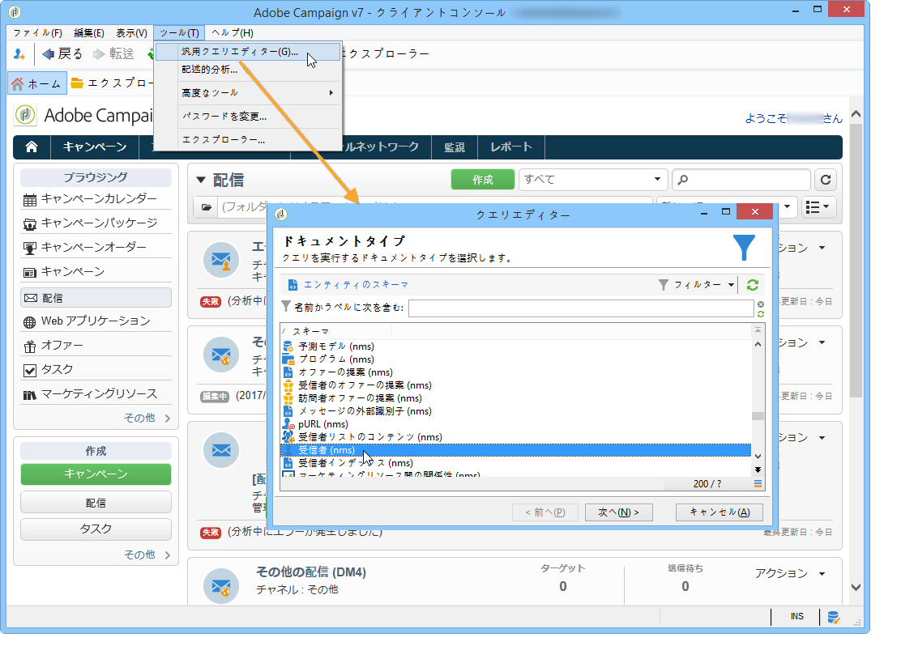

# クエリの概要{#about-queries-in-campaign}

クエリツールはアプリケーションの様々なレベルで利用可能で、ターゲット母集団の定義、顧客のセグメント化、トラッキングログの抽出とフィルタリング、フィルターの作成などに使用できます。

専用のアシスタントである汎用クエリエディターが用意されており、**[!UICONTROL ツール／汎用クエリエディター...]**&#x200B;メニューからアクセスできます。このエディタを使用すると、データベースクエリで情報の抽出、整理、グループ化、並べ替えができます。 例えば、特定の期間中にニュースレターリンクで n 回を超えてクリックした受信者を取得できます。

汎用クエリエディターでは、すべてのクエリ機能が一元化されています。これにより、制限フィルターを作成および保存して、そのフィルターをターゲティングワークフローのクエリボックスなどの他のコンテキストで再利用できます。

>[!BEGINTABS]

>[!TAB データベースのクエリ]

レポートの作成手順について詳しくは、**[Campaign（コンソール）ドキュメント](https://experienceleague.adobe.com/ja/docs/campaign/campaign-v8/data/query/query-editor){target=_blank}**&#x200B;を参照してください。

{target=_blank}

>[!TAB ワークフローへのクエリの追加]

**[Campaign v8 ドキュメント](https://experienceleague.adobe.com/ja/docs/campaign/automation/workflows/wf-activities/targeting-activities/query){target=_blank}**&#x200B;には、ワークフローコンテキストでのクエリの作成に関連する主な手順が説明されています。

{target=_blank}

>[!TAB フィルター条件]

クエリをデザインするには、クエリエディターでフィルター条件を選択する必要があります。 使用可能な機能とユースケースについて詳しくは、**[Campaign v8 ドキュメント](https://experienceleague.adobe.com/ja/docs/campaign/campaign-v8/data/query/filter-conditions){target=_blank}**&#x200B;を参照してください

{target=_blank}

>[!ENDTABS]

