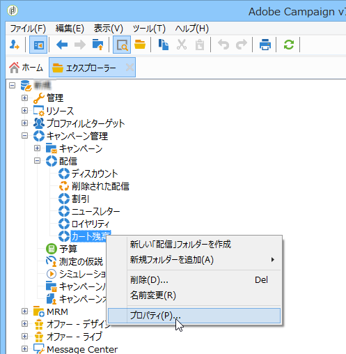
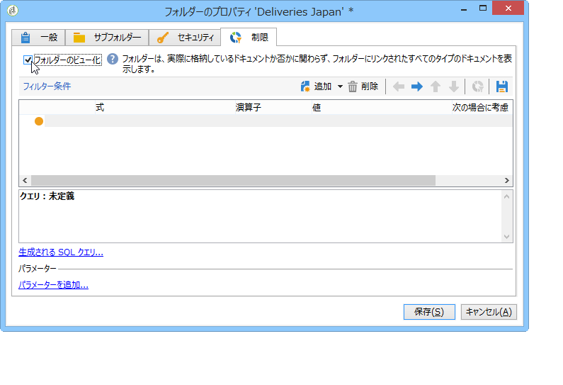
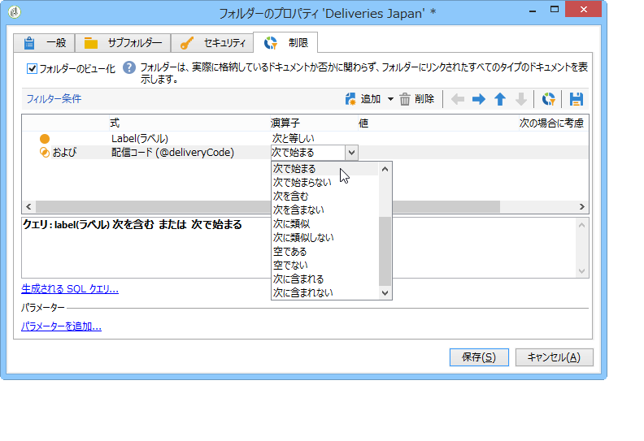

# フォルダへのアクセスを管理{#folder-access-management}

エクスプローラ・ナビゲーション・ツリーの各フォルダには、アクセス権の読み取り、書き込み、削除が割り当てられています。 ファイルにアクセスするには、個別のオペレーターまたはオペレーターのグループが、少なくとも目的のファイルに対する読み取りアクセス権を持っている必要があります。

## フォルダーの権限

### フォルダーに対する権限の編集 {#edit-permissions-on-a-folder}

ツリーの特定のフォルダーに対する権限を編集するには、次の手順に従います。

1. フォルダーを右クリックし、「**[!UICONTROL プロパティ]**」を選択します。

   

1. 「**[!UICONTROL セキュリティ]**」タブをクリックすると、そのフォルダーに設定されている権限が表示されます。

   

### 権限の変更 {#modify-permissions}

権限を変更するには、次の方法があります。

* **グループまたはオペレーターを置き換える**：これをおこなうには、そのフォルダーへのアクセス権を持つグループ（またはオペレーター）を 1 つクリックし、次の図のように、ドロップダウンリストから新しいグループ（または新しいオペレーター）を選択します。

   

* **グループまたはオペレーターのアクセスを許可する**：これをおこなうには、**[!UICONTROL 追加]**&#x200B;ボタンをクリックし、そのフォルダーへのアクセスを許可する対象のグループまたはオペレーターを選択します。
* **グループまたはオペレーターのアクセスを禁止する**：これをおこなうには、**[!UICONTROL 削除]**&#x200B;をクリックし、そのフォルダーへのアクセス許可を取り消すグループまたはオペレーターを選択します。
* **グループまたはオペレーターに付与する権利を選択する**：これをおこなうには、該当するグループまたはオペレーターをクリックし、必要に応じて、付与するアクセス権を選択したり、付与しないアクセス権を選択解除したりします。

   

### 権限のサブフォルダーへの反映 {#propagate-permissions}

権限やアクセス権をサブフォルダーに反映させることができます。これを実行するには、フォルダープロパティの「**[!UICONTROL サブフォルダーにも反映]**」オプションを選択します。

このウィンドウで定義された権限が、現在のノードに属するすべてのサブフォルダーに反映されます。したがって、個々のサブフォルダーに設定された権限は無視できます。

>[!NOTE]
>
>フォルダーでこのオプションをクリアしても、サブフォルダーのオプションは自動的にはクリアされません。個々のサブフォルダーに対する指定を明示的に解除する必要があることに注意してください。

### すべてのオペレーターへのアクセス権の付与 {#grant-access-to-all-operators}

「**[!UICONTROL セキュリティ]**」タブでは、「**[!UICONTROL システムフォルダー]**」オプションが選択されている場合、個々のオペレーターの権利に関係なく、すべてのオペレーターがこのデータにアクセスできます。このオプションが選択されていない場合、オペレーターにデータへのアクセスを許可するには、該当するオペレーターまたはグループを認証リストに明示的に追加する必要があります。

## フォルダーとビュー {#folders-and-views}

### フォルダーについて {#about-folders}

フォルダーとは Adobe Campaign ツリーのノードです。ノードを作成するには、ツリーを右クリックし、**[!UICONTROL 新規フォルダーを追加]**&#x200B;メニューを使用します。デフォルトでは、最初のメニューを使用すると現在のコンテキストに対応したフォルダーを追加できます。

エクスプローラのナビゲーションツリーはカスタマイズできます。 この節](adobe-campaign-workspace.md)では、設定手順とベストプラクティス[について説明します。

### ビューについて {#about-views}

また、必要に応じて、データアクセスの制限やツリー内のコンテンツの整理を目的としたビューを作成できます。それらのビューにはアクセス権を設定できます。

ビューはフォルダーの一種ですが、別の場所にある同じタイプのフォルダー（1 つまたは複数）に格納されているレコードを表示するために使用します。例えば、キャンペーンフォルダーをビューとして作成すると、デフォルトでは、データベース内に存在するすべてのキャンペーン（本来の格納場所に関わらず）のデータを表示するビューになります。そのデータにはフィルターを適用することができます。

フォルダーをビューに変換すると、そのフォルダータイプに該当するデータが、実際の格納場所がデータベース内のどこにあるフォルダーであるかに関わらず、すべて表示されます。そうして表示されたデータリストにフィルターを適用し、ビューの内容を絞り込んで使用することができます。

>[!IMPORTANT]
>
>ビューにはデータが含まれており、ビューからそのデータにアクセスできますが、データが実際に格納されている場所はそのビューフォルダー内ではありません。データソースフォルダー内のデータを操作するには、オペレーターが適切なアクセス権を持っている必要があります（少なくとも読み取りアクセス権）。
>
>ソースフォルダーへのアクセスを許可することなくビューの表示のみを可能にする場合は、ソースフォルダーの親ノードへの読み取りアクセス権を付与しないようにするだけで十分です。

ビューとフォルダーを区別するために、各ビューの名前は異なる色（濃いシアン）で表示されます。

### フォルダーの追加とビューの作成 {#adding-folders-and-creating-views}

以下の例では、特定のデータを表示するための新しいフォルダーを作成します。

1. **[!UICONTROL 配信]**&#x200B;タイプの新しいフォルダーを作成し、「**フランス配信**」という名前を付けます。
1. このフォルダーを右クリックし、「**[!UICONTROL プロパティ]**」を選択します。

   

1. 「**[!UICONTROL 制限]**」タブで、「**[!UICONTROL フォルダーのビュー化]**」を選択します。データベース内にあるすべての配信データが表示されます。

   

1. ウィンドウ中央部のセクションにある Query Editor を使って配信のフィルター条件を定義します。すると、定義したフィルターに該当するキャンペーンが表示されます。

   >[!NOTE]
   >
   >Query Editor については、[この節](../../platform/using/about-queries-in-campaign.md)を参照してください。

   例えば、次のようなフィルター条件を定義したとします。

すると、ビューに表示される配信リストの内容は次のようなものになります。

>[!NOTE]
>
>[トランザクションメッセージ](../../message-center/using/about-transactional-messaging.md)イベントを管理する場合、**[!UICONTROL リアルタイムイベント]**&#x200B;または&#x200B;**[!UICONTROL バッチイベント]**&#x200B;フォルダーを実行インスタンス上の表示として設定しないでください。これは、アクセス権の問題につながる可能性があります。 アクセス管理について詳しくは、[この節](../../message-center/using/event-collection.md)を参照してください。