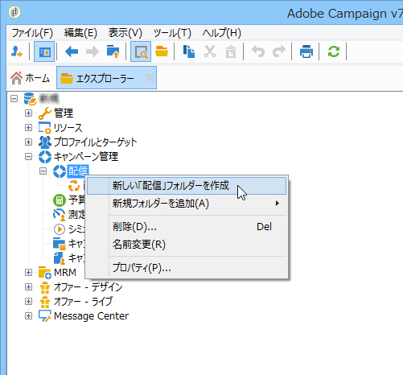
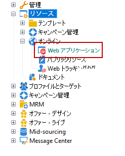

# フォルダーへのアクセスの管理{#folder-access-management}

エクスプローラーナビゲーションツリーの各フォルダーには、読み取り、書き込み、削除のアクセス権が割り当てられています。 ファイルにアクセスするには、オペレーターまたはオペレーターグループに少なくともファイルへの読み取りアクセス権が必要です。

>[!NOTE]
>
>フォルダーの権限について詳しくは、[Campaign v8 ドキュメント](https://experienceleague.adobe.com/ja/docs/campaign/campaign-v8/admin/permissions/folder-permissions){target=_blank}を参照してください。

## フォルダーとビュー {#folders-and-views}

### フォルダーとは {#about-folders}

フォルダーとは Adobe Campaign ツリーのノードです。ノードを作成するには、ツリーを右クリックし、**[!UICONTROL 新規フォルダーを追加]**&#x200B;メニューを使用します。デフォルトでは、最初のメニューを使用すると現在のコンテキストに対応したフォルダーを追加できます。

エクスプローラーのナビゲーションツリーをカスタマイズできます。 設定手順とベストプラクティスについては、[この節](adobe-campaign-workspace.md)を参照してください。

### ビューとは {#about-views}

また、必要に応じて、データアクセスの制限やツリー内のコンテンツの整理を目的としたビューを作成できます。それらのビューにはアクセス権を設定できます。

ビューはフォルダーの一種ですが、別の場所にある同じタイプのフォルダー（1 つまたは複数）に格納されているレコードを表示するために使用します。例えば、キャンペーンフォルダーをビューとして作成すると、デフォルトでは、データベース内に存在するすべてのキャンペーン（本来の格納場所に関わらず）のデータを表示するビューになります。そのデータにはフィルターを適用することができます。

フォルダーをビューに変換すると、そのフォルダータイプに該当するデータが、実際の格納場所がデータベース内のどこにあるフォルダーであるかに関わらず、すべて表示されます。そうして表示されたデータリストにフィルターを適用し、ビューの内容を絞り込んで使用することができます。

>[!IMPORTANT]
>
>ビューにはデータが含まれており、ビューからそのデータにアクセスできますが、データが実際に格納されている場所はそのビューフォルダー内ではありません。データソースフォルダー内のデータを操作するには、オペレーターが適切なアクセス権（少なくとも読み取りアクセス権）を持っている必要があります。
>
>ソースフォルダーへのアクセスを許可することなくビューの表示のみを可能にする場合は、ソースフォルダーの親ノードへの読み取りアクセス権を付与しないようにするだけで十分です。

ビューとフォルダーを区別するために、各ビューの名前は異なる色（濃いシアン）で表示されます。

### フォルダーの追加とビューの作成 {#adding-folders-and-creating-views}

>[!IMPORTANT]
>
>標準提供されているフォルダーは、ビューとしてマークしないでください。

以下の例では、特定のデータを表示するための新しいフォルダーを作成します。

1. **[!UICONTROL 配信]**&#x200B;タイプの新しいフォルダーを作成し、「**フランス配信**」という名前を付けます。
1. このフォルダーを右クリックし、「**[!UICONTROL プロパティ]**」を選択します。

   

1. 「**[!UICONTROL 制限]**」タブで、「**[!UICONTROL フォルダーのビュー化]**」を選択します。データベース内にあるすべての配信データが表示されます。

   

1. ウィンドウ中央部のセクションにある Query Editor を使って配信のフィルター条件を定義します。すると、定義したフィルターに該当するキャンペーンが表示されます。

   >[!NOTE]
   >
   >Query Editor については、[この節](../../platform/using/adobe-campaign-workspace.md#about-queries-in-campaign)を参照してください。

   例えば、次のようなフィルター条件を定義したとします。

ビューには、次の配信が表示されます。

>[!NOTE]
>
>[トランザクションメッセージ](../../message-center/using/about-transactional-messaging.md)イベントを管理する場合、**[!UICONTROL リアルタイムイベント]**&#x200B;または&#x200B;**[!UICONTROL バッチイベント]**&#x200B;フォルダーを実行インスタンス上の表示として設定しないでください。これは、アクセス権の問題につながる可能性があります。 アクセス管理について詳しくは、[この節](../../message-center/using/about-event-processing.md#event-collection)を参照してください。

<!--
## Permissions on a folder

### Edit permissions on a folder {#edit-permissions-on-a-folder}

To edit permissions on a specific folder of the tree, follow the steps below:

1. Right-click on the folder and select **[!UICONTROL Properties...]**.

   

1. Click the **[!UICONTROL Security]** tab to view authorizations on this folder.

   

### Modify permissions {#modify-permissions}

To modify permissions, you can:

* **Replace a group or an operator**. To do this, click one of the groups (or operators) with rights to the folder, and select a new group (or a new operator) from the drop-down list:

  

* **Authorize a group or an operator**. To do this, click the **[!UICONTROL Add]** button and select the group or operator to which you want to assign authorizations for this folder.
* **Forbid a group or an operator**. To do this, click **[!UICONTROL Delete]** and select the group or operator from which you want to remove authorization for this folder.
* **Select the rights assigned to a group or an operator**. To do this, click the group or operator concerned, then select the access rights you want to grant and deselect the others.

  

### Propagate permissions {#propagate-permissions}

You can propagate authorizations and access rights. To do this, select the **[!UICONTROL Propagate]** option in the folder properties.

The authorizations defined in this window will then be applied to all the sub-folders of the current node. You can then overload these authorizations for each of the sub-folders.

>[!NOTE]
>
>Clearing this option for a folder does not automatically clear it for the sub-folders. You must clear it explicitly for each of the sub-folders.

### Grant access to all operators {#grant-access-to-all-operators}

In the **[!UICONTROL Security]** tab, if the **[!UICONTROL System folder]** option is selected, all operators will have access to this data, regardless of their rights. If this option is cleared, you must explicitly add the operator (or their group) to the list of authorizations in order for them to have access.

-->