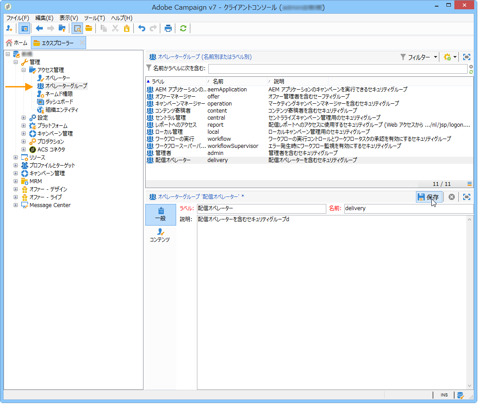
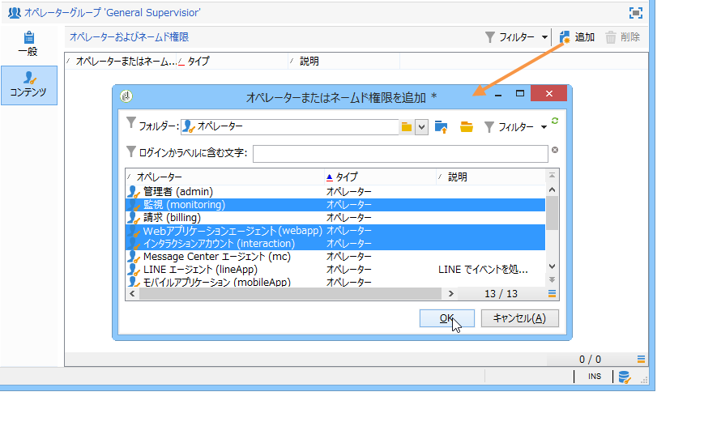

# オペレーターグループの作成と管理 {#operator-groups}

>[!NOTE]
>
>これらの手順は、**従来のネイティブ認証** を使用して Campaign に接続するオペレーターにのみ適用されます。 Campaign Classic v7.3.1 以降、すべてのオペレーターは、[Adobe Identity Management System （IMS） ](https://helpx.adobe.com/jp/enterprise/using/identity.html){target="_blank"} を使用して Campaign に接続する必要があります。 [詳細情報](../../technotes/using/migrate-users-to-ims.md)
>
>Adobe IDを使用して Campaign に接続する際に、次の節が適用されなくなりました。 Adobe IMS を使用して権限を設定する方法については、[Campaign v8 ドキュメント](https://experienceleague.adobe.com/docs/campaign/campaign-v8/admin/permissions/gs-permissions.html?lang=ja){target="_blank"}を参照してください。

オペレーターグループは、ツリーの&#x200B;**[!UICONTROL 管理／アクセス管理／オペレーターグループ]**&#x200B;ノードを使用して作成します。

## 新しいオペレーターグループの作成 {#creating-a-new-operator-group}

新しいオペレーターグループを作成するには、以下の手順を実行します。

1. グループリストの右側にある「**[!UICONTROL 新規]**」ボタンをクリックするか、リストを右クリックして「**[!UICONTROL 新規]**」を選択します。
1. セクション下部のウィンドウにある「**[!UICONTROL 一般]**」タブで、このグループの名前と説明を、該当するフィールドにそれぞれ入力します。

   

1. 「**[!UICONTROL コンテンツ]**」タブをクリックし、このグループの権限を定義します。
1. **[!UICONTROL 追加]**&#x200B;ボタンをクリックし、グループに付与する権限または関連付けるオペレーターを選択します。
1. 「**[!UICONTROL フォルダー]**」フィールドのドロップダウンリストまたは右側にあるフォルダーをクリックし、このグループに付与する権限または関連付けるオペレーターを指定します。
1. 追加するアクセス権またはオペレーターを選択し、「**[!UICONTROL OK]**」をクリックして確定します。

   

   他のアクセス権やオペレーターを追加するには、この操作を繰り返します。

1. 「**[!UICONTROL 保存]**」ボタンをクリックして、グループをリストに追加します。

## デフォルトのグループ {#default-groups}

以下のオペレーターグループがデフォルトで用意されています。

1. **[!UICONTROL 管理者]**

   このグループのオペレーターは、インスタンスに対して完全なアクセス権を持ちます。管理者は、インターフェイスの技術面において最高レベルのアクセス権限を持つユーザーです。このユーザーは&#x200B;**[!UICONTROL 管理者]**&#x200B;の役割を持ち、プラットフォームがすべて設定されていることを確認します。

   このグループには以下のネームド権限が設定されています。

   * **[!UICONTROL 管理者]**：ワークフロー、配信、スクリプトなどの任意のオブジェクトの実行／作成／編集／削除する権限。

1. **[!UICONTROL 配信オペレーター]**

   このグループのオペレーターは、配信の管理を担当します。配信の作成と準備に必要とされる主なリソース（キャンペーンタイポロジ、配信マッピング、デフォルトテンプレート、パーソナライゼーションブロックなど）にアクセスできます。

   このグループには以下のネームド権限が設定されています。

   * **[!UICONTROL 配信を準備]**：配信分析を作成、編集および開始する権限。
   * **[!UICONTROL 配信を開始]**：分析済みの配信を承認する権限。

1. **[!UICONTROL キャンペーンマネージャー]**

   このグループのオペレーターは、マーケティングキャンペーンの管理を実行できます。**[!UICONTROL Campaign]**（オプションの Adobe Campaign モジュール）のフレームワーク内で、キャンペーンにリンクされたオブジェクト（プラン、プログラム、ワークフロー、予算など）にアクセスできます。

   このグループには以下のネームド権限が設定されています。

   * **[!UICONTROL フォルダーを挿入]**：Adobe Campaign ツリーにフォルダーを挿入する権限（関係する分岐に対して編集権限を持っていることが前提）。
   * **[!UICONTROL ワークフロー]**：ワークフローを使用する権限。

   >[!NOTE]
   >
   >このグループのオペレーターに配信開始の権利は付与されません。

1. **[!UICONTROL コンテンツ寄稿者]**

   このグループのオペレーターは、**[!UICONTROL コンテンツ管理]**（Adobe Campaign オプションモジュール）のフレームワーク内でコンテンツフォルダーにアクセスできます。このグループによってオペレーターに付与される権利はありません。

1. **[!UICONTROL レポートへのアクセス]**

   このグループは、特定のオペレーターに対してキャンペーンダッシュボードのレポート、スケジュール、フォーラムの各アイコンを有効にする外部オペレーター向けです。

1. **[!UICONTROL ワークフローの実行]**

   このグループのオペレーターには、キャンペーンとは関係がないワークフローを管理する権利が付与されます。

1. **[!UICONTROL ワークフロースーパーバイザー]**

   このグループのオペレーターには、キャンペーンワークフローに関するアラートが発生するとメール通知が送付されます。

1. ローカル管理、中央管理

   このグループのオペレーターは&#x200B;**[!UICONTROL 分散型マーケティング]**（Adobe Campaign オプションモジュール）を使用できます。

1. **[!UICONTROL オファーマネージャー]**

   このグループのオペレーターは、オファーの作成および管理をおこなえます。これについて詳しくは、この[ページ](../../interaction/using/operator-profiles.md)を参照してください。このグループには以下のネームド権限が設定されています。

   * **[!UICONTROL フォルダーを挿入]**：Adobe Campaign ツリーにフォルダーを挿入する権限（関係する分岐に対して編集権限を持っていることが前提）。
   * **[!UICONTROL フォルダーを編集]**：内部名、ラベル、関連する画像、サブフォルダーの順序など、フォルダーのプロパティを変更する権利。
