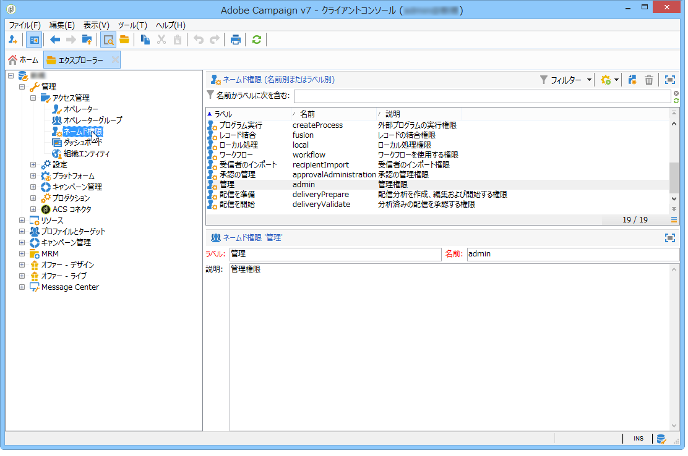

# ネームド権限を使用した権限の設定{#named-rights}

ネームド権限は、個別のオペレーターやオペレーターのグループに付与する権限を定義するものです。Adobe Campaign には、運用方法の参考として、デフォルトのネームド権限セットがあらかじめ用意されています。 それらのネームド権限の設定は、ツリーの&#x200B;**[!UICONTROL 管理／アクセス管理／ネームド権限]**&#x200B;で編集できます。

デフォルトで用意されているネームド権限は以下のとおりです。

* **[!UICONTROL 管理]**：**[!UICONTROL 管理]**&#x200B;権限を持つオペレーターは、インスタンスに対する完全なアクセス権を持ちます。 管理者ユーザーは、ワークフロー、配信、スクリプトなどの任意のオブジェクトの実行／作成／編集／削除が可能です。

  >[!IMPORTANT]
  >
  >**IMSに移行した後：** Adobe Identity Management System （IMS）に移行すると、名前に「admin」という単語が含まれている製品プロファイルまたはネームド権限（「Administrators」、「admin」、「admins」など） Campaign Campaign コントロールパネルへのアクセス権を自動的に付与します。 ユーザーにCampaign コントロールパネルアクセス権を付与しない限り、名前付き権限またはロール名に「管理者」を使用しないことをお勧めします。 [IMS移行](../../technotes/using/migrate-users-to-ims.md)および[Campaign コントロールパネルアクセスの管理](https://experienceleague.adobe.com/docs/control-panel/using/discover-control-panel/managing-permissions.html){target="_blank"}の詳細を説明します。

* **[!UICONTROL 承認の管理]**：担当のオペレーターやグループが現在の状態を承認したことを確認するため、ワークフローや配信内で複数の承認手順を設定できます。 **[!UICONTROL 承認の管理]**&#x200B;権限を持つユーザーは、承認手順を設定したり、これらの手順を承認する必要のあるオペレーターまたはオペレーターグループを割り当てたりできます。

  >[!IMPORTANT]
  >
  >**IMS:**&#x200B;製品プロファイルに移行した後、または「admin」という単語を含むネームド権限（「Approval Administrator」など）により、Campaign Campaign コントロールパネルへのアクセス権が付与されます。 [IMS移行](../../technotes/using/migrate-users-to-ims.md)および[Campaign コントロールパネルアクセスの管理](https://experienceleague.adobe.com/docs/control-panel/using/discover-control-panel/managing-permissions.html){target="_blank"}の詳細を説明します。

* **[!UICONTROL セントラル処理]**：セントラル管理の権限（分散型マーケティング）。

* **[!UICONTROL フォルダーを削除]**：フォルダーを削除する権限。 この権限を持つユーザーは、エクスプローラービューからフォルダーを削除できます。

* **[!UICONTROL フォルダーを編集]**：内部名、ラベル、関連する画像、サブフォルダーの順序など、フォルダーのプロパティを変更する権利。

* **[!UICONTROL エクスポート]**：ユーザーは、**[!UICONTROL エクスポート]**&#x200B;ワークフローアクティビティを使用して、サーバーまたはローカルマシン上のファイルに、Adobe Campaign インスタンスのデータをエクスポートできます。

* **[!UICONTROL ファイルアクセス]**：スクリプトを介したファイルの読み取り／書き込みアクセス権。このスクリプトは **[!UICONTROL JavaScript]** ワークフローアクティビティに記述してサーバー上のファイルの読み取り／書き込みをおこなうことができます。

* **[!UICONTROL インポート]**：データのインポート全般を実行する権限。 **[!UICONTROL インポート]**&#x200B;では他のすべてのテーブルにデータをインポートできますが、**[!UICONTROL 受信者のインポート]**&#x200B;権限は、受信者テーブルにのみインポートできます。

* **[!UICONTROL フォルダーを挿入]**：フォルダーを挿入する権限。 **[!UICONTROL フォルダーを挿入]**&#x200B;権限を持つユーザーは、エクスプローラービューのフォルダーツリーに新しいフォルダーを作成できます。

* **[!UICONTROL ローカル]**：ローカル管理の権限（分散型マーケティング）。

* **[!UICONTROL 結合]**：選択したレコードを 1 つに結合する権限。 受信者が重複して存在する場合、**[!UICONTROL 結合]**&#x200B;権限があれば、重複を選択し、それらを単一の主な受信者に結合できます。

* **[!UICONTROL 配信を準備]**：配信分析を作成、編集および保存する権限。 **[!UICONTROL 配信を準備]**&#x200B;権限を持つユーザーは、配信分析プロセスを開始できます。

* **[!UICONTROL プライバシーデータ権限]**：プライバシーデータを収集および削除する権限。 詳しくは、この[ページ](https://helpx.adobe.com/jp/campaign/kb/acc-privacy.html)を参照してください。

* **[!UICONTROL プログラム実行]**：様々なプログラミング言語でコマンドを実行する権限。

* **[!UICONTROL 受信者のインポート]**：受信者をインポートする権限。 **[!UICONTROL 受信者のインポート]**&#x200B;権限を持つユーザーは、ローカルファイルを受信者テーブルにインポートできます。

* **[!UICONTROL SQL スクリプトの実行]**：データベースで SQL コマンドを直接実行する権限。

* **[!UICONTROL 配信を開始]**：分析済みの配信を承認する権限。 配信の分析後、配信は様々な承認手順で一時停止し、再開するには承認が必要になります。 **[!UICONTROL 配信を開始]**&#x200B;権限を持つユーザーは、配信を承認できます。

* **[!UICONTROL SQL データ管理アクティビティを使用]**：ワークテーブルを作成および設定するために SQL データ管理アクティビティを使用して独自の SQL スクリプトを記述する権限。 詳しくは、[Campaign v8 ドキュメント](https://experienceleague.adobe.com/docs/campaign/automation/workflows/wf-activities/action-activities/sql-data-management.html?lang=ja){target="_blank"}を参照してください。

* **[!UICONTROL ワークフロー]**：ワークフローを実行する権限。 この権限がないと、ユーザーはワークフローを開始、停止または再起動できません。

* **[!UICONTROL Web アプリ]**：Web アプリケーションを使用する権限。

>[!NOTE]
>
>このリストは、プラットフォームにインストールされているアドオンによって変わることがあります。

## アクセス権マトリックス {#access-rights-matrix}

デフォルトのグループやネームド権限を使用すると、ナビゲーション階層構造内の特定のフォルダーに対するオペレーターのアクセスを許可し、読み取り、書き込み、削除の権限を付与できます。

Adobe Campaign のアクセス権マトリックスは[ここ](/help/platform/using/assets/access-rights-matrix.pdf)にあります。

