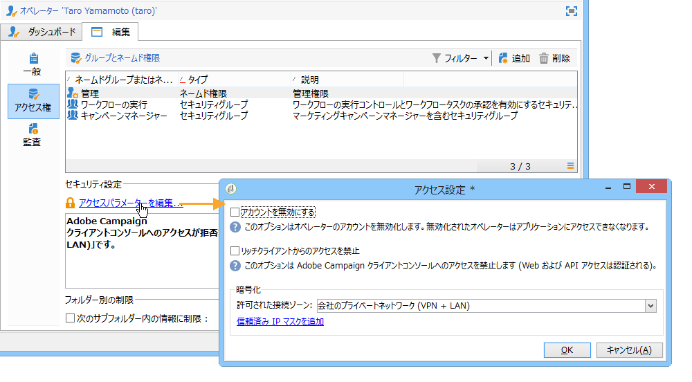
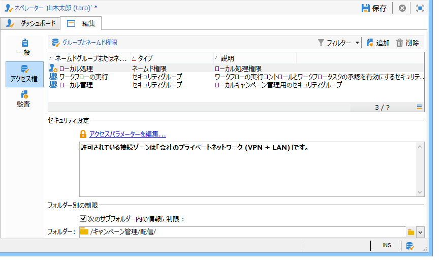
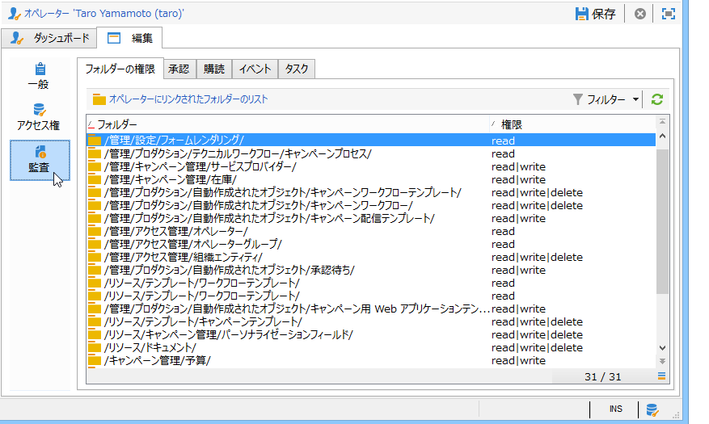
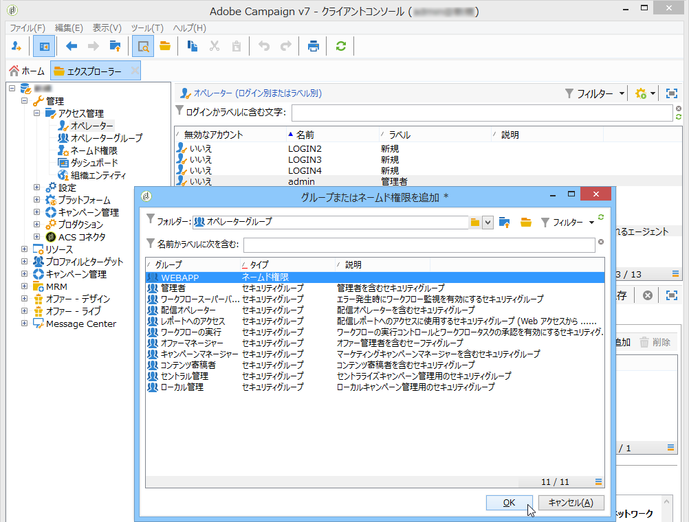

# オペレータの作成と管理{#operators}

## キャンペーン演算子の使用を開始する{#about-operators}

オペレーターは、ログインしてアクションを実行する権限を持つ Adobe Campaign ユーザーです。

デフォルトでは、オペレーターは&#x200B;**[!UICONTROL 管理／アクセス管理／オペレーター]**&#x200B;ノードに格納されます。

オペレーターは、手動で作成するか、既存の LDAP ディレクトリ上でマッピングできます。

オペレーターを作成するための詳しい手順については、[このページ](#creating-an-operator)を参照してください。

Adobe Campaign と LDAP の統合について詳しくは、[このページ](../../installation/using/connecting-through-ldap.md)を参照してください。

>[!IMPORTANT]
>
>インスタンスにログオンするには、オペレーターがセキュリティゾーンにリンクされている必要があります。Adobe Campaign でのセキュリティゾーンについて詳しくは、[このページ](../../installation/using/configuring-campaign-server.md#defining-security-zones)を参照してください。

Adobe ID を使用して Adobe Campaign に直接接続することもできます。詳しくは、この[ページ](../../integrations/using/about-adobe-id.md)を参照してください。

## 演算子{#creating-an-operator}を作成します

新しいオペレーターを作成し権限を付与するには、次の手順に従います。

1. オペレーターリストの上にある「**[!UICONTROL 新規]**」ボタンをクリックし、作成するオペレーターの詳細情報を入力します。

   

1. ユーザーの「**[!UICONTROL 識別パラメーター]**」として、ログイン、パスワード、名前を指定します。ログインとパスワードは、そのオペレーターが Adobe Campaign にログオンするときに使われます。ログオンしたユーザーは、**[!UICONTROL ツール／パスワードを変更]**&#x200B;メニューを選択して自分のパスワードを変更できます。オペレーターは処理の承認などの通知を E メールで受信するので、オペレーターの E メールは必要不可欠です。

   このセクションでは、オペレーターと組織エンティティとのリンクを設定することもできます。詳しくは、[このページ](../../campaign/using/about-distributed-marketing.md)を参照してください。

1. オペレーターに付与する権限を、「**[!UICONTROL オペレーターアクセス権]**」セクションで選択します。

   権利をオペレーターに割り当てるには、権利リストの上にある「**[!UICONTROL 追加]**」ボタンをクリックし、表示されるグループのリストからオペレーターのグループを 1 つ選択します。

   

   また、ネームド権限を 1 つまたは複数指定することもできます（[ネームド権限](#named-rights)を参照）。指定するには、「**[!UICONTROL フォルダー]**」フィールドの右にある矢印をクリックし、「**[!UICONTROL ネームド権限]**」を選択します。

   

   割り当てるグループとネームド権限のいずれかまたは両方を選択し、「**[!UICONTROL OK]**」をクリックして確定します。

1. 「**[!UICONTROL OK]**」をクリックすると、オペレーターが作成され、既存オペレーターのリストにプロファイルが追加されます。

   

>[!NOTE]
>
>新しいオペレーターフォルダーを作成すると、必要に応じた方法でオペレーターを整理することができます。作成するには、オペレーターフォルダーを右クリックし、「**[!UICONTROL 「オペレーター」フォルダーを追加]**」を選択します。

オペレーターのプロファイルを作成した後は、プロファイルに含まれる情報の追加や更新ができます。これを実行するには、「**[!UICONTROL 編集]**」タブをクリックします。

>[!NOTE]
>
>「**[!UICONTROL セッションタイムアウト]**」フィールドでは、FDA セッションがタイムアウトするまでの遅延を調整できます。詳しくは、[Federated Data Access について](../../installation/using/about-fda.md)を参照してください。

## 演算子のタイムゾーンを定義{#time-zone-of-the-operator}

「**[!UICONTROL 一般]**」タブでは、オペレーターのタイムゾーンを選択できます。オペレーターは、デフォルトではサーバーのタイムゾーンで作業します。このドロップダウンリストから別のタイムゾーンを選択することもできます。

タイムゾーンの設定については、[このページ](../../installation/using/time-zone-management.md)を参照してください。

>[!NOTE]
>
>異なるタイムゾーンのユーザー同士が共同作業できるよう、格納する日付情報は UTC（協定世界時）で表現される必要があります。日付をユーザーのタイムゾーンで表示する、ファイルのインポートおよびエクスポートを実行する、E メールの配信をスケジュール設定する、ワークフロー内のアクティビティをスケジュール設定するとき（スケジューラー、待機、時間の制約など）には、日付は適切なタイムゾーンに変換されます。
>
>こうしたコンテキストに関係する制約や推奨事項については、Adobe Campaign のドキュメントの関連セクションに記載されています。

また、「**[!UICONTROL 地域設定]**」ドロップダウンリストでは、日付や数値を表示する書式を選択できます。

## 追加権限{#access-rights-options}

オペレーターに関連付けられたグループとネームド権限を更新するには、「**[!UICONTROL アクセス権]**」タブを使用します。

「**[!UICONTROL アクセスパラメーターを編集]**」リンクには、以下のオプションがあります。

* 「**[!UICONTROL アカウントを無効にする]**」オプションでは、オペレーターのアカウントを無効にできます。これで、オペレーターは Adobe Campaign にアクセスできなくなります。

   >[!NOTE]
   >
   >このアカウントが無効になっていても、オペレーターは Campaign からアラートや通知を受け取ることができます。 このオペレーターへの Campaign 通知の送信を停止するには、プロファイルからメールアドレスを削除することを推奨します。

* 「**[!UICONTROL リッチクライアントからのアクセスを禁止]**」オプションを使用すると、Adobe Campaign の使用を [Web アクセス](../../platform/using/adobe-campaign-workspace.md#console-and-web-access)または API に制限できます。これにより、Adobe Campaign クライアントコンソールにアクセスできなくなります。
* 安全ゾーンをオペレーターに関連付けることができます。詳しくは、[このページ](../../installation/using/configuring-campaign-server.md#defining-security-zones)を参照してください。
* また、適切なリンクを使用して、信頼できる IP マスクを定義することもできます。

   オペレーターは、このリストに含まれる IP アドレスからアクセスした場合、パスワードを入力することなく Adobe Campaign に接続できます。

   次の図のように指定すると、一連の IP アドレスに対してパスワードなしの接続を許可することもできます。

   

   >[!NOTE]
   >
   >プラットフォームに対するアクセスのセキュリティが保たれるよう、このオプションを使用する際は十分注意してください。

* 「**[!UICONTROL 次のサブフォルダーにある情報に制限]**」オプションは、オペレーターの権利の対象を特定のフォルダーに限定する場合に使用します。ここで指定されたノードに属するサブフォルダーだけがユーザーに対して表示されるようになります。

   

   >[!IMPORTANT]
   >
   >これは非常に強い制限です。使用の際は十分注意してください。この種の権利を持つオペレーターがログインした場合は、ここで指定されたフォルダーの内容だけが表示され、ツリー内の他のノードにエクスプローラーでアクセスすることはできません。ただし、アクセスする機能の種類によっては（ワークフローなど）、通常見ることができないノード内のデータも表示されることがあります。

### 設定の確認{#check-settings}

「**[!UICONTROL 監査]**」タブでは、オペレーターに関係する情報を参照できます。そのオペレーターが関与する領域内の設定内容に応じて、様々なタブが自動的に追加されます。

以下にアクセスできます。

* オペレーターに関連付けられたフォルダーに対する権利のリスト。

   

   >[!NOTE]
   >
   >詳しくは、[フォルダーアクセスの管理](#folder-access-management)を参照してください。

* オペレーター承認ログ。

   

* オペレーターが購読しているディスカッションフォーラムのリスト。
* オペレーターのカレンダーに記載されたイベント。
* オペレーターに割り当てられたタスクのリスト。

## デフォルトのオペレーター {#default-operators}

Adobe Campaign は、管理者（&#39;admin&#39;）、請求（&#39;billing&#39;）、監視、Web アプリケーションエージェント（&#39;webapp&#39;）など、デフォルト設定されたプロファイルを持つテクニカルオペレーターを使用します。オペレーターの中には、プラットフォームにインストールされているアプリケーションとオプションに依存するものもあります。例えば、&#39;central&#39; オペレーターおよび &#39;local&#39; オペレーターは、分散型マーケティングのオプションがインストールされている場合にのみ表示されます。

>[!IMPORTANT]
>
>これらのテクニカルオペレーターは、プラットフォームから情報メッセージが返された場合、デフォルトで通知を受信します。テクニカルオペレーターの連絡先 E メールは必ず設定しておくことをお勧めします。
>
>また、Web アプリケーションが正しく動作するよう、&#39;webapp&#39; オペレーターについては特定の地域設定をおこなわないでおくことをお勧めします。

デフォルトでは、&#39;webapp&#39; テクニカルオペレーターには「管理」のネームド権限が付与されていますが、これはセキュリティリスクの原因になる可能性があります。したがって、このネームド権限は削除しておくことをお勧めします。手順は次のとおりです。

1. **[!UICONTROL 管理／アクセス管理／ネームド権限]**&#x200B;ノードで、「**[!UICONTROL 新規]**」をクリックして新しいネームド権限を作成し、「Web アプリ」という名前を付けます。

   

   ネームド権限について詳しくは、[ネームド権限](#named-rights)の節を参照してください。

1. **[!UICONTROL 管理／アクセス管理／オペレーター]**&#x200B;ノードで、Web アプリケーションエージェントのオペレーター（&#39;webapp&#39;）を選択します。

   「**[!UICONTROL 編集]**」タブ、「**[!UICONTROL アクセス権]**」タブの順に選択し、リストから「管理」ネームド権限を削除します。

   

   「**[!UICONTROL 追加]**」をクリックし、作成した「Web アプリ」ネームド権限を選択して、変更内容を保存します。

   

1. &#39;webapp&#39; オペレーターに、このオペレーターに関係するフォルダー（主に&#39;受信者&#39;フォルダー）に対する読み取り、書き込みのデータアクセス権を設定します。

   

   ツリーのフォルダーに対するアクセス権の変更について詳しくは、[フォルダーアクセスの管理](#folder-access-management)の節を参照してください。

>[!NOTE]
>
>セキュリティガイドラインについて詳しくは、[Adobe Campaign セキュリティ設定チェックリスト](https://helpx.adobe.com/jp/campaign/kb/acc-security.html)を参照してください。
