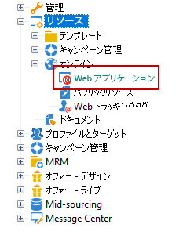

# アクセス管理{#access-management}

## 権限について {#about-permissions}

Adobe Campaign は、様々なオペレーターに割り当てる一連の権利を定義したり、管理したりするのに役立ちます。以下の操作は、それらの権利に基づいて承認または拒否されます。

* 特定種類の機能に対するアクセス（ネームド権限など）
* 特定種類のレコードに対するアクセス
* レコード（アクション、連絡先、キャンペーン、グループなど）の作成、変更または削除

権限は、オペレーターのプロファイルまたはオペレーターグループに付与されます。

これらの操作は、オペレーターの Adobe Campaign に対する接続モードにリンクされた安全パラメーターに基づいて実行されます。詳しくは、[このページ](../../installation/using/configuring-campaign-server.md#defining-security-zones)を参照してください。

ユーザーに付与できる権限には次の 2 種類があります。

* グループを使用する場合は、権利の付与対象とするオペレーターのグループを定義し、オペレーターを 1 つまたは複数のグループに関連付けます。これにより、権利を再利用することや、複数のオペレーターに一貫性の高いプロファイルを設定することができます。また、プロファイルの管理やメンテナンスをおこなううえでも便利な方法です。グループの作成および管理について詳しくは、[オペレーターグループ](#operator-groups)を参照してください。
* ネームド権限は、ユーザーに対して直接付与することができ、グループ経由で付与された権利を上書きする目的で使用することもできます。これらの権限について詳しくは、[ネームド権限](#named-rights)で説明しています。

>[!NOTE]
>
>権限の定義を開始する前に、[セキュリティ設定チェックリスト](https://helpx.adobe.com/jp/campaign/kb/acc-security.html)を読むことをお勧めします。

## オペレーター {#operators}

### オペレーターについて {#about-operators}

オペレーターは、ログインしてアクションを実行する権限を持つ Adobe Campaign ユーザーです。

デフォルトでは、オペレーターは&#x200B;**[!UICONTROL 管理／アクセス管理／オペレーター]**&#x200B;ノードに格納されます。

オペレーターは、手動で作成するか、既存の LDAP ディレクトリ上でマッピングできます。

オペレーターを作成するための詳しい手順については、[このページ](#creating-an-operator)を参照してください。

Adobe Campaign と LDAP の統合について詳しくは、[このページ](../../installation/using/connecting-through-ldap.md)を参照してください。

>[!IMPORTANT]
>
>インスタンスにログオンするには、オペレーターがセキュリティゾーンにリンクされている必要があります。Adobe Campaign でのセキュリティゾーンについて詳しくは、[このページ](../../installation/using/configuring-campaign-server.md#defining-security-zones)を参照してください。

Adobe ID を使用して Adobe Campaign に直接接続することもできます。詳しくは、この[ページ](../../integrations/using/about-adobe-id.md)を参照してください。

### オペレーターの作成 {#creating-an-operator}

新しいオペレーターを作成し権限を付与するには、次の手順に従います。

1. オペレーターリストの上にある「**[!UICONTROL 新規]**」ボタンをクリックし、作成するオペレーターの詳細情報を入力します。

   

1. ユーザーの「**[!UICONTROL 識別パラメーター]**」として、ログイン、パスワード、名前を指定します。ログインとパスワードは、そのオペレーターが Adobe Campaign にログオンするときに使われます。ログオンしたユーザーは、**[!UICONTROL ツール／パスワードを変更]**&#x200B;メニューを選択して自分のパスワードを変更できます。オペレーターは処理の承認などの通知を E メールで受信するので、オペレーターの E メールは必要不可欠です。

   このセクションでは、オペレーターと組織エンティティとのリンクを設定することもできます。詳しくは、[このページ](../../campaign/using/about-distributed-marketing.md)を参照してください。

1. オペレーターに付与する権限を、「**[!UICONTROL オペレーターアクセス権]**」セクションで選択します。

   権利をオペレーターに割り当てるには、権利リストの上にある「**[!UICONTROL 追加]**」ボタンをクリックし、表示されるグループのリストからオペレーターのグループを 1 つ選択します。

   

   また、ネームド権限を 1 つまたは複数指定することもできます（[ネームド権限](#named-rights)を参照）。指定するには、「**[!UICONTROL フォルダー]**」フィールドの右にある矢印をクリックし、「**[!UICONTROL ネームド権限]**」を選択します。

   

   割り当てるグループとネームド権限のいずれかまたは両方を選択し、「**[!UICONTROL OK]**」をクリックして確定します。

1. 「**[!UICONTROL OK]**」をクリックすると、オペレーターが作成され、既存オペレーターのリストにプロファイルが追加されます。

   

>[!NOTE]
>
>新しいオペレーターフォルダーを作成すると、必要に応じた方法でオペレーターを整理することができます。作成するには、オペレーターフォルダーを右クリックし、「**[!UICONTROL 「オペレーター」フォルダーを追加]**」を選択します。

オペレーターのプロファイルを作成した後は、プロファイルに含まれる情報の追加や更新ができます。これを実行するには、「**[!UICONTROL 編集]**」タブをクリックします。

>[!NOTE]
>
>「**[!UICONTROL セッションタイムアウト]**」フィールドでは、FDA セッションがタイムアウトするまでの遅延を調整できます。詳しくは、[Federated Data Access について](../../platform/using/about-fda.md)を参照してください。

### オペレーターのタイムゾーン {#time-zone-of-the-operator}

「**[!UICONTROL 一般]**」タブでは、オペレーターのタイムゾーンを選択できます。オペレーターは、デフォルトではサーバーのタイムゾーンで作業します。このドロップダウンリストから別のタイムゾーンを選択することもできます。

タイムゾーンの設定については、[このページ](../../installation/using/time-zone-management.md)を参照してください。

>[!NOTE]
>
>異なるタイムゾーンのユーザー同士が共同作業できるよう、格納する日付情報は UTC（協定世界時）で表現される必要があります。日付をユーザーのタイムゾーンで表示する、ファイルのインポートおよびエクスポートを実行する、E メールの配信をスケジュール設定する、ワークフロー内のアクティビティをスケジュール設定するとき（スケジューラー、待機、時間の制約など）には、日付は適切なタイムゾーンに変換されます。
>
>こうしたコンテキストに関係する制約や推奨事項については、Adobe Campaign のドキュメントの関連セクションに記載されています。

また、「**[!UICONTROL 地域設定]**」ドロップダウンリストでは、日付や数値を表示する書式を選択できます。

### アクセス権オプション {#access-rights-options}

オペレーターに関連付けられたグループとネームド権限を更新するには、「**[!UICONTROL アクセス権]**」タブを使用します。

「**[!UICONTROL アクセスパラメーターを編集]**」リンクには、以下のオプションがあります。

* 「**[!UICONTROL アカウントを無効にする]**」オプションでは、オペレーターのアカウントを無効にできます。これで、オペレーターは Adobe Campaign にアクセスできなくなります。
* 「**[!UICONTROL リッチクライアントからのアクセスを禁止]**」オプションを使用すると、Adobe Campaign の使用を [Web アクセス](../../platform/using/adobe-campaign-workspace.md#console-and-web-access)または API に制限できます。これにより、Adobe Campaign クライアントコンソールにアクセスできなくなります。
* 安全ゾーンをオペレーターに関連付けることができます。詳しくは、[このページ](../../installation/using/configuring-campaign-server.md#defining-security-zones)を参照してください。
* また、適切なリンクを使用して、信頼できる IP マスクを定義することもできます。

   オペレーターは、このリストに含まれる IP アドレスからアクセスした場合、パスワードを入力することなく Adobe Campaign に接続できます。

   次の図のように指定すると、一連の IP アドレスに対してパスワードなしの接続を許可することもできます。

   

   >[!NOTE]
   >
   >プラットフォームに対するアクセスのセキュリティが保たれるよう、このオプションを使用する際は十分注意してください。

* 「**[!UICONTROL 次のサブフォルダーにある情報に制限]**」オプションは、オペレーターの権利の対象を特定のフォルダーに限定する場合に使用します。ここで指定されたノードに属するサブフォルダーだけがユーザーに対して表示されるようになります。

   

   >[!IMPORTANT]
   >
   >これは非常に強い制限です。使用の際は十分注意してください。この種の権利を持つオペレーターがログインした場合は、ここで指定されたフォルダーの内容だけが表示され、ツリー内の他のノードにエクスプローラーでアクセスすることはできません。ただし、アクセスする機能の種類によっては（ワークフローなど）、通常見ることができないノード内のデータも表示されることがあります。

### オペレーターのフォルダー、承認、タスク {#folders--approval-and-tasks-of-an-operator}

「**[!UICONTROL 監査]**」タブでは、オペレーターに関係する情報を参照できます。そのオペレーターが関与する領域内の設定内容に応じて、様々なタブが自動的に追加されます。

以下にアクセスできます。

* オペレーターに関連付けられたフォルダーに対する権利のリスト。

   

   >[!NOTE]
   >
   >詳しくは、[フォルダーアクセスの管理](#folder-access-management)を参照してください。

* オペレーター承認ログ。

   

* オペレーターが購読しているディスカッションフォーラムのリスト。
* オペレーターのカレンダーに記載されたイベント。
* オペレーターに割り当てられたタスクのリスト。

### デフォルトのオペレーター {#default-operators}

Adobe Campaign は、管理者（&#39;admin&#39;）、請求（&#39;billing&#39;）、監視、Web アプリケーションエージェント（&#39;webapp&#39;）など、デフォルト設定されたプロファイルを持つテクニカルオペレーターを使用します。オペレーターの中には、プラットフォームにインストールされているアプリケーションとオプションに依存するものもあります。例えば、&#39;central&#39; オペレーターおよび &#39;local&#39; オペレーターは、分散型マーケティングのオプションがインストールされている場合にのみ表示されます。

>[!IMPORTANT]
>
>これらのテクニカルオペレーターは、プラットフォームから情報メッセージが返された場合、デフォルトで通知を受信します。テクニカルオペレーターの連絡先 E メールは必ず設定しておくことをお勧めします。
>
>また、Web アプリケーションが正しく動作するよう、&#39;webapp&#39; オペレーターについては特定の地域設定をおこなわないでおくことをお勧めします。

デフォルトでは、&#39;webapp&#39; テクニカルオペレーターには「管理」のネームド権限が付与されていますが、これはセキュリティリスクの原因になる可能性があります。したがって、このネームド権限は削除しておくことをお勧めします。手順は次のとおりです。

1. **[!UICONTROL 管理／アクセス管理／ネームド権限]**&#x200B;ノードで、「**[!UICONTROL 新規]**」をクリックして新しいネームド権限を作成し、「Web アプリ」という名前を付けます。

   

   ネームド権限について詳しくは、[ネームド権限](#named-rights)の節を参照してください。

1. **[!UICONTROL 管理／アクセス管理／オペレーター]**&#x200B;ノードで、Web アプリケーションエージェントのオペレーター（&#39;webapp&#39;）を選択します。

   「**[!UICONTROL 編集]**」タブ、「**[!UICONTROL アクセス権]**」タブの順に選択し、リストから「管理」ネームド権限を削除します。

   

   「**[!UICONTROL 追加]**」をクリックし、作成した「Web アプリ」ネームド権限を選択して、変更内容を保存します。

   

1. &#39;webapp&#39; オペレーターに、このオペレーターに関係するフォルダー（主に&#39;受信者&#39;フォルダー）に対する読み取り、書き込みのデータアクセス権を設定します。

   

   ツリーのフォルダーに対するアクセス権の変更について詳しくは、[フォルダーアクセスの管理](#folder-access-management)の節を参照してください。

>[!NOTE]
>
>セキュリティガイドラインについて詳しくは、[Adobe Campaign セキュリティ設定チェックリスト](https://helpx.adobe.com/jp/campaign/kb/acc-security.html)を参照してください。

## オペレーターグループ {#operator-groups}

オペレーターグループは、ツリーの&#x200B;**[!UICONTROL 管理／アクセス管理／オペレーターグループ]**&#x200B;ノードを使って作成します。

### 新しいオペレーターグループの作成 {#creating-a-new-operator-group}

新しいオペレーターグループを作成するには、以下の手順を実行します。

1. グループリストの右側にある「**[!UICONTROL 新規]**」ボタンをクリックするか、リストを右クリックして「**[!UICONTROL 新規]**」を選択します。
1. セクション下部のウィンドウにある「**[!UICONTROL 一般]**」タブで、このグループの名前と説明を、該当するフィールドにそれぞれ入力します。

   

1. 「**[!UICONTROL コンテンツ]**」タブをクリックし、このグループの権限を定義します。
1. **[!UICONTROL 追加]**&#x200B;ボタンをクリックし、グループに付与する権限または関連付けるオペレーターを選択します。
1. 「**[!UICONTROL フォルダー]**」フィールドのドロップダウンリストまたは右側にあるフォルダーをクリックし、このグループに付与する権限または関連付けるオペレーターを指定します。
1. 追加するアクセス権またはオペレーターを選択し、「**[!UICONTROL OK]**」をクリックして確定します。

   

   他のアクセス権やオペレーターを追加するには、この操作を繰り返します。

1. 「**[!UICONTROL 保存]**」ボタンをクリックして、グループをリストに追加します。

### デフォルトのグループ {#default-groups}

以下のオペレーターグループがデフォルトで用意されています。

1. **[!UICONTROL 管理者]**

   このグループの演算子は、インスタンスに対してフルアクセス権を持ちます。 管理者は、インターフェイスの最も技術的な部分にアクセスできるユーザーです。 管理者は **** 管理者の役割を持ち、プラットフォームがすべて設定されていることを確認します。

   このグループには、次の名前が付けられたrightが含まれます。

   * **[!UICONTROL 管理]**:ワークフロー、配信、スクリプトなどのオブジェクトを実行、作成、編集、削除する権利

1. **[!UICONTROL 配信オペレーター]**

   このグループのオペレーターは、配信の管理を担当します。配信の作成と準備に必要とされる主なリソース（キャンペーンタイポロジ、配信マッピング、デフォルトテンプレート、パーソナライゼーションブロックなど）にアクセスできます。

   このグループには以下のネームド権限が設定されています。

   * **[!UICONTROL 配信の準備]**:配信分析を作成、編集、開始する権利、
   * **[!UICONTROL 開始配信]**:前に分析された配信を承認する権利。

1. **[!UICONTROL キャンペーンマネージャー]**

   このグループの演算子は、マーケティングキャンペーンを管理できます。キャンペーン(計画、プログラム、ワークフロー、予算など)にリンクされたオブジェクトにアクセスできます。 を **[!UICONTROL キャンペーン]** (オプションのAdobe Campaignモジュール)の枠内に置く。

   このグループには以下のネームド権限が設定されています。

   * **[!UICONTROL フォルダの挿入]**:adobe campaignツリーにフォルダを挿入する権利（関係するブランチの編集権限がある場合）、
   * **[!UICONTROL ワークフロー]**:ワークフローを使用する権利。

   >[!NOTE]
   >
   >このグループのオペレーターに配信開始の権利は付与されません。

1. **[!UICONTROL コンテンツ寄稿者]**

   このグループのオペレーターは、**[!UICONTROL コンテンツ管理]**（Adobe Campaign オプションモジュール）のフレームワーク内でコンテンツフォルダーにアクセスできます。このグループによってオペレーターに付与される権利はありません。

1. **[!UICONTROL レポートにアクセスするオペレーター]**

   このグループは、Web アクセス経由で配信レポートにアクセスする外部のオペレーター向けに予約されています。

1. **[!UICONTROL ワークフローの実行]**

   このグループのオペレーターには、キャンペーンとは関係がないワークフローを管理する権利が付与されます。

1. **[!UICONTROL ワークフロースーパーバイザー]**

   このグループのオペレーターには、キャンペーンワークフローに関するアラートが発生すると E メール通知が送付されます。

1. ローカル管理、中央管理

   このグループのオペレーターは&#x200B;**[!UICONTROL 分散型マーケティング]**（Adobe Campaign オプションモジュール）を使用できます。

1. **[!UICONTROL オファーマネージャー]**

   このグループのオペレーターは、オファーの作成および管理をおこなえます。これについて詳しくは、この[ページ](../../interaction/using/operator-profiles.md)を参照してください。このグループには以下のネームド権限が設定されています。

   * **[!UICONTROL フォルダの挿入]**:Adobe Campaignツリーにフォルダを挿入する権限（該当するブランチの編集権限がある場合）、
   * **[!UICONTROL フォルダーを編集]**：内部名、ラベル、関連する画像、サブフォルダーの順序など、フォルダーのプロパティを変更する権利。

## ネームド権限 {#named-rights}

ネームド権限は、個別のオペレーターやオペレーターのグループに付与する権限を定義するものです。Adobe Campaign には、運用方法の参考として、デフォルトのネームド権限セットがあらかじめ用意されています。それらのネームド権限の設定は、ツリーの&#x200B;**[!UICONTROL 管理／アクセス管理／ネームド権限]**&#x200B;で編集できます。

デフォルトで用意されているネームド権限は以下のとおりです。

* **[!UICONTROL 管理]**：**[!UICONTROL 管理]**&#x200B;権限を持つオペレーターは、インスタンスに対する完全なアクセス権を持ちます。管理者ユーザーは、ワークフロー、配信、スクリプトなどの任意のオブジェクトの実行／作成／編集／削除が可能です。

* **[!UICONTROL 承認の管理]**：担当のオペレーターやグループが現在の状態を承認したことを確認するため、ワークフローや配信内で複数の承認手順を設定できます。**[!UICONTROL 承認の管理]**&#x200B;権限を持つユーザーは、承認手順を設定したり、これらの手順を承認する必要のあるオペレーターまたはオペレーターグループを割り当てたりできます。

* **[!UICONTROL セントラル処理]**：セントラル管理の権限（分散型マーケティング）。

* **[!UICONTROL フォルダーを削除]**：フォルダーを削除する権限。この権限を持つユーザーは、エクスプローラービューからフォルダーを削除できます。

* **[!UICONTROL フォルダーを編集]**：内部名、ラベル、関連する画像、サブフォルダーの順序など、フォルダーのプロパティを変更する権利。

* **[!UICONTROL エクスポート]**：ユーザーは、**[!UICONTROL エクスポート]**&#x200B;ワークフローアクティビティを使用して、サーバーまたはローカルマシン上のファイルに、Adobe Campaign インスタンスのデータをエクスポートできます。

* **[!UICONTROL ファイルアクセス]**：スクリプトを介したファイルの読み取り／書き込みアクセス権。このスクリプトは **[!UICONTROL JavaScript]** ワークフローアクティビティに記述してサーバー上のファイルの読み取り／書き込みをおこなうことができます。

* **[!UICONTROL インポート]**：データのインポート全般を実行する権限。**[!UICONTROL インポート]**&#x200B;では他のすべてのテーブルにデータをインポートできますが、**[!UICONTROL 受信者のインポート]**&#x200B;権限は、受信者テーブルにのみインポートできます。

* **[!UICONTROL フォルダーを挿入]**：フォルダーを挿入する権限。**[!UICONTROL フォルダーを挿入]**&#x200B;権限を持つユーザーは、エクスプローラービューのフォルダーツリーに新しいフォルダーを作成できます。

* **[!UICONTROL ローカル]**：ローカル管理の権限（分散型マーケティング）。

* **[!UICONTROL 結合]**：選択したレコードを 1 つに結合する権限。受信者が重複して存在する場合、**[!UICONTROL 結合]**&#x200B;権限があれば、重複を選択し、それらを単一の主な受信者に結合できます。

* **[!UICONTROL 配信を準備]**：配信分析を作成、編集および保存する権限。**[!UICONTROL 配信を準備]**&#x200B;権限を持つユーザーは、配信分析プロセスを開始できます。

* **[!UICONTROL プライバシーデータ権限]**：プライバシーデータを収集および削除する権限。詳しくは、この[ページ](https://helpx.adobe.com/jp/campaign/kb/acc-privacy.html)を参照してください。

* **[!UICONTROL プログラム実行]**：様々なプログラミング言語でコマンドを実行する権限。

* **[!UICONTROL 受信者のインポート]**：受信者をインポートする権限。**[!UICONTROL 受信者のインポート]**&#x200B;権限を持つユーザーは、ローカルファイルを受信者テーブルにインポートできます。

* **[!UICONTROL SQL スクリプトの実行]**：データベースで SQL コマンドを直接実行する権限。

* **[!UICONTROL 配信を開始]**：分析済みの配信を承認する権限。配信の分析後、配信は様々な承認手順で一時停止し、再開するには承認が必要になります。**[!UICONTROL 配信を開始]**&#x200B;権限を持つユーザーは、配信を承認できます。

* **[!UICONTROL SQL データ管理アクティビティを使用]**：作業用テーブルを作成および設定するために SQL データ管理アクティビティを使用して独自の SQL スクリプトを記述する権限（[この節](../../workflow/using/sql-data-management.md)を参照）。

* **[!UICONTROL ワークフロー]**：ワークフローを実行する権限。この権限がないと、ユーザーはワークフローを開始、停止または再起動できません。

* **[!UICONTROL Web アプリ]**：Web アプリケーションを使用する権限。

>[!NOTE]
>
>このリストは、プラットフォームにインストールされているアドオンに応じて変わることがあります。

## アクセス権マトリックス {#access-rights-matrix}

デフォルトのグループやネームド権限を使用すると、ナビゲーション階層構造内の特定のフォルダーに対するオペレーターのアクセスを許可し、読み取り、書き込み、削除の権限を付与できます。

Adobe Campaign のアクセス権マトリックスは[ここ](/help/platform/using/assets/access-rights-matrix.pdf)にあります。

## フォルダーアクセスの管理 {#folder-access-management}

ツリー内の各フォルダーには、読み取り、書き込み、削除のアクセス権が設定されています。ファイルにアクセスするには、個別のオペレーターまたはオペレーターのグループが、少なくとも目的のファイルに対する読み取りアクセス権を持っている必要があります。

### フォルダーに対する権限の編集 {#edit-permissions-on-a-folder}

ツリーの特定のフォルダーに対する権限を編集するには、次の手順に従います。

1. フォルダーを右クリックし、「**[!UICONTROL プロパティ]**」を選択します。

   

1. 「**[!UICONTROL セキュリティ]**」タブをクリックすると、そのフォルダーに設定されている権限が表示されます。

   

### 権限の変更 {#modify-permissions}

権限を変更するには、次の方法があります。

* **グループまたはオペレーターを置き換える**：これをおこなうには、そのフォルダーへのアクセス権を持つグループ（またはオペレーター）を 1 つクリックし、次の図のように、ドロップダウンリストから新しいグループ（または新しいオペレーター）を選択します。

   

* **グループまたはオペレーターのアクセスを許可する**：これをおこなうには、**[!UICONTROL 追加]**&#x200B;ボタンをクリックし、そのフォルダーへのアクセスを許可する対象のグループまたはオペレーターを選択します。
* **グループまたはオペレーターのアクセスを禁止する**：これをおこなうには、**[!UICONTROL 削除]**&#x200B;をクリックし、そのフォルダーへのアクセス許可を取り消すグループまたはオペレーターを選択します。
* **グループまたはオペレーターに付与する権利を選択する**：これをおこなうには、該当するグループまたはオペレーターをクリックし、必要に応じて、付与するアクセス権を選択したり、付与しないアクセス権を選択解除したりします。

   

### 権限のサブフォルダーへの反映 {#propagate-permissions}

権限やアクセス権をサブフォルダーに反映させることができます。これを実行するには、フォルダープロパティの「**[!UICONTROL サブフォルダーにも反映]**」オプションを選択します。

このウィンドウで定義された権限が、現在のノードに属するすべてのサブフォルダーに反映されます。したがって、個々のサブフォルダーに設定された権限は無視できます。

>[!NOTE]
>
>フォルダーでこのオプションをクリアしても、サブフォルダーのオプションは自動的にはクリアされません。個々のサブフォルダーに対する指定を明示的に解除する必要があることに注意してください。

### すべてのオペレーターへのアクセス権の付与 {#grant-access-to-all-operators}

「**[!UICONTROL セキュリティ]**」タブでは、「**[!UICONTROL システムフォルダー]**」オプションが選択されている場合、個々のオペレーターの権利に関係なく、すべてのオペレーターがこのデータにアクセスできます。このオプションが選択されていない場合、オペレーターにデータへのアクセスを許可するには、該当するオペレーターまたはグループを認証リストに明示的に追加する必要があります。

## フォルダーとビュー {#folders-and-views}

### フォルダーについて {#about-folders}

フォルダーとは Adobe Campaign ツリーのノードです。ノードを作成するには、ツリーを右クリックし、**[!UICONTROL 新規フォルダーを追加]**&#x200B;メニューを使用します。デフォルトでは、最初のメニューを使用すると現在のコンテキストに対応したフォルダーを追加できます。

それらのフォルダーには、ツリー内にあるその他すべてのフォルダーと同じく、権限を付与できます。[フォルダーアクセスの管理](#folder-access-management)を参照してください。

### ビューについて {#about-views}

また、必要に応じて、データアクセスの制限やツリー内のコンテンツの整理を目的としたビューを作成できます。それらのビューにはアクセス権を設定できます。

ビューはフォルダーの一種ですが、別の場所にある同じタイプのフォルダー（1 つまたは複数）に格納されているレコードを表示するために使用します。例えば、キャンペーンフォルダーをビューとして作成すると、デフォルトでは、データベース内に存在するすべてのキャンペーン（本来の格納場所に関わらず）のデータを表示するビューになります。そのデータにはフィルターを適用することができます。

フォルダーをビューに変換すると、そのフォルダータイプに該当するデータが、実際の格納場所がデータベース内のどこにあるフォルダーであるかに関わらず、すべて表示されます。そうして表示されたデータリストにフィルターを適用し、ビューの内容を絞り込んで使用することができます。

>[!IMPORTANT]
>
>ビューにはデータが含まれており、ビューからそのデータにアクセスできますが、データが実際に格納されている場所はそのビューフォルダー内ではありません。データソースフォルダー内のデータを操作するには、オペレーターが適切なアクセス権を持っている必要があります（少なくとも読み取りアクセス権）。
>
>ソースフォルダーへのアクセスを許可することなくビューの表示のみを可能にする場合は、ソースフォルダーの親ノードへの読み取りアクセス権を付与しないようにするだけで十分です。

ビューとフォルダーを区別するために、各ビューの名前は異なる色（濃いシアン）で表示されます。

### フォルダーの追加とビューの作成 {#adding-folders-and-creating-views}

以下の例では、特定のデータを表示するための新しいフォルダーを作成します。

1. **[!UICONTROL 配信]**&#x200B;タイプの新しいフォルダーを作成し、「**フランス配信**」という名前を付けます。
1. このフォルダーを右クリックし、「**[!UICONTROL プロパティ]**」を選択します。

   

1. 「**[!UICONTROL 制限]**」タブで、「**[!UICONTROL フォルダーのビュー化]**」を選択します。データベース内にあるすべての配信データが表示されます。

   

1. ウィンドウ中央部のセクションにある Query Editor を使って配信のフィルター条件を定義します。すると、定義したフィルターに該当するキャンペーンが表示されます。

   >[!NOTE]
   >
   >Query Editor については、[この節](../../platform/using/about-queries-in-campaign.md)を参照してください。

   例えば、次のようなフィルター条件を定義したとします。

すると、ビューに表示される配信リストの内容は次のようなものになります。

