# アクセス管理{#access-management}

## 権限について {#about-permissions}

Adobe Campaign は、様々なオペレーターに割り当てる一連の権利を定義したり、管理したりするのに役立ちます。以下の操作は、それらの権利に基づいて承認または拒否されます。

* 特定種類の機能に対するアクセス（ネームド権限など）
* 特定種類のレコードに対するアクセス
* レコード（アクション、連絡先、キャンペーン、グループなど）の作成、変更または削除

権限は、オペレーターのプロファイルまたはオペレーターグループに付与されます。

これらの操作は、オペレーターの Adobe Campaign に対する接続モードにリンクされた安全パラメーターに基づいて実行されます。詳しくは、[このページ](../../installation/using/configuring-campaign-server.md#defining-security-zones)を参照してください。

ユーザーに付与できる権限には次の 2 種類があります。

* グループを使用する場合は、権利の付与対象とするオペレーターのグループを定義し、オペレーターを 1 つまたは複数のグループに関連付けます。これにより、権利を再利用することや、複数のオペレーターに一貫性の高いプロファイルを設定することができます。また、プロファイルの管理やメンテナンスをおこなう上でも便利な方法です。Group creation and management are presented in [Operator groups](#operator-groups).
* ネームド権限は、ユーザーに対して直接付与することができ、グループ経由で付与された権利を上書きする目的で使用することもできます。これらの権限は、「固有の権限」 [で表示されます](#named-rights)。

>[!NOTE]
>
>権限の定義を開始する前に、[セキュリティ設定チェックリスト](https://docs.campaign.adobe.com/doc/AC/getting_started/EN/security.html)を読むことをお勧めします。

## オペレーター {#operators}

### オペレーターについて {#about-operators}

オペレーターは、ログインしてアクションを実行する権限を持つ Adobe Campaign ユーザーです。

デフォルトでは、演算子はノードに保存され **[!UICONTROL Administration > Access management > Operators]** ます。

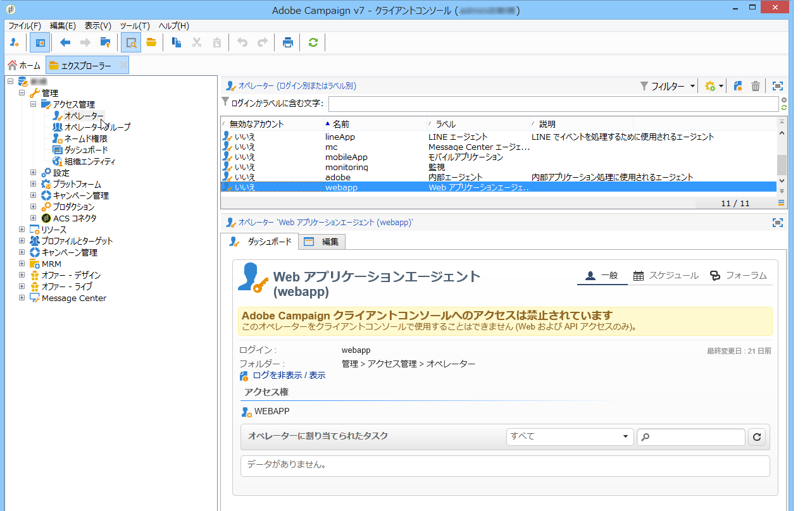

オペレーターは、手動で作成するか、既存の LDAP ディレクトリ上でマッピングできます。

オペレーターを作成するための詳しい手順については、[このページ](#creating-an-operator)を参照してください。

Adobe Campaign と LDAP の統合について詳しくは、[このページ](../../installation/using/connecting-through-ldap.md)を参照してください。

>[!CAUTION]
>
>インスタンスにログオンするには、オペレーターがセキュリティゾーンにリンクされている必要があります。Adobe Campaign でのセキュリティゾーンについて詳しくは、[このページ](../../installation/using/configuring-campaign-server.md#defining-security-zones)を参照してください。

Adobe ID を使用して Adobe Campaign に直接接続することもできます。詳しくは、この[ページ](../../integrations/using/about-adobe-id.md)を参照してください。

### オペレーターの作成 {#creating-an-operator}

新しいオペレーターを作成し権限を付与するには、次の手順に従います。

1. Click the **[!UICONTROL New]** button located above the list of operators, and enter the details of the new operator.

   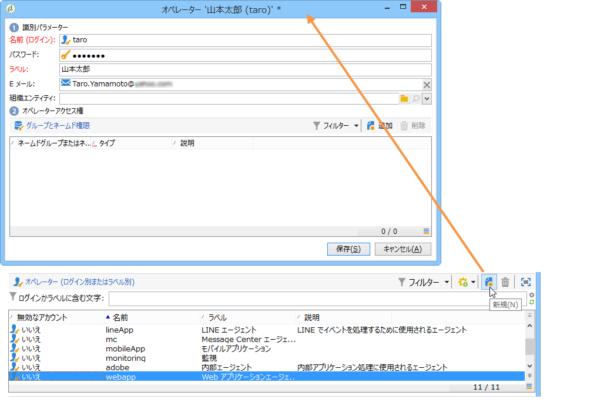

1. Specify the **[!UICONTROL Identification parameters]** of the user: its login, password and name. ログインとパスワードは、そのオペレーターが Adobe Campaign にログオンするときに使われます。Once the user is logged on, they can change their password via the **[!UICONTROL Tools > Change password]** menu. オペレーターは処理の承認などの通知を E メールで受信するので、オペレーターの E メールは必要不可欠です。

   このセクションでは、オペレーターと組織エンティティとのリンクを設定することもできます。詳しくは、[このページ](../../campaign/using/about-distributed-marketing.md)を参照してください。

1. Select the permissions granted to the operator in the **[!UICONTROL Operator access rights]** section.

   To assign rights to the operator, click the **[!UICONTROL Add]** button located above the list of rights, then select a group of operators from the list of available groups:

   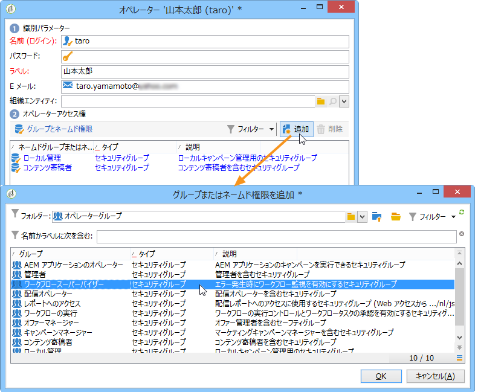

   You can also select one or more named rights (refer to [Named rights](#named-rights)). To do this, click the arrow to the right of the **[!UICONTROL Folder]** field, and select **[!UICONTROL Named rights]**:

   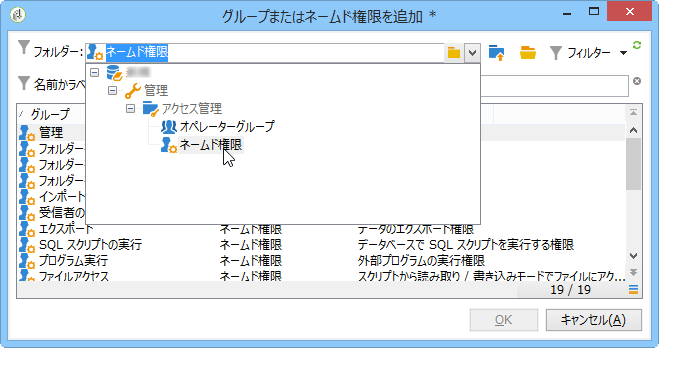

   割り当てるグループとネームド権限のいずれかまたは両方を選択し、「**[!UICONTROL OK]**」をクリックして確定します。

1. 「**[!UICONTROL Ok]**」をクリックすると、オペレーターが作成され、既存オペレーターのリストにプロファイルが追加されます。

   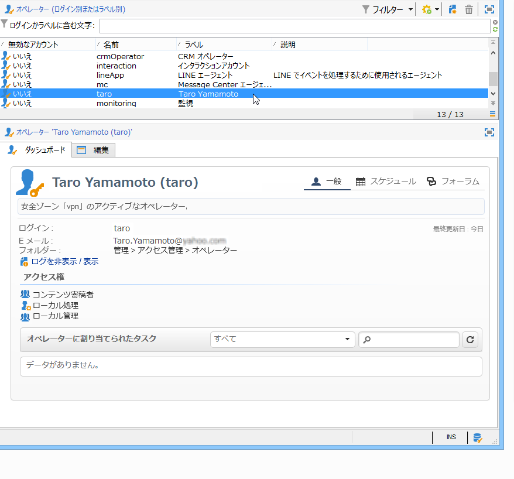

>[!NOTE]
>
>新しいオペレーターフォルダーを作成すると、必要に応じた方法でオペレーターを整理することができます。To do this, right-click the operator folder and select **[!UICONTROL Add an 'Operators' folder]**.

オペレーターのプロファイルを作成した後は、プロファイルに含まれる情報の追加や更新ができます。To do this, click the **[!UICONTROL Edit]** tab.

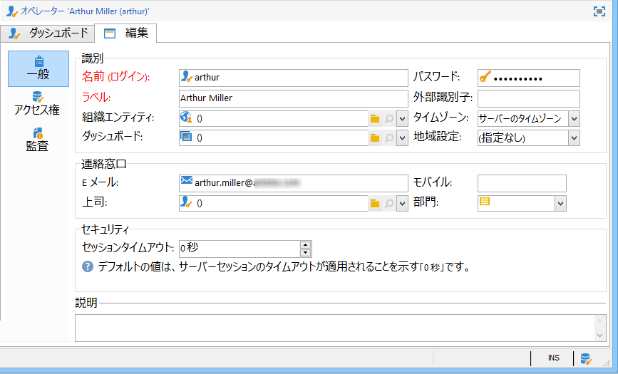

>[!NOTE]
>
>The **[!UICONTROL Session timeout]** field lets you adjust the delay before the FDA session timeout. 詳細については、「フェデレーテッドデータア [クセスについて](../../platform/using/accessing-an-external-database.md#about-federated-data-access)」を参照してください。

### オペレーターのタイムゾーン {#time-zone-of-the-operator}

In the **[!UICONTROL General]** tab, you can select the time zone of the operator. オペレーターは、デフォルトではサーバーのタイムゾーンで作業します。このドロップダウンリストから別のタイムゾーンを選択することもできます。

タイムゾーンの設定については、[このページ](../../installation/using/time-zone-management.md)を参照してください。

>[!NOTE]
>
>異なるタイムゾーンのユーザー同士が共同作業できるよう、格納する日付情報は UTC（協定世界時）で表現される必要があります。日付をユーザーのタイムゾーンで表示する、ファイルのインポートおよびエクスポートを実行する、E メールの配信をスケジュール設定する、ワークフロー内のアクティビティをスケジュール設定するとき（スケジューラー、待機、時間の制約など）には、日付は適切なタイムゾーンに変換されます。
>
>こうしたコンテキストに関係する制約や推奨事項については、Adobe Campaign のドキュメントの関連セクションに記載されています。

In addition, the **[!UICONTROL Regional settings]** drop-down list lets you select the format to display dates and numbers.

### アクセス権オプション {#access-rights-options}

Use the **[!UICONTROL Access rights]** tab to update the groups and named rights linked to the operator.

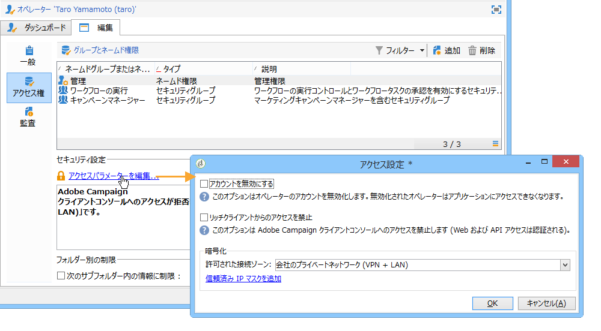

The **[!UICONTROL Edit the access parameters...]** link lets you access the following options:

* The **[!UICONTROL Disable account]** option lets you disable the operator&#39;s account: he will no longer access Adobe Campaign.
* The **[!UICONTROL Forbid access from the rich client]** option lets you restrict the use of Adobe Campaign to [Web access](../../platform/using/adobe-campaign-workspace.md#console-and-web-access) or through APIs: access to the Adobe Campaign client console is no longer available.
* 安全ゾーンをオペレーターに関連付けることができます。詳しくは、[このページ](../../installation/using/configuring-campaign-server.md#defining-security-zones)を参照してください。
* また、適切なリンクを使用して、信頼できる IP マスクを定義することもできます。

   オペレーターは、このリストに含まれる IP アドレスからアクセスした場合、パスワードを入力することなく Adobe Campaign に接続できます。

   次の図のように指定すると、一連の IP アドレスに対してパスワードなしの接続を許可することもできます。

   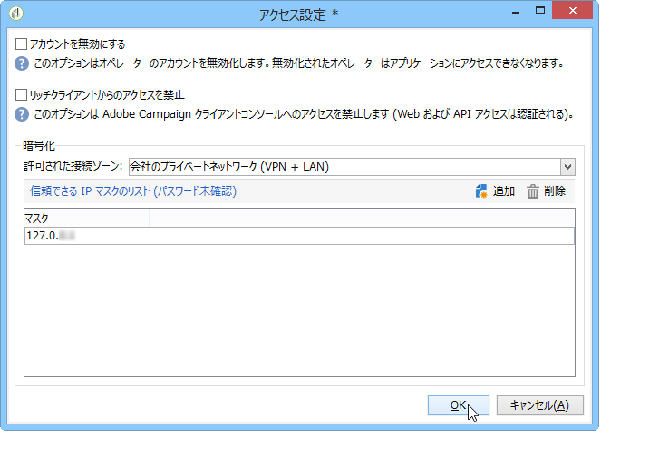

   >[!NOTE]
   >
   >プラットフォームに対するアクセスのセキュリティが保たれるよう、このオプションを使用する際は十分注意してください。

* このオ **[!UICONTROL Restrict to information found in sub-folders of:]** プションを使用すると、フォルダーの演算子に関連付ける権限を制限できます。 ここで指定されたノードに属するサブフォルダーだけがユーザーに対して表示されるようになります。

   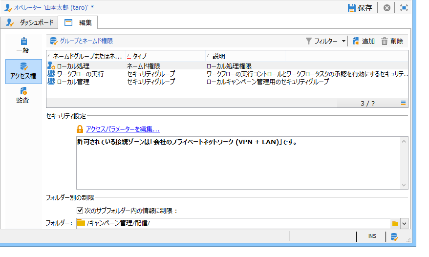

   >[!CAUTION]
   >
   >これは非常に強い制限です。使用の際は十分注意してください。この種の権利を持つオペレーターがログインした場合は、ここで指定されたフォルダーの内容だけが表示され、ツリー内の他のノードにエクスプローラーでアクセスすることはできません。ただし、アクセスする機能の種類によっては（ワークフローなど）、通常見ることができないノード内のデータも表示されることがあります。

### オペレーターのフォルダー、承認、タスク {#folders--approval-and-tasks-of-an-operator}

The **[!UICONTROL Audit]** tab lets you view information related to the operator. そのオペレーターが関与する領域内の設定内容に応じて、様々なタブが自動的に追加されます。

以下にアクセスできます。

* オペレーターに関連付けられたフォルダーに対する権利のリスト。

   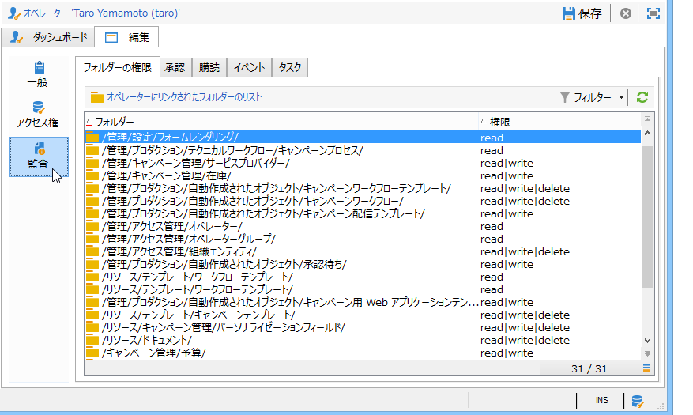

   >[!NOTE]
   >
   >詳しくは、「フォルダーアクセス管理」を [参照してください](#folder-access-management)。

* オペレーター承認ログ。

   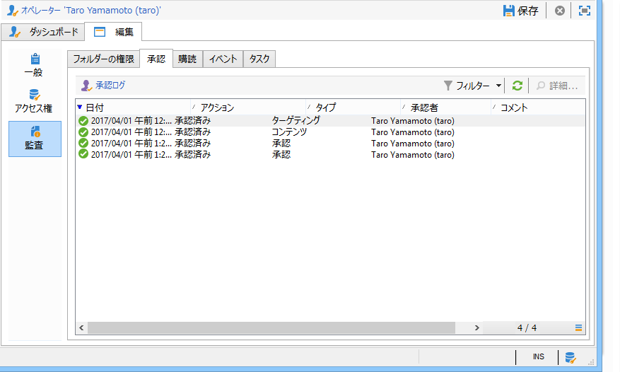

* オペレーターが購読しているディスカッションフォーラムのリスト。
* オペレーターのカレンダーに記載されたイベント。
* オペレーターに割り当てられたタスクのリスト。

### デフォルトのオペレーター {#default-operators}

Adobe Campaignは、次の技術的なオペレーターを使用し、デフォルトで設定されたプロファイルを使用します。管理者(&#39;admin&#39;)、課金(&#39;billing&#39;)、監視、Webアプリケーションエージェント(&#39;webapp&#39;)など これらの一部は、プラットフォームにインストールされているアプリケーションとオプションに依存します。例えば、「central」演算子と「local」演算子は、「Distributed Marketing」オプションがインストールされている場合にのみ表示されます。

>[!CAUTION]
>
>これらのテクニカルオペレーターは、プラットフォームから情報メッセージが返された場合、デフォルトで通知を受信します。テクニカルオペレーターの連絡先 E メールは必ず設定しておくことをお勧めします。
>
>また、Web アプリケーションが正しく動作するよう、&#39;webapp&#39; オペレーターについては特定の地域設定をおこなわないでおくことをお勧めします。

デフォルトでは、&#39;webapp&#39; テクニカルオペレーターには「管理」のネームド権限が付与されていますが、これはセキュリティリスクの原因になる可能性があります。したがって、このネームド権限は削除しておくことをお勧めします。手順は次のとおりです。

1. ノードで、 **[!UICONTROL Administration > Access management > Named rights]** をクリックし **[!UICONTROL New]** て権利を作成し、WEBAPPという名前を付けます。

   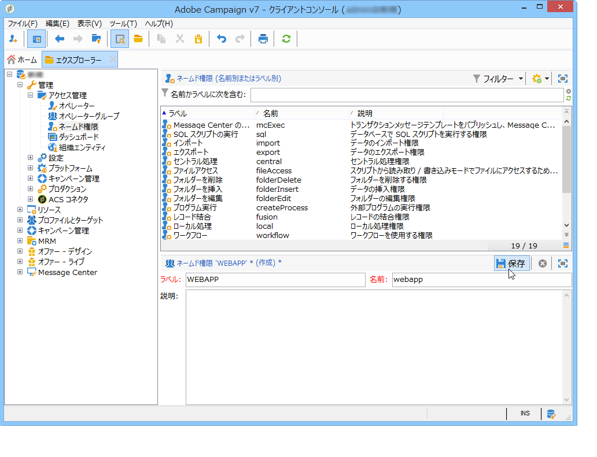

   Named rights are detailed in the [Named rights](#named-rights) section.

1. ノードから、 **[!UICONTROL Administration > Access management > Operators]** Webアプリケーションエージェント演算子(「webapp」)を選択します。

   Select the **[!UICONTROL Edit]** tab, then the **[!UICONTROL Access rights]** tab and delete the ADMINISTRATION named right from the list.

   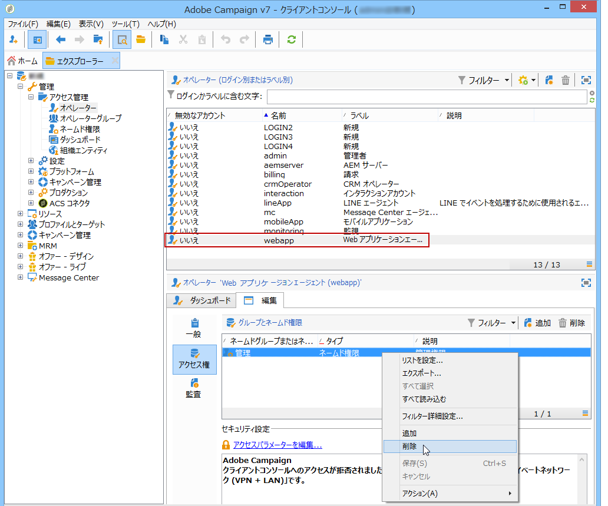

   Click **[!UICONTROL Add]** and select the WEBAPP right that you have just created, then save your changes.

   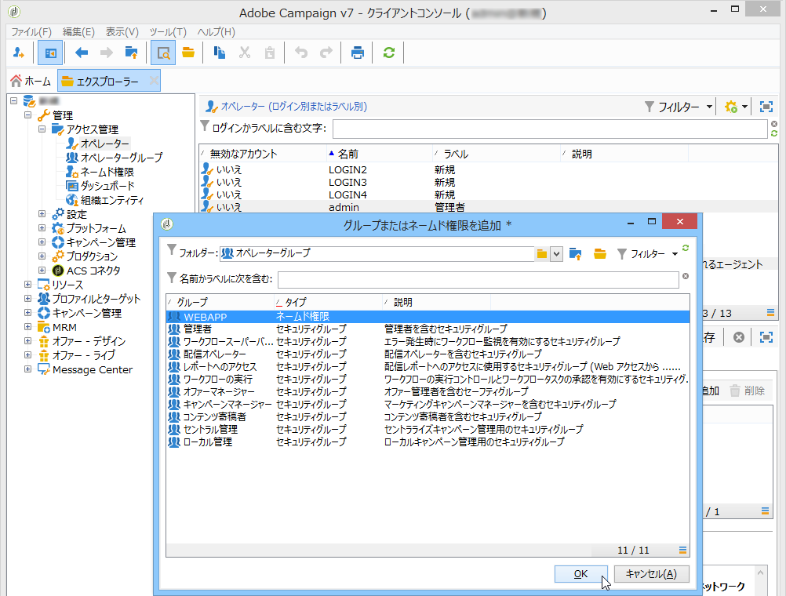

1. &#39;webapp&#39; オペレーターに、このオペレーターに関係するフォルダー（主に&#39;受信者&#39;フォルダー）に対する読み取り、書き込みのデータアクセス権を設定します。

   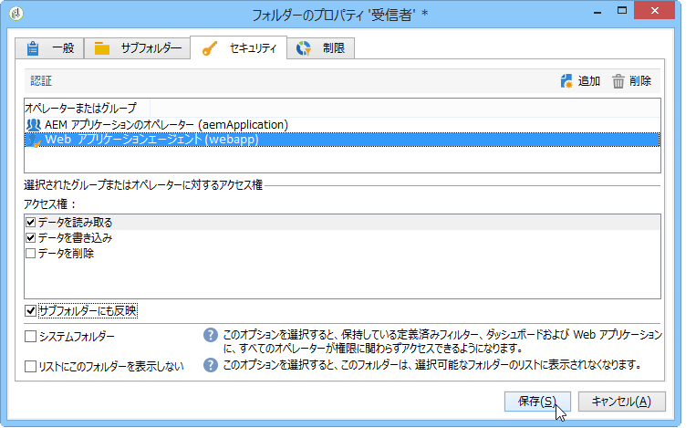

   Modifying rights on tree folders is detailed in the [Folder access management](#folder-access-management) section.

>[!NOTE]
>
>セキュリティガイドラインについて詳しくは、[Adobe Campaign セキュリティ設定チェックリスト](https://docs.campaign.adobe.com/doc/AC/getting_started/EN/security.html)を参照してください。

## オペレーターグループ {#operator-groups}

演算子グループは、ツリー内のノー **[!UICONTROL Administration > Access management > Operator groups]** ドを介して作成されます。

### 新しいオペレーターグループの作成 {#creating-a-new-operator-group}

新しいオペレーターグループを作成するには、以下の手順を実行します。

1. Click the **[!UICONTROL New]** button to the right of the list of groups or right-click the list and choose **[!UICONTROL New]**.
1. In the section lower window, from the **[!UICONTROL General]** tab, enter the name and a description for this group in the corresponding fields.

   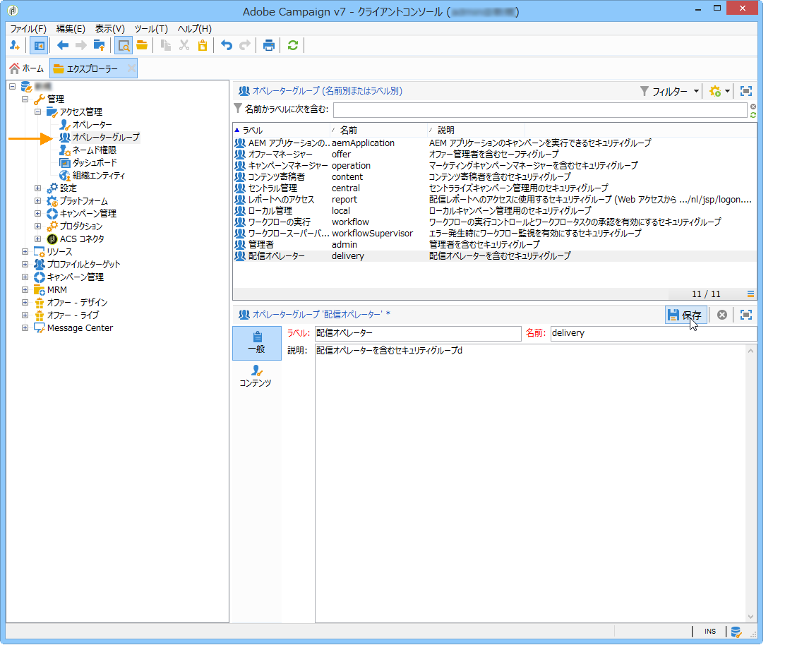

1. Click the **[!UICONTROL Content]** tab to define authorizations for this group.
1. Click the **[!UICONTROL Add]** button to select an appointed right or an operator to associate to the group.
1. Click the drop-down list or on the folder to the right of the **[!UICONTROL Folder]** field to locate the appointed rights or operators to associate to this group.
1. 追加するアクセス権またはオペレーターを選択し、「**[!UICONTROL OK]**」をクリックして確定します。

   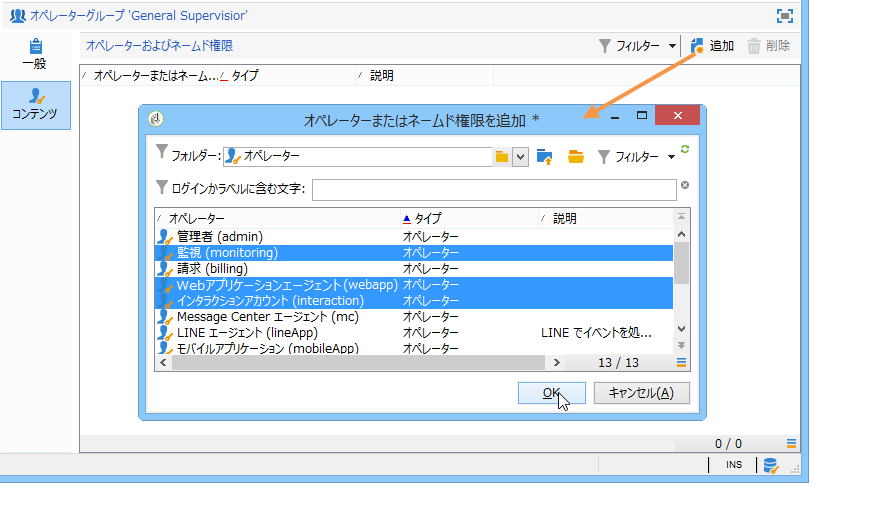

   他のアクセス権やオペレーターを追加するには、この操作を繰り返します。

1. Click the **[!UICONTROL Save]** button to add the group to the list.

### デフォルトのグループ {#default-groups}

以下のオペレーターグループがデフォルトで用意されています。

1. 配信オペレーター

   このグループのオペレーターは、配信の管理を担当します。配信の作成と準備に必要とされる主なリソース（キャンペーンタイポロジ、配信マッピング、デフォルトテンプレート、パーソナライゼーションブロックなど）にアクセスできます。

   このグループには以下のネームド権限が設定されています。

   * 配信を準備：配信分析を作成、編集および開始する権利
   * 配信を開始：以前分析した配信を承認する権利

1. キャンペーンマネージャー

   このグループのオペレーターは、マーケティングキャンペーンの管理を実行できます。キャンペーンにリンクされたオブジェクト（プラン、プログラム、ワークフロー、予算など）にアクセスできます。

   このグループには以下のネームド権限が設定されています。

   * フォルダーを挿入：Adobe Campaign ツリーにフォルダーを挿入する権利（関係する分岐に対して編集の権利を持っていることが前提）
   * ワークフロー：ワークフローを使用する権利
   >[!NOTE]
   >
   >このグループのオペレーターに配信開始の権利は付与されません。

1. コンテンツ寄稿者

   このグループのオペレーターは、**コンテンツ管理**（Adobe Campaign オプションモジュール）のフレームワーク内でコンテンツフォルダーにアクセスできます。このグループによってオペレーターに付与される権利はありません。

1. レポートにアクセスするオペレーター

   このグループは、Web アクセス経由で配信レポートにアクセスする外部のオペレーター向けに予約されています。

1. ワークフローの実行

   このグループのオペレーターには、キャンペーンとは関係がないワークフローを管理する権利が付与されます。

1. ワークフロースーパーバイザー

   このグループのオペレーターには、キャンペーンワークフローに関するアラートが発生すると E メール通知が送付されます。

1. ローカル管理、中央管理

   このグループのオペレーターは&#x200B;**分散型マーケティング**（Adobe Campaign オプションモジュール）を使用できます。

## ネームド権限 {#named-rights}

ネームド権限は、個別のオペレーターやオペレーターのグループに付与する権限を定義するものです。Adobe Campaign には、運用方法の参考として、デフォルトのネームド権限セットがあらかじめ用意されています。これらの権限は、ツリーのノード **[!UICONTROL Administration > Access management > Named rights]** から編集できます。

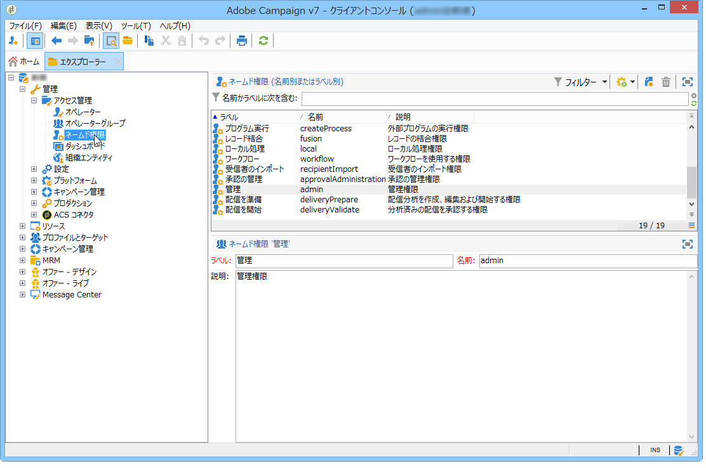

デフォルトで用意されているネームド権限は以下のとおりです。

* 管理：汎用管理権限は、コンソール上のすべてのフォルダーに適用されます。
* 承認管理：レビュー担当者の割り当て権限。
* 中央：中央管理権（分散マーケティング）
* フォルダの削除：フォルダを削除する権限。
* フォルダの編集：フォルダのプロパティを変更する権限：名前、ラベル、関連する画像など
* エクスポート：データのエクスポート権。
* ファイルアクセス：スクリプトを使用したファイルの読み取りおよび書き込みアクセス権。
* インポート：汎用データインポートの権限。
* フォルダの挿入：フォルダを挿入する権限。
* ローカル：ローカル管理権（分散マーケティング）
* マージ：レコードのマージ権。
* 配信の準備：配信分析を作成、編集および開始する権限。
* プライバシーデータの権利：プライバシーデータを収集および削除する権利。 詳しくは、この[ページ](https://helpx.adobe.com/campaign/kb/acc-privacy.html)を参照してください。
* プログラムの実行：外部プログラムを実行する権利。
* 受信者のインポート：受信者をインポートする権限。
* SQLスクリプトの実行：データベースでSQLスクリプトを実行する権限。
* 配信を開始：前に分析された配信を承認する権利。
* USE SQL DATA MANAGEMENT ACTIVITY: Right to write your own SQL scripts using the SQL Data Management activity, in order to create and populate work tables (see [this section](../../workflow/using/sql-data-management.md)).
* ワークフロー：ワークフローの使用権
* WEBAPP:Webアプリケーションを使用する権利。

>[!NOTE]
>
>このリストは、プラットフォームにインストールされているアドオンに応じて変わることがあります。

## アクセス権マトリックス {#access-rights-matrix}

デフォルトのグループやネームド権限を使用すると、ナビゲーション階層構造内の特定のフォルダーに対するオペレーターのアクセスを許可し、読み取り、書き込み、削除の権限を付与できます。

Adobe Campaign のアクセス権マトリックスは[ここ](/help/platform/using/assets/accessrights.pdf)にあります。

## フォルダーアクセスの管理 {#folder-access-management}

ツリー内の各フォルダーには、読み取り、書き込み、削除のアクセス権が設定されています。ファイルにアクセスするには、個別のオペレーターまたはオペレーターのグループが、少なくとも目的のファイルに対する読み取りアクセス権を持っている必要があります。

### フォルダーに対する権限の編集 {#edit-permissions-on-a-folder}

ツリーの特定のフォルダーに対する権限を編集するには、次の手順に従います。

1. Right-click on the folder and select **[!UICONTROL Properties...]**.

   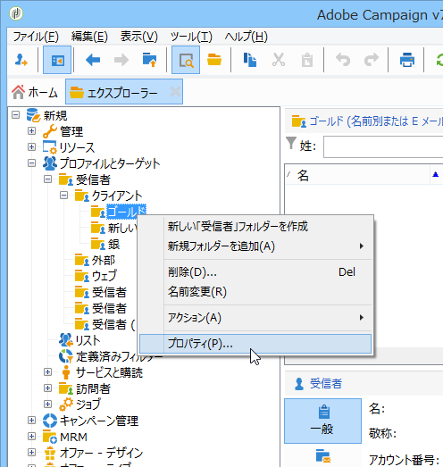

1. Click the **[!UICONTROL Security]** tab to view authorizations on this folder.

   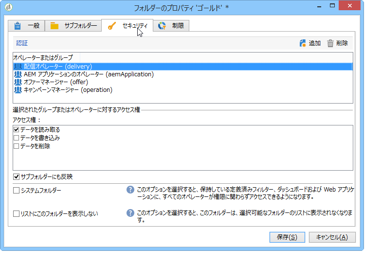

### 権限の変更 {#modify-permissions}

権限を変更するには、次の方法があります。

* **グループまたはオペレーターを置き換える**：これをおこなうには、そのフォルダーへのアクセス権を持つグループ（またはオペレーター）を 1 つクリックし、次の図のように、ドロップダウンリストから新しいグループ（または新しいオペレーター）を選択します。

   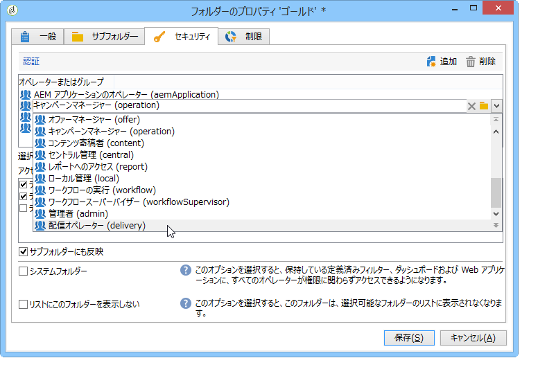

* **グループまたはオペレーターのアクセスを許可する**：To do this, click the **[!UICONTROL Add]** button and select the group or operator to which you want to assign authorizations for this folder.
* **グループまたはオペレーターのアクセスを禁止する**：To do this, click **[!UICONTROL Delete]** and select the group or operator from which you want to remove authorization for this folder.
* **グループまたはオペレーターに付与する権利を選択する**：これをおこなうには、該当するグループまたはオペレーターをクリックし、必要に応じて、付与するアクセス権を選択したり、付与しないアクセス権を選択解除したりします。

   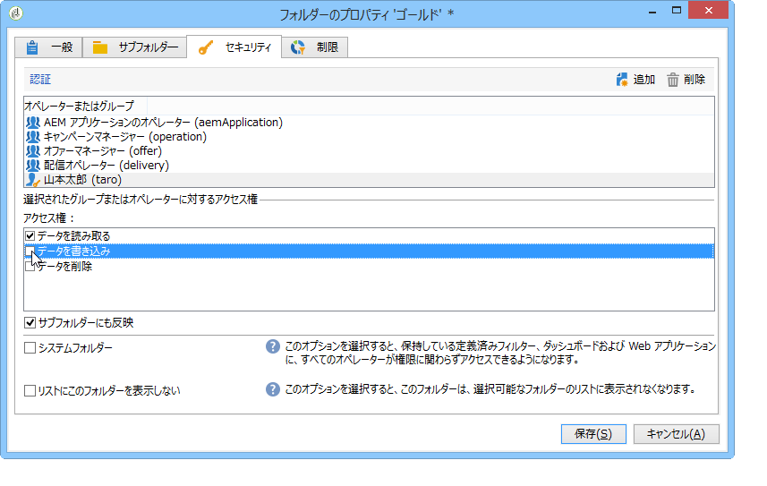

### 権限のサブフォルダーへの反映 {#propagate-permissions}

権限やアクセス権をサブフォルダーに反映させることができます。To do this, select the **[!UICONTROL Propagate]** option in the folder properties.

このウィンドウで定義された権限が、現在のノードに属するすべてのサブフォルダーに反映されます。したがって、個々のサブフォルダーに設定された権限は無視できます。

>[!NOTE]
>
>フォルダーでこのオプションをクリアしても、サブフォルダーのオプションは自動的にはクリアされません。個々のサブフォルダーに対する指定を明示的に解除する必要があることに注意してください。

### すべてのオペレーターへのアクセス権の付与 {#grant-access-to-all-operators}

In the **[!UICONTROL Security]** tab, if the **[!UICONTROL System folder]** option is selected, all operators will have access to this data, regardless of their rights. このオプションが選択されていない場合、オペレーターにデータへのアクセスを許可するには、該当するオペレーターまたはグループを認証リストに明示的に追加する必要があります。

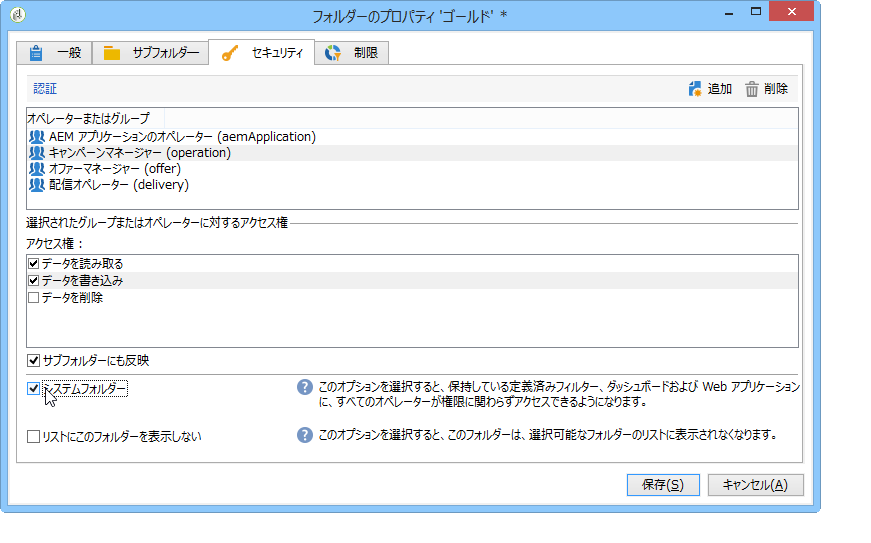

## フォルダーとビュー {#folders-and-views}

### フォルダーとビューについて {#about-folders-and-views}

フォルダーとは Adobe Campaign ツリーのノードです。These nodes are created by right-clicking the tree, via the **[!UICONTROL Add new folder]** menu. デフォルトでは、最初のメニューを使用すると現在のコンテキストに対応したフォルダーを追加できます。

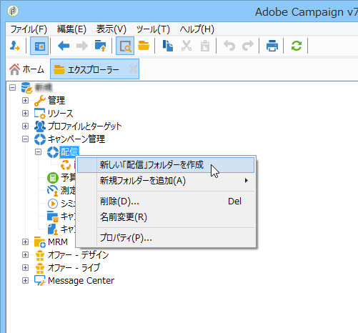

それらのフォルダーには、ツリー内にあるその他すべてのフォルダーと同じく、権限を付与できます。「フォルダ [ーアクセス管理」を参照](#folder-access-management)。

また、必要に応じて、データアクセスの制限やツリー内のコンテンツの整理を目的としたビューを作成できます。それらのビューにはアクセス権を設定できます。

ビューはフォルダーの一種ですが、別の場所にある同じタイプのフォルダー（1 つまたは複数）に格納されているレコードを表示するために使用します。例えば、キャンペーンフォルダーをビューとして作成すると、デフォルトでは、データベース内に存在するすべてのキャンペーン（本来の格納場所に関わらず）のデータを表示するビューになります。そのデータにはフィルターを適用することができます。

フォルダーをビューに変換すると、そのフォルダータイプに該当するデータが、実際の格納場所がデータベース内のどこにあるフォルダーであるかに関わらず、すべて表示されます。そうして表示されたデータリストにフィルターを適用し、ビューの内容を絞り込んで使用することができます。

>[!CAUTION]
>
>ビューにはデータが含まれており、ビューからそのデータにアクセスできますが、データが実際に格納されている場所はそのビューフォルダー内ではありません。データソースフォルダー内のデータを操作するには、オペレーターが適切なアクセス権を持っている必要があります（少なくとも読み取りアクセス権）。
>
>ソースフォルダーへのアクセスを許可することなくビューの表示のみを可能にする場合は、ソースフォルダーの親ノードへの読み取りアクセス権を付与しないようにするだけで十分です。

### フォルダーの追加とビューの作成 {#adding-folders-and-creating-views}

以下の例では、特定のデータを表示するための新しいフォルダーを作成します。

1. Create a new **[!UICONTROL Deliveries]** type folder, and name it **Deliveries France**.
1. Right-click this folder and select **[!UICONTROL Properties...]**.

   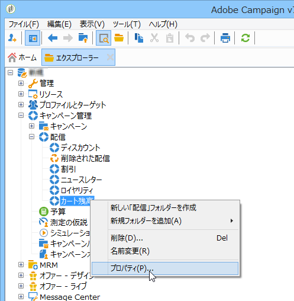

1. タブで、を **[!UICONTROL Restriction]** 選択します **[!UICONTROL This folder is a view]**。 データベース内にあるすべての配信データが表示されます。

   

1. ウィンドウ中央部のセクションにある Query Editor を使って配信のフィルター条件を定義します。すると、定義したフィルターに該当するキャンペーンが表示されます。

   >[!NOTE]
   >
   >Query Editor については、[この節](../../platform/using/about-queries-in-campaign.md)を参照してください。

   例えば、次のようなフィルター条件を定義したとします。

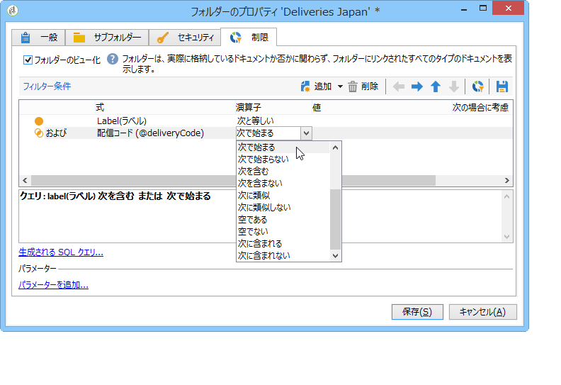

すると、ビューに表示される配信リストの内容は次のようなものになります。

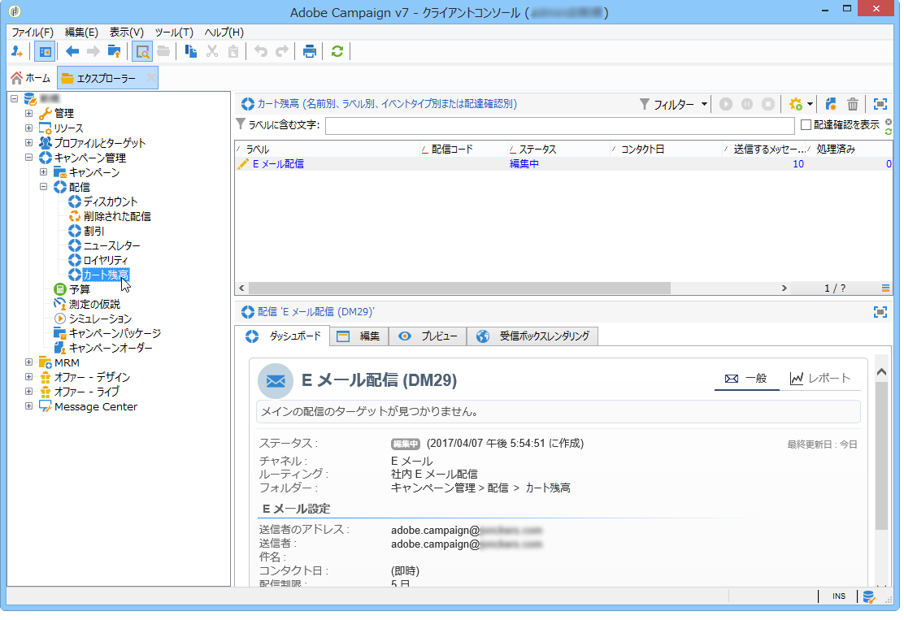

