# 外部データベースへのアクセス{#accessing-an-external-database}

## Federated Data Access について {#about-federated-data-access}

Adobe Campaign では、**Federated Data Access**（FDA）オプションを利用することができます。このオプションを使用すると、1 つ以上の外部データベースに格納されている情報を処理することが可能です。Adobe Campaign データの構造を変更しなくても、外部データにアクセスできます。

>[!CAUTION]
>
>**Federated Data Access**（FDA）モジュールはオプションです。Adobe Campaign のライセンス契約を確認してください。
>  
>また、FDA を使用して外部データベースにアクセスできるのは、オンプレミスインストールとハイブリッドインストールに限られます。

### 動作の仕組み {#operating-principle}

FDA オプションを使用すると、SQL ソースからデータを収集し、ターゲットテーブルの構造を自動的に検出できます。

この機能を使用するには、以下をおこなう必要があります。

1. Adobe Campaign の FDA モジュールと互換性がある外部データベースを用意します。各種データベースシステムの互換性があるバージョンのリストについては、[互換性マトリックス](https://helpx.adobe.com/campaign/kb/compatibility-matrix.html)を参照してください。さらに、Adobe Campaign および外部データベースで[必要な権限](#remote-database-access-rights)をユーザーに割り当てる必要があります。
1. Adobe Campaign サーバーに、データベースに対応する[ドライバーをインストール](#specific-configurations-by-database-type)します。
1. Adobe Campaign と外部データベースの間の接続を確立するための[外部アカウントを作成および設定](#connecting-to-the-database)します。使用可能な外部アカウントの詳細については、このページを参照して [ください](../../platform/using/external-accounts.md)。
1. Adobe Campaign で、外部データベースの[読み取りスキーマを作成](#creating-the-data-schema)します。これにより、外部データベースのデータ構造を認識できるようになります。
1. 最後に、前の手順で作成したスキーマから[新しいターゲットマッピングを作成](#defining-data-mapping)します。これは、配信の受信者を外部データベースから取得する場合に必要です。これにより、特に配信のパーソナライズに関して一定の制限を適用することが可能です。

データ読み取りスキーマの作成が完了すると、Adobe Campaign ワークフローでデータを処理できるようになります。詳しくは、[この節](../../workflow/using/executing-a-workflow.md#architecture)を参照してください。

### ベストプラクティスと推奨事項 {#best-practices-and-recommendations}

FDA オプションは、ワークフローにおいて外部データベースのデータをバッチモードで操作するように設計されています。FDA を単一の操作（パーソナライゼーション、インタラクション、リアルタイム配信など）に使用するなど、別の状況で使用する場合は、実行に際していくつかの注意事項があります。

外部データベースの利用を開始する前に、考えられる問題を検出し、このオプションを最適に使用できるように、パフォーマンステストを実行します。

Adobe Campaign と外部データベースの両方を使用する必要がある操作は、できるだけおこなわないようにします。これは、次のような方法で回避できます。

* Adobe Campaign データベースを外部データベースにエクスポートし、外部データベースからのみ操作を実行して、その結果を Adobe Campaign に再インポートします。
* 外部の Adobe Campaign データベースからデータを収集し、ローカルで操作を実行します。

外部データベースのデータを使用する配信でパーソナライゼーションを実行する場合は、ワークフローで使用するデータを収集して一時テーブルに格納してから、一時テーブルのデータを使用して配信をパーソナライズします。

### 制限事項 {#limitations}

FDA オプションには、使用する外部データベースシステムの制限事項が適用されます。

パフォーマンス上の理由から、配信のパーソナライゼーション、インタラクションモジュール、リアルタイム配信などの単一の操作の実行においては、この機能を使用しないことをお勧めします。

## データベースタイプ別の特定の設定 {#specific-configurations-by-database-type}

Adobe Campaign から外部データベースにアクセスできるようにするには、使用する外部データベースに応じて特定の設定をおこなう必要があります。これらの設定は、基本的には、ドライバーをインストールし、Adobe Campaign サーバー上の各 RDBMS に属する環境変数を宣言することです。

原則として、外部データベースの対応するクライアントレイヤーを Adobe Campaign サーバーにインストールする必要があります。

>[!NOTE]
>
>互換性のあるバージョンは [Campaign 互換性マトリクス](https://helpx.adobe.com/campaign/kb/compatibility-matrix.html#FederatedDataAccessFDA)に記載されています。

### Hadoop へのアクセスの設定 {#configure-access-to-hadoop}

FDA で Hadoop 外部データベースに接続するには、Adobe Campaign サーバーで次の設定が必要になります。

#### Windows の場合 {#for-windows}

1. Windows 用の ODBC ドライバーと [Azure HD Insight](https://www.microsoft.com/en-us/download/details.aspx?id=40886) ドライバーをインストールします。
1. ODBC DataSource Adminstrator ツールを実行して、DSN（データソース名）を作成します。ユーザーが変更できる Hive 用 System DSN サンプルが提供されています。

   ```
   Description: vorac (or any name you like)
   Host: vorac.azurehdinsight.net
   Port: 443
   Database: sm_tst611 (or your database name)
   Mechanism: Azure HDInsight Service
   User/Password: admin/<your password here>
   ```

1. 「共有接続の作成」の節に従って、Hadoop外部ア [カウントを作成します](#creating-a-shared-connection) 。

#### Linux の場合 {#for-linux}

1. Linux 用の unixODBC をインストールします。

   ```
   apt-get install unixodbc
   ```

1. Download and install ODBC drivers for Apache Hive from HortonWorks: [https://www.hortonworks.com/downloads/](https://www.hortonworks.com/downloads/).

   ```
   dpkg -i hive-odbc-native_2.1.10.1014-2_amd64.deb
   ```

1. ODBC ファイルの場所を確認します。

   ```
   root@campadpac71:/tmp# odbcinst -j
   unixODBC 2.3.1
   DRIVERS............: /etc/odbcinst.ini
   SYSTEM DATA SOURCES: /etc/odbc.ini
   FILE DATA SOURCES..: /etc/ODBCDataSources
   USER DATA SOURCES..: /root/.odbc.ini
   SQLULEN Size.......: 8
   SQLLEN Size........: 8
   SQLSETPOSIROW Size.: 8
   ```

1. DSN（データソース名）を作成し、odbc.ini ファイルを編集します。次に、Hive 接続用の DSN を作成します。

   HDInsight で「バイラル」と呼ばれる接続を設定する場合の例を以下に示します。

   ```
   [ODBC Data Sources]
   vorac 
   
   [vorac]
   Driver=/usr/lib/hive/lib/native/Linux-amd64-64/libhortonworkshiveodbc64.so
   HOST=vorac.azurehdinsight.net
   PORT=443
   Schema=sm_tst611
   HiveServerType=2
   AuthMech=6
   UID=admin
   PWD=<your password here>
   HTTPPath=
   UseNativeQuery=1
   ```

   >[!NOTE]
   >
   >ここで、**UseNativeQuery** パラメーターは非常に重要です。Campaign は Hive 対応ですが、UseNativeQuery を設定しないと正しく機能しません。通常、ドライバーまたは Hive SQL コネクタがクエリを上書きして列の順序を勝手に変更してしまいます。

   認証設定は Hive や Hadoop の構成に依存します。例えば HD Insight では、[ここ](http://www.simba.com/products/Spark/doc/ODBC_InstallGuide/unix/content/odbc/hi/configuring/authenticating/azuresvc.htm)で説明しているように、ユーザー／パスワード認証に AuthMech=6 を使用します。

1. 変数をエクスポートします。

   ```
   export ODBCINI=/etc/myodbc.ini
   export ODBCSYSINI=/etc/myodbcinst.ini
   ```

1. Hortonworks ドライバーを /usr/lib/hive/lib/native/Linux-amd64-64/hortonworks.hiveodbc.ini を介して設定します。

   Campaign と unix-odbc（libodbcinst）に接続するには、UTF-16 を使用する必要があります。

   ```
   [Driver]
   
   DriverManagerEncoding=UTF-16
   ErrorMessagesPath=/usr/lib/hive/lib/native/hiveodbc/ErrorMessages/
   LogLevel=0
   LogPath=/tmp/hive
   SwapFilePath=/tmp
   
   ODBCInstLib=libodbcinst.so
   ```

1. これで、isql を使用した接続をテストできます。

   ```
   isql vorac
   isql vorac -v
   ```

1. 「共有接続の作成」の節に従って、Hadoop外部ア [カウントを作成します](#creating-a-shared-connection) 。

### MySQL へのアクセスの設定 {#configure-access-to-mysql}

MySQL データベースの設定方法については、[この記事](https://helpx.adobe.com/campaign/kb/campaign_fda_mysql.html)を参照してください。

### Netezza へのアクセスの設定 {#configure-access-to-netezza}

FDA で Netezza 外部データベースに接続するには、Adobe Campaign サーバーで追加の設定が必要になります。

1. 使用するオペレーティングシステムに応じて、Netezza 用の ODBC ドライバーをインストールします。

   * **Linux の場合は、nz-linuxclient-v7.2.0.0.tar.gz です。**&#x200B;オペレーティングシステムに対応するフォルダー（linux または linux64）を選択し、解凍コマンドを開始します。デフォルトで推奨されるリポジトリにインストールを実行したままにすることができます。&quot;/usr/local/nz&quot;
   * **Windows の場合は、nz-winclient-v7.2.0.0.zip です。**&#x200B;ファイルを解凍し、オペレーティングシステムに対応する実行可能スクリプト（nzodbcsetup.exe または nzodbcsetup64.exe）を開始します。ウィザードの手順に従ってドライバーのインストールを完了します。

1. ODBC ドライバーを設定します。設定は、次の標準ファイルで実行できます。一般パ **ラメーターの場合は/etc/odbc.ini** 、ドライ **バーの宣言の場合は/etc/odbcinst.ini** 。

   * **/etc/odbc.ini**

      ```
      [ODBC]
      InstallDir=/etc/
      ```

      「InstallDir」は、odbcinst.ini ファイルの保存場所です。

   * **/etc/odbcinst.ini**

      ```
      [ODBC Drivers]
      NetezzaSQL = Installed
      
      [NetezzaSQL]
      Driver           = /usr/local/nz/lib/libnzsqlodbc3.so
      Setup            = /usr/local/nz/lib/libnzsqlodbc3.so
      APILevel         = 1
      ConnectFunctions = YYN
      Description      = Netezza ODBC driver
      DriverODBCVer    = 03.51
      DebugLogging     = false
      LogPath          = /tmp
      UnicodeTranslationOption = utf8
      CharacterTranslationOption = all
      PreFetch         = 256
      Socket           = 16384
      ```

1. Adobe Campaign サーバーの環境変数を指定します。

   * **LD_LIBRARY_PATH**:/usr/local/nz/libおよび/usr/local/nz/lib64 「/usr/local/nz」は、ドライバーのインストール時にデフォルトで提示されるインストールリポジトリです。インストール先として選択したリポジトリを指定する必要があります。
   * **ODBCINI**:odbc.iniファイルの場所(/etc/odbc.iniなど)。
   * **NZ_ODBC_INI_PATH**:odbc.iniファイルの場所。 Netezza で odbc.ini ファイルを使用するには、この 2 番目の変数も必要になります。

1. 「共有接続の作成」の節に従って、Netezza外部ア [カウントを作成します](#creating-a-shared-connection) 。

>[!NOTE]
>
>自動で生成されるプライマリキーを含むスキーマの操作は考慮されません。
>
>テーブルでは、スキーマで定義された最初のインデックスに対して **Organize on** 句が使用されます。Netezza では、この句が 1～4 列に制限されるので、このインデックスに 4 列までしか格納できません。

### Oracle へのアクセスの設定 {#configure-access-to-oracle}

FDA で Oracle 外部データベースに接続するには、Adobe Campaign サーバーで追加の設定が必要になります。

#### Linux の場合 {#for-linux-1}

1. お使いのバージョンの Oracle に対応した Oracle フルクライアントをインストールします。
1. インストールに TNS の定義を追加します。これは、/etc/oracle リポジトリの「**tnsnames.ora**」ファイルで指定します。このリポジトリが存在しない場合は作成します。

   その後、TNS_ADMIN 環境変数を新規に作成し、TNS_ADMIN=/etc/oracle をエクスポートしてマシンを再起動します。

1. Oracle を Adobe Campaign サーバー（nlserver）に統合します。そのためには、Adobe Campaign サーバーツリー構造の「nl6」フォルダーに「**customer.sh**」ファイルがあり、そのファイルに Oracle ライブラリへのリンクが含まれていることを確認します。T

   クライアントのバージョンが 11.2 の場合の例を次に示します。

   ```
   export ORACLE_HOME=/usr/lib/oracle/11.2
   export TNS_ADMIN=/etc/oracle
   export LD_LIBRARY_PATH=$ORACLE_HOME/client64/lib:$LD_LIBRARY_PATH
   ```

   >[!NOTE]
   >
   >これらの値（特に ORACLE_HOME）はインストールリポジトリによって異なります。これらの値を参照する前に、ツリー構造を確認してください。

1. Oracle に必要なライブラリをインストールします。

   * **libclntsh.so**

      ```
      cd /usr/lib/oracle/<version>/client<architecture>/lib
      ln -s libclntsh.so.<version> libclntsh.so
      ```

   * **libaio1**

      ```
      aptitude install libaio1
      or
      yum install libaio1
      ```

#### Windows の場合 {#for-windows-1}

1. Oracle クライアントをインストールします。
1. In the C:Oracle folder, create a **tnsnames.ora** file containing your TNS definition.

   C:Oracleを値としてTNS_ADMIN環境変数を追加し、マシンを再起動します。

### Sybase IQ へのアクセスを設定する {#configure-access-to-sybase-iq}

FDA で Sybase IQ 16 外部データベースに接続するには、Adobe Campaign サーバーで追加の設定が必要になります。

1. unixodbc パッケージがサーバーにあることを確認します。
1. **iq_odbc** をインストールします。インストールの終了時にエラーが発生することがあります。このエラーは無視してかまいません。
1. **iq_client_common** をインストールします。インストールの終了時に Java のエラーが発生することがあります。このエラーは無視してかまいません。
1. ODBC ドライバーを設定します。設定は、次の標準ファイルで実行できます。一般パラメーターの/etc/odbc.iniと、ドライバーの宣言用の/etc/odbcinst.ini

   * **/etc/odbc.ini** (文字などの値を自 `<server_alias>` 分で置き換える):

      ```
      [ODBC Data Sources]
      <server_alias>=libdbodbc.so
      
      [<server_alias>]
      Driver=/opt/sybase/IQ-16_0/lib64/libdbodbc16.so
      Description=<description>
      Username=<username>
      Password=<password>
      ServerName=<server_name>
      CommLinks=tcpip(host=<host>)
      ```

   * **/etc/odbcinst.ini**

      ```
      [ODBC DRIVERS]
      SAP SybaseIQ=Installed
      
      [SAP SybaseIQ]
      Driver=/opt/sybase/IQ-16_0/lib64/libdbodbc16.so
      ```

1. 新しい libodbc16.so ライブラリのパスを LD_LIBRARY_PATH 変数に追加します。方法は次のとおりです。

   * customer.sh ファイルを使用してパスを宣言する場合は、パス /opt/sybase/IQ-16_0/lib64 を LD_LIBRARY_PATH 変数に追加します。
   * それ以外の場合は、Unix コマンドを使用します。

1. 「共有接続の作成」の説明に従って、新しいFDA外部ア [カウントを作成します](#creating-a-shared-connection) 。 For Sybase IQ, the server name corresponds to the ODBC connection (`<server_alias>`) defined in step 5. 必ずしもサーバー自体の名前であるとは限りません。

>[!NOTE]
>
>Windows の場合は、Sybase IQ クライアントを Adobe Campaign サーバーにインストールし、ODBC 接続を作成する必要があります。Adobe Campaign サーバー（nlserver）を Windows でサービスとして実行しているときに、システムデータソースを作成してください。

### Teradata へのアクセスの設定 {#configure-access-to-teradata}

FDA で Teradata 外部データベースに接続するには、Adobe Campaign サーバーで追加の設定が必要になります。Teradata データベースの設定方法については、[この記事](https://helpx.adobe.com/campaign/kb/campaign_fda_teradata.html)を参照してください。

1. [Teradata 用の ODBC ドライバー](http://downloads.teradata.com/download/connectivity/odbc-driver/linux)をインストールします。

   これは 3 つのパッケージで構成され、Red Hat（または CentOS）／Suse に次の順序でインストールできます。

   * TeraGSS
   * tdicu1510（setup_wrapper.sh を使用してインストール）
   * tdodbc1510（setup_wrapper.shを使用してインストール）

1. ODBC ドライバーを設定します。設定は、次の標準ファイルで実行できます。一般パ **ラメーターの場合は/etc/odbc.ini** 、ドライバーの宣言の場合は/etc/odbcinst.iniを参照してください。

   * **/etc/odbc.ini**

      ```
      [ODBC]
      InstallDir=/etc/
      ```

      「InstallDir」は、**odbcinst.ini** ファイルの保存場所です。

   * **/etc/odbcinst.ini**

      ```
      [ODBC DRIVERS]
      teradata=Installed
      
      [teradata]
      Driver=/opt/teradata/client/15.10/lib64/tdata.so
      APILevel=CORE
      ConnectFunctions=YYY
      DriverODBCVer=3.51
      SQLLevel=1
      ```

1. Adobe Campaign サーバーの環境変数を指定します。

   * **LD_LIBRARY_PATH**:/opt/teradata/client/15.10/lib64および/opt/teradata/client/15.10/odbc_64/lib。
   * **ODBCINI**:odbc.iniファイルの場所(/etc/odbc.iniなど)。
   * **NLSPATH**:opermsgs.catファイルの場所(/opt/teradata/client/15.10/msg/opermsgs.cat)

### SAP HANA へのアクセスを設定する {#configure-access-to-sap-hana}

FDA で SAP HANA 外部データベースに接続するには、Adobe Campaign サーバーで追加の設定が必要になります。

1. 使用するオペレーティングシステムに応じて、SAP HANA 用の ODBC ドライバーをインストールします。

   * **hdb_client_linux.tgz（Linux 用）：**&#x200B;解凍後、hdbinst コマンドを開始し、指示に従ってドライバーのインストールを完了します。
   * **hdb_client_windows.zip（Windows 用）：** Unzip the file and start the executable: **hdbinst.exe**. ウィザードの手順に従ってドライバーのインストールを完了します。

1. ODBC ドライバーを設定します。設定は、次の標準ファイルで実行できます。一般的なパラメーターの場合は/etc/odbc.ini、宣言するドライバーの場合は/etc/odbcinst.iniです。

   * **/etc/odbc.ini**

      ```
      [ODBC]
      InstallDir=/etc/
      
      [HDB]
      Driver=HDBODBC
      servernode=localhost:39013 (this value depend of your server)
      User:SYSTEM
      ```

      「InstallDir」は、**odbcinst.ini** ファイルの保存場所です。

   * **/etc/odbcinst.ini**

      ```
      [HDBODBC]
      Description = "SmartCloudPT HANA"
      Driver = /usr/sap/hdbclient/libodbcHDB.so
      ```

1. Adobe Campaign サーバーの環境変数を指定します。

   * **LD_LIBRARY_PATH**:SAP Hanaクライアント(デフォルトでは/usr/sap/hdbclient/ [libodbcHDB.so](http://libodbchdb.so/) )へのリンクを含めます。
   * **ODBCINI**:odbc.iniファイルの場所(/etc/odbc.iniなど)。

1. 「共有接続の作成」の節に従って、SAP Hana外部ア [カウントを作成します](#creating-a-shared-connection) 。

## リモートデータベースのアクセス権 {#remote-database-access-rights}

まず、ユーザーが FDA で外部データベースの操作を実行できるように、Adobe Campaign で特定のネームド権限を設定する必要があります。

1. Adobe Campaignエクスプ **[!UICONTROL Administration > Access Management > Named Rights]** ローラーでノードを選択します。
1. 任意のラベルを指定して新しい権限を作成します。
1. The **[!UICONTROL Name]** field must take the following format **user:base@server**, where :

   * **user** は、外部データベースのユーザーの名前に対応します。
   * **base** は、外部データベースの名前に対応します。
   * **server** は、外部データベースサーバーの名前に対応します。

      >[!NOTE]
      >
      >**:base** の部分は、Oracle では省略可能です。

1. Save the named right then link it to your chosen user from the **[!UICONTROL Administration > Access Management > Operators]** node of the Adobe Campaign explorer.

次に、外部データベースに格納されているデータを処理できるように、Adobe Campaign ユーザーに少なくともデータベースに対する「書き込み」権限を付与して、作業用テーブルの作成を許可する必要があります。作業用テーブルは Adobe Campaign で自動的に削除されます。

一般に必要となる権限には次のものがあります。

* **CONNECT**：リモートデータベースへの接続
* **READ Data**：顧客データが格納されたテーブルへの読み取り専用アクセス
* **READ &#39;MetaData&#39;**：テーブル構造を取得するためのサーバーデータカタログへのアクセス
* **LOAD**：作業用テーブルへの一括読み込み（収集や結合の作業で必要）
* **TABLE/INDEX/PROCEDURE/FUNCTION** の&#x200B;**CREATE/DROP**
* **EXPLAIN**（推奨）：問題が発生した場合にパフォーマンスの監視に使用
* **WRITE Data**（統合シナリオに応じて）

>[!NOTE]
>
>データベース管理者は、これらの権限を各データベースエンジン特有の権限に対応付ける必要があります。詳しくは、[RDBMS 特有の権限](https://docs.campaign.adobe.com/doc/AC6.1/en/technicalResources/technicalResources.html)を参照してください。

## データベースへの接続 {#connecting-to-the-database}

外部データベースへの接続を有効にするには、対象のデータソースおよびデータの読み込みが必要なテーブルの名前を接続パラメーターで指定する必要があります。

>[!CAUTION]
>
>Adobe Campaign ユーザーが外部データベースのデータを処理するには、外部データベースおよび Adobe Campaign アプリケーションサーバーに対する特定の権限が必要です。詳細については、「リモート・データベース・アク [セス権」の節を参照してくださ](#remote-database-access-rights) い。
>
>誤作動を回避するために、リモートの共有データにアクセスするオペレーターは分離された環境で作業をおこなう必要があります。

### 共有接続の作成 {#creating-a-shared-connection}

共有外部データベースへの接続を有効にすると、この接続がアクティブである限り、データベースは Adobe Campaign 経由でアクセスできます。

1. 設定は、ノードを介して事前に定義する必要があ **[!UICONTROL Administration > Platform > External accounts]** ります。
1. ボタンをクリ **[!UICONTROL New]** ックし、タイプを選択 **[!UICONTROL External database]** します。
1. Define the **[!UICONTROL Connection]** parameters of the external database.

   For connections to an **ODBC** type database the **[!UICONTROL Server]** field must contain the name of the ODBC data source and not the server name. また、使用するデータベースによっては、追加の設定が必要になることがあります。「データベースタ [イプ別の設定」の節を参照](#specific-configurations-by-database-type) 。

1. Once the parameters are entered, click the **[!UICONTROL Test the connection]** button to approve them.

   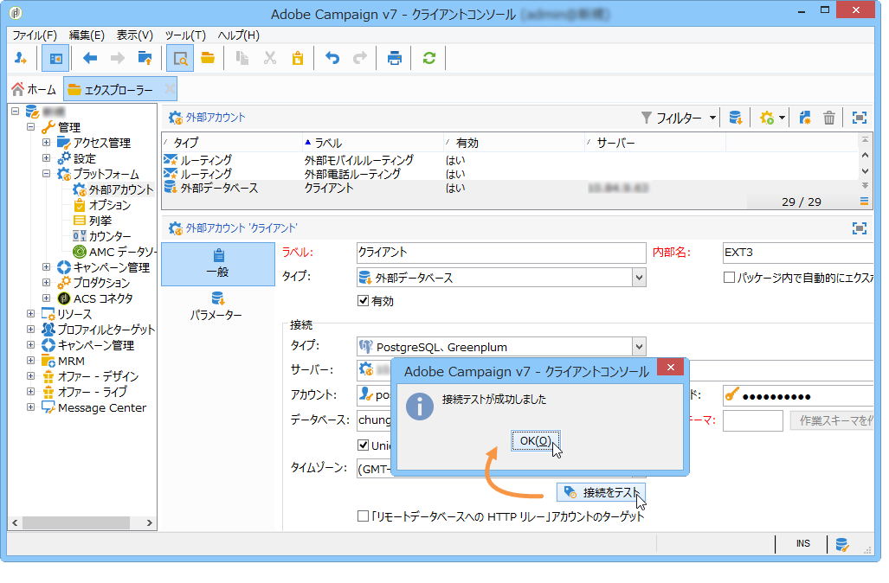

1. If necessary, uncheck the **[!UICONTROL Enabled]** option to disable access to this database without deleting its configuration.
1. このデータベースに Adobe Campaign からアクセスするには、SQL 関数をデプロイする必要があります。タブをクリックし **[!UICONTROL Parameters]** てから、ボタンをクリッ **[!UICONTROL Deploy functions]** クします。

   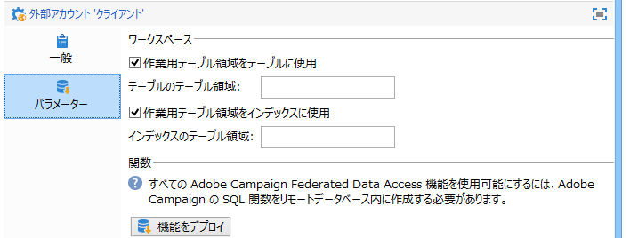

You can define specific work tablespaces for the tables and for the index in the **[!UICONTROL Parameters]** tab.

### Windows 認証を使用した接続の作成 {#creating-a-connection-with-windows-authentication}

FDA では Windows 認証を使用した接続も可能です。手順は次のとおりです。

* Adobe Campaign サービスが、ローカルシステムアカウントと異なる Windows アカウントで実行されていることを確認します。
* Adobe Campaign オペレーターが Adobe Campaign アプリケーションサーバーおよび外部データベースに対する十分な権限を破棄していることを確認します。
* Create the corresponding external account without specifying the **[!UICONTROL Account]** and the **[!UICONTROL Password]**. データベースの名前のみ指定します。

### 一時的な接続の作成 {#creating-a-temporary-connection}

ワークフローアクティビティから外部データベースへの接続を直接定義できます。この場合、接続はローカルの外部データベース上に置かれ、現在のワークフロー内で使用するために予約されます。外部アカウントには保存されません。This type of punctual connection can be created on different activities of the workflow, particularly the **[!UICONTROL Query]**, the **[!UICONTROL Data loading (RDBMS)]**, the **[!UICONTROL Enrichment]** activity or the **[!UICONTROL Split]** activity.

>[!CAUTION]
>
>このタイプの設定は推奨されませんが、データを収集するために定期的に使用される場合があります。ただし、[共有接続の作成](#creating-a-shared-connection)の節で説明しているように、外部アカウントを作成する必要があります。

例えば、「クエリ」アクティビティで、外部データベースへの定期的な接続を作成する手順は次のようになります。

1. をクリックし、 **[!UICONTROL Add data...]** オプションを選択 **[!UICONTROL External data]** します。
1. オプションを選 **[!UICONTROL Locally defining the data source]** 択します。

   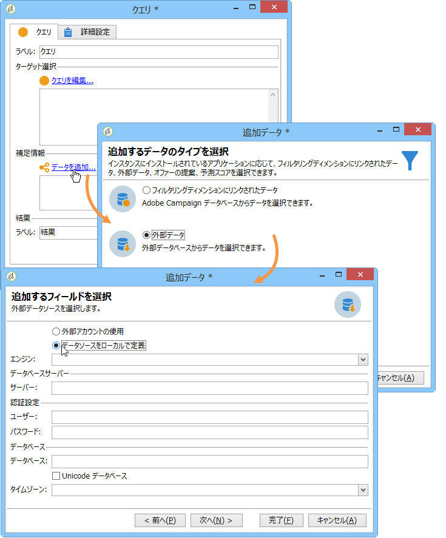

1. ドロップダウンリストからターゲットのデータベースエンジンを選択します。サーバーの名前を入力し、認証パラメーターを指定します。

   外部データベースの名前も指定します。

   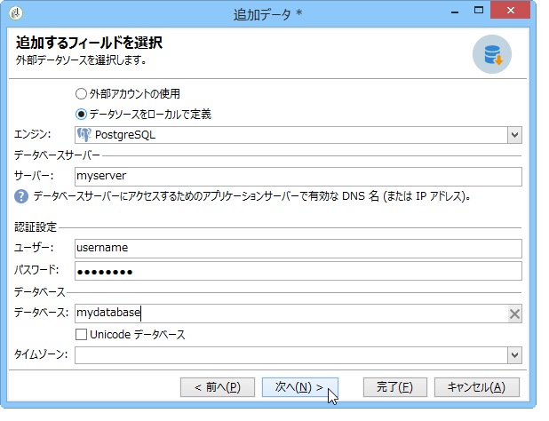

   ボタンをクリッ **[!UICONTROL Next]** クします。

1. データが格納されているテーブルを選択します。

   該当するフィールドにテーブルの名前を直接入力するか、編集アイコンをクリックしてデータベーステーブルのリストにアクセスできます。

   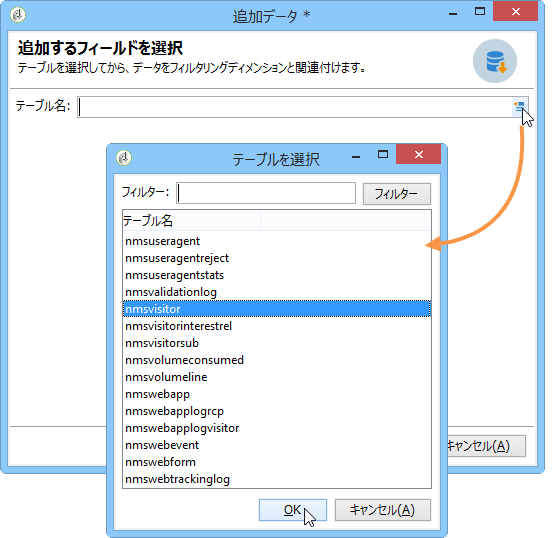

1. Click the **[!UICONTROL Add]** button to define one or several reconciliation fields between the external database data and the data in the Adobe Campaign database. とのア **[!UICONTROL Edit expression]** イコンを使 **[!UICONTROL Remote field]** 用して、 **[!UICONTROL Local field]** 各テーブルのフィールドのリストにアクセスできます。

   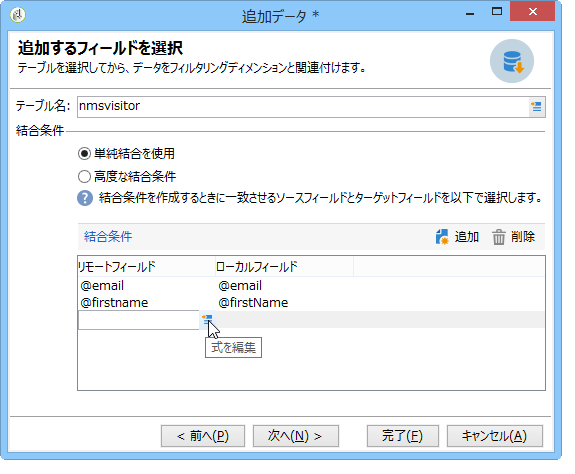

1. 必要に応じて、フィルタリング条件とデータ並べ替えモードを指定します。
1. 外部データベースで収集する追加のデータを選択します。To do this, double click on the fields(s) that you want to add to display them in the **[!UICONTROL Output columns]**.

   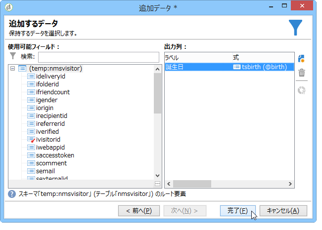

   Click **[!UICONTROL Finish]** to confirm this configuration.

### 接続の保護 {#secure-connection}

外部の FDA アカウントを設定するときに外部データベースへのアクセスを保護できます。

そのためには、サーバーアドレスと使用するポートのアドレスの後に &quot;**:ssl**&quot; を追加します。例： **192.168.0.52:4501:ssl**。

これで、データはセキュアな SSL プロトコル経由で送信されます。

### 任意の追加設定 {#additional-configurations}

必要に応じて、外部データベースのデータを処理するためのスキーマを作成できます。同様に、Adobe Campaign では外部テーブルのデータでマッピングを定義できます。これらは一般的な設定で、ワークフローだけに適用されるわけではありません。

>[!NOTE]
>
>Adobe Campaign でのスキーマの作成および新しいデータマッピングの定義について詳しくは、[このページ](../../configuration/using/about-schema-edition.md)を参照してください。

## データスキーマの作成 {#creating-the-data-schema}

To create a schema on an external database, click the **[!UICONTROL New]** button above the list of data schemas and choose **[!UICONTROL Access external data]**.


スキーマの名前と説明を入力し、データベースへの接続を有効にする外部アカウントを選択します。これにより、外部データベースで使用できるテーブルのリストにアクセスできます。収集するデータを含むテーブルを選択します。

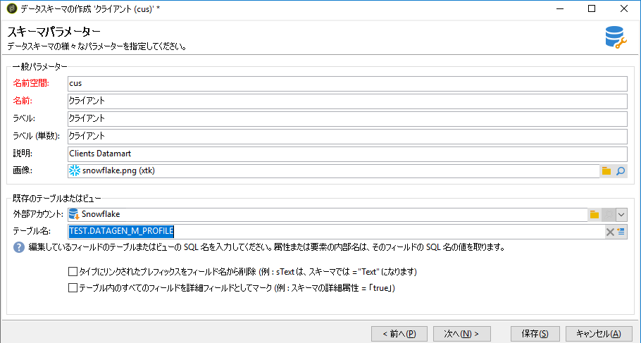

Click **[!UICONTROL OK]** to confirm. Adobe Campaign では選択したテーブルの構造が自動的に検出され、論理スキーマが生成されます。

>[!NOTE]
>
>Adobe Campaign ではリンクは生成されません。

Click **[!UICONTROL Save]** to confirm creation.

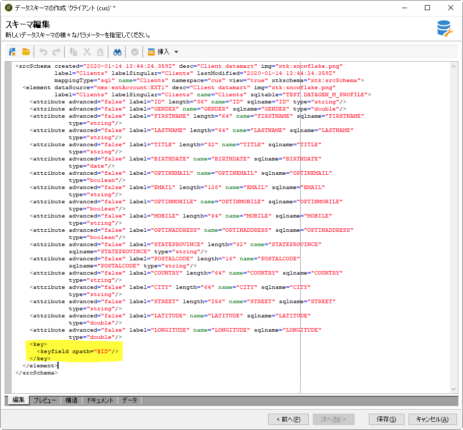

テーブルをマッピングすると（標準または FDA マッピング）、インデックスが自動的に作成されます。

## データマッピングの削除 {#defining-data-mapping}

Adobe Campaign では、外部テーブルのデータでマッピングを定義できます。

そのためには、外部テーブルのスキーマを作成した後に、新しい配信マッピングを作成してこのテーブルのデータを配信ターゲットとして使用する必要があります。

それには、次の手順に従います。

1. 新しい配信マッピングを作成し、ターゲティングディメンション（先ほど作成したスキーマなど）を選択します。

   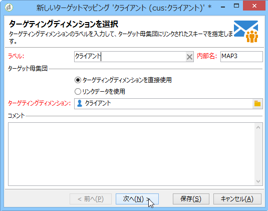

1. 配信情報が格納されるフィールド（姓、名前、E メール、住所など）を指定します。

   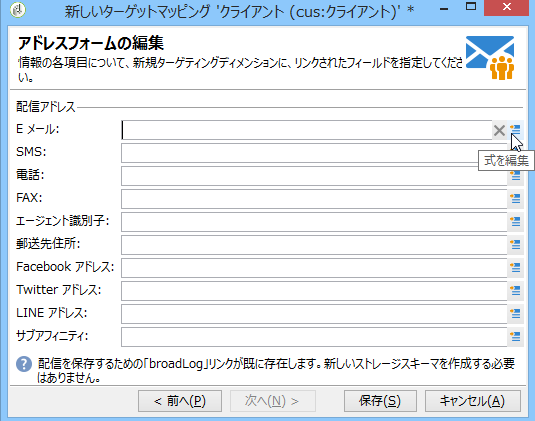

1. 拡張スキーマを識別しやすくするためのサフィックスなど、情報ストレージのパラメーターを指定します。

   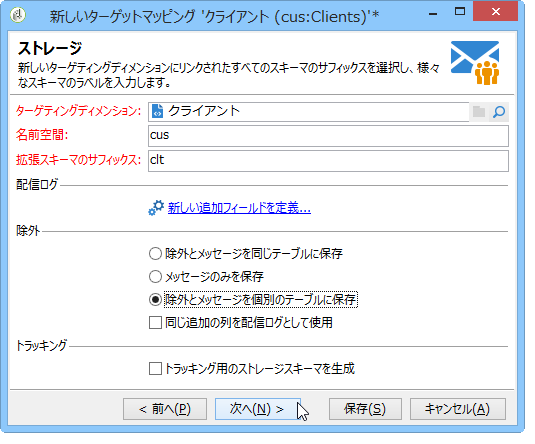

   除外（**excludelog**）をメッセージ付き（**broadlog**）で格納するか、個々のテーブルに格納するかを選択できます。

   この配信マッピングのトラッキングを管理するかどうかを選択することもできます（**trackinglog**）。

1. 次に、考慮する拡張を選択します。拡張タイプは、プラットフォームのパラメーターとオプション（ライセンス契約の表示）によって異なります。

   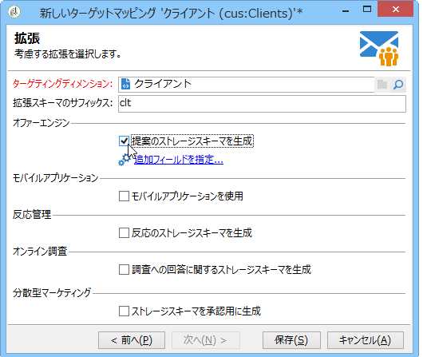

   Click the **[!UICONTROL Save]** button to launch delivery mapping creation: all linked tables are created automatically based on the selected parameters.

## 追加のオプション {#additional-options}

### リモートインスタンスへの HTTP リレー {#http-relay-to-a-remote-instance}

HTTP プロトコルを使用してリモートインスタンスで設定された外部データベースにアクセスできます。

>[!NOTE]
>
>この機能ではサポートされていない SQL データタイプもあります。塗りデータタイプは全くサポートされていません。ターゲットとするデータベース（Microsoft SQL Server のタイムスタンプなど）によっては、その他のデータタイプが機能しない場合があります。詳細は、アドビサポートにお問い合わせください。

これにより、2 つのインスタンス間でのデータの転送と同期が簡素化されます。また、インスタンスとリモートデータベース間のトンネリングおよびこのデータベースにアクセスするためのクライアントレイヤーのインストールを回避できます。宛先インスタンスには、ホストされているインスタンスを指定できます。

>[!CAUTION]
>
>このオプションは、ETL（データ・レプリケーション・フロー）を容易にする目的でのみ使用できます。
>
>例えば、このオプションにより、クラウドでホストされるインスタンスは「オンプレミス」でホストされているデータベースのデータに直接アクセスできます。ただし、このオプションでは、ターゲティングを「オンプレミス」でホストされるデータベースでクラウドから直接実行することはできません。

このようにするには、ローカルインスタンスが HTTP プロトコルを使用してリモートインスタンスと通信できるように 2 つのインスタンスの外部アカウントを設定する必要があります。

* ローカルインスタンス：新しい接続タイプ **[!UICONTROL HTTP relay to a remote database]** を選択します。

   一括読み込みデータ転送の場合は、バッファサイズも指定します。転送データのサイズを削減する場合は、圧縮オプションを選択します。

   を次 **[!UICONTROL Data source]** の構文で定義する必要があります。&quot;nms:extAccount : `<internal_name_of_the_external_account>`&quot;

   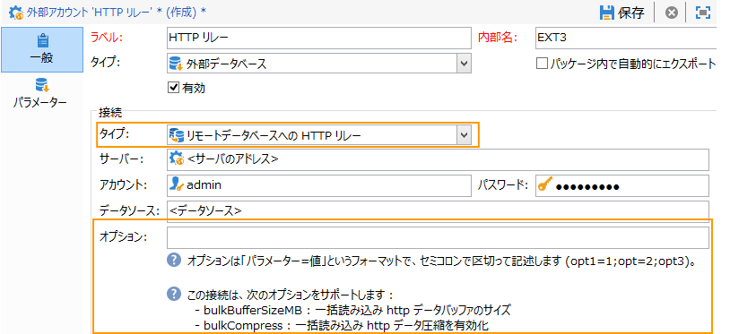

   >[!NOTE]
   >
   >HTTPS 接続を使用することをお勧めします。

* リモートインスタンス：httpリレー経由でアクセスされるデータベースのFDA外部アカウントで、のTargetを確認しま **[!UICONTROL 'HTTP relay to a remote database' account option]**&#x200B;す。

   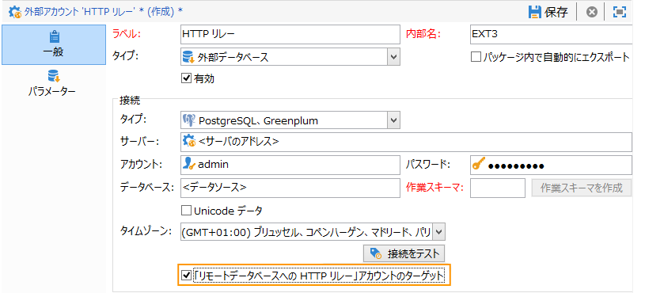

次の例に、新しい可能な操作モードを示します。

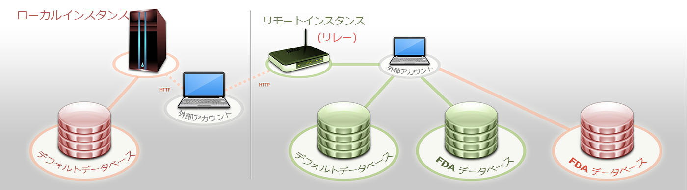

>[!CAUTION]
>
>リモートインスタンスのデフォルトデータベースには、外部アカウント経由でもアクセス可能である必要があります。

この操作方法では、各インスタンスのクリーンアップワークフローによって、インスタンスをリレーとして使用するデータベースの作業用テーブルが削除されるのを防ぎます。

したがって、前述の例では、赤い FDA データベースがローカルインスタンスで使用されているので、リモートインスタンスのクリーンアップワークフローはこのデータベースで処理を実行しません。

### 一時的なスキーマの直接的な作成 {#directly-creating-temporary-schemas}

FDA 外部データベースへの複数のアクセスを管理する場合、新しいオプションを使って、外部アカウントの設定時に作業用スキーマを直接作成できます。

>[!NOTE]
>
>このオプションは PostgreSQL でのみ機能します。

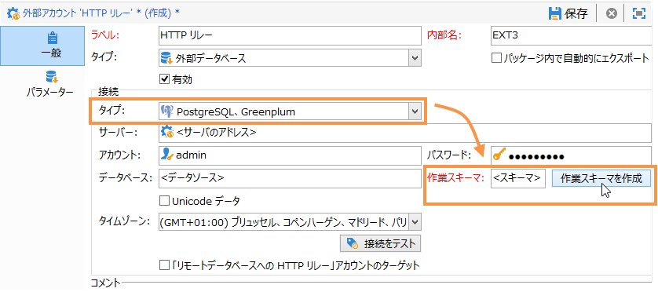

### 外部データを使用した E メールのパーソナライゼーションの最適化 {#optimizing-email-personalization-with-external-data}

ビルド8740から、配信プロパティ **[!UICONTROL Prepare the personalization data with a workflow]** のタブでこのオプションを使 **[!UICONTROL Analysis]** 用できるようになりました。

このオプションを選択すると、配信の分析時に、一時テーブル内のターゲットにリンクするすべてのデータ（FDA にリンクするテーブルのデータなど）を保存するワークフローが自動的に作成、実行されます。

このオプションをオンにすることで、パーソナライゼーションのパフォーマンスを大幅に向上できます。

### Cloud Messaging - FDA の同期 {#cloud-messaging---fda-synchronization}

Cloud Messaging サーバーとマーケティングサーバーを長期間同期していない場合、マーケティングサーバーの不足している broadlog の量が大量になる可能性があります。FDA を使用した broadlog の同期を最適化するために、**NmsMidSourcing_LogsPeriodHour** オプションが追加されています。このオプションでは、同期ワークフローが実行されるたびに復元される broadlog の数を制限するために、最大期間（時間数）を指定できます。

The option is to be added in the console, in the **[!UICONTROL Administration > Options]** node.

>[!CAUTION]
>
>このオプションは、FDA を使用して大量の broadlog を同期するために&#x200B;**のみ**&#x200B;使用する必要があります。

>[!NOTE]
>
>このオプションは、前回復元した日が存在する場合（**NmsMidSourcing_LastBroadLog_*** オプション）にのみ考慮されます。

### Message Center - XtkFolder テーブルの読み取りアクセス {#message-center---read-access-on-the-xtkfolder-table}

ビルド 8141 以上では、Message Center が FDA をアーカイブモードとして使用する場合、手動の操作が必要です。

XtKFolder テーブルへの読み取りアクセスを外部 FDA アカウントにリンクされているユーザーに付与する必要があります。

例えば、PostgreSQL データベースの場合、コマンドは次のようになります。

```
GRANT SELECT ON XtkFolder TO DBUSER;
```

このユーザーには、次のテーブルに対する読み取りアクセスが必要です。

* NmsBroadLogRtEvent
* NmsBroadLogBatchEvent
* NmsTrackingLogRtEvent
* NmsTrackingLogBatchEvent
* NmsRtEvent
* NmsBatchEvent
* NmsBroadLogMsg
* NmsTrackingUrl
* NmsDelivery
* NmsWebTrackingLog

>[!NOTE]
この変更によって、「関連の xtkfolder に対する権限が拒否されました」というエラーメッセージが削除されます。

外部 FDA アカウントで選択された作業用スキーマが標準の Neolane アカウントでない場合、アクセス権に対するこの変更は不要です。

## ワークフローでの外部データベースからのデータの使用 {#using-data-from-an-external-database-in-a-workflow}

複数の Adobe Campaign ワークフローアクティビティで、外部データベースに格納されたデータを使用できます。

### 外部データのフィルタリング {#filtering-on-external-data}

「クエリ」アクティビティでは、外部データを追加して、定義したフィルター設定でそのデータを使用できます。

詳しくは、[クエリ](../../workflow/using/targeting-data.md#selecting-data)の節を参照してください。

### サブセットの作成 {#creating-sub-sets}

「分割」アクティビティでは、サブセットを作成できます。外部データを使用して、使用するフィルタリング条件を定義できます。

詳しくは、[分割](../../workflow/using/split.md)の節を参照してください。

### 外部データベースの読み込み {#loading-external-database}

「データの読み込み（RDBMS）」で外部データを使用できます。このアクティビティについては、[データの読み込み](../../workflow/using/data-loading--rdbms-.md)の節で説明しています。

### 情報およびリンクの追加 {#adding-information-and-links}

「エンリッチメント」アクティビティでは、ワークフローの作業用テーブルにデータを追加したり、リンクを外部テーブルに追加したりすることができます。このため、外部データベースからのデータを活用できます。この手順は、[エンリッチメント](../../workflow/using/enrichment.md)の節で説明しています。
