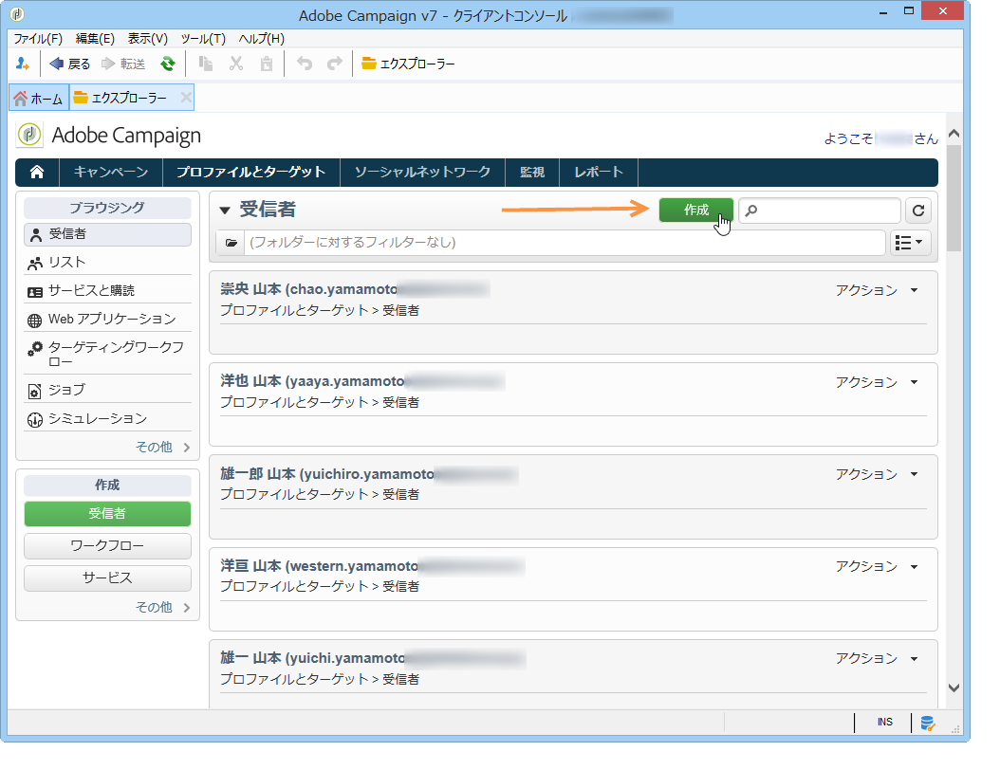

# プロファイルの追加{#adding-profiles}

ほとんどの場合、プロファイルは[ワークフローを使用して Campaign にインポート](../../workflow/using/importing-data.md)されます。However, you can add one or more profiles directly from the interface, by clicking the **[!UICONTROL Create]** button. それにより、プロファイルはデータベースに追加されます。

このプロファイルに関する情報を入力します。The tabs and fields to be completed are described in [Editing a profile](../../platform/using/editing-a-profile.md).

Click **[!UICONTROL Save]** to validate profile creation. プロファイルが Adobe Campaign データベースに追加されます。
