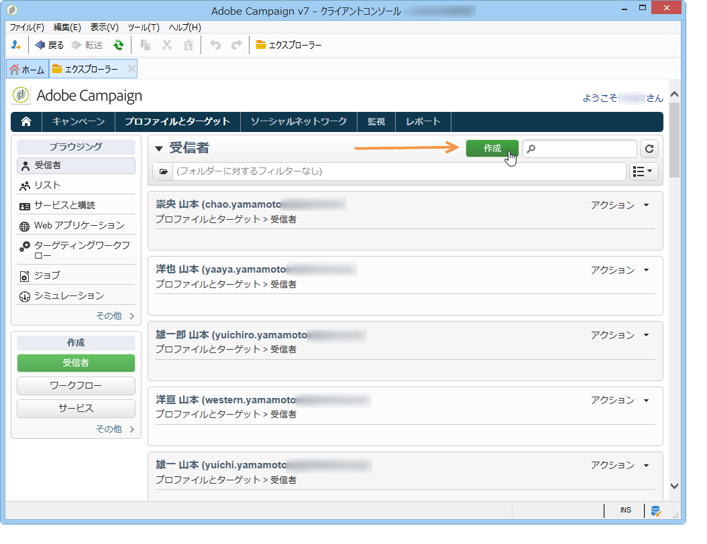

# プロファイルの追加{#adding-profiles}

ほとんどの場合、プロファイルは[ワークフローを使用して Campaign にインポート](../../platform/using/import-export-workflows.md)されます。 ただし、「**[!UICONTROL 作成]**」ボタンをクリックして、1 つ以上のプロファイルをインターフェイスから直接追加することもできます。 それにより、プロファイルはデータベースに追加されます。

>[!NOTE]
>
>Adobe Campaign コンソールでプロファイルを作成する方法について詳しくは、[Campaign v8 ドキュメント](https://experienceleague.adobe.com/ja/docs/campaign-classic/using/getting-started/profile-management/adding-profiles){target=_blank}を参照してください。

<!--
Enter the information for this profile. The tabs and fields to be completed are described in [Editing a profile](../../platform/using/editing-a-profile.md).

Click **[!UICONTROL Save]** to validate profile creation. The profile is then added in Adobe Campaign database.
-->