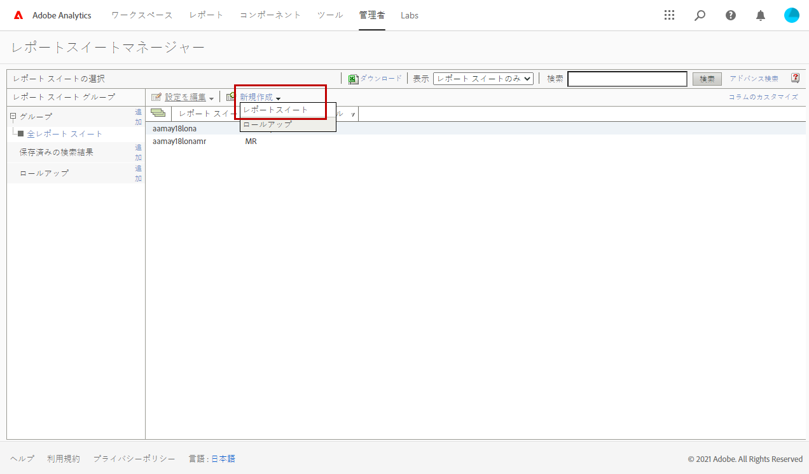
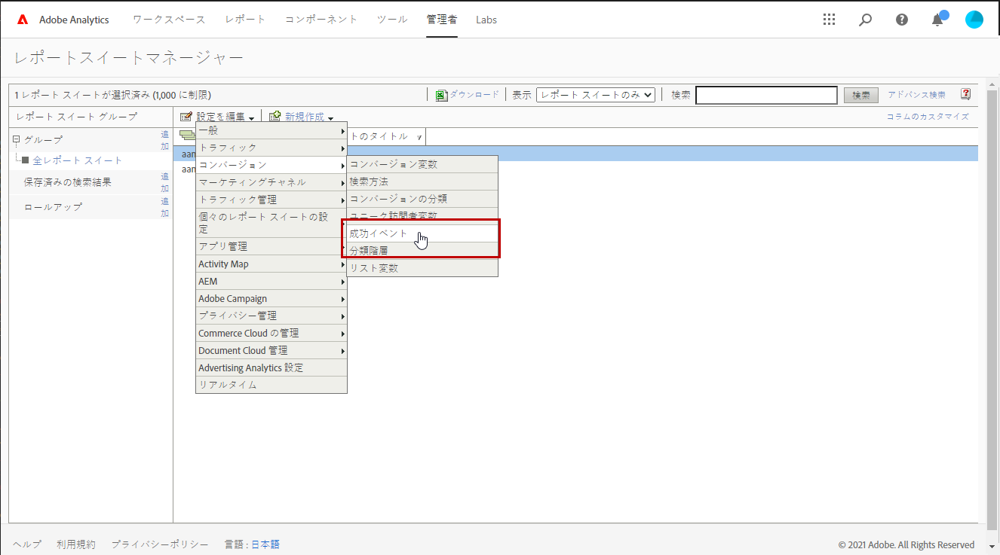
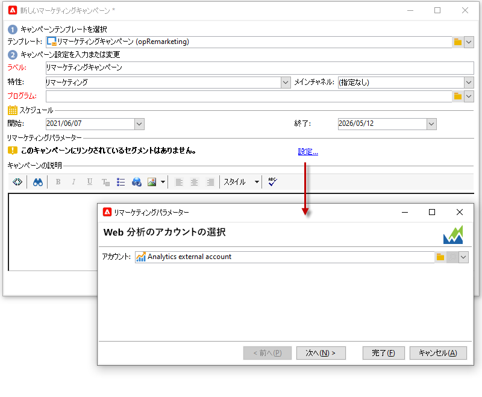

# Adobe Analytics Connector{#adobe-analytics-connector}

## Adobe Analytics Connector の統合について {#about-analytics-connector-integration}

Adobe Analytics コネクタを使用すると、Adobe Campaign と Adobe Analytics が **[!UICONTROL Web 分析コネクタ]**&#x200B;パッケージを介してやり取りできます。 メールキャンペーン後のユーザー行動に関するデータをセグメントの形式で Adobe Campaign に送信します。逆に、Adobe Campaign から配信された メールキャンペーンの指標と属性を Adobe Analytics に送信します。

>[!CAUTION]
>
>* Adobe Analytics Connector は、トランザクションメッセージ（Message Center）との互換性はありません。
>
>* 開始する前に、Adobe Identity Management System（IMS）が Campaign に実装されていることを確認します。詳しくは、[このページ](../../integrations/using/about-adobe-id.md)を参照してください。

Adobe Analytics コネクタを使用すると、Adobe Campaign でインターネットオーディエンスを測定することができます（Web 分析）。このような統合を通じて、Adobe Campaign では 1 つ以上のサイトでマーケティングキャンペーン後の訪問者の行動に関するデータを収集し、（分析後に）訪問者を購入者に変換できるようリマーケティングキャンペーンを実行できます。また反対に、Adobe Campaign では、Web 分析ツールを使用して指標およびキャンペーン属性をプラットフォームに転送できます。

各ツールのアクションフィールドは次のとおりです。

* Web 分析の役割：

   1. Adobe Campaign で実行された E メールキャンペーンにマークを付けます。
   1. 受信者がキャンペーン E メールのクリック後に参照したサイトでの行動をセグメントの形式で保存します。セグメントは、離脱した製品（閲覧されたが、カートへの追加や購入はおこなわれなかった）、購入またはカート放棄を対象とします。

* Adobe Campaign の役割：

   1. 指標およびキャンペーン属性をコネクタに送信します。コネクタはそれを Web 分析ツールに転送します。
   1. セグメントを収集し、分析します。
   1. リマーケティングキャンペーンをトリガーします。

## 統合の設定 {#setting-up-the-integration}

>[!IMPORTANT]
>
> ハイブリッドおよびオンプレミスの実装の場合は、この [ ページ ](../../platform/using/adobe-analytics-provisioning.md) で説明されているプロビジョニング手順に従ってください。

コネクタを設定するには、Adobe Campaign インスタンスに接続し、次の操作を実行する必要があります。

1. [コンバージョン変数と成功イベントの設定](#configure-conversion-success)
1. [Adobe Campaign Classic での外部アカウントの設定](#external-account-classic)

<!--
### Create your Report suite in Adobe Analytics {#report-suite-analytics}

To set up the Adobe Analytics/Adobe Campaign Classic integration, you must connect to your [!DNL Adobe Analytics] instance and perform the following operations:

1. From [!DNL Adobe Analytics], select the **[!UICONTROL Admin tab]** then click **[!UICONTROL All admin]**.

   

1. Click **[!UICONTROL Report suites]**.

   

1. From the **[!UICONTROL Report suite manager]** page, click **[!UICONTROL Create new]** then **[!UICONTROL Report suite]**.

   For the detailed procedure on **[!UICONTROL Report suite]** creation, refer to this [section](https://experienceleague.adobe.com/docs/analytics/admin/manage-report-suites/new-report-suite/t-create-a-report-suite.html?lang=en#prerequisites).

   

1. Select a template. 

1. Configure your new report suite with the following information:

   * **[!UICONTROL Report Suite ID]**
   * **[!UICONTROL Site Title]**
   * **[!UICONTROL Time Zone]**
   * **[!UICONTROL Go Live Date]**
   * **[!UICONTROL Estimated Page Views Per Day]**

   

1. When configured, click **[!UICONTROL Create report suite]**.
-->

### コンバージョン変数と成功イベントの設定 {#configure-conversion-success}

**[!UICONTROL コンバージョン変数]** と **[!UICONTROL 成功イベント]** を次のように設定する必要があります。

1. Adobe Campaignとリンクする **[!UICONTROL レポートスイート]** を選択します。

1. 「**[!UICONTROL 設定を編集]**」ボタンから、**[!UICONTROL コンバージョン]**／**[!UICONTROL コンバージョン変数]**&#x200B;を選択します。

   

1. 「**[!UICONTROL 新規追加]**」をクリックし、メールキャンペーンの効果測定に必要な ID として、内部キャンペーン名（cid）および iNmsBroadlog（bid）テーブル ID を作成します。

   **[!UICONTROL コンバージョン変数]**&#x200B;の編集方法については、[この節](https://experienceleague.adobe.com/docs/analytics/admin/admin-tools/conversion-variables/t-conversion-variables-admin.html?lang=ja#admin-tools)を参照してください。

   

1. 終了したら「**[!UICONTROL 保存]**」をクリックします。

1. 次に、**[!UICONTROL 成功イベント]**&#x200B;を作成するには、「**[!UICONTROL 設定を編集]**」ボタンから&#x200B;**[!UICONTROL コンバージョン]**／**[!UICONTROL 成功イベント]**&#x200B;を選択します。

   

1. 「**[!UICONTROL 新規追加]**」をクリックして、次の&#x200B;**[!UICONTROL 成功イベント]**&#x200B;を設定します。

   * **[!UICONTROL クリック済み]**
   * **[!UICONTROL 開封済み]**
   * **[!UICONTROL ユーザーがクリック]**
   * **[!UICONTROL 処理済み]**
   * **[!UICONTROL スケジュール済み]**
   * **[!UICONTROL 送信済み]**
   * **[!UICONTROL バウンス数合計]**
   * **[!UICONTROL ユニーククリック数]**
   * **[!UICONTROL ユニーク開封数]**
   * **[!UICONTROL 購読解除済み]**

   **[!UICONTROL 成功イベント]**&#x200B;の設定方法については、[この節](https://experienceleague.adobe.com/docs/analytics/admin/admin-tools/success-events/t-success-events.html?lang=ja#admin-tools)を参照してください。。

   >[!NOTE]
   >
   > 数値型の **[!UICONTROL 成功イベント]** のみがサポートされます。

   

1. 終了したら「**[!UICONTROL 保存]**」をクリックします。

**[!UICONTROL コンバージョン変数]** と **[!UICONTROL 成功イベント]** を設定した後、Analytics コネクタ用に作成された **[!UICONTROL 製品プロファイル]** に変数が含まれていることを確認します。 詳しくは、[Adobe Analytics製品プロファイルの作成 ](../../platform/using/adobe-analytics-provisioning.md#analytics-product-profile) を参照してください。

次に、Adobe Campaign Classicで **[!UICONTROL 外部アカウント]** を設定する必要があります。

### Adobe Campaign Classic での外部アカウントの設定 {#external-account-classic}

>[!IMPORTANT]
>
> この統合を機能させるには、Adobe Campaign に **[!UICONTROL Web 分析コネクタ]**&#x200B;パッケージをインストールする必要があります。
>
>パッケージのインストールについて詳しくは、[このページ](../../installation/using/installing-campaign-standard-packages.md)を参照してください。

次に、Adobe Campaign で **[!UICONTROL Web 分析]**&#x200B;外部アカウントを設定して、2 つのソリューション間の同期を有効にしてください。

外部アカウントの設定時に&#x200B;**[!UICONTROL レポートスイート]**、**[!UICONTROL コンバージョン変数]**、**[!UICONTROL 成功イベント]**&#x200B;のいずれかが表示されない場合は、新しく作成したコンポーネントに対する権限が、ユーザーに関連付けられた&#x200B;**[!UICONTROL 製品プロファイル]**&#x200B;にないことをい意味します。

詳しくは、 ](https://experienceleague.adobe.com/docs/analytics/admin/admin-console/permissions/product-profile.html?lang=ja#product-profile-admins)Adobe Analytics の製品プロファイル[のページを参照してください。

1. Adobe Campaign ツリーの&#x200B;**[!UICONTROL 管理]**／**[!UICONTROL プラットフォーム]**／**[!UICONTROL 外部アカウント]**&#x200B;フォルダーで、「**[!UICONTROL 新規]**」をクリックします。

   

1. ドロップダウンリストを使用して、**[!UICONTROL 統合]**&#x200B;ドロップダウンから「**[!UICONTROL Web 分析]**」タイプと「**[!UICONTROL Adobe Analytics]**」を選択します。

   

1. **[!UICONTROL 統合]**&#x200B;ドロップダウンの横にある「**[!UICONTROL 設定]**」をクリックします。

1. **[!UICONTROL Analytics 統合の設定]** ウィンドウで、次の情報を提供して、外部アカウントをレポートスイートにマッピングします。

   * **[!UICONTROL メール]**
   * **[!UICONTROL IMS Org]**
   * **[!UICONTROL Analytics の会社]**
   * **[!UICONTROL レポートスイート]**

1. 「**[!UICONTROL eVars]**」カテゴリから、[!DNL Adobe Analytics] で設定した 2 つの&#x200B;**[!UICONTROL コンバージョン変数]**&#x200B;をマッピングします。

   

1. 「**[!UICONTROL イベント]**」カテゴリから、[!DNL Adobe Analytics] で設定した 10 個の&#x200B;**[!UICONTROL 成功イベント]**&#x200B;をマッピングします。

1. 終了したら「**[!UICONTROL 送信]**」をクリックします。 Adobe Campaign は、マッピングされた Analytics の&#x200B;**[!UICONTROL レポートスイート]**&#x200B;に、**[!UICONTROL データソース]**、**[!UICONTROL 計算指標]**、**[!UICONTROL リマーケティングセグメント]**&#x200B;および&#x200B;**[!UICONTROL 分類]**&#x200B;を作成します。

   [!DNL Adobe Analytics] とAdobe Campaign の同期が完了したら、ウィンドウを閉じます。

1. 設定は、「**[!UICONTROL Analytics 統合の設定]**」ウィンドウの「**[!UICONTROL データ設定]**」タブで確認できます。

   「**[!UICONTROL 同期]**」ボタンを使用すると、[!DNL Adobe Campaign] は [!DNL Adobe Analytics] で行った名前の変更を同期します。[!DNL Adobe Analytics] でコンポーネントを削除すると、そのコンポーネントは [!DNL Adobe Campaign] で取り消し線が引かれるか、「**見つかりません**」というメッセージと共に表示されます。

   

1. 必要に応じて、「**[!UICONTROL セグメントを更新]**」タブでセグメントを追加または削除できます。

1. 「**[!UICONTROL 外部アカウント]**」で、「**[!UICONTROL 式をエンリッチメントする...]**」リンクをクリックして URL 計算式を変更し、Web 分析ツールの統合情報（キャンペーン ID）とアクティビティをトラッキングする必要があるサイトのドメインを指定します。

   

1. サイトのドメイン名を指定します。

   

1. 「**[!UICONTROL 次へ]**」をクリックし、ドメイン名が保存されていることを確認します。

   

1. 必要に応じて、計算式をオーバーロードします。これをおこなうには、チェックボックスをオンにして、ウィンドウ内で式を直接編集します。

   >[!IMPORTANT]
   >
   >この設定モードは、エキスパートユーザー向けに用意されているものです。この式にエラーがあった場合、メール配信が停止する可能性があります。

1. 「**[!UICONTROL 詳細設定]**」タブでは、より技術的な設定を設定または変更できます。

   * **[!UICONTROL 存続期間]**：Adobe Campaign でテクニカルワークフローで Web イベントを収集するまでの期間（日数）を指定できます。デフォルト：180 日。
   * **[!UICONTROL 持続]**：すべての Web イベント（購入など）をリマーケティングキャンペーンの属性にできる期間を指定できます。デフォルト：7 日。

>[!NOTE]
>
>複数のオーディエンス測定ツールを使用する場合は、外部アカウントの作成時に&#x200B;**[!UICONTROL パートナー]**&#x200B;ドロップダウンリストで「**[!UICONTROL その他]**」を選択できます。配信プロパティの 1 つの外部アカウントのみを参照できます。そのため、トラッキングされる URL の式を調整する必要があります。調整するには、Adobe および使用される他のすべての測定ツールで想定されているパラメーターを追加します。

### Web 分析プロセスのテクニカルワークフロー {#technical-workflows-of-web-analytics-processes}

Adobe Campaign と Adobe Analytics の間のデータ交換は、バックグラウンドタスクとして実行される 4 つのテクニカルワークフローによって処理されます。

これらのワークフローは、Adobe Campaign ツリーの&#x200B;**[!UICONTROL 管理]**／**[!UICONTROL プロダクション]**／**[!UICONTROL テクニカルワークフロー]**／**[!UICONTROL Web 分析プロセス]**&#x200B;フォルダーにあります。

* **[!UICONTROL Web イベントの復元]**：このワークフローでは、指定したサイトでのユーザーの行動に関するセグメントを 1 時間に 1 回ダウンロードし、Adobe Campaign データベースに格納してリマーケティングワークフローを開始します。
* **[!UICONTROL イベントパージ]**：このワークフローでは、「**[!UICONTROL 存続期間]**」フィールドで設定した期間に基づいてデータベースからすべてのイベントを削除できます。詳しくは、](#external-account-classic)Adobe Campaign Classic での外部アカウントの設定[を参照してください。
* **[!UICONTROL コンバージョン済みの連絡先の特定]**：リマーケティングキャンペーン後に購入をおこなった訪問者のディレクトリ。このワークフローで収集されたデータは、**[!UICONTROL リマーケティングの効率]**&#x200B;レポートでアクセスできます。この[ページ](#creating-a-re-marketing-campaign)を参照してください。
* **[!UICONTROL 指標とキャンペーン属性の送信]**：Adobe Analytics Connector を使用して Adobe Campaign から Adobe Experience Cloud にメールキャンペーンの指標を送信できます。このワークフローは毎日午前 4 時にトリガーされ、データを Analysis に送信するには 24 時間かかります。

   ワークフローは再起動しないでください。再起動すると、以前のデータがすべて再送され、Analytics の結果に歪みが生じる可能性があります。

   含まれる指標は次のとおりです。

   * **[!UICONTROL 配信するメッセージ]**（@toDeliver）
   * **[!UICONTROL 処理済み]**（@processed）
   * **[!UICONTROL 成功]**（@success）
   * **[!UICONTROL オープン数合計]**（@totalRecipientOpen）
   * **[!UICONTROL 開封した受信者]**（@recipientOpen）
   * **[!UICONTROL クリックした受信者の合計数]**（@totalRecipientClick）
   * **[!UICONTROL クリックした人]**（@personClick）
   * **[!UICONTROL ユニーククリック数]**（@recipientClick）
   * **[!UICONTROL オプトアウト]**（@optOut）
   * **[!UICONTROL エラー]**（@error）

   >[!NOTE]
   >
   >送信されたデータは最後のスナップショットに基づいたデルタであり、指標データの値がマイナスになる可能性があります。

   送信される属性は次のとおりです。

   * **[!UICONTROL 内部名]**（@internalName）
   * **[!UICONTROL ラベル]**（@label）
   * **[!UICONTROL ラベル]** (operation/@label)：**キャンペーン**&#x200B;パッケージがインストールされている場合のみ
   * **[!UICONTROL 特性]** (operation/@nature)：**キャンペーン**&#x200B;パッケージがインストールされている場合のみ
   * **[!UICONTROL タグ 1]** (webAnalytics/@tag1)
   * **[!UICONTROL タグ 2]** (webAnalytics/@tag2)
   * **[!UICONTROL タグ 3]** (webAnalytics/@tag3)
   * **[!UICONTROL コンタクト日]** (scheduling/@contactDate)

## Adobe Campaign での配信のトラッキング {#tracking-deliveries-in-adobe-campaign}

Adobe Campaign で配信を送信した後、Adobe Experience Cloud でサイト上のアクティビティをトラッキングできるようにするには、配信プロパティで対応するコネクタを参照する必要があります。それには、次の手順に従います。

1. トラッキングするキャンペーンの配信を開きます。

   

1. 配信プロパティを開きます。
1. 「**[!UICONTROL Web 分析]**」タブに移動し、前に作成した外部アカウントを選択します。[Adobe Campaign Classic での外部アカウントの設定](#external-account-classic)を参照してください。

   

1. 配信を送信し、Adobe Analytics で配信のレポートにアクセスできるようになりました。

## リマーケティングキャンペーンの作成 {#creating-a-re-marketing-campaign}

リマーケティングキャンペーンを準備するには、リマーケティングタイプのキャンペーンに使用する配信テンプレートを作成します。次に、リマーケティングキャンペーンを設定し、セグメントにリンクします。セグメントごとに異なるリマーケティングキャンペーンが必要です。

Adobe Campaign で最初のキャンペーンでターゲットとした受信者の行動を分析し、セグメントの収集が終了すると、リマーケティングキャンペーンが自動的に開始されます。カートが放棄されたか、製品を表示しても購入に至らなかった場合、サイトのブラウジングが購入につながるように、対象の受信者に配信が送信されます。

Adobe Campaign にはパーソナライズされた配信テンプレートが用意されており、これを使用するか、またはこれをベースとして使用することによってキャンペーンを準備することができます。

1. **[!UICONTROL エクスプローラー]**&#x200B;で、Adobe Campaign ツリーの&#x200B;**[!UICONTROL リソース]**／**[!UICONTROL テンプレート]**／**[!UICONTROL 配信テンプレート]**&#x200B;フォルダーに移動します。

1. 「**[!UICONTROL E メール配信（リマーケティング）]**」テンプレートまたは Adobe Campaign に用意されているリマーケティングテンプレートのサンプルを複製します。

   

1. ニーズに合わせてテンプレートをパーソナライズし、保存します。

1. 新しいキャンペーンを作成し、ドロップダウンリストから「**[!UICONTROL リマーケティングキャンペーン]**」テンプレートを選択します。

   

1. **[!UICONTROL 設定...]** リンクをクリックして、キャンペーンにリンクされたセグメントおよび配信テンプレートを指定します。

1. 前に設定した外部アカウントを選択します。

   

1. 対象のセグメントを選択します。

   

1. このリマーケティングキャンペーンに使用する配信テンプレートを選択し、「**[!UICONTROL 完了]**」をクリックしてウィンドウを閉じます。

   

1. 「**[!UICONTROL OK]**」をクリックしてキャンペーンウィンドウを閉じます。

**[!UICONTROL リマーケティングの効率]**&#x200B;レポートは、グローバルレポートページからアクセスします。このレポートでは、Adobe Campaign のリマーケティングキャンペーン後における、カート放棄数に対するコンバージョンされた連絡先（何かを購入したなど）数を表示できます。週ごと、月ごとまたは Adobe Campaign と Web 分析ツール間の同期開始以降のコンバージョン率が計算されます。

