# Adobe Analytics Data コネクタ{#adobe-analytics-data-connector}

## Data コネクタ統合について {#about-data-connector-integration}

>[!CAUTION]
>
>Adobe Analytics Data Connector には、トランザクションメッセージ（Message Center）との互換性はありません。

Data コネクタ（旧 Adobe Genesis）を使用すると、Adobe Campaign と Adobe Analytics の間で、**Web 分析コネクタ**&#x200B;パッケージを介したインタラクションが可能になります。Adobe Data コネクタは、E メールキャンペーン後のユーザー行動に関するデータをセグメントの形式で Adobe Campaign に送信します。反対に、Adobe Campaign から配信された E メールキャンペーンの指標と属性を Adobe Analytics - Data コネクタに送信します。

Adobe Campaign では、Data コネクタを使用してインターネットオーディエンスを測定することができます（Web 分析）。このような統合を通じて、Adobe Campaign では 1 つ以上のサイトでマーケティングキャンペーン後の訪問者の行動に関するデータを収集し、（分析後に）訪問者を購入者に変換できるようリマーケティングキャンペーンを実行できます。また反対に、Adobe Campaign では、Web 分析ツールを使用して指標およびキャンペーン属性をプラットフォームに転送できます。

Adobe Analytics と Adobe Campaign の統合の実装について詳しくは、[このドキュメント](https://helpx.adobe.com/marketing-cloud/how-to/analytics-ac.html)を参照してください。

各ツールのアクションフィールドは次のとおりです。

* Web 分析の役割：

   1. Adobe Campaign で実行された E メールキャンペーンにマークを付けます。
   1. 受信者がキャンペーン E メールのクリック後に参照したサイトでの行動をセグメントの形式で保存します。セグメントは、離脱した製品（閲覧されたが、カートへの追加や購入はおこなわれなかった）、購入またはカート放棄を対象とします。

* Adobe Campaign の役割：

   1. 指標およびキャンペーン属性をコネクタに送信します。コネクタはそれを Web 分析ツールに転送します。
   1. セグメントを収集し、分析します。
   1. リマーケティングキャンペーンをトリガーします。

## 統合の設定 {#setting-up-the-integration}

Data コネクタを設定するには、Adobe Campaign インスタンスに接続し、次の操作を実行する必要があります。

* [手順1:Analyticsでの統合の設定](#step-1--configure-integration-in-analytics)
* [手順2:Campaignで外部アカウントを作成する](#step-2--create-the-external-account-in-campaign)
* [手順3:Adobe CampaignとAdobe Analyticsの同期](#step-3--synchronize-adobe-campaign-and-adobe-analytics)

### Step 1: Configure integration in Analytics {#step-1--configure-integration-in-analytics}

ウィザードを使用して Data コネクタを設定するための詳細な手順を示します。

1. Adobe ID または Enterprise ID を使用して Adobe Experience Cloud にログインします。

   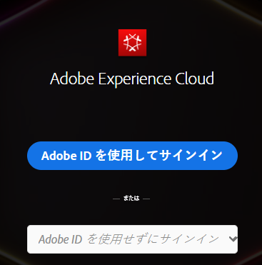

1. Experience Cloud ソリューションのリストで、「**[!UICONTROL Analytics]**」を選択します。

   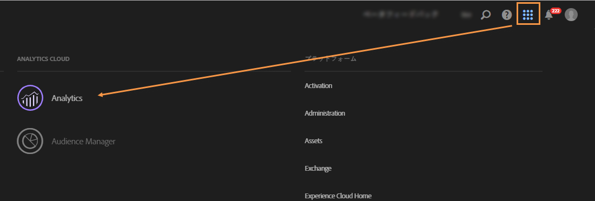

1. タブで、を **[!UICONTROL Admin]** 選択します **[!UICONTROL Data Connectors]**。

   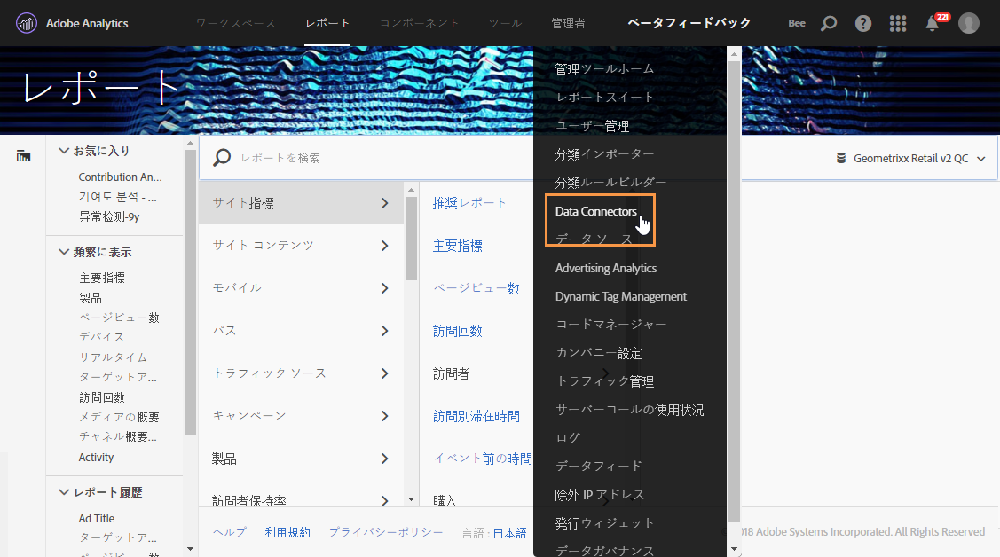

1. From the list of partners, select **[!UICONTROL Neolane - Enterprise Marketing Platform]**.

   

1. ダイアログで、 **[!UICONTROL Add integration]** をクリックしま **[!UICONTROL Activate]**&#x200B;す。
1. この統 **[!UICONTROL I accept these terms and conditions]** 合にリンクされ **[!UICONTROL Report suite]** ているを選択し、コネクタのラベルを入力します。

   完了したら、をクリックしま **[!UICONTROL Create and configure this integration]**&#x200B;す。

   

1. Enter the email address that will receive the notifications on behalf of the connector, then copy the **[!UICONTROL Account ID]** as it appears in the external Adobe Campaign account (for more on this, refer to the [Step 2: Create the external account in Campaign](#step-2--create-the-external-account-in-campaign)).

   

1. E メールキャンペーンの影響を測定するために必要な ID として、キャンペーン名（cid）および iNmsBroadlog（bid）テーブル ID を指定します。収集されるイベントの指標も指定する必要があります。

   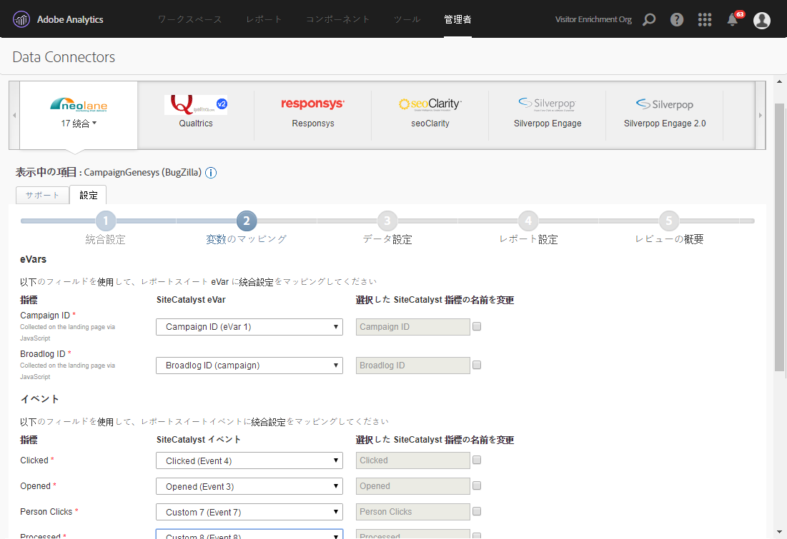

1. 必要に応じて、パーソナライズされたセグメントを指定します。

   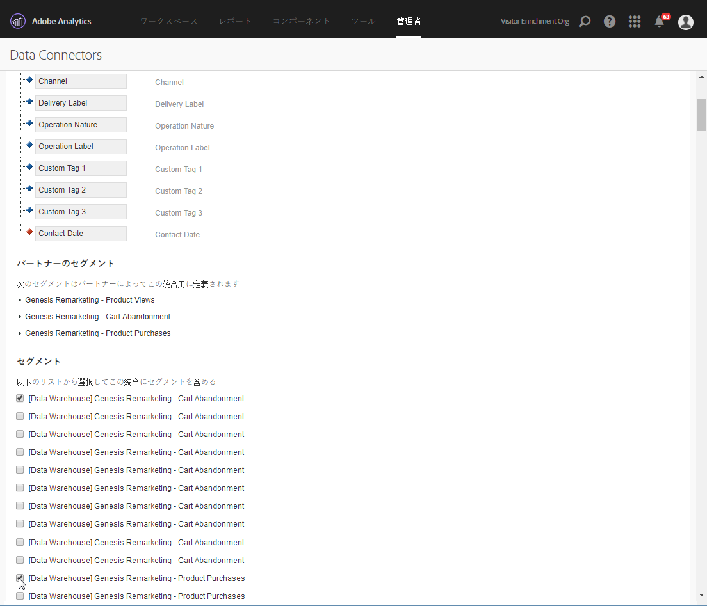

1. In **[!UICONTROL Data collection]**, select a method for recovering data, in this case the **[!UICONTROL cid]** and **[!UICONTROL bid]** identifiers specified in step 6.

   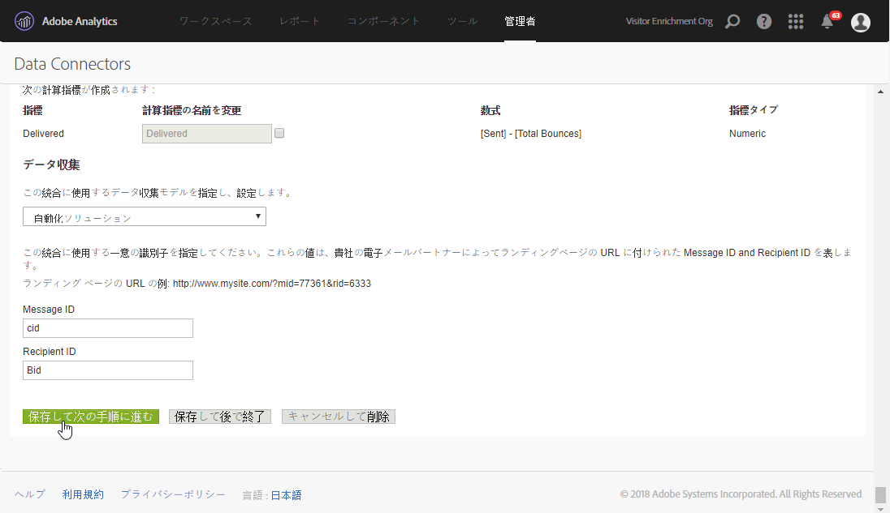

1. ダッシュボードに表示する情報を選択します。

   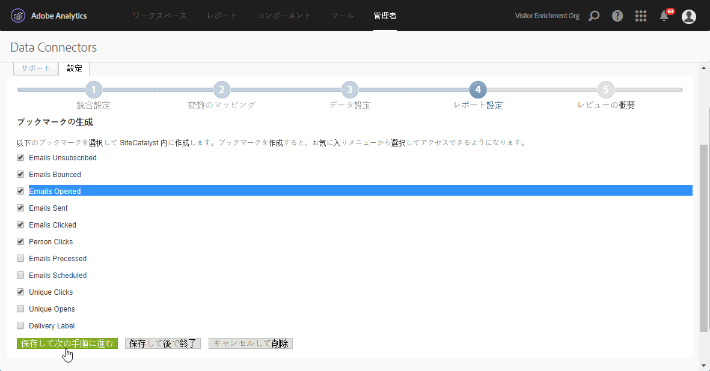

1. 上述の手順で指定した内容をまとめたページで設定を確認します。

   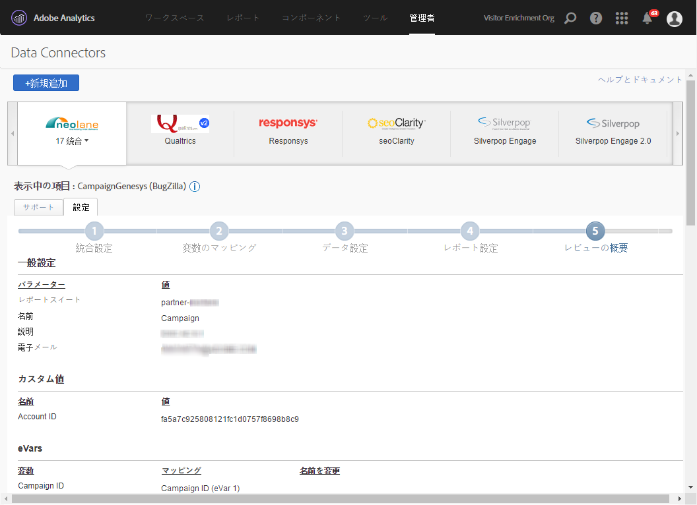

1. Click **[!UICONTROL Activate Now]** to approve configuration and activate the connector.

   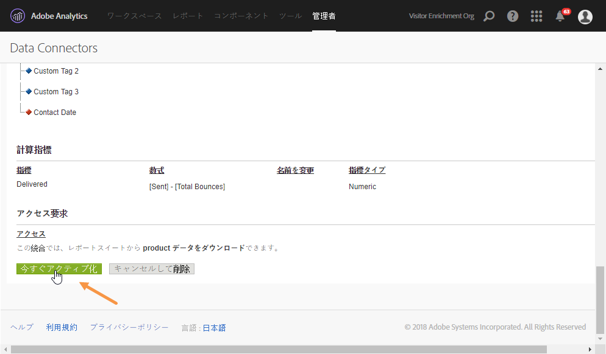

   これで、Data コネクタが設定されました。

### Step 2: Create the external account in Campaign {#step-2--create-the-external-account-in-campaign}

Adobe Campaign は、コネクタにより分析プラットフォームと統合されます。アプリケーションを同期するには、次の手順を適用します。

1. Adobe Campaign に **Web 分析コネクタ**&#x200B;パッケージをインストールします。
1. Adobe Campaignツリーの **[!UICONTROL Administration > Platform > External accounts]** フォルダーに移動します。
1. Right-click the list of external accounts and select **[!UICONTROL New]** in the drop-down menu (or click the **[!UICONTROL New]** button above the list of external accounts).
1. Use the drop-down list to select the **[!UICONTROL Web Analytics]** type.
1. コネクタのプロバイダーを選択します（この場合は「**[!UICONTROL Adobe Analytics - Data Connector]**」）。

   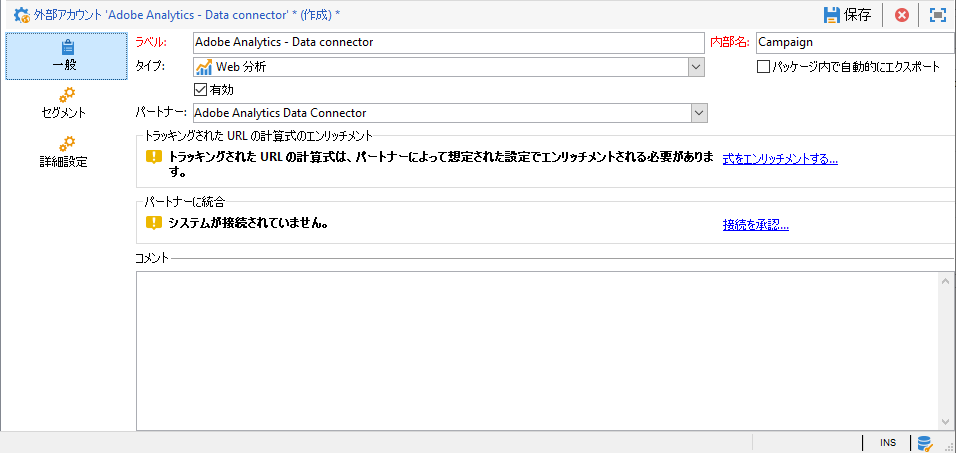

1. Click the **[!UICONTROL Enrich the formula...]** link to change the URL calculation formula to specify the Web analytics tool integration information (campaign IDs) and the domains of the sites whose activity must be tracked.
1. サイトのドメイン名を指定します。

   

1. Click **[!UICONTROL Next]** and make sure the domain names have been saved.

   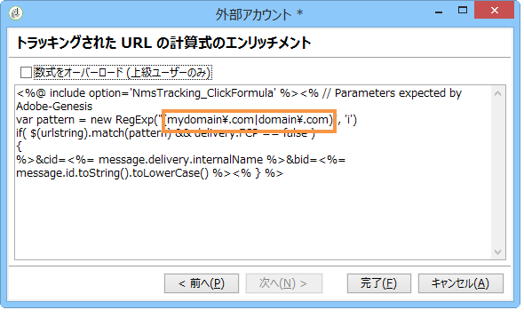

1. 必要に応じて、計算式をオーバーロードします。そのためには、ボックスをオンにして、ウィンドウで式を直接編集します。

   

   >[!CAUTION]
   >
   >この設定モードはエキスパートユーザー向けに用意されています。この式にエラーがあった場合、E メール配信が停止される可能性があります。

1. The **[!UICONTROL Advanced]** tab lets you configure or modify more technical settings.

   * **[!UICONTROL Lifespan]**:技術的なワークフローによってAdobe CampaignでWebイベントが回復されるまでの遅延時間（日単位）を指定できます。 デフォルト：180日。
   * **[!UICONTROL Persistence]**:すべてのWebイベント（例えば、購入）をリマーケティングキャンペーンに関連付けることができる期間、デフォルト：7日。

>[!NOTE]
>
>If you are using several audience measuring tools, you can select **[!UICONTROL Other]** in the **[!UICONTROL Partners]** drop-down list when creating the external account. 配信プロパティの 1 つの外部アカウントのみを参照できます。そのため、トラッキングされる URL の式を調整する必要があります。調整するには、Adobe および使用される他のすべての測定ツールで想定されているパラメーターを追加します。

### Step 3: Synchronize Adobe Campaign and Adobe Analytics {#step-3--synchronize-adobe-campaign-and-adobe-analytics}

外部アカウントを作成した後、両方のアプリケーションを同期する必要があります。

1. 前に作成した外部アカウントに移動します。
1. Change the account **[!UICONTROL Label]** as needed.
1. Change the **[!UICONTROL Internal name]** so that it matches the **[!UICONTROL Name]** chosen while configuring the Data Connector.

   

1. リンクをクリック **[!UICONTROL Approve connection]** します。

   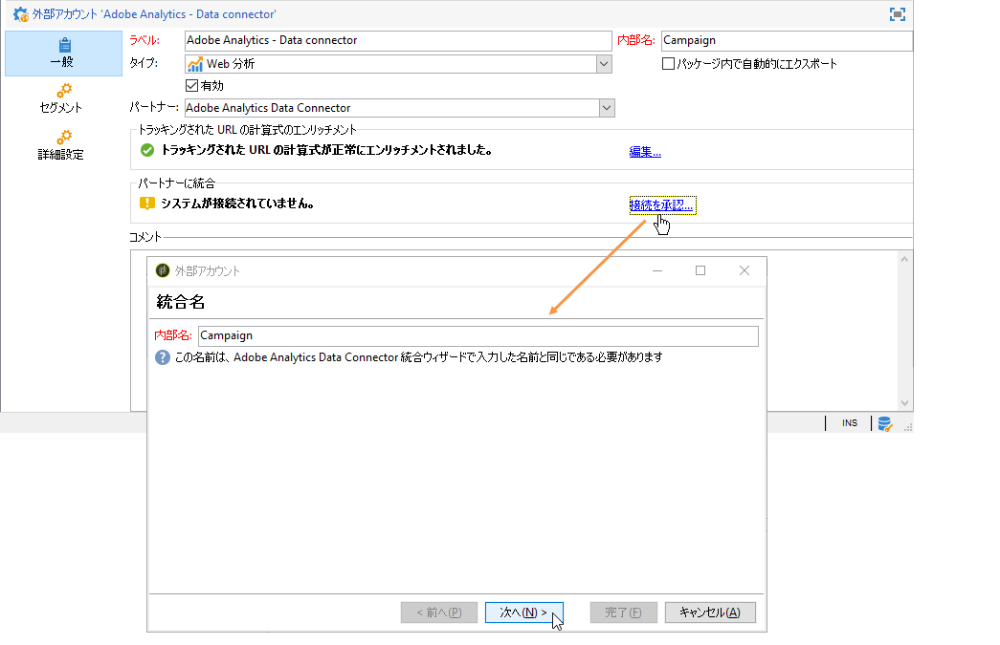

   Make sure the **[!UICONTROL Internal name]** matches the **[!UICONTROL Name]** specified in the Data Connector configuration wizard.

1. Enter the **[!UICONTROL Account ID]** in the Data Connector configuration wizard.

   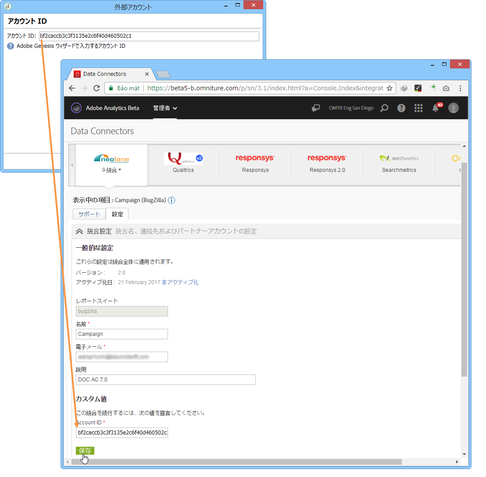

1. Data コネクタウィザードに従って手順を実行し、Adobe Campaign の外部アカウントに戻ります。
1. Click **[!UICONTROL Next]** in order for the data exchange to take place between Adobe Campaign and Adobe Analytics - Data connector.

   同期が完了すると、セグメントリストが表示されます。

   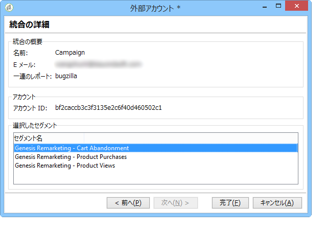

When the synchronization of data between Adobe Campaign and Adobe Analytics - Data connector is effective, the three default segments defined in the Data Connector wizard are recovered by Adobe Campaign and become accessible in the **[!UICONTROL Segments]** tab of the Adobe Campaign external account.

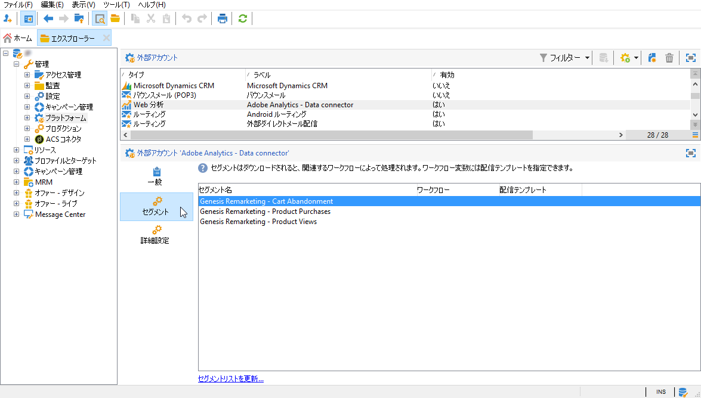

Data コネクタウィザードで追加セグメントを設定した場合は、それらのセグメントを Adobe Campaign に追加できます。To do this, click the **[!UICONTROL Update segment list]** link and follow the steps outlined in the external account wizard. 操作を実行すると、新しいセグメントがリストに表示されます。

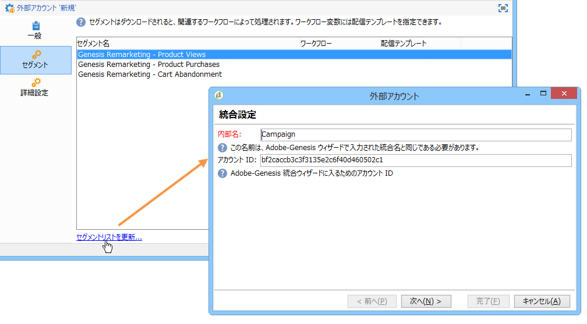

### Web 分析プロセスのテクニカルワークフロー {#technical-workflows-of-web-analytics-processes}

Adobe Campaign と Adobe Analytics - Data コネクタとの間のデータ交換は、バックグラウンドタスクとして実行される 4 つのテクニカルワークフローによって処理されます。

Adobe Campaignツリーのフォルダーの下に表示され **[!UICONTROL Administration > Production > Technical workflows > Web analytics process]** ます。

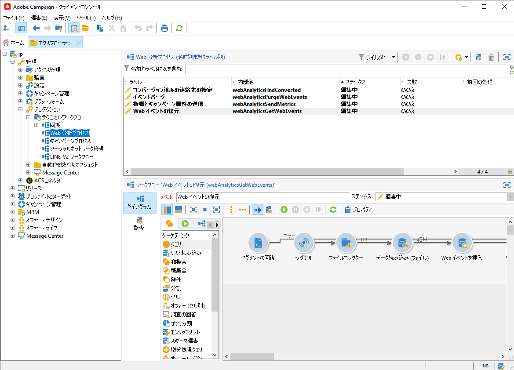

* **[!UICONTROL Recovering of web events]**:1時間後に、このワークフローは、特定のサイトでのユーザーの行動に関するセグメントをダウンロードし、Adobe Campaignデータベースに含めて、再マーケティングワークフローを開始します。
* **[!UICONTROL Event purge]**:このワークフローを使用すると、フィールドで設定した期間に応じて、データベースからすべてのイベントを削除で **[!UICONTROL Lifespan]** きます。 詳細については、手順2を参照し [てください。Campaignで外部アカウントを作成します](#step-2--create-the-external-account-in-campaign)。
* **[!UICONTROL Identification of converted contacts]**:リマーケティングキャンペーン後に購入を行った訪問者のディレクトリ。 The data collected by this workflow is accessible in the **[!UICONTROL Re-marketing efficiency]** report, refer to this [page](#creating-a-re-marketing-campaign).* **[!UICONTROL Sending of indicators and campaign attributes]**: lets you send email campaign indicators via Adobe Campaign to the Adobe Experience Cloud using Adobe Analytics - Data connector. このワークフローは毎日午前 4 時にトリガーされ、データを Analysis に送信するには 24 時間かかります。

   ワークフローは再起動しないでください。再起動すると、以前のデータがすべて再送され、Analytics の結果に歪みが生じる可能性があります。

   含まれる指標は次のとおりです。

   * **[!UICONTROL Messages to deliver]** (@toDeliver)
   * **[!UICONTROL Processed]** (@processed)
   * **[!UICONTROL Success]** (@success)
   * **[!UICONTROL Total count of opens]** (@totalRecipientOpen)
   * **[!UICONTROL Recipients who have opened]** (@recipientOpen)
   * **[!UICONTROL Total number of recipients who clicked]** (@totalRecipientClick)
   * **[!UICONTROL People who clicked]** (@personClick)
   * **[!UICONTROL Number of distinct clicks]** (@recipientClick)
   * **[!UICONTROL Opt-Out]** (@optOut)
   * **[!UICONTROL Errors]** (@error)
   >[!NOTE]
   >
   >送信されたデータは最後のスナップショットに基づいたデルタであり、指標データの値がマイナスになる可能性があります。

   送信される属性は次のとおりです。

   * **[!UICONTROL Internal name]** (@internalName)
   * **[!UICONTROL Label]** (@label)
   * **[!UICONTROL Label]**&#x200B;ラベル (operation/@)：**キャンペーン**&#x200B;パッケージがインストールされている場合のみ
   * **[!UICONTROL Nature]**&#x200B;特性 (operation/@)：**キャンペーン**&#x200B;パッケージがインストールされている場合のみ
   * **[!UICONTROL Tag 1]** (webAnalytics/@tag1)
   * **[!UICONTROL Tag 2]** (webAnalytics/@tag2)
   * **[!UICONTROL Tag 3]** (webAnalytics/@tag3)
   * **[!UICONTROL Contact date]** (scheduling/@contactDate)

* **コンバージョン済みの連絡先の特定**：リマーケティングキャンペーン後に購入をおこなった訪問者のディレクトリ。The data collected by this workflow is accessible in the **[!UICONTROL Re-marketing efficiency]** report (refer to this [page](../../platform/using/adobe-analytics-data-connector.md#creating-a-re-marketing-campaign)).

## Adobe Campaign での配信のトラッキング {#tracking-deliveries-in-adobe-campaign}

Adobe Campaign で配信を送信した後、Adobe Experience Cloud でサイト上のアクティビティをトラッキングできるようにするには、配信プロパティで対応するコネクタを参照する必要があります。それには、次の手順に従います。

1. トラッキングするキャンペーンの配信を開きます。

   

1. 配信プロパティを開きます。
1. タブに移動し、以 **[!UICONTROL Web Analytics]** 前に作成した外部アカウントを選択します。 手順2を参 [照してください。Campaignで外部アカウントを作成します](#step-2--create-the-external-account-in-campaign))。

   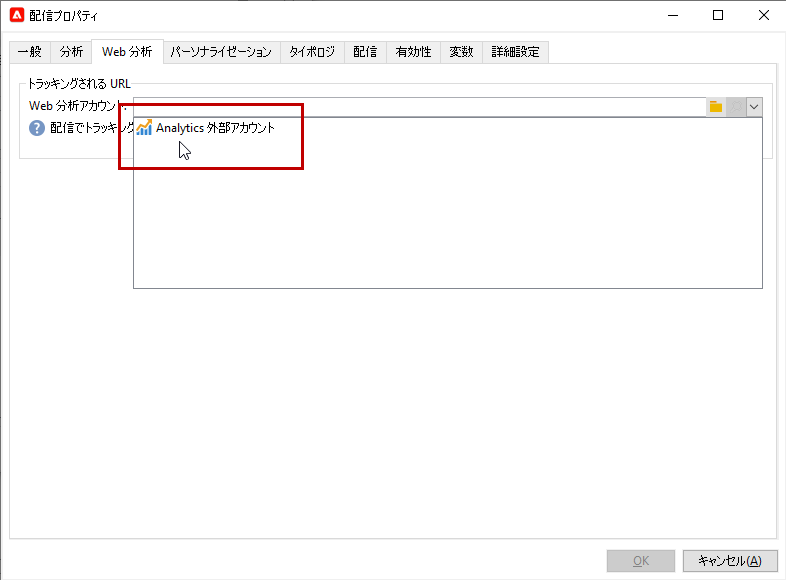

1. 配信を送信し、Adobe Analytics でそのレポートにアクセスできるようになりました。

## リマーケティングキャンペーンの作成 {#creating-a-re-marketing-campaign}

リマーケティングキャンペーンを準備するには、リマーケティングタイプのキャンペーンに使用する配信テンプレートを作成します。次に、リマーケティングキャンペーンを設定し、セグメントにリンクします。セグメントごとに異なるリマーケティングキャンペーンが必要です。

Adobe Campaign で最初のキャンペーンでターゲットとした受信者の行動を分析し、セグメントの収集が終了すると、リマーケティングキャンペーンが自動的に開始されます。カートが放棄されたか、製品を表示しても購入に至らなかった場合、サイトのブラウジングが購入につながるように、対象の受信者に配信が送信されます。

Adobe Campaign にはパーソナライズされた配信テンプレートが用意されており、これを使用するか、またはこれをベースとして使用することによってキャンペーンを準備することができます。

1. から、Adobe **[!UICONTROL Explorer]** Campaignツリーの **[!UICONTROL Resources > Templates > Delivery templates]** フォルダーに移動します。
1. Duplicate the **[!UICONTROL Email delivery (re-marketing)]** template or the re-marketing template examples offered by Adobe Campaign.
1. ニーズに合わせてテンプレートをパーソナライズし、保存します。

   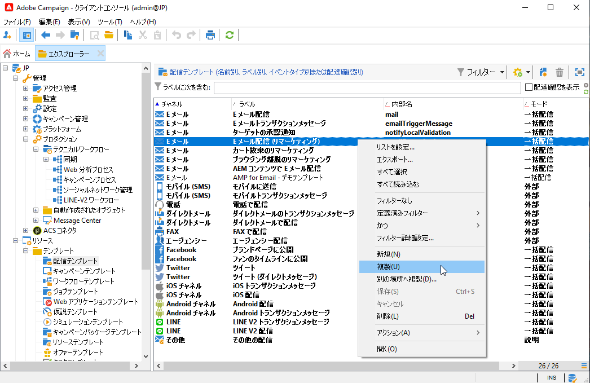

1. Create a new campaign and select the **[!UICONTROL Re-marketing campaign]** template from the drop-down list.

   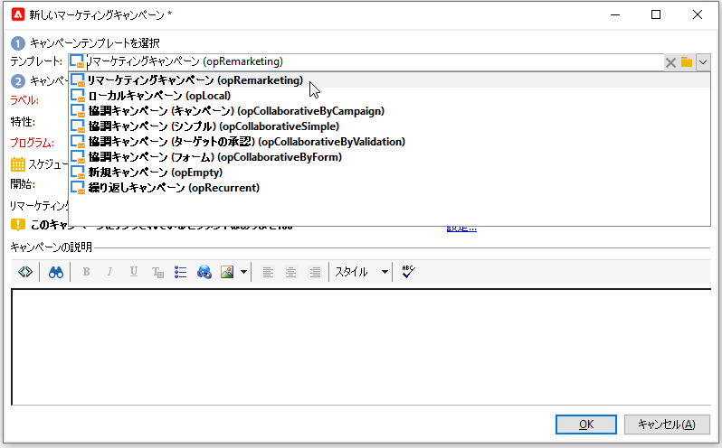

1. Click the **[!UICONTROL Configure...]** link to specify the segment and delivery template linked to the campaign.
1. 前に設定した外部アカウントを選択します。

   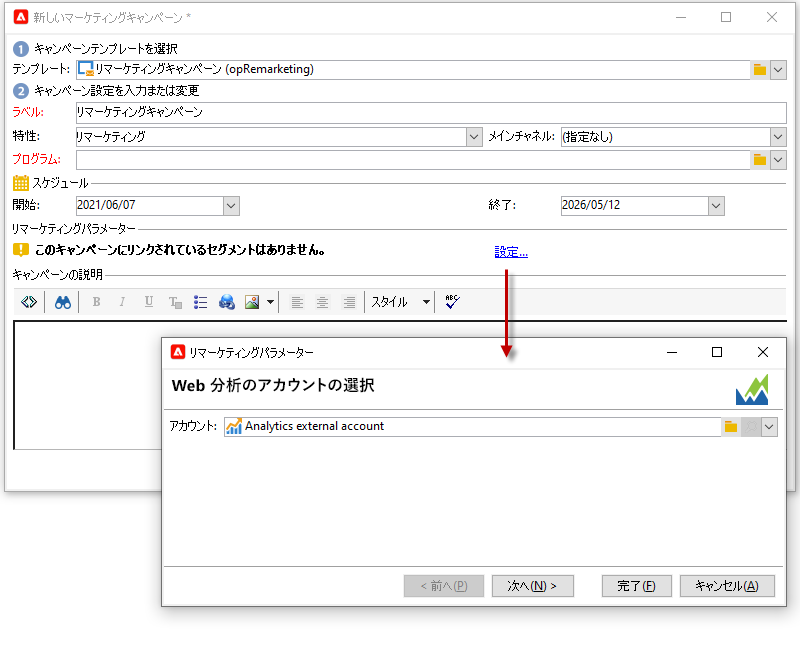

1. 対象のセグメントを選択します。

   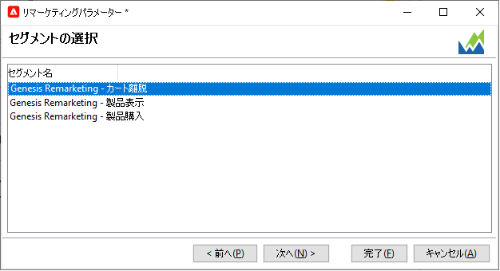

1. Select the delivery template to be used for this re-marketing campaign, then click **[!UICONTROL Finish]** to close the window.

   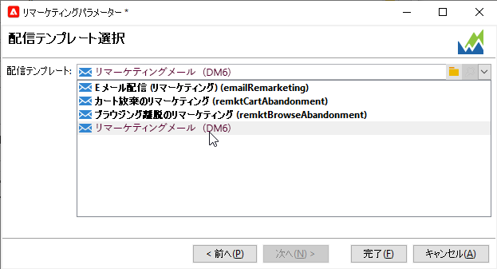

1. 「**[!UICONTROL OK]**」をクリックしてキャンペーンウィンドウを閉じます。

The **[!UICONTROL Re-marketing efficiency]** report is accessed via the global reports page. このレポートでは、Adobe Campaign のリマーケティングキャンペーン後における、カート放棄数に対するコンバージョンされた連絡先（何かを購入したなど）数を表示できます。週ごと、月ごとまたは Adobe Campaign と Web 分析ツール間の同期開始以降のコンバージョン率が計算されます。

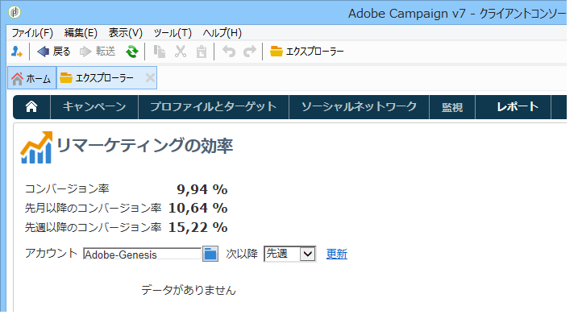

