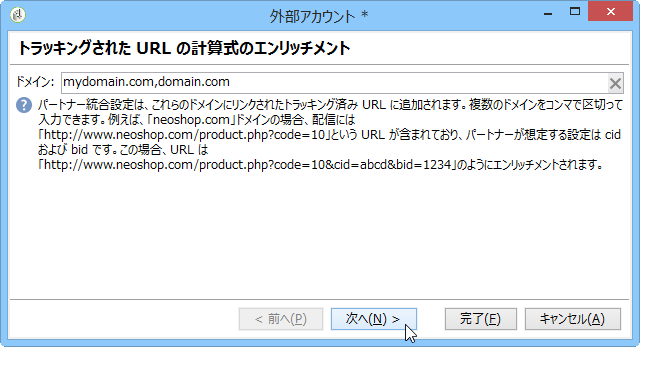
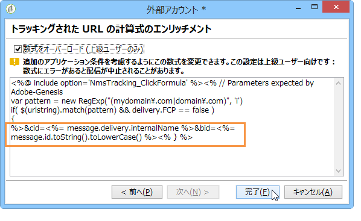

# Adobe Analytics Data コネクタ{#adobe-analytics-data-connector}

## Data コネクタ統合について {#about-data-connector-integration}

>[!CAUTION]
>
>Adobe Analytics Data Connector には、トランザクションメッセージ（Message Center）との互換性はありません。

Data コネクタ（旧 Adobe Genesis）を使用すると、Adobe Campaign と Adobe Analytics の間で、**Web 分析コネクタ**&#x200B;パッケージを介したインタラクションが可能になります。Adobe Data コネクタは、E メールキャンペーン後のユーザー行動に関するデータをセグメントの形式で Adobe Campaign に送信します。反対に、Adobe Campaign から配信された E メールキャンペーンの指標と属性を Adobe Analytics - Data コネクタに送信します。

Adobe Campaign では、Data コネクタを使用してインターネットオーディエンスを測定することができます（Web 分析）。このような統合を通じて、Adobe Campaign では 1 つ以上のサイトでマーケティングキャンペーン後の訪問者の行動に関するデータを収集し、（分析後に）訪問者を購入者に変換できるようリマーケティングキャンペーンを実行できます。また反対に、Adobe Campaign では、Web 分析ツールを使用して指標およびキャンペーン属性をプラットフォームに転送できます。

Adobe Analytics と Adobe Campaign の統合の実装について詳しくは、[このドキュメント](https://helpx.adobe.com/jp/marketing-cloud/how-to/analytics-ac.html)を参照してください。

各ツールのアクションフィールドは次のとおりです。

* Web 分析の役割：

   1. Adobe Campaign で実行された E メールキャンペーンにマークを付けます。
   1. 受信者がキャンペーン E メールのクリック後に参照したサイトでの行動をセグメントの形式で保存します。セグメントは、離脱した製品（閲覧されたが、カートへの追加や購入はおこなわれなかった）、購入またはカート放棄を対象とします。

* Adobe Campaign の役割：

   1. 指標およびキャンペーン属性をコネクタに送信します。コネクタはそれを Web 分析ツールに転送します。
   1. セグメントを収集し、分析します。
   1. リマーケティングキャンペーンをトリガーします。

## 統合の設定 {#setting-up-the-integration}

Data コネクタを設定するには、Adobe Campaign インスタンスに接続し、次の操作を実行する必要があります。

* [手順 1：Analytics での統合の設定](#step-1--configure-integration-in-analytics)
* [手順 2：Campaign での外部アカウントの作成](#step-2--create-the-external-account-in-campaign)
* [手順 3：Adobe Campaign と Adobe Analytics の同期](#step-3--synchronize-adobe-campaign-and-adobe-analytics)

### 手順 1：Analytics での統合の設定 {#step-1--configure-integration-in-analytics}

ウィザードを使用して Data コネクタを設定するための詳細な手順を示します。

1. Adobe ID または Enterprise ID を使用して Adobe Experience Cloud にログインします。

   

1. Experience Cloud ソリューションのリストで、「**[!UICONTROL Analytics]**」を選択します。

   

1. 「**[!UICONTROL 管理者]**」タブで、「**[!UICONTROL Data Connectors]**」を選択します。

   **[!UICONTROL Data Connectors]** メニューにアクセスするには、次の Analytics ツールの権限が必要です。詳しくは、この[ページ](https://docs.adobe.com/content/help/ja-JP/analytics/admin/admin-console/permissions/analytics-tools.html)を参照してください。
   * 統合（作成）
   * 統合（更新）
   * 統合（削除）

   

1. パートナーのリストから、「**[!UICONTROL Adobe Campaign Classic]**」を選択します。

   

1. **[!UICONTROL 統合を追加]**&#x200B;ダイアログで、「**[!UICONTROL 有効化]**」をクリックします。
1. 「**[!UICONTROL これらの条件に同意します]**」をオンにします。この統合にリンクされている&#x200B;**[!UICONTROL レポートスイート]**&#x200B;を選択し、コネクタラベルを入力します。

   完了したら、「**[!UICONTROL この統合を作成して設定]**」をクリックします。

   

1. コネクタの代わりに通知を受信する E メールアドレスを入力し、外部の Adobe Campaign アカウントに表示される&#x200B;**[!UICONTROL アカウント ID]** をコピーします（詳しくは、[手順 2：Campaign での外部アカウントの作成](#step-2--create-the-external-account-in-campaign)を参照）。

   

1. E メールキャンペーンの影響を測定するために必要な ID として、キャンペーン名（cid）および iNmsBroadlog（bid）テーブル ID を指定します。収集されるイベントの指標も指定する必要があります。使用する&#x200B;**[!UICONTROL イベント]**&#x200B;のタイプが「数値」であることを確認します。そうしないと、ドロップダウンメニューには表示されません。

   

1. 必要に応じて、パーソナライズされたセグメントを指定します。

   

1. 「**[!UICONTROL データコレクション]**」で、データの復元方法として、この例では手順 6 で指定した **[!UICONTROL cid]** と **[!UICONTROL bid]** の ID を選択します。

   

1. ダッシュボードに表示する情報を選択します。

   

1. 上述の手順で指定した内容をまとめたページで設定を確認します。

   

1. 「**[!UICONTROL 今すぐ有効にする]**」をクリックして設定を承認し、コネクタを有効にします。

   

   これで、Data コネクタが設定されました。

### 手順 2：Campaign での外部アカウントの作成 {#step-2--create-the-external-account-in-campaign}

Adobe Campaign は、コネクタにより分析プラットフォームと統合されます。アプリケーションを同期するには、次の手順を適用します。

1. Adobe Campaign に **Web 分析コネクタ**&#x200B;パッケージをインストールします。
1. Adobe Campaign ツリーの&#x200B;**[!UICONTROL 管理／プラットフォーム／外部アカウント]**&#x200B;フォルダーに移動します。
1. 外部アカウントのリストを右クリックし、ドロップダウンメニューで「**[!UICONTROL 新規]**」を選択します（または外部アカウントのリストの上部で&#x200B;**[!UICONTROL 新規]**&#x200B;ボタンをクリックします）。
1. ドロップダウンリストを使用して「**[!UICONTROL Web 分析]**」タイプを選択します。
1. コネクタのプロバイダーを選択します（この場合は「**[!UICONTROL Adobe Analytics - Data Connecto]**」）。

   

1. 「**[!UICONTROL 式をエンリッチメントする...]**」リンクをクリックして URL 計算式を変更し、Web 分析ツールの統合情報（キャンペーン ID）と、アクティビティをトラッキングする必要があるサイトのドメインを指定する必要があります。
1. サイトのドメイン名を指定します。

   

1. 「**[!UICONTROL 次へ]**」をクリックし、ドメイン名が保存されていることを確認します。

   

1. 必要に応じて、計算式をオーバーロードします。そのためには、ボックスをオンにして、ウィンドウで式を直接編集します。

   

   >[!CAUTION]
   >
   >この設定モードはエキスパートユーザー向けに用意されています。この式にエラーがあった場合、E メール配信が停止される可能性があります。

1. 「**[!UICONTROL 詳細設定]**」タブでは、より技術的な設定を設定または変更できます。

   * **[!UICONTROL 存続期間]**：Adobe Campaign でテクニカルワークフローで Web イベントを収集するまでの期間（日数）を指定できます。デフォルト：180 日。
   * **[!UICONTROL 持続]**：すべての Web イベント（購入など）をリマーケティングキャンペーンの属性にできる期間を指定できます。デフォルト：7 日。

>[!NOTE]
>
>複数のオーディエンス測定ツールを使用する場合は、外部アカウントの作成時に&#x200B;**[!UICONTROL パートナー]**&#x200B;ドロップダウンリストで「**[!UICONTROL その他]**」を選択できます。配信プロパティの 1 つの外部アカウントのみを参照できます。そのため、トラッキングされる URL の式を調整する必要があります。調整するには、Adobe および使用される他のすべての測定ツールで想定されているパラメーターを追加します。

### 手順 3：Adobe Campaign と Adobe Analytics の同期 {#step-3--synchronize-adobe-campaign-and-adobe-analytics}

外部アカウントを作成した後、両方のアプリケーションを同期する必要があります。

1. 前に作成した外部アカウントに移動します。
1. 必要に応じて、アカウントの&#x200B;**[!UICONTROL ラベル]**&#x200B;を変更します。
1. Data コネクタの設定中に選択した&#x200B;**[!UICONTROL 名前]**&#x200B;と一致するように&#x200B;**[!UICONTROL 内部名]**&#x200B;を変更します。

   

1. **[!UICONTROL 接続を承認]**&#x200B;リンクをクリックします。

   

   **[!UICONTROL 内部名]**&#x200B;が Data コネクタ設定ウィザードで指定した&#x200B;**[!UICONTROL 名前]**&#x200B;と一致することを確認します。

1. Data コネクタ設定ウィザードで&#x200B;**[!UICONTROL アカウント ID]** を入力します。

   

1. Data コネクタウィザードに従って手順を実行し、Adobe Campaign の外部アカウントに戻ります。
1. Adobe Campaign と Adobe Analytics - Data コネクタとの間でデータ交換を実行するために「**[!UICONTROL 次へ]**」をクリックします。

   同期が完了すると、セグメントリストが表示されます。

   

Adobe Campaign と Adobe Analytics - Data コネクタとの間のデータ同期が有効な場合、Data コネクタウィザードで定義した 3 つのデフォルトセグメントが Adobe Campaign によって収集され、Adobe Campaign 外部アカウントの「**[!UICONTROL セグメント]**」タブでアクセスできるようになります。

Data コネクタウィザードで追加セグメントを設定した場合は、それらのセグメントを Adobe Campaign に追加できます。そのためには、「**[!UICONTROL セグメントリストを更新]**」リンクをクリックし、外部アカウントウィザードで示される手順に従います。操作を実行すると、新しいセグメントがリストに表示されます。

### Web 分析プロセスのテクニカルワークフロー {#technical-workflows-of-web-analytics-processes}

Adobe Campaign と Adobe Analytics - Data コネクタとの間のデータ交換は、バックグラウンドタスクとして実行される 4 つのテクニカルワークフローによって処理されます。

これらのワークフローは、Adobe Campaign ツリーの&#x200B;**[!UICONTROL 管理／プロダクション／テクニカルワークフロー／Web 分析プロセス]**&#x200B;フォルダーで利用できます。

* **[!UICONTROL Web イベントの復元]**：このワークフローでは、指定したサイトでのユーザーの行動に関するセグメントを 1 時間に 1 回ダウンロードし、Adobe Campaign データベースに格納してリマーケティングワークフローを開始します。
* **[!UICONTROL イベントパージ]**：このワークフローでは、「**[!UICONTROL 存続期間]**」フィールドで設定した期間に基づいてデータベースからすべてのイベントを削除できます。詳しくは、[手順 2：Campaign での外部アカウントの作成](#step-2--create-the-external-account-in-campaign)を参照してください。
* **[!UICONTROL コンバージョン済みの連絡先の特定]**：リマーケティングキャンペーン後に購入をおこなった訪問者のディレクトリ。このワークフローで収集されたデータは、**[!UICONTROL リマーケティングの効率]**&#x200B;レポートでアクセスできます。この[ページ](#creating-a-re-marketing-campaign)を参照してください。
* **[!UICONTROL 指標とキャンペーン属性の送信]**：Adobe Analytics Data Connector を使用して Adobe Campaign から Adobe Experience Cloud に E メールキャンペーン指標を送信できます。このワークフローは毎日午前 4 時にトリガーされ、データを Analysis に送信するには 24 時間かかります。

   ワークフローは再起動しないでください。再起動すると、以前のデータがすべて再送され、Analytics の結果に歪みが生じる可能性があります。

   含まれる指標は次のとおりです。

   * **[!UICONTROL 配信するメッセージ]**（@toDeliver）
   * **[!UICONTROL 処理済み]**（@processed）
   * **[!UICONTROL 成功]**（@success）
   * **[!UICONTROL オープン数合計]**（@totalRecipientOpen）
   * **[!UICONTROL 開封した受信者]**（@recipientOpen）
   * **[!UICONTROL クリックした受信者の合計数]**（@totalRecipientClick）
   * **[!UICONTROL クリックした人]**（@personClick）
   * **[!UICONTROL ユニーククリック数]**（@recipientClick）
   * **[!UICONTROL オプトアウト]**（@optOut）
   * **[!UICONTROL エラー]**（@error）

   >[!NOTE]
   >
   >送信されたデータは最後のスナップショットに基づいたデルタであり、指標データの値がマイナスになる可能性があります。

   送信される属性は次のとおりです。

   * **[!UICONTROL 内部名]**（@internalName）
   * **[!UICONTROL ラベル]**（@label）
   * **[!UICONTROL ラベル]** (operation/@label)：**キャンペーン**&#x200B;パッケージがインストールされている場合のみ
   * **[!UICONTROL 特性]** (operation/@nature)：**キャンペーン**&#x200B;パッケージがインストールされている場合のみ
   * **[!UICONTROL タグ 1]** (webAnalytics/@tag1)
   * **[!UICONTROL タグ 2]** (webAnalytics/@tag2)
   * **[!UICONTROL タグ 3]** (webAnalytics/@tag3)
   * **[!UICONTROL コンタクト日]** (scheduling/@contactDate)

## Adobe Campaign での配信のトラッキング {#tracking-deliveries-in-adobe-campaign}

Adobe Campaign で配信を送信した後、Adobe Experience Cloud でサイト上のアクティビティをトラッキングできるようにするには、配信プロパティで対応するコネクタを参照する必要があります。それには、次の手順に従います。

1. トラッキングするキャンペーンの配信を開きます。

   

1. 配信プロパティを開きます。
1. 「**[!UICONTROL Web 分析]**」タブに移動し、前に作成した外部アカウントを選択します。Refer to [Step 2: Create the external account in Campaign](#step-2--create-the-external-account-in-campaign).

   

1. 配信を送信し、Adobe Analytics でそのレポートにアクセスできるようになりました。

## リマーケティングキャンペーンの作成 {#creating-a-re-marketing-campaign}

リマーケティングキャンペーンを準備するには、リマーケティングタイプのキャンペーンに使用する配信テンプレートを作成します。次に、リマーケティングキャンペーンを設定し、セグメントにリンクします。セグメントごとに異なるリマーケティングキャンペーンが必要です。

Adobe Campaign で最初のキャンペーンでターゲットとした受信者の行動を分析し、セグメントの収集が終了すると、リマーケティングキャンペーンが自動的に開始されます。カートが放棄されたか、製品を表示しても購入に至らなかった場合、サイトのブラウジングが購入につながるように、対象の受信者に配信が送信されます。

Adobe Campaign にはパーソナライズされた配信テンプレートが用意されており、これを使用するか、またはこれをベースとして使用することによってキャンペーンを準備することができます。

1. **[!UICONTROL エクスプローラー]**&#x200B;で、Adobe Campaign ツリーの&#x200B;**[!UICONTROL リソース／テンプレート／配信テンプレート]**&#x200B;フォルダーに移動します。
1. 「**[!UICONTROL E メール配信（リマーケティング）]**」テンプレートまたは Adobe Campaign に用意されているリマーケティングテンプレートのサンプルを複製します。
1. ニーズに合わせてテンプレートをパーソナライズし、保存します。

   

1. 新しいキャンペーンを作成し、ドロップダウンリストから「**[!UICONTROL リマーケティングキャンペーン]**」テンプレートを選択します。

   

1. **[!UICONTROL 設定...]** リンクをクリックして、キャンペーンにリンクされたセグメントおよび配信テンプレートを指定します。
1. 前に設定した外部アカウントを選択します。

   

1. 対象のセグメントを選択します。

   

1. このリマーケティングキャンペーンに使用する配信テンプレートを選択し、「**[!UICONTROL 完了]**」をクリックしてウィンドウを閉じます。

   

1. 「**[!UICONTROL OK]**」をクリックしてキャンペーンウィンドウを閉じます。

**[!UICONTROL リマーケティングの効率]**&#x200B;レポートは、グローバルレポートページからアクセスします。このレポートでは、Adobe Campaign のリマーケティングキャンペーン後における、カート放棄数に対するコンバージョンされた連絡先（何かを購入したなど）数を表示できます。週ごと、月ごとまたは Adobe Campaign と Web 分析ツール間の同期開始以降のコンバージョン率が計算されます。

