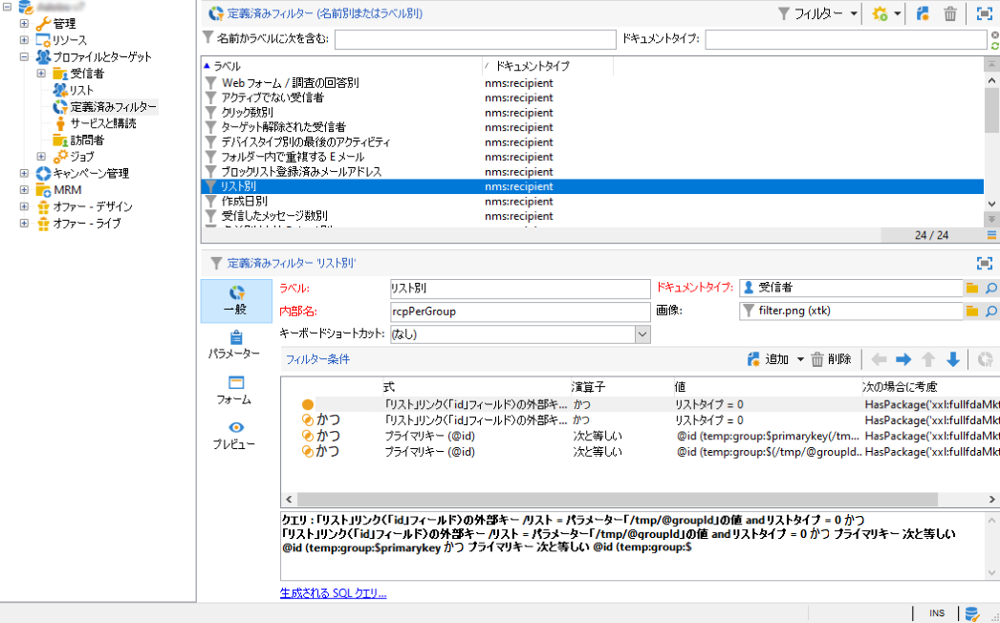
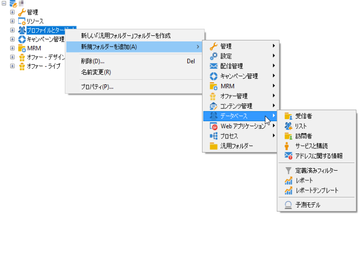

# Adobe Campaign エクスプローラーの使用 {#using-adobe-campaign-explorer}

Adobe Campaign エクスプローラーにアクセスするには、ツールバーアイコンを使用します。これにより、Adobe Campaign のすべての機能、設定画面およびプラットフォーム要素の一部の詳細ビューにアクセスできます。

**[!UICONTROL エクスプローラー]**&#x200B;ワークスペースは、3 つのゾーンに分割されています。

**1 - ツリー**：ツリーのコンテンツは、パーソナライズできます（ノードの追加、移動または削除）。この手順は、エキスパートユーザー専用です。詳細については、[この節](#about-navigation-hierarchy)を参照してください。

**2 - リスト**：このリストのフィルタリング、検索の実行、情報の追加、データの並べ替えのいずれかを行うことができます。 [詳細情報](adobe-campaign-ui-lists.md)。

**3 - 詳細**：選択した要素の詳細を表示できます。右上にあるアイコンを使用すると、この情報をフルスクリーンフォーマットで表示できます。

## フォルダーとナビゲーションツリー{#about-navigation-hierarchy}

ナビゲーションツリーは、ファイルブラウザー（Windows エクスプローラなど）のように機能します。 フォルダーには、サブフォルダーを含めることができます。 ノードを選択すると、そのノードに対応するビューが表示されます。

表示されるビューは、選択した行を編集するためのスキーマと入力フォームに関連付けられたリストです。

ツリーに新しいフォルダーを追加するには、フォルダーの挿入先となるブランチでフォルダーを右クリックし、**[!UICONTROL 新規フォルダーを追加]**&#x200B;を選択します。 ショートカットメニューで、作成するファイルの種類を選択します。

[この節では](../../configuration/using/configuration.md)、キャンペーンのナビゲーションツリーを設定する方法について説明します。

](access-management-folders.md)この節では[、フォルダーに権限を設定する方法を説明します。

## フォルダー設定のベストプラクティス

* **ビルトインフォルダーの使用**

  ビルトインフォルダーを使用すると、プロジェクトに関与していないユーザーがアプリケーションを簡単に使用、保守、トラブルシューティングできるようになります。受信者、リスト、配信などのカスタムフォルダー構造を作成するのではなく、管理、プロファイルとターゲット、キャンペーン管理などの標準フォルダーを使用してください。

* **サブフォルダーの作成**

  標準フォルダー（管理／実稼働／テクニカルワークフロー）の下にテクニカルワークフローを配置し、ワークフロータイプごとにサブディレクトリを作成します。

* **命名規則の設定**

  例えば、実行順に並べ替えて表示されるように、ワークフローにアルファベット順に名前を付けることができます。

  例：

   * A1 - 受信者のインポート、10:00 開始。
   * A2 - チケットのインポート、11:00 開始。

* **開始時に使用できるテンプレートの作成**

  ユーザーに固有の配信テンプレート、ワークフローテンプレート、キャンペーンテンプレートを作成します。 この構造により、時間を節約でき、ユーザーごとに適切な配信マッピングとタイポロジーを確実に使用できます。

## 画面の解像度 {#screen-resolution}

最適なナビゲーションとユーザビリティを確保するために、アドビでは 1600 x 900 ピクセル以上の画面解像度を推奨します。

>[!CAUTION]
>
>1600 x 900 ピクセル未満の解像度は Adobe Campaign ではサポートしていません。

**[!UICONTROL エクスプローラー]**&#x200B;ワークスペースで&#x200B;**[!UICONTROL 詳細]**&#x200B;ゾーンの一部が切り詰められているように見える場合は、ゾーンの上部にある矢印を使用してゾーンを拡大するか、「**[!UICONTROL 拡大]**」ボタンをクリックします。

## リストの参照とカスタマイズ {#browsing-lists}

リストを参照、管理、カスタマイズする方法については、](adobe-campaign-ui-lists.md)この節[を参照してください。
