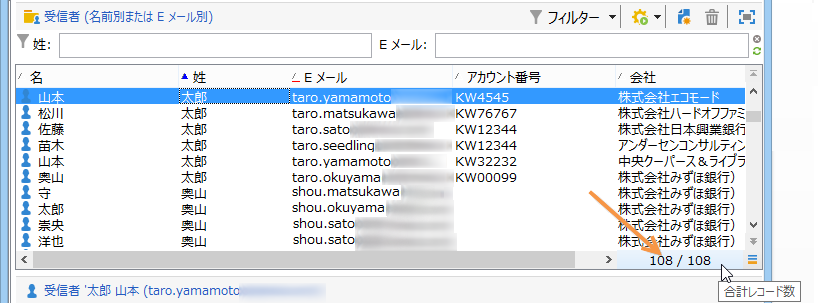
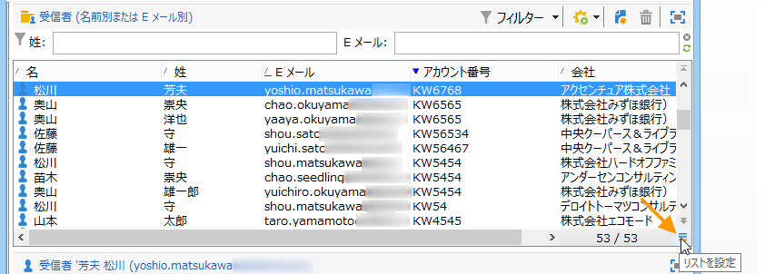
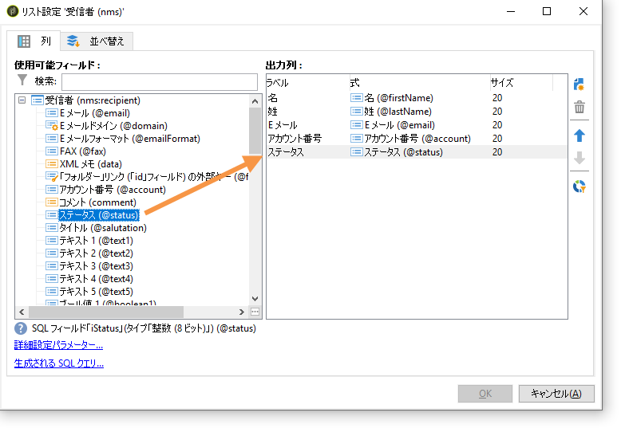
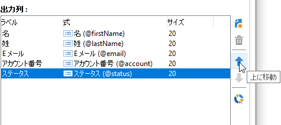
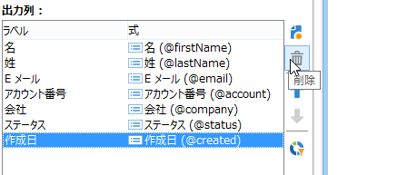

# リストの管理とカスタマイズ{#manage-and-customize-lists}

エクスプローラを使用して、キャンペーンデータベース内のレコードのリストにアクセスできます。 これらのリストのフィルタリング、検索の実行、情報の追加、データのフィルタリングと並べ替えを行うことができます。

## レコードをカウント{#counting-records}

Adobe Campaign には、デフォルトで、リストの最初の 200 件のレコードが読み込まれます。つまり、表示しているテーブルのすべてのレコードが表示されるわけではありません。リスト内のレコード数のカウントを実行して、レコードをさらに読み込むことができます。

リスト画面の右下の部分にある&#x200B;**[!UICONTROL カウンター]**&#x200B;を使用すると、読み込まれているレコード数とデータベース内の合計レコード数（フィルターの適用後）が示されます。

右側に数値ではなく「**?**」が表示される場合は、カウンターをクリックして計算を起動します。

### さらにレコードを読み込む{#loading-more-records}

追加レコード（デフォルトでは 200 ライン）を読み込んで表示するには、「**[!UICONTROL 読み込みを続行]**」をクリックします。

すべてのレコードを読み込むには、リストを右クリックして&#x200B;**[!UICONTROL すべて読み込む]**&#x200B;を選択します。

>[!CAUTION]
>
>レコード数によっては、リスト全体を読み込むのに時間がかかることがあります。

### デフォルトのレコード数の変更 {#change-default-number-of-records}

読み込まれるデフォルトのレコード数を変更するには、リストの右下にある「**[!UICONTROL リストを設定]**」をクリックします。

リスト設定ウィンドウで、**[!UICONTROL Advanced parameters]**（左下）をクリックし、取得する行数を変更します。

## リストの構成{#configuring-lists}

### 列の追加 {#add-columns}

リストに列を追加するには、2 つの方法があります。

手軽なのは、レコードの詳細からリストに列を追加する方法です。手順は次のとおりです。

1. 詳細画面で、列に表示するフィールドを右クリックします。
1. 「**[!UICONTROL リストに追加]**」を選択します。

   既存の列の右側に列が追加されます。

列を追加するもう 1 つの方法は、リスト設定ウィンドウを使用することです。この方法は、詳細画面に表示されないデータを表示したい場合などに使用します。手順は次のとおりです。

1. リストの右下にある「**[!UICONTROL リストを設定]**」をクリックします。

   

1. リスト設定ウィンドウで、「**[!UICONTROL 出力列]**」に追加するために、「**[!UICONTROL 使用可能フィールド]**」リストに追加するフィールドをダブルクリックします。

   

   >[!NOTE]
   >
   >デフォルトでは、詳細フィールドは表示されません。表示するには、使用可能フィールドのリストの右下にある「**詳細フィールドを表示**」をクリックします。
   >
   >ラベルは、テーブルごとに、その後はアルファベット順に表示されます。
   >
   >「**検索**」フィールドを使用して、使用可能フィールドで検索を実行できます。詳しくは、[この節](#sorting-a-list)を参照してください。
   >
   >フィールドは、SQL フィールド、リンクテーブル、集計フィールドなどの特定のアイコンで識別されます。選択した各フィールドの説明が、使用可能フィールドのリストの下に表示されます。[詳細情報](#configuring-lists)。
   >
   >データを並べ替えたりフィルターしたりすることもできます。[この節](../../platform/using/filtering-options.md)を参照してください。

1. 表示する列ごとにこの手順を繰り返します。
1. 矢印を使用して&#x200B;**表示順序**&#x200B;を変更します。最も上にある列が、レコードのリストで左になります。

   

1. 必要に応じて、「**[!UICONTROL 値の配分]**」をクリックし、現在のフォルダーの選択されたフィールドの値の配分を参照できます。

   

1. 「**[!UICONTROL OK]**」をクリックして設定を確定し、結果を表示します。

### 新しい列の作成 {#create-a-new-column}

新しい列を作成して、リストに表示するフィールドを増やすことができます。手順は次のとおりです。

1. リストの右下にある「**[!UICONTROL リストを設定]**」をクリックします。
1. 「**[!UICONTROL 追加]**」をクリックして、リストに新しいフィールドを表示します。

### 列の削除 {#remove-a-column}

リストの右下にある「**[!UICONTROL リストを設定]**」を使用して、レコードのリスト内の 1 つ以上の列をマスクできます。

リスト設定ウィンドウで、マスクする列を「**[!UICONTROL 出力列]**」ゾーンから選択し、削除ボタンをクリックします。

マスクする列ごとにこの手順を繰り返します。「**[!UICONTROL OK]**」をクリックして設定を確定し、結果を表示します。

### 列の幅の調整 {#adjust-column-width}

リストがアクティブである（少なくとも 1 ラインが選択されている）ときは、F9 キーを使用して、すべての列が画面に表示されるように列幅を調整できます。

### サブフォルダ{#display-sub-folders-records}内のデータを表示

リストには、次の内容を表示できます。

* 選択したフォルダーのみに含まれているレコード
* 選択したフォルダーとそのサブフォルダー内のレコード

表示モードを切り替えるには、ツールバーの&#x200B;**[!UICONTROL サブフォルダーのコンテンツを表示]**&#x200B;をクリックします。

## リスト構成の保存{#saving-a-list-configuration}

リストの設定は、ワークステーションレベルでローカルに定義されます。ローカルキャッシュがクリアされると、ローカルの設定が無効になります。

デフォルトでは、定義された表示パラメーターは、対応するフォルダータイプのすべてのリストに適用されます。したがって、受信者のリストがフォルダーからどのように表示されるかを変更すると、この設定は他のすべての受信者フォルダーに適用されます。

ただし、同じタイプの異なるフォルダーに適用される複数の設定を保存できます。設定は、データが含まれるフォルダーのプロパティとともに保存され、再適用できます。

例えば、「配信」フォルダーについて、次の表示を設定できます。

このリストの設定を保存して再利用するには、以下の手順に従います。

1. 表示されているデータを含むフォルダーを右クリックします。
1. 「**[!UICONTROL プロパティ]**」を選択します。
1. 「**[!UICONTROL 詳細設定]**」をクリックし、「**[!UICONTROL 設定]**」フィールドで名前を指定します。

   

1. 「**[!UICONTROL OK]**」をクリックし、「**[!UICONTROL 保存]**」をクリックします。

この設定を別の「**配信**」フォルダーに適用できます。

フォルダーのプロパティウィンドウで「**[!UICONTROL 保存]**」をクリックします。リストの表示は、指定した設定と一致するように変更されます。

## リストのエクスポート{#exporting-a-list}

リストからデータをエクスポートするには、エクスポートウィザードを使用する必要があります。これにアクセスするには、リストからエクスポートする要素を選択し、右クリックして「**[!UICONTROL エクスポート...]**」を選択します。

インポートおよびエクスポート機能の使用については、[一般的なインポートおよびエクスポート](../../platform/using/about-generic-imports-exports.md)で説明しています。

>[!CAUTION]
>
>リストの要素をコピーまたは貼り付け機能を使用してエクスポートしないでください。

## リストの並べ替え{#sorting-a-list}

リストに大量のデータが含まれている場合があります。これらのデータを並べ替えたり、標準フィルターまたは詳細フィルターを適用したりすることができます。並べ替えでは、データを昇順または降順で表示できます。フィルターでは、基準を定義または組み合わせて、選択したデータのみを表示できます。

列ヘッダーをクリックして、昇順または降順ソートを適用するか、データの並べ替えをキャンセルできます。アクティブな並べ替えステータスおよび並べ替え順は、列ラベルの前の青色の矢印で示されます。列ラベルの前の赤色のダッシュは、データベースからインデックス付けされたデータに並べ替えが適用されていることを意味します。この並べ替え方法は、並べ替えジョブを最適化するために使用されます。

並べ替えの設定をおこなったり、並べ替え基準を組み合わせることもできます。これをおこなうには、以下の手順に従います。

1. リストの右下にある「**[!UICONTROL リストを設定]**」をクリックします。

   

1. リスト設定ウィンドウで、「**[!UICONTROL 並べ替え]**」タブをクリックします。
1. 並べ替えるフィールドと、並べ替えの順番（昇順または降順）を選択します。

   

1. 並べ替えの優先順位は、並べ替え列の順序を使用して定義されます。優先順位を変更するには、適切なアイコンを使用して列の順序を変更します。

   

   並べ替えの優先順位は、リスト内の列の表示には影響しません。

1. 「**[!UICONTROL OK]**」をクリックしてこの設定を確定し、リストで結果を表示します。

### 要素の検索 {#running-a-search}

エディターで使用可能フィールドの検索を実行するには、フィールドのリストの上にある「**[!UICONTROL 検索]**」フィールドを使用します。キーボードの **Enter** キーを押すか、リストを参照します。検索と一致するフィールドは、太字のラベルになります。

>[!NOTE]
>
>フィルターを作成して、リストのデータの一部のみを表示できます。[詳細情報](../../platform/using/creating-filters.md)。
