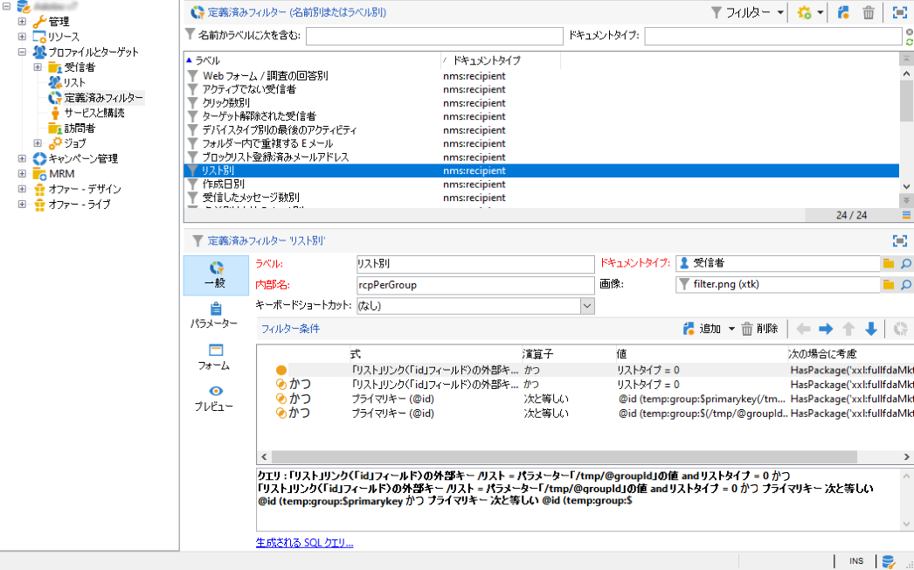
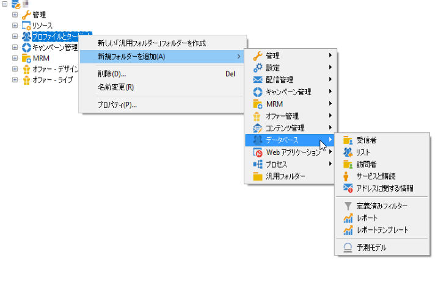

# Adobe Campaign ワークスペース{#adobe-campaign-workspace}

## Adobe Campaignインターフェイスを探索{#about-adobe-campaign-interface}

データベースに接続すると、Adobe Campaign ホームページが表示されます。これはダッシュボード形式になっており、各種の機能にアクセスできるリンクとショートカットから構成されています（具体的な内容は、それぞれのインストール構成と一般的なプラットフォーム設定によって異なります）。

ホームページの中心セクションには、Campaign のオンラインドキュメントポータル、フォーラムおよびサポート Web サイトにアクセスするためのリンクが表示されます。

 Campaign ワークスペースを[ビデオ](#video)で確認

>[!NOTE]
>
>各インスタンスで利用できる Adobe Campaign 機能は、インストールされているモジュールやアドオンによって異なります。権限や特定の設定によっては、利用できない機能もあります。
>
>モジュールやアドオンをインストールする前に、ライセンス契約を確認する必要があります。詳しくは、アドビのアカウント担当者にお問い合わせください。

### コンソールおよび Web アクセス {#console-and-web-access}

Adobe Campaign プラットフォームにアクセスするには、コンソールまたはインターネットブラウザーを使用します。

Web アクセス用のインターフェイスはコンソールに似ていますが、機能が限定されています。

例えば、あるキャンペーンをコンソールで見たときには、次のようなオプションが表示されます。

一方、Web アクセスで見たときには、次のようなオプションが表示されます。

### 言語 {#languages}

言語は、Adobe Campaign Classic インスタンスをインストールするときに選択されます。

次の 5 種類の言語から選択できます。

* 英語（英国）
* 英語（米国）
* フランス語
* ドイツ語
* 日本語

Adobe Campaign Classic インスタンスに選択した言語は、日時フォーマットに影響を与える可能性があります。詳しくは、[この節](../../platform/using/adobe-campaign-workspace.md#date-and-time)を参照してください。

インスタンスの作成方法の詳細については、この[ページ](../../installation/using/creating-an-instance-and-logging-on.md)を参照してください。

>[!CAUTION]
>
>インスタンスの作成後は、言語を変更できません。

## ナビゲーションの基本 {#navigation-basics}

### ブラウズページ{#browsing-pages}

プラットフォームの様々な機能は、いくつかのコア機能に分類されています。インターフェイスの上部のセクションに表示されるリンクを使用して、これらの機能にアクセスします。

どのコア機能にアクセスできるかは、インストールしたパッケージおよびアドオンと、アクセス権によって異なります。

各コア機能には、タスク関連のニーズと使用コンテキストに基づく一連の機能が含まれています。例えば、「**[!UICONTROL プロファイルとターゲット]**」リンクをクリックすると、受信者リスト、購読サービス、既存のターゲティングワークフローおよびこれらの要素を作成するためのショートカットにアクセスできます。

リストは、「**[!UICONTROL プロファイルとターゲット]**」インターフェイスの左側のセクションにある「**[!UICONTROL リスト]**」リンクから使用できます。

### タブを使用{#using-tabs}

* コア機能またはリンクをクリックすると、現在のページに替わって、該当するページが表示されます。前のページに戻るには、ツールバーの「**[!UICONTROL 戻る]**」ボタンをクリックします。ホームページに戻るには、「**[!UICONTROL ホーム]**」ボタンをクリックします。

   

* メニューまたは表示画面（Web アプリケーション、プログラム、配信、レポートなど）へのショートカットの場合は、対応するページが別のタブで表示されます。これにより、タブを使用してページからページに移動することができます。

   

### 要素{#creating-an-element}を作成

各コア機能のセクションでは、使用可能な各種の要素を参照できます。そのためには、「**[!UICONTROL ブラウジング]**」セクションのショートカットを使用します。「**[!UICONTROL その他]**」リンクを使用すると、環境に関わらず、その他のすべてのページにアクセスできます。

画面左にある「**[!UICONTROL 作成]**」セクションのショートカットを使用して、新しい要素（配信、Web アプリケーション、ワークフローなど）を作成できます。リストの上にある「**[!UICONTROL 作成]**」ボタンを使用すると、リストに新しい要素を追加できます。

例えば、配信ページでは、「**[!UICONTROL 作成]**」ボタンを使用して新しい配信を作成します。

## Adobe Campaignエクスプローラーを使用{#using-adobe-campaign-explorer}

Adobe Campaign エクスプローラーにアクセスするには、ツールバーアイコンを使用します。これにより、Adobe Campaign のすべての機能、設定画面およびプラットフォーム要素の一部の詳細ビューにアクセスできます。

**[!UICONTROL エクスプローラー]**&#x200B;ワークスペースは、3 つのゾーンに分割されています。

**1 - ツリー**：ツリーのコンテンツは、パーソナライズできます（ノードの追加、移動または削除）。この手順は、エキスパートユーザー専用です。詳しくは、[この](#about-navigation-hierarchy)を参照してください。

**2 - リスト**：このリストのフィルター、検索の実行、情報の追加またはデータの並べ替えをおこなうことができます。[詳細情報](adobe-campaign-ui-lists.md)。

**3 - 詳細**：選択した要素の詳細を表示できます。右上にあるアイコンを使用すると、この情報をフルスクリーンフォーマットで表示できます。

### フォルダとナビゲーションツリー{#about-navigation-hierarchy}

ナビゲーションツリーは、ファイルブラウザ（Windowsエクスプローラなど）と同様に機能します。 フォルダには、サブフォルダを含めることができます。 ノードを選択すると、そのノードに対応する表示が表示されます。

表示される表示は、スキーマに関連付けられたリストと、選択した行を編集する入力フォームです。

ツリーに新しいフォルダを追加するには、フォルダを挿入するブランチのフォルダを右クリックし、**[!UICONTROL 追加新しいフォルダ]**&#x200B;を選択します。 ショートカットメニューで、作成するファイルの種類を選択します。

このセクション](../../configuration/using/configuration.md)では、キャンペーンのナビゲーションツリー[の構成方法を説明します。

この節](access-management-folders.md)で、フォルダ[に権限を設定する方法を説明します。

### フォルダ設定のベストプラクティス

* **組み込みフォルダを使用する**

   組み込みのフォルダーを使用すると、プロジェクトに関与していないユーザーでも、アプリケーションの使用、保守、トラブルシューティングを簡単に行うことができます。 受信者、リスト、配信などのカスタムフォルダ構造を作成することは避け、標準のフォルダ(管理、プロファイル、ターゲット、キャンペーン管理など)を使用してください。

* **サブフォルダの作成**

   標準テクニカルワークフローの下にフォルダを配置する：管理/実稼働/テクニカルワークフローを作成し、ワークフロータイプごとにサブディレクトリを作成します。

* **命名規則の設定**

   例えば、ワークフローにアルファベット順の名前を付け、実行順に並べ替えて表示することができます。

   例：

   * A1 -受信者を読み込む、開始は10:00;
   * A2 — 輸入チケット、開始11時。

* **開始するユーザー用のテンプレートの作成**

   配信テンプレート、ワークフローテンプレート、ユーザーに固有のキャンペーンテンプレートを作成します。 この構造により、時間を節約でき、各ユーザーに適切な配信マッピングとタイポロジーを使用できます。

### 画面の解像度 {#screen-resolution}

最適なナビゲーションとユーザビリティを確保するために、画面の解像度は 1600x900 ピクセル以上を推奨します。

>[!CAUTION]
>
>1600 x 900ピクセル未満の解像度は、Adobe Campaignでサポートされます。

**[!UICONTROL エクスプローラー]**&#x200B;ワークスペースで&#x200B;**[!UICONTROL 詳細]**&#x200B;ゾーンの一部が切り詰められている場合は、ゾーンの上部にある矢印を使用するか、**[!UICONTROL 拡大]**&#x200B;ボタンをクリックして拡大してください。

### リストの参照とカスタマイズ{#browsing-lists}

このセクション](adobe-campaign-ui-lists.md)では、リスト[を参照、管理、カスタマイズする方法について説明します。

## フォーマットと単位 {#formats-and-units}

### 日時 {#date-and-time}

Adobe Campaign Classic インスタンスは、言語によって日時の形式が異なります。

言語は Campaign をインストールする際に選択し、後から変更することはできません。英語（米国）、英語（英国）、フランス語、ドイツ語または日本語を選択できます。詳しくは、[このページ](../../installation/using/creating-an-instance-and-logging-on.md)を参照してください。

米国英語と英国英語の主な違いは次のとおりです。

<table> 
 <thead> 
  <tr> 
   <th> フォーマット  </th> 
   <th> 英語（米国）  </th> 
   <th> 英語（英国）  </th> 
  </tr> 
 </thead> 
 <tbody> 
  <tr> 
   <td> 日付  </td> 
   <td> 日曜日が週始め  </td> 
   <td> 月曜日が週始め  </td> 
  </tr> 
  <tr> 
   <td> 日付の短縮表記  </td> 
   <td> 
%2M/%2D/%4Y

<strong>例：09/25/2018</strong>
 </td> 
   <td> 
%2D/%2M/%4Y

<strong>例：25/09/2018</strong>
 </td> 
  </tr> 
  <tr> 
   <td> 日付と時刻の短縮表記  </td> 
   <td> 
%2M/%2D/%4Y %I:%2N:%2S %P

<strong>例：09/25/2018 10:47:25 PM</strong>
 </td> 
   <td> 
%2D/%2M/%4Y %2H:%2N:%2S

<strong>例：25/09/2018 22:47:25</strong>
 </td> 
  </tr> 
 </tbody> 
</table>

### 列挙での値の追加 {#add-values-in-an-enumeration}

ドロップダウンリストがある入力フィールドを使用して、列挙値を入力できます。この値は、保存してドロップダウンリストのオプションとして提供できます。例えば、受信者プロファイルの「**[!UICONTROL 一般]**」タブの「**[!UICONTROL 市区町村]**」フィールドで、「ロンドン」と入力します。Enter キーを押してこの値を確定すると、この値をフィールドに関連付けられた列挙に対して保存するかどうかを尋ねるメッセージが表示されます。

「**[!UICONTROL はい]**」をクリックした場合、この値は該当するフィールド（この場合は、**[!UICONTROL ロンドン]**）のコンボボックスで使用可能になります。

>[!NOTE]
>
>列挙（「定義済みリスト」とも呼ばれます）は、管理者が&#x200B;**[!UICONTROL 管理／プラットフォーム／列挙]**&#x200B;セクションで管理します。詳しくは、[列挙の管理](../../platform/using/managing-enumerations.md)を参照してください。

### デフォルトの単位 {#default-units}

有効期間（配信のリソースの有効期間、タスクの承認期限など）を表すフィールドでは、値を次の&#x200B;**単位**&#x200B;で表すことができます。

* **[!UICONTROL s]**（秒）
* **[!UICONTROL mn]**（分）
* **[!UICONTROL h]**（時間）
* **[!UICONTROL d]**（日）

## チュートリアルビデオ {#video}

このビデオでは、Campaign Classic のワークスペースについて説明します。

>[!VIDEO](https://video.tv.adobe.com/v/35130?quality=12)

Campaign Classic に関するその他のハウツービデオは[こちら](https://experienceleague.adobe.com/docs/campaign-classic-learn/tutorials/overview.html?lang=ja)で参照できます。
