# Adobe Campaign ワークスペース{#adobe-campaign-workspace}

## Adobe Campaign のインターフェイスについて {#about-adobe-campaign-interface}

データベースに接続すると、Adobe Campaign ホームページが表示されます。これはダッシュボード形式になっており、各種の機能にアクセスできるリンクとショートカットから構成されています（具体的な内容は、それぞれのインストール構成と一般的なプラットフォーム設定によって異なります）。

ホームページの中心セクションには、Campaign のオンラインドキュメントポータル、フォーラムおよびサポート Web サイトにアクセスするためのリンクが表示されます。

上のスクリーンショットは、Adobe Campaign ユーザーのホームページの例です。詳しくは、[Adobe Campaign のインターフェイスの概要ビデオ](https://docs.adobe.com/content/help/en/campaign-learn/campaign-classic-tutorials/getting-started/interface-overview.html)をご覧ください。

>[!NOTE]
>
>各インスタンスで利用できる Adobe Campaign 機能は、インストールされているモジュールやアドオンによって異なります。権限や特定の設定によっては、利用できない機能もあります。
>
>モジュールやアドオンをインストールする前に、ライセンス契約を確認する必要があります。詳しくは、アドビのアカウント担当者にお問い合わせください。

### コンソールおよび Web アクセス {#console-and-web-access}

Adobe Campaign プラットフォームにアクセスするには、コンソールまたはインターネットブラウザーを使用します。

Web アクセス用のインターフェイスはコンソールに似ていますが、機能が限定されています。

例えば、あるキャンペーンをコンソールで見たときには、次のようなオプションが表示されます。

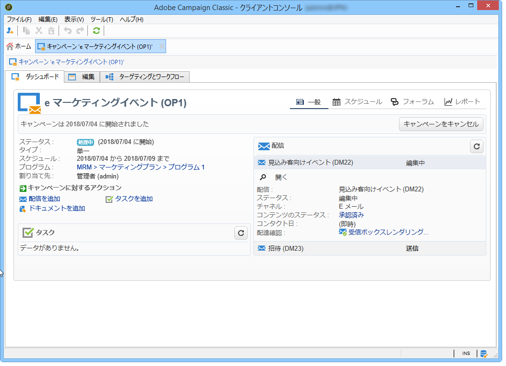

一方、Web アクセスで見たときには、次のようなオプションが表示されます。

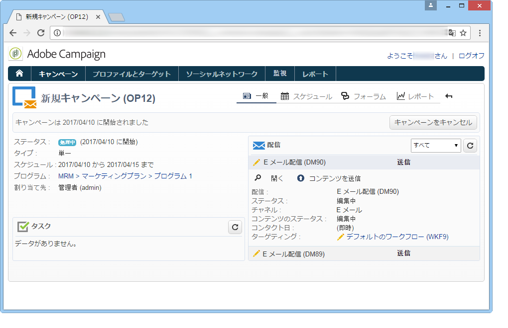

### 言語 {#languages}

この言語は、Adobe Campaign Classicインスタンスのインストール時に選択され、後で変更することはできません。 インスタンスの作成方法の詳細については、このページを参照してく [ださい](../../installation/using/creating-an-instance-and-logging-on.md)。

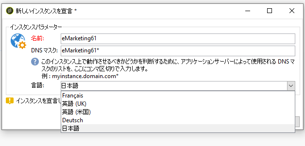

次の5種類の言語から選択できます。

* 英語 (UK)
* 英語（米国）
* フランス語
* ドイツ語
* 日本語

Adobe Campaign Classicインスタンスに選択した言語は、日付と時間の形式に影響する場合があります。 詳しくは、[この節](../../platform/using/adobe-campaign-workspace.md#date-and-time)を参照してください。

## ナビゲーションの基本 {#navigation-basics}

### ページの参照 {#browsing-pages}

プラットフォームの様々な機能は、いくつかのコア機能に分類されています。インターフェイスの上部のセクションに表示されるリンクを使用して、これらの機能にアクセスします。

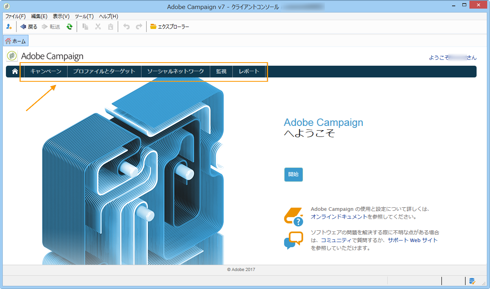

どのコア機能にアクセスできるかは、インストールしたパッケージおよびアドオンと、アクセス権によって異なります。

各コア機能には、タスク関連のニーズと使用コンテキストに基づく一連の機能が含まれています。For instance, the **[!UICONTROL Profiles and targets]** link gets you to the recipient lists, subscription services, existing targeting workflows and the shortcuts for creating these elements.

The lists are available via the **[!UICONTROL Lists]** link in the left-hand section of the **[!UICONTROL Profiles and Targets]** interface.

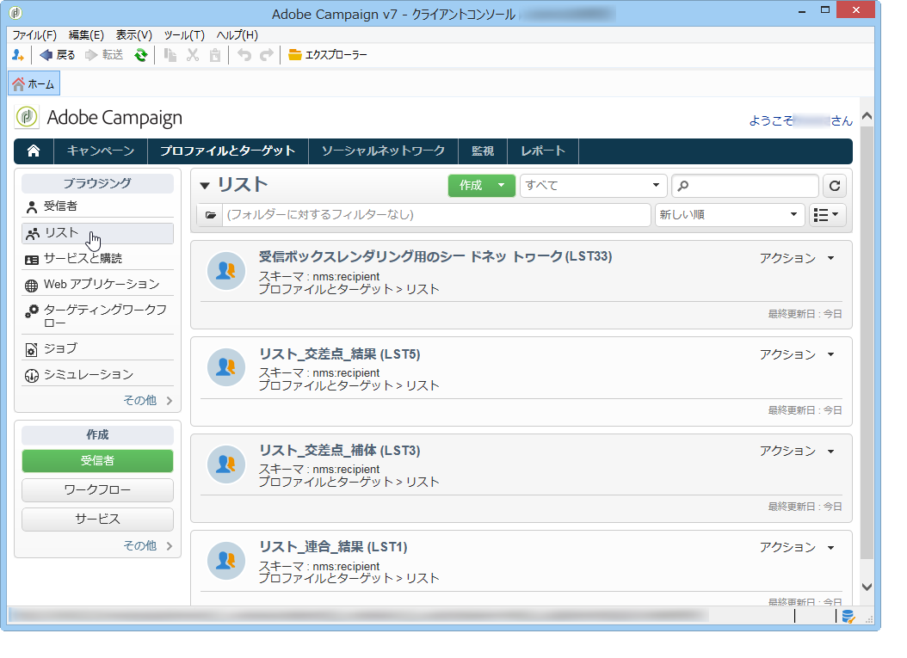

### タブの使用 {#using-tabs}

* コア機能またはリンクをクリックすると、現在のページに替わって、該当するページが表示されます。To go back to the previous page, click the **[!UICONTROL Back]** button on the toolbar. To return to the home page, click the **[!UICONTROL Home]** button.

   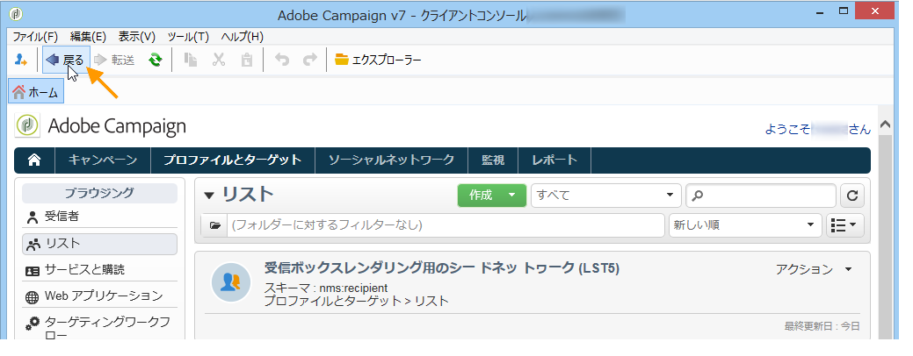

* メニューまたは表示画面（Web アプリケーション、プログラム、配信、レポートなど）へのショートカットの場合は、対応するページが別のタブで表示されます。これにより、タブを使用してページからページに移動することができます。

   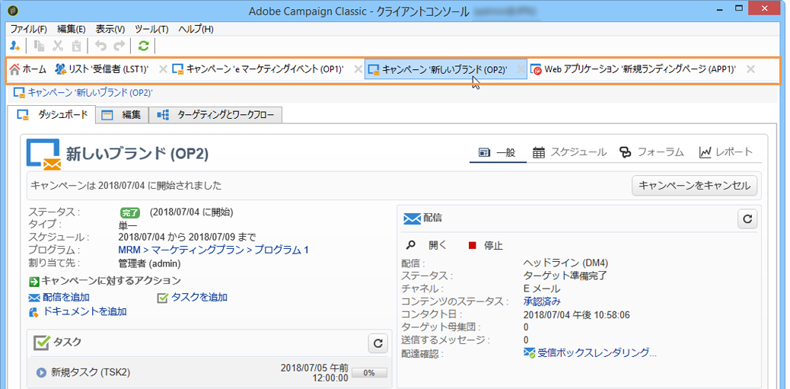

### 要素の作成 {#creating-an-element}

各コア機能のセクションでは、使用可能な各種の要素を参照できます。To do this, use the shortcuts in the **[!UICONTROL Browsing]** section. The **[!UICONTROL Other choices]** link lets you access all other pages, regardless of environment.

新しい要素（配信、Webアプリケーション、ワークフローなど）を作成できます。画面の左側のセクショ **[!UICONTROL Create]** ンのショートカットを使用する。 Use the **[!UICONTROL Create]** button above the list to add new elements to the list.

For example, on the delivery page, use the **[!UICONTROL Create]** button to create a new delivery.

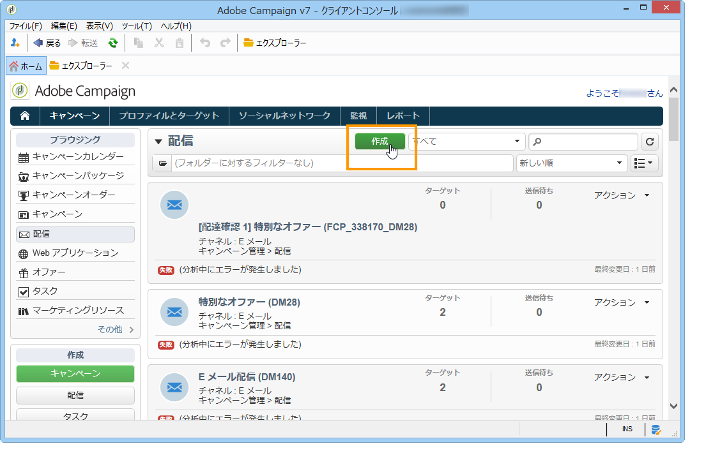

## Adobe Campaign エクスプローラーの使用 {#using-adobe-campaign-explorer}

### Adobe Campaign エクスプローラーについて {#about-adobe-campaign-explorer}

Adobe Campaign エクスプローラーにアクセスするには、ツールバーアイコンを使用します。これにより、Adobe Campaign のすべての機能、設定画面およびプラットフォーム要素の一部の詳細ビューにアクセスできます。

The **[!UICONTROL Explorer]** workspace is divided into three zones:

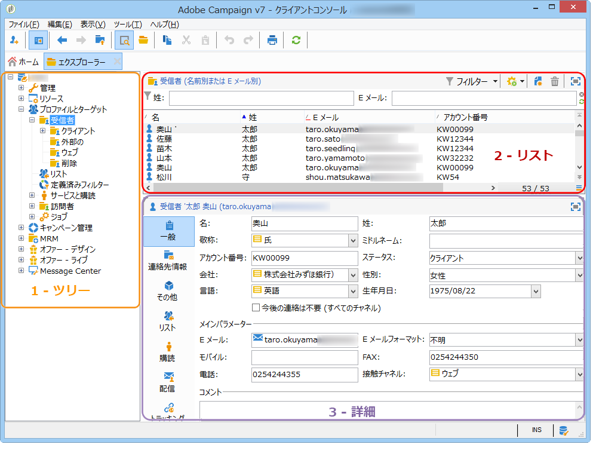

**1 - ツリー**：ツリーのコンテンツは、パーソナライズできます（ノードの追加、移動または削除）。この手順は、エキスパートユーザー専用です。詳しくは、[このページ](../../configuration/using/about-navigation-hierarchy.md)を参照してください。

**2 - リスト**：このリストのフィルター、検索の実行、情報の追加またはデータの並べ替えをおこなうことができます。

**3 - 詳細**：選択した要素の詳細を表示できます。右上にあるアイコンを使用すると、この情報をフルスクリーンフォーマットで表示できます。

### 画面の解像度 {#screen-resolution}

最適なナビゲーションとユーザビリティを確保するために、画面の解像度は 1600x900 ピクセル以上を推奨します。

>[!CAUTION]
>
>1600x900 ピクセル未満の解像度は、Adobe Campaign でサポートされない場合があります。

In the **[!UICONTROL Explorer]** workspace, if some parts of the **[!UICONTROL Details]** zone appear to be truncated, expand it using the arrow on top of the zone or click the **[!UICONTROL Enlarge]** button.

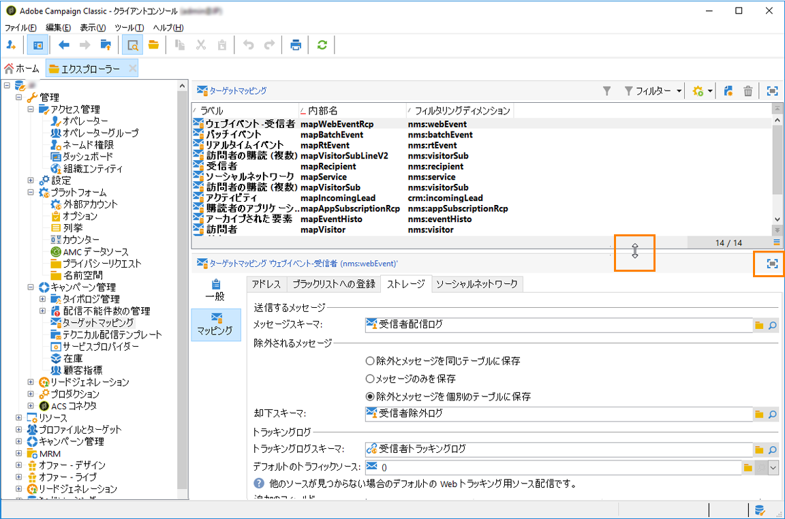

### リストの参照 {#browsing-lists}

リストを参照するには、レコード選択を変更せずにリストをスクロールする&#x200B;**スクロールバー**（横および縦）、**マウスホイール**&#x200B;または&#x200B;**矢印キー**&#x200B;を使用できます。

>[!NOTE]
>
>Configuration and personalization of list content are presented in [Configuring lists](#configuring-lists).
>
>データを並べ替えたりフィルターしたりすることもできます。詳しくは、フ [ィルタオプションを参照](../../platform/using/filtering-options.md)。

### レコードのカウント {#counting-records}

Adobe Campaign には、デフォルトで、リストの最初の 200 件のレコードが読み込まれます。つまり、表示しているテーブルのすべてのレコードが表示されるわけではありません。リスト内のレコード数のカウントを実行して、レコードをさらに読み込むことができます。

In the lower right-hand part of the list screen, a **[!UICONTROL counter]** shows how many records have been loaded and the total number of records in the database (after applying any filters):

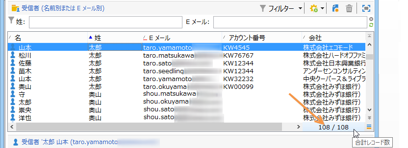

右側に数値ではなく「**?**」が表示される場合は、カウンターをクリックして計算を起動します。

### 追加レコードの読み込み {#loading-more-records}

To load (and therefore display) additional records (200 lines by default) click **[!UICONTROL Continue loading]**.

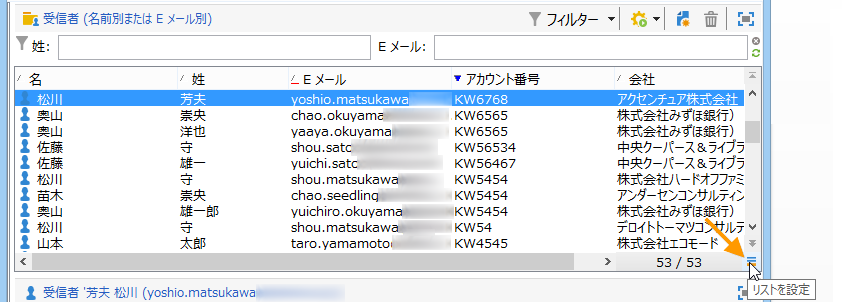

To load all the records, right-click the list and select **[!UICONTROL Load all]**.

>[!CAUTION]
>
>レコード数によっては、リスト全体を読み込むのに時間がかかることがあります。

### デフォルトのレコード数の変更 {#change-default-number-of-records}

To change the default number of records loaded, click **[!UICONTROL Configure list]** in the bottom right-hand corner of the list.

リスト設定ウィンドウで、「詳細設定パラメーター」（左下）をクリックして、取得するライン数を変更します。

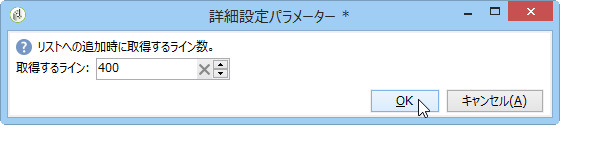

### リストの設定 {#configuring-lists}

#### 列の追加 {#add-columns}

リストに列を追加するには、2 つの方法があります。

手軽なのは、レコードの詳細からリストに列を追加する方法です。手順は次のとおりです。

1. 詳細画面で、列に表示するフィールドを右クリックします。
1. 選択 **[!UICONTROL Add in the list]**.

   既存の列の右側に列が追加されます。

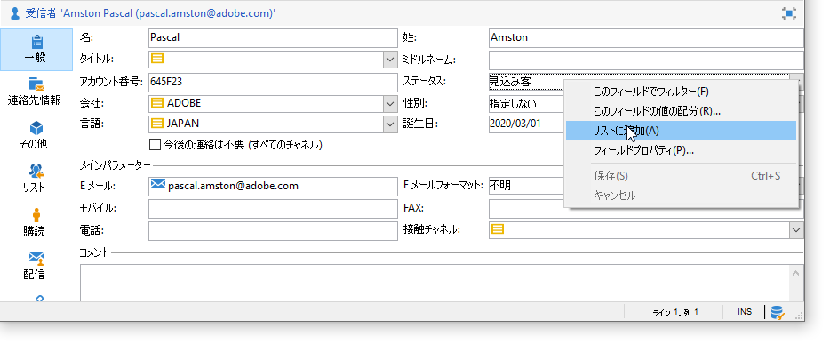

列を追加するもう 1 つの方法は、リスト設定ウィンドウを使用することです。この方法は、詳細画面に表示されないデータを表示したい場合などに使用します。手順は次のとおりです。

1. Click **[!UICONTROL Configure list]** below and to the right of the list.

   

1. In the list configuration window, double-click the field to be added in the **[!UICONTROL Available fields]** list in order to add it to the **[!UICONTROL Output columns]**.

   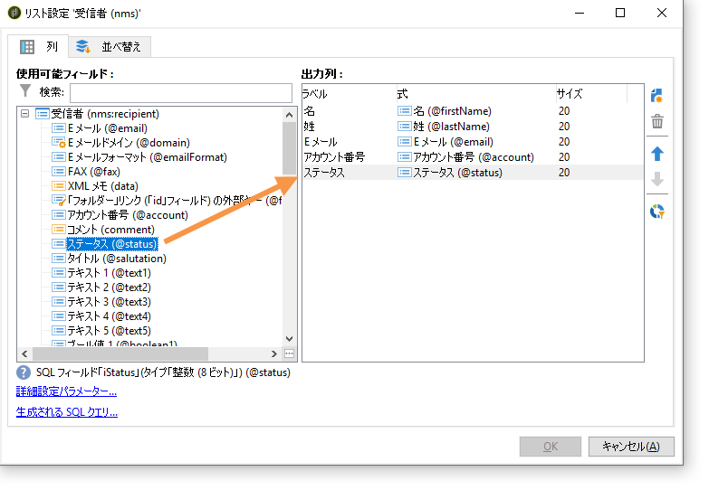

   >[!NOTE]
   >
   >デフォルトでは、詳細フィールドは表示されません。表示するには、使用可能フィールドのリストの右下にある「**詳細フィールドを表示**」をクリックします。
   >
   >ラベルは、テーブルごとに、その後はアルファベット順に表示されます。
   >
   >「**検索**」フィールドを使用して、使用可能フィールドで検索を実行できます。詳しくは、リストの並べ替えを [参照してください](#sorting-a-list)。
   >
   >フィールドは、次の特定のアイコンで識別されます。SQLフィールド、リンクテーブル、計算フィールドなど 選択した各フィールドの説明が、使用可能なフィールドのリストの下に表示されます。
   [リストの設定](#configuring-lists).
   >
   >データを並べ替えたりフィルターしたりすることもできます。詳しくは、フ [ィルタオプションを参照](../../platform/using/filtering-options.md)。

1. 表示する列ごとにこの手順を繰り返します。
1. 矢印を使用して&#x200B;**表示順序**&#x200B;を変更します。最も上にある列が、レコードのリストで左になります。

   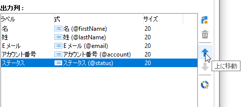

1. If you need, you can click **[!UICONTROL Distribution of values]** to view the repartition of values for the selected field in the current folder.

   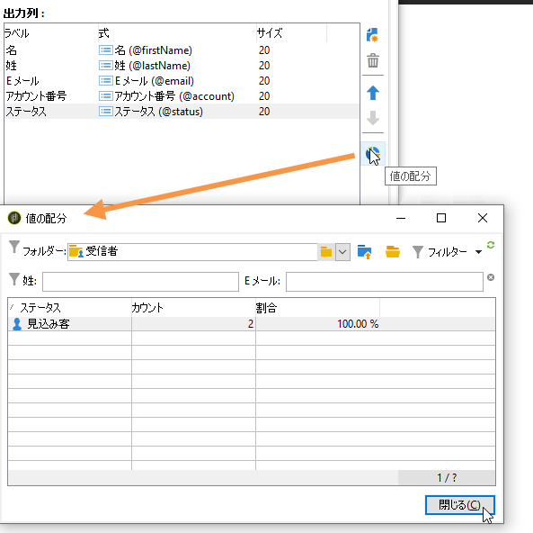

1. 「**[!UICONTROL OK]**」をクリックして設定を確定し、結果を表示します。

#### 新しい列の作成 {#create-a-new-column}

新しい列を作成して、リストに表示するフィールドを増やすことができます。手順は次のとおりです。

1. Click **[!UICONTROL Configure the list]** at below and to the right of the list.
1. Click **[!UICONTROL Add]** to display a new field in the list.

#### 列の削除 {#remove-a-column}

You can mask one or more columns in a list of records using **[!UICONTROL Configure list]** located below and to the right of the list.

In the list configuration window, select the column to be masked from the **[!UICONTROL Output columns]** zone, and click the delete button.

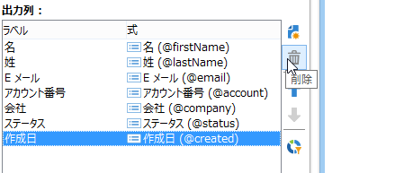

マスクする列ごとにこの手順を繰り返します。「**[!UICONTROL OK]**」をクリックして設定を確定し、結果を表示します。

#### 列の幅の調整 {#adjust-column-width}

リストがアクティブである（少なくとも 1 ラインが選択されている）ときは、F9 キーを使用して、すべての列が画面に表示されるように列幅を調整できます。

#### サブフォルダーのレコードの表示 {#display-sub-folders-records}

リストには、次の内容を表示できます。

* 選択したフォルダーのみに含まれているレコード
* 選択したフォルダーとそのサブフォルダー内のレコード

To switch from one display mode to the other, click **[!UICONTROL Display sub-levels]** in the toolbar.

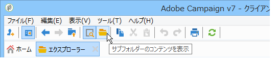

### リストの設定の保存 {#saving-a-list-configuration}

リストの設定は、ワークステーションレベルでローカルに定義されます。ローカルキャッシュがクリアされると、ローカルの設定が無効になります。

デフォルトでは、定義された表示パラメーターは、対応するフォルダータイプのすべてのリストに適用されます。したがって、受信者のリストがフォルダーからどのように表示されるかを変更すると、この設定は他のすべての受信者フォルダーに適用されます。

ただし、同じタイプの異なるフォルダーに適用される複数の設定を保存できます。設定は、データが含まれるフォルダーのプロパティとともに保存され、再適用できます。

例えば、「配信」フォルダーについて、次の表示を設定できます。

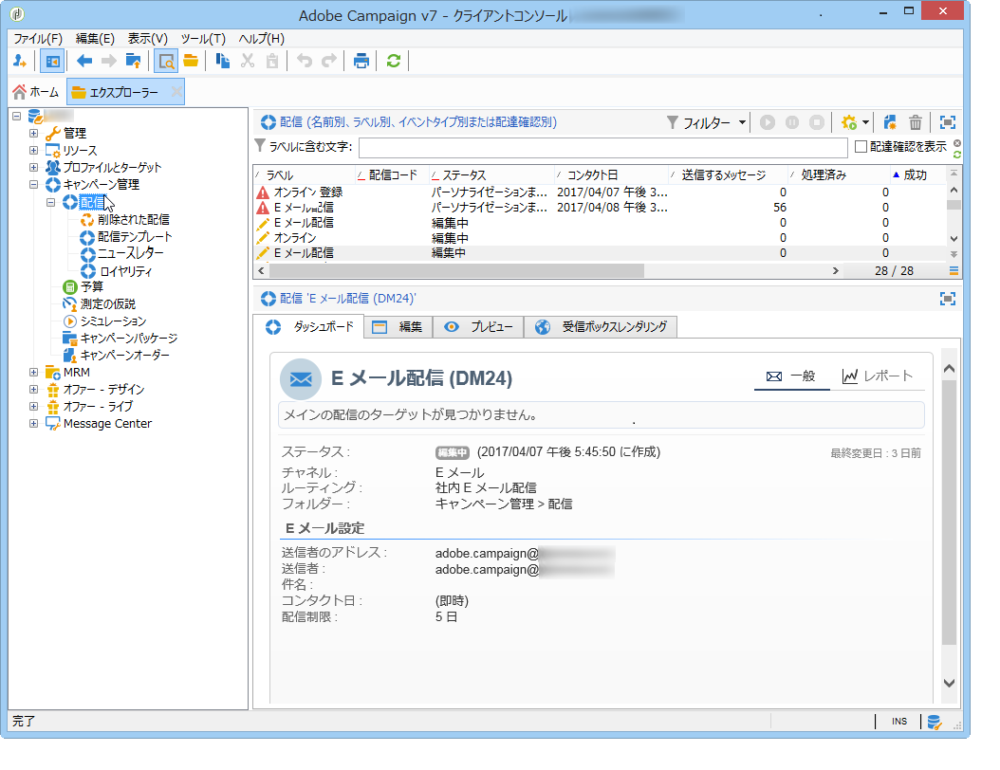

このリストの設定を保存して再利用するには、以下の手順に従います。

1. 表示されているデータを含むフォルダーを右クリックします。
1. 選択 **[!UICONTROL Properties]**.
1. をクリ **[!UICONTROL Advanced settings]** ックし、フィールドに名前を指定 **[!UICONTROL Configuration]** します。

   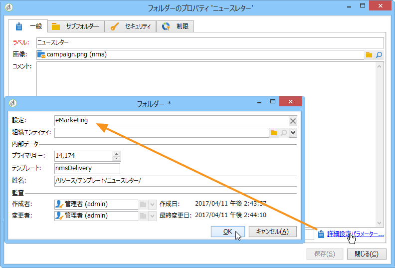

1. をクリック **[!UICONTROL OK]** し、をクリックしま **[!UICONTROL Save]**&#x200B;す。

この設定を別の「**配信**」フォルダーに適用できます。

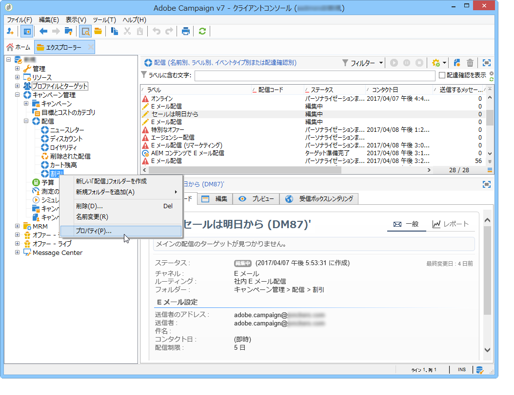

Click **[!UICONTROL Save]** in the folder properties window. リストの表示は、指定した設定と一致するように変更されます。

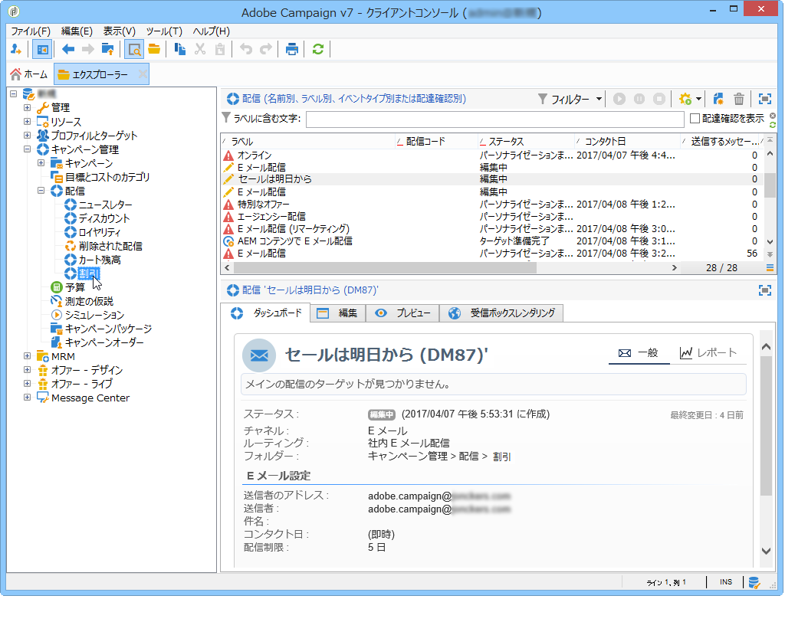

### リストのエクスポート {#exporting-a-list}

リストからデータをエクスポートするには、エクスポートウィザードを使用する必要があります。To access it, select the elements to be exported from the list, right-click and select **[!UICONTROL Export...]**.

インポート機能とエクスポート機能の使用については、「一般的なインポ [ートとエクスポート」で説明しま](../../platform/using/generic-imports-and-exports.md)す。

>[!CAUTION]
>
>リストの要素をコピーまたは貼り付け機能を使用してエクスポートしないでください。

### リストの並べ替え {#sorting-a-list}

リストに大量のデータが含まれている場合があります。これらのデータを並べ替えたり、標準フィルターまたは詳細フィルターを適用したりすることができます。並べ替えでは、データを昇順または降順で表示できます。フィルターでは、基準を定義または組み合わせて、選択したデータのみを表示できます。

列ヘッダーをクリックして、昇順または降順ソートを適用するか、データの並べ替えをキャンセルできます。アクティブな並べ替えステータスおよび並べ替え順は、列ラベルの前の青色の矢印で示されます。列ラベルの前の赤色のダッシュは、データベースからインデックス付けされたデータに並べ替えが適用されていることを意味します。この並べ替え方法は、並べ替えジョブを最適化するために使用されます。

並べ替えの設定をおこなったり、並べ替え基準を組み合わせることもできます。これをおこなうには、以下の手順に従います。

1. **[!UICONTROL Configure list]** リストの下と右。

   

1. In the list configuration window, click the **[!UICONTROL Sorting]** tab.
1. 並べ替えるフィールドと、並べ替えの順番（昇順または降順）を選択します。

   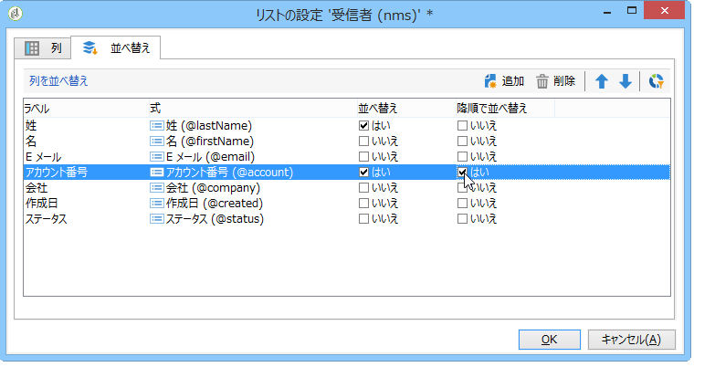

1. 並べ替えの優先順位は、並べ替え列の順序を使用して定義されます。優先順位を変更するには、適切なアイコンを使用して列の順序を変更します。

   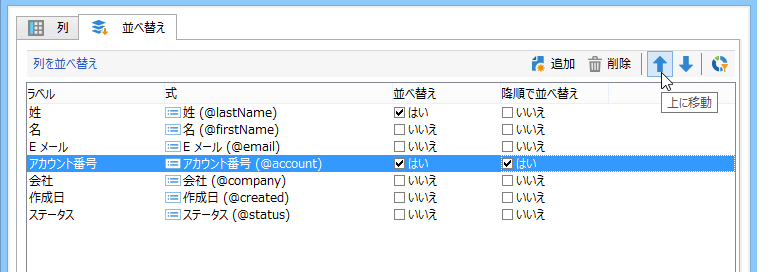

   並べ替えの優先順位は、リスト内の列の表示には影響しません。

1. 「**[!UICONTROL Ok]**」をクリックしてこの設定を確定し、リストで結果を表示します。

### 検索の実行 {#running-a-search}

You can run a search of the available fields in an editor using the **[!UICONTROL Search]** field located above the list of fields. キーボードの **Enter** キーを押すか、リストを参照します。検索と一致するフィールドは、太字のラベルになります。

>[!NOTE]
>
>フィルターを作成して、リストのデータの一部のみを表示できます。フィルターの [作成を参照してくださ](../../platform/using/creating-filters.md)い。

## フォーマットと単位 {#formats-and-units}

### 日時 {#date-and-time}

Adobe Campaign Classic インスタンスは、言語によって日時の形式が異なります。

言語は Campaign をインストールする際に選択し、後から変更することはできません。次を選択できます。英語（米国）、英語(EN)、フランス語、ドイツ語または日本語。 詳しくは、[このページ](../../installation/using/creating-an-instance-and-logging-on.md)を参照してください。

米国英語と英国英語の主な違いは次のとおりです。

<table> 
 <thead> 
  <tr> 
   <th> フォーマット  </th> 
   <th> 英語（米国）  </th> 
   <th> 英語（英国）  </th> 
  </tr> 
 </thead> 
 <tbody> 
  <tr> 
   <td> 日付  </td> 
   <td> 日曜日が週始め  </td> 
   <td> 月曜日が週始め  </td> 
  </tr> 
  <tr> 
   <td> 日付の短縮表記  </td> 
   <td> 
%2M/%2D/%4Y

<strong>例：09/25/2018</strong>
 </td> 
   <td> 
%2D/%2M/%4Y

<strong>例：25/09/2018</strong>
 </td> 
  </tr> 
  <tr> 
   <td> 日付と時刻の短縮表記  </td> 
   <td> 
%2M/%2D/%4Y %I:%2N:%2S %P

<strong>例：09/25/2018 10:47:25 PM</strong>
 </td> 
   <td> 
%2D/%2M/%4Y %2H:%2N:%2S

<strong>例：25/09/2018 22:47:25</strong>
 </td> 
  </tr> 
 </tbody> 
</table>

### 列挙での値の追加 {#add-values-in-an-enumeration}

ドロップダウンリストがある入力フィールドを使用して、列挙値を入力できます。この値は、保存してドロップダウンリストのオプションとして提供できます。For example, in the **[!UICONTROL City]** field of the **[!UICONTROL General]** tab of a recipient profile, you can enter London. Enter キーを押してこの値を確定すると、この値をフィールドに関連付けられた列挙に対して保存するかどうかを尋ねるメッセージが表示されます。

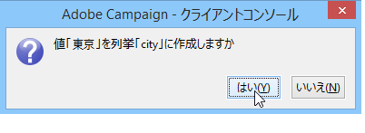

If you click **[!UICONTROL Yes]**, this value will be available in the combo box of the relevant field (in this case: **[!UICONTROL London]**).

>[!NOTE]
>
>Enumerations (also known as &#39;itemized lists&#39;) are managed by the administrator via the **[!UICONTROL Administration > Platform > Enumerations]** section. For more on this, refer to [Managing enumerations](../../platform/using/managing-enumerations.md).

### デフォルトの単位 {#default-units}

有効期間（配信のリソースの有効期間、タスクの承認期限など）を表すフィールドでは、値を次の&#x200B;**単位**&#x200B;で表すことができます。

* **[!UICONTROL s]** 数秒間
* **[!UICONTROL mn]** 数分間
* **[!UICONTROL h]** 何時間も
* **[!UICONTROL d]** 何日も

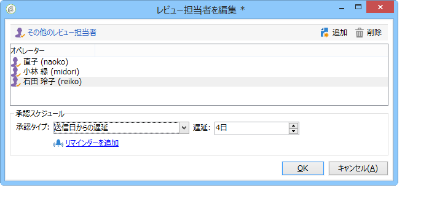

