# リストの作成および管理{#creating-and-managing-lists}

## Adobe Campaign でのリストについて {#about-lists-in-adobe-campaign}

リストは、配信アクションのターゲットにしたり、インポート操作時やワークフロー実行時に更新したりできるプロファイルの静的なセットです。例えば、クエリによってデータベースから抽出した母集団からリストを作成できます。

これらのリストを対象とした配信（E メール、SMS、またはその他のチャネルによる）を、許可型マーケティングの方針に従って設定できます。

リストは、タブのリンクを使用して作 **[!UICONTROL Lists]** 成および管理さ **[!UICONTROL Profiles and targets]** れます。

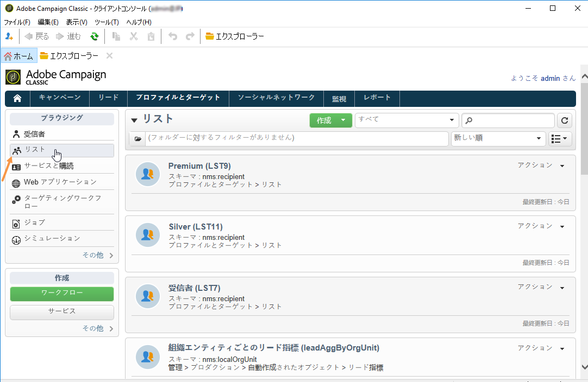

Adobe Campaign では、2 つのリストタイプを使用できます。

* **[!UICONTROL Group]** type:タイプ **[!UICONTROL Group]** リストは、特定の条件に従っ **て選択され** た人の静的リストに属します。 リストは、一連のプロファイルのスナップショットのようなものです。データベースにプロファイルが追加されても、リストが自動的に更新されることはありませんので、ご注意ください。

   For more information on how to create a **[!UICONTROL Group]** type list, refer to this [page](#creating-a-profile-list-from-a-group).

* **[!UICONTROL List]** type:タイプ **[!UICONTROL List]** リストを使用すると、ワークフローを使用してリストを作成および管理できます。 These will be specific lists resulting from data imports, that can be updated via the dedicated **[!UICONTROL List update]** workflow activity.

   Unlike the **[!UICONTROL Group]** type list, this type list can be automatically updated with a **[!UICONTROL Scheduler]** activity. Note that For an example on how to create **[!UICONTROL List]** type lists, refer to [this page](../../workflow/using/list-update.md).

## グループからのプロファイルリストの作成 {#creating-a-profile-list-from-a-group}

**[!UICONTROL Group]** リンクを介して作成されるタイプ **[!UICONTROL Profiles and targets]** リストは、デフォルトのAdobe Campaignプロファイルテーブル(nms:recipient)に基づいている必要があります。

>[!NOTE]
>
>他のタイプのデータを含むリストを作成するには、ワークフローを実行する必要があります。例えば、訪問者テーブルでクエリを使用してからリストを更新することによって、訪問者リストを作成できます。ワークフローについて詳しくは、[この節](../../workflow/using/about-workflows.md)を参照してください。

To create a new **[!UICONTROL Group]** type list, apply the following steps:

1. ボタンをクリ **[!UICONTROL Create]** ックし、を選択しま **[!UICONTROL New list]**&#x200B;す。

   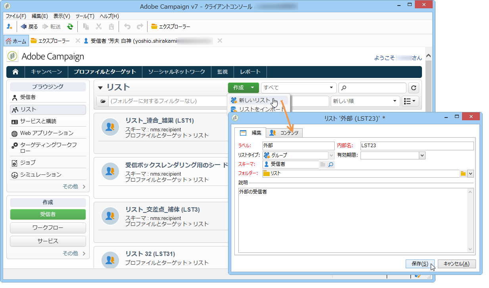

1. Enter the information in the **[!UICONTROL Edit]** tab of the list creation window.

   * Enter the list name in the **[!UICONTROL Label]** field and, if necessary, change the internal name.
   * このリストの説明を入力します。
   * 有効期限を指定できます。この日付に達すると、リストはパージされ自動的に削除されます。

      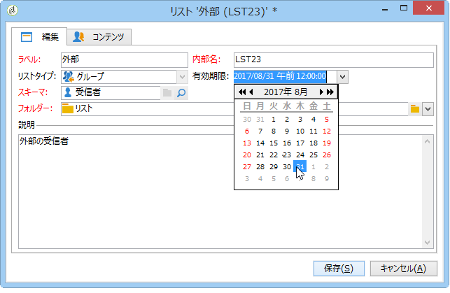

1. In the **[!UICONTROL Content]** tab, click **[!UICONTROL Add]** to select the profiles belonging to the list.

   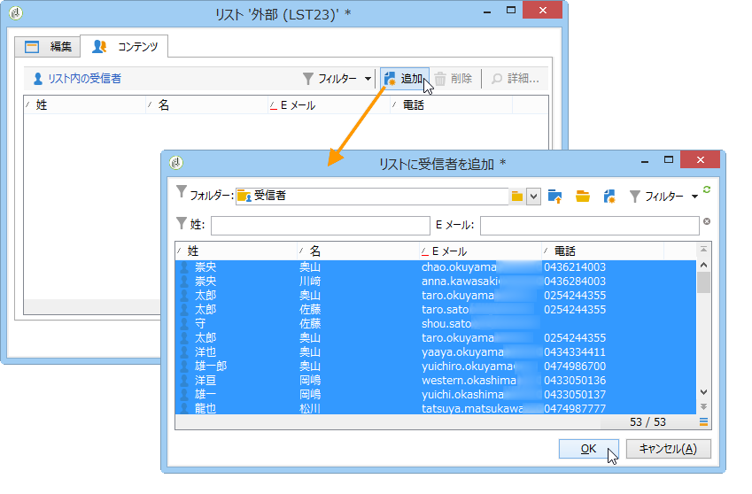

1. Click **[!UICONTROL Save]** to save the list. リストの概要にリストが追加されます。

You can create new profiles directly from the &#39;add profiles&#39; window by clicking **[!UICONTROL Create]**. プロファイルはデータベースに追加されます。

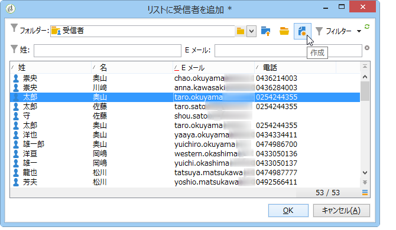

プロファイルリストは、他のリストと同様に設定できます。詳しくは、リ [ストの設定を参照してくださ](../../platform/using/adobe-campaign-workspace.md#configuring-lists)い。

## リストへのデータのリンク {#linking-data-to-a-list}

>[!NOTE]
>
>Linking data to a list can only been done with a **[!UICONTROL Group]** type list.

一連のプロファイルをフィルターしてリストにリンクすることができます。配信アクションをこのリスト、つまりターゲットプロファイルに送信できます。プロファイルをグループ化するには、以下の手順に従います。

1. プロファイルを選択して、右クリックします。
1. 選択 **[!UICONTROL Actions > Associate selection with a list...]**.

   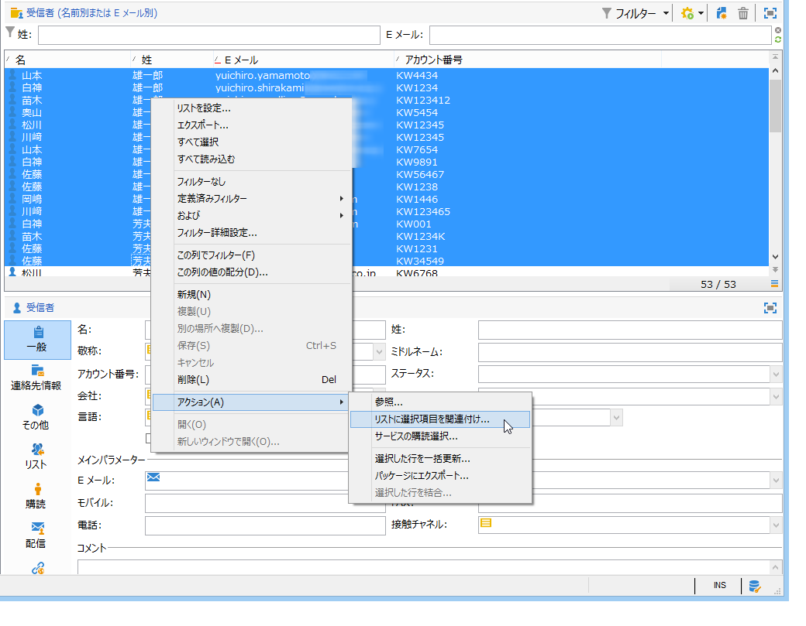

1. Select the desired list or create a new list using the **[!UICONTROL Create]** button, then click **[!UICONTROL Next]**.

   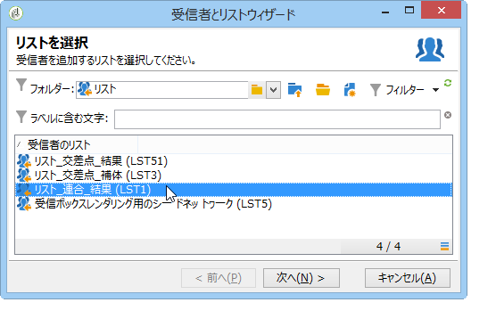

1. ボタンをクリッ **[!UICONTROL Start]** クします。

   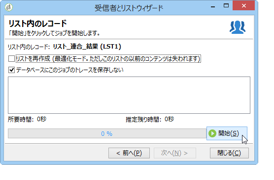

このオプ **[!UICONTROL Recreate the list]** ションは、以前のコンテンツをリストから削除します。 プロファイルが既にリストにリンクされているかどうかを検証するためのクエリが不要なので、このモードは最適化されています。

このオプションのチェ **[!UICONTROL No trace of this job is saved in the database]** ックを外すと、このプロセスにリンクされた情報を保存する実行フォルダーを選択（または作成）できます。

ウィンドウの上部セクションで実行を監視できます。The **[!UICONTROL Stop]** button lets you stop the process. 既に処理された連絡先がリストにリンクされます。

You can monitor the process via the **[!UICONTROL Lists]** tab on the profiles concerned by this operation:

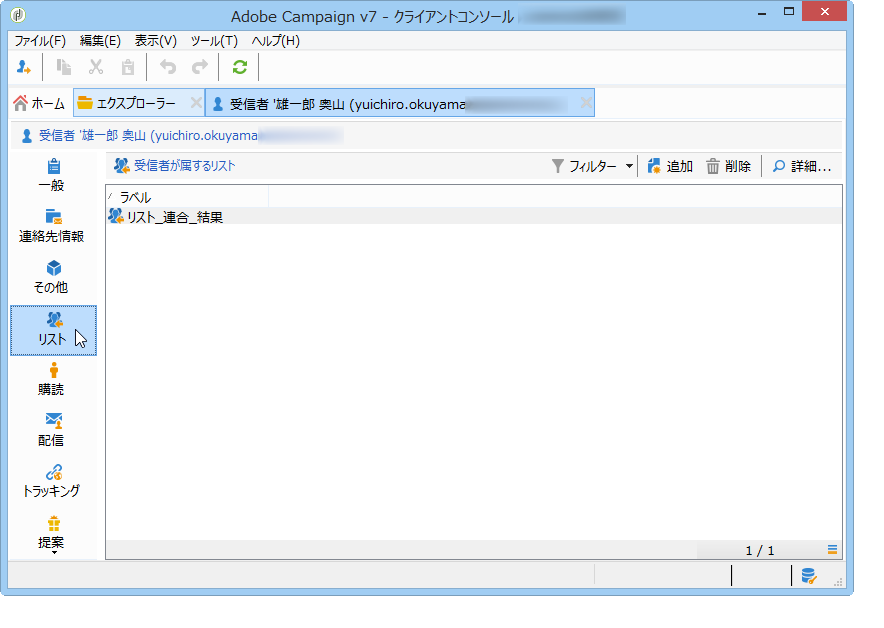

You can also edit the list via the Adobe Campaign home page: click the **[!UICONTROL Profiles and Targets > Lists]** menu and select the concerned list. The **[!UICONTROL Content]** tab shows the profiles linked to this list.

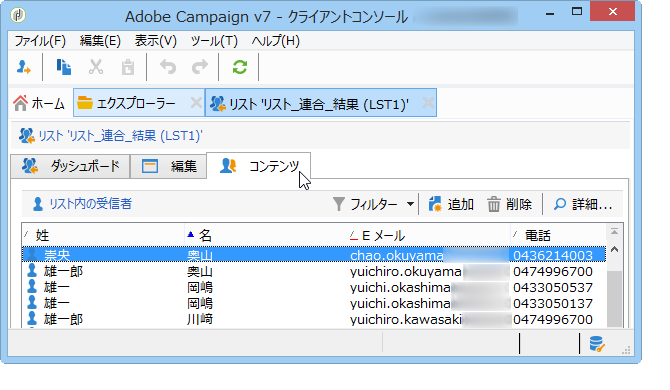

## リストからのプロファイルの削除 {#removing-a-profile-from-a-list}

次の操作で、リストからプロファイルを削除することができます。

* Edit the list, select the profile in the **[!UICONTROL Content]** tab, then click the **[!UICONTROL Delete]** icon.

   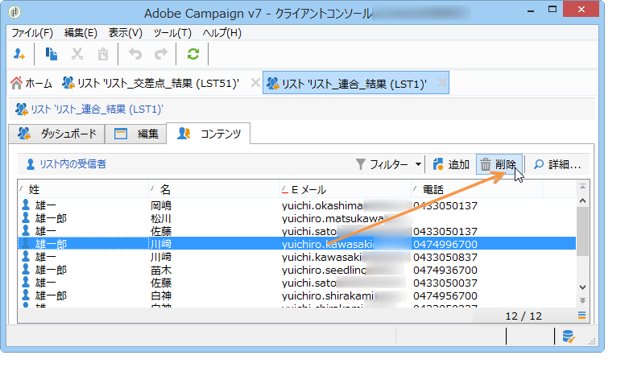

* Edit the profile, click the **[!UICONTROL List]** tab, then click the **[!UICONTROL Delete]** icon.

   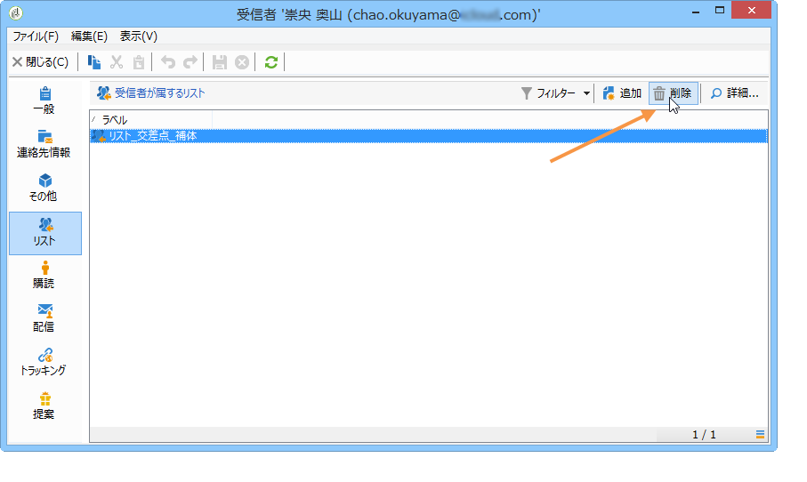

## プロファイルリストの削除 {#deleting-a-list-of-profiles}

Adobe Campaign ツリーのグループリストから 1 つ以上のリストを削除できます。To do this, edit the tree via the **[!UICONTROL Advanced > Explorer]** link in the Adobe Campaign home page. 該当するグループを選択して右クリックします。選択 **[!UICONTROL Delete]**. 削除を確定するよう求める警告メッセージが表示されます。

>[!NOTE]
>
>リストを削除した場合、リストのプロファイルは影響を受けませんが、プロファイルのデータは更新されます。

