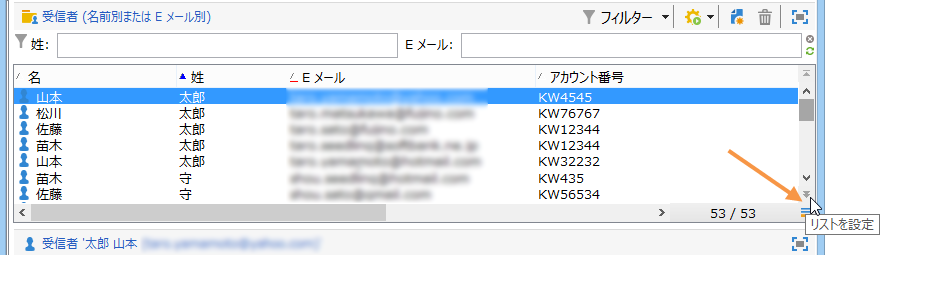
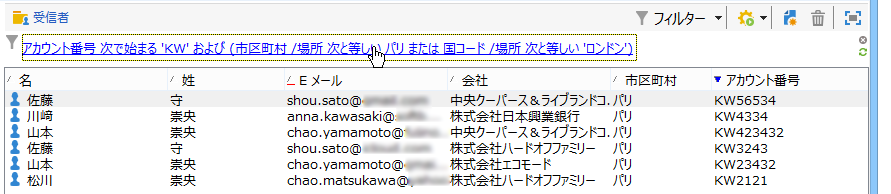
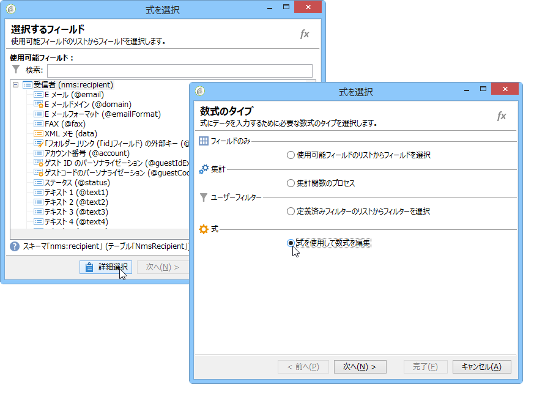

# フィルターの作成{#creating-filters}

## はじめに {#introduction}

When you navigate in the Adobe Campaign tree (from the **[!UICONTROL Explorer]** menu in the home page), the data contained in the database is displayed in lists. これらのリストは、オペレーターが必要とするデータのみが表示されるように設定できます。これにより、フィルターされたデータに対してアクションを起動できます。Filter configuration lets you select data from a list **[!UICONTROL dynamically]**. データが変更されると、フィルターされたデータは更新されます。

>[!NOTE]
>
>表示設定は、ワークステーションレベルでローカルに定義されます。これは非表示のファイルに保存されていますが、このデータのクリーンアップが必要になることがあります（特に、データの更新時に問題が発生した場合）。これを行うには、メニューを使用 **[!UICONTROL File > Clear the local cache]** します。

## 使用可能なフィルターのタイポロジ {#typology-of-available-filters}

Adobe Campaign では、データリストにフィルターを適用できます。

これらのフィルターは、1 回だけ使用したり、今後の使用のために保存したりすることができます。複数のフィルターを同時に適用できます。

Adobe Campaign では、次のフィルタータイプを使用できます。

* デフォルトのフィルター

   **デフォルトのフィルター**&#x200B;には、リストの上にあるフィールドからアクセスできます。定義済みのフィールドをフィルターできます（受信者プロファイルの場合、デフォルトでは名前および E メールアドレスです）。フィールドを使用して、フィルターする文字を入力するか、ドロップダウンリストからフィルター条件を選択します。

   
<!--
  >[!NOTE]
  >
  >The **%** character replaces any character string. For example, the string `%@yahoo.com` lets you display all the profiles with an e-mail address in the domain "yahoo.com".
-->
リストのデフォルトのフィルターを変更できます。詳しくは、デフォルトフィルターの変 [更を参照してください](#altering-the-default-filter)。

* 標準フィルター

   **標準フィルター**&#x200B;は、列に対する 1 回限りのフィルターです。表示される列に対する 1 つ以上の単純な検索基準を使用して定義されます。

   同じデータリストに対して複数の標準フィルターを組み合わせて、検索を絞り込むことができます。フィルターフィールドは上下に並んで表示されます。これらは、それぞれ個別に削除できます。

   

   シンプルフィルターについて詳しくは、シン [プルフィルターの作成を参照してくださ](#creating-a-simple-filter)い。

* 詳細フィルター

   **詳細フィルター**&#x200B;は、データに対する単一のクエリや連結したクエリを使用して作成されます。

   アドバンスフィルターの作成について詳しくは、「アドバンスフィ [ルターの作成」を参照してくださ](#creating-an-advanced-filter)い。

   関数を使用してフィルターのコンテンツを定義できます。詳しくは、「関数を使用したアドバンスフ [ィルターの作成」を参照してください](#creating-an-advanced-filter-with-functions)。

   >[!NOTE]
   >
   >Adobe Campaign でのクエリの作成について詳しくは、[この節](../../platform/using/about-queries-in-campaign.md)を参照してください。

* ユーザーフィルター

   **アプリケーションフィルター**&#x200B;は、その設定を他のオペレーターと使用および共有するために保存された詳細フィルターです。

   The **[!UICONTROL Filters]** button located above the lists offers a set of application filters that can be combined to refine the filtering. The method for creating these filters is presented in [Saving a filter](#saving-a-filter).

## デフォルトのフィルターの変更 {#altering-the-default-filter}

受信者リストの既定のフィルタを変更するには、ツリーのノ **[!UICONTROL Profiles and Targets > Pre-defined filters]** ードをクリックします。

For all other types of data, configure the default filter via the **[!UICONTROL Administration > Configuration > Predefined filters]** node.

次の手順に従います。

1. デフォルトで使用するフィルターを選択します。
1. タブをクリッ **[!UICONTROL Parameters]** クし、を選択しま **[!UICONTROL Default filter for the associated document type]**&#x200B;す。

   

   >[!CAUTION]
   >
   >デフォルトのフィルターが既にリストに適用されている場合は、新しいフィルターを適用する前に無効にする必要があります。そのためには、フィルターフィールドの右側にある赤色のバツ印をクリックします。

1. Click **[!UICONTROL Save]** to apply the filter.

   >[!NOTE]
   >
   >フィルター定義ウィンドウの詳細は、アドバ [ンスフィルターの作成](#creating-an-advanced-filter) とフ [ィルターの保存です](#saving-a-filter)。

## 標準フィルターの作成 {#creating-a-simple-filter}

**標準フィルター**&#x200B;を作成するには、次の手順に従います。

1. フィルタリングするフィールドを右クリックし、選択しま **[!UICONTROL Filter on this field]**&#x200B;す。

   

   デフォルトのフィルターフィールドがリストの上に表示されます。

1. ドロップダウンリストからフィルターオプションを選択するか、適用するフィルター基準を入力します（基準を選択または入力する方法は、テキスト、列挙などのフィールドのタイプによって異なります）。

   

1. フィルターを有効化するには、キーボードの Enter キーを押すか、フィルターフィールドの右側にある緑色の矢印をクリックします。

データをフィルターするフィールドがプロファイルのフォームに表示されていない場合、表示される列にそのフィールドを追加すると、その列でフィルターできます。手順は次のとおりです。

1. アイコンをクリッ **[!UICONTROL Configure the list]** クします。

   

1. 表示される列を選択します（例えば、受信者の年齢）。

   

1. 受信者リストの **Age** （年齢）列を右クリックし、を選択します **[!UICONTROL Filter on this column]**。

   

   年齢のフィルターオプションを選択できるようになります。

   

## 詳細フィルターの作成 {#creating-an-advanced-filter}

**詳細フィルター**&#x200B;を作成するには、次の手順に従います。

1. ボタンをクリ **[!UICONTROL Filters]** ックし、を選択しま **[!UICONTROL Advanced filter...]**&#x200B;す。

   

   You can also right-click the list of data to filter and select **[!UICONTROL Advanced filter...]**.

   フィルター条件定義ウィンドウが表示されます。

1. Click the **[!UICONTROL Expression]** column to define the input value.
1. Click **[!UICONTROL Edit expression]** to select the field to which the filter will be applied.

   

1. リストから、データをフィルターする基準となるフィールドを選択します。Click **[!UICONTROL Finish]** to confirm.
1. Click the **[!UICONTROL Operator]** column and select the operator to be applied from the drop-down list.
1. Select an expected value from the **[!UICONTROL Value]** column. 複数のフィルターを組み合わせてクエリを絞り込むことができます。To add a filter condition, click **[!UICONTROL Add]**.

   

1. 式に階層を割り当てたり、ツールバーの矢印を使用してクエリ式の順序を変更したりすることができます。
1. 式の間のデフォルトの演算子は「**および**」ですが、これはフィールドをクリックすることで変更できます。「**または**」演算子を選択できます。

   

1. 「**[!UICONTROL OK]**」をクリックしてフィルター作成を確定し、リストに適用します。

適用されるフィルターがリストの上に表示されます。

このフィルターを編集または変更するには、そのラベルをクリックします。

To cancel this filter, click the **[!UICONTROL Remove this filter]** icon to the right of the filter.

詳細フィルターを保存して、今後の使用のために保持できます。For further information about this type of filter, see [Saving a filter](#saving-a-filter).

### 関数を使用した詳細フィルターの作成 {#creating-an-advanced-filter-with-functions}

詳細フィルターでは関数を使用できます。**関数を使用したフィルター**&#x200B;は式エディターを使用して作成されますが、式エディターでは、データベースデータと高度な関数を使用して数式を作成できます。関数を使用してフィルターを作成するには、詳細フィルターの作成手順の 1、2 および 3 を繰り返してから、次の手順に従います。

1. In the field selection window, click **[!UICONTROL Advanced selection]**.
1. 使用する数式のタイプ（集計、既存のユーザーフィルターまたは式）を選択します。

   

   次のオプションを使用できます。

   * **[!UICONTROL Field only]** フィールドを選択します。 これはデフォルトのモードです。
   * **[!UICONTROL Aggregate]** をクリックして、使用する集計式（数、合計、平均、最大、最小）を選択します。
   * **[!UICONTROL User filter]** をクリックして、既存のユーザーフィルターの1つを選択します。 ユーザーフィルターについて詳しくは、 [フィルターの保存を参照してくださ](#saving-a-filter)い。
   * **[!UICONTROL Expression]** をクリックして、式エディターにアクセスします。

      式エディターでは、詳細フィルターを定義できます。次のような画面です。

      

      データベーステーブル内のフィールドを選択し、それらに高度な機能を追加できます。で使用する関数を選択します **[!UICONTROL List of functions]**。 使用できる関数は、関数のリス [トで詳しく説明します](../../platform/using/defining-filter-conditions.md#list-of-functions)。 次に、関数の対象となるフィールド（複数可）を選択し、「**[!UICONTROL OK]**」をクリックして式を承認します。

      >[!NOTE]
      >
      >式に基づくフィルターの作成の例については、[その日が誕生日の受信者の識別](../../workflow/using/sending-a-birthday-email.md#identifying-recipients-whose-birthday-it-is)を参照してください。

## フィルターの保存 {#saving-a-filter}

フィルターは各オペレーター専用であり、オペレーターがクライアントコンソールのキャッシュをクリアするたびに再初期化されます。

You can create an **application filter** by saving an advanced filter: it can be re-used by right-clicking in any list or via the **[!UICONTROL Filters]** button located above the lists.

これらのフィルターには、配信ウィザードのターゲット選択ステージで直接アクセスすることもできます（配信の作成について詳しくは、[この節](../../delivery/using/creating-an-email-delivery.md)を参照してください）。アプリケーションフィルターを作成するには、次の操作をおこなうことができます。

* 詳細フィルターをアプリケーションフィルターに変換します。To do this, click **[!UICONTROL Save]** before closing the advanced filter editor.

   

* ツリーの（または受信者用の）ノ **[!UICONTROL Administration > Configuration > Predefined filters]** ードを使用して、こ **[!UICONTROL Profiles and targets > Predefined filters]** のアプリケーションフィルターを作成します。 To do this, right-click the list of filters, and select **[!UICONTROL New...]**. 手順は、詳細フィルターを作成する場合と同じです。

   The **[!UICONTROL Label]** field enables you to name this filter. This name will appear in the combo box of the **[!UICONTROL Filters...]** button.

   

You can delete all filters on the current list by right-clicking and selecting **[!UICONTROL No filter]** or via the **[!UICONTROL Filters]** icon located above the list.

You can combine filters by clicking the **[!UICONTROL Filters]** button and using the **[!UICONTROL And...]** menu.

## 受信者のフィルター {#filtering-recipients}

Predefined filters (see [Saving a filter](#saving-a-filter)) enable you to filter the profiles of recipients contained in the database. ツリーのノードからフィルタ **[!UICONTROL Profiles and Targets > Predefined filters]** ーを編集できます。 The filters are listed in the upper section of the workspace, via the **[!UICONTROL Filters]** button.

フィルターを選択してその定義を表示し、フィルターされたデータのプレビューにアクセスします。

>[!NOTE]
>
>For a detailed example of predefined filter creation, refer to [Use case](../../platform/using/use-case.md).

定義済みフィルターは、次のとおりです。

<table> 
 <tbody> 
  <tr> 
   <td> <strong>ラベル</strong>  </td> 
   <td> <strong>クエリ</strong>  </td> 
  </tr> 
  <tr> 
   <td> 開封済み  </td> 
   <td> 配信を開封した受信者を選択します。  </td> 
  </tr> 
  <tr> 
   <td> 開封したがクリックしなかった  </td> 
   <td> 配信を開封したがリンクをクリックしていなかった受信者を選択します。  </td> 
  </tr> 
  <tr> 
   <td> アクティブでない受信者  </td> 
   <td> 配信を X ヶ月間開封していない受信者を選択します。  </td> 
  </tr> 
  <tr> 
   <td> デバイスタイプ別の最後のアクティビティ  </td> 
   <td> 過去 Z 日間にデバイス X を使用して配信 Y をクリックしたか開封した受信者を選択します。  </td> 
  </tr> 
  <tr> 
   <td> デバイスタイプ別の最後のアクティビティ（トラッキング）  </td> 
   <td> 過去 Z 日間にデバイス X を使用して配信 Y をクリックしたか開封した受信者を選択します。  </td> 
  </tr> 
  <tr> 
   <td> ターゲット解除された受信者  </td> 
   <td> チャネル Y 経由で X ヶ月間ターゲットとされていない受信者を選択します。  </td> 
  </tr> 
  <tr> 
   <td> 非常にアクティブな受信者  </td> 
   <td> 過去 Y ヶ月間に少なくとも X 回、配信内でクリックした受信者を選択します。  </td> 
  </tr> 
  <tr> 
   <td> ブラックリストに登録された E メールアドレス  </td> 
   <td> E メールアドレスがブラックリストに登録されている受信者を選択します。  </td> 
  </tr> 
  <tr> 
   <td> 強制隔離された E メールアドレス  </td> 
   <td> E メールアドレスが強制隔離されている受信者を選択します。  </td> 
  </tr> 
  <tr> 
   <td> フォルダー内で重複する E メールアドレス  </td> 
   <td> フォルダー内で E メールアドレスが重複している受信者を選択します。  </td> 
  </tr> 
  <tr> 
   <td> 開封もクリックもなし  </td> 
   <td> 配信を開封していなくかつ配信内でクリックもしていない受信者を選択します。  </td> 
  </tr> 
  <tr> 
   <td> 新しい受信者（日数）  </td> 
   <td> 過去 X 日間に作成された受信者を選択します。  </td> 
  </tr> 
  <tr> 
   <td> 新しい受信者（分）  </td> 
   <td> 過去 X 分間に作成された受信者を選択します。  </td> 
  </tr> 
  <tr> 
   <td> 新しい受信者（月）  </td> 
   <td> 過去 X ヶ月間に作成された受信者を選択します。  </td> 
  </tr> 
  <tr> 
   <td> 購読  </td> 
   <td> 購読別に受信者を選択します。  </td> 
  </tr> 
  <tr> 
   <td> 特定のリンクをクリックする  </td> 
   <td> 配信内の特定の URL をクリックした受信者を選択します。  </td> 
  </tr> 
  <tr> 
   <td> 配信後の行動別  </td> 
   <td> 配信の受信後の行動に従って受信者を選択します。  </td> 
  </tr> 
  <tr> 
   <td> 作成日別  </td> 
   <td> X ヶ月（現在の日付 - n ヶ月）から Y ヶ月（現在の日付 - n ヶ月）までの期間で、作成日別に受信者を選択します。  </td> 
  </tr> 
  <tr> 
   <td> リスト別  </td> 
   <td> リスト別に受信者を選択します。  </td> 
  </tr> 
  <tr> 
   <td> クリック数別  </td> 
   <td> 過去 X ヶ月間に配信内でクリックした受信者を選択します。  </td> 
  </tr> 
  <tr> 
   <td> 受信したメッセージ数別  </td> 
   <td> 受信したメッセージ数に従って受信者を選択します。  </td> 
  </tr> 
  <tr> 
   <td> 開封数別  </td> 
   <td> Z の期間で X 件から Y 件の配信を開封した受信者を選択します。  </td> 
  </tr> 
  <tr> 
   <td> 名前別または E メール別  </td> 
   <td> 名前または E メールに従って受信者を選択します。  </td> 
  </tr> 
  <tr> 
   <td> 年齢層別  </td> 
   <td> 年齢に従って受信者を選択します。  </td> 
  </tr> 
 </tbody> 
</table>

>[!NOTE]
>
>数および期間に関する条件式は、より広範囲な数値定義になっています（クエリの上限／下限として設定された数値に一致する受信者は、その条件式に含まれます）。

データの計算方法の例：

* 30 歳以下の受信者を選択します。

   

* 18 歳以上の受信者を選択します。

   

* 18 歳から 30 歳までの受信者を選択します。

   

## データフィルターの詳細設定 {#advanced-settings-for-data-filters}

Click the **[!UICONTROL Settings]** tab to access the following options:

* **[!UICONTROL Default filter for the associated document type]**:このオプションを使用すると、デフォルトでこのフィルターをソートに関連するリストのエディターで提案できます。

   例えば、フィルターは **[!UICONTROL By name or login]** 演算子に適用されます。 このオプションを選択すると、このフィルターがすべてのオペレーターリストで常に利用できます。

* **[!UICONTROL Filter shared with other operators]**:このオプションを使用すると、現在のデータベースの他のすべての演算子でフィルターを使用できます。
* **[!UICONTROL Use parameter entry form]**:このオプションを使用すると、このフィルターが選択されている場合にリストの上に表示されるフィルターフィールドを定義できます。 これらのフィールドでフィルター設定を定義できます。This form must be entered in XML format via the **[!UICONTROL Form]** button. For example, the preconfigured filter **[!UICONTROL Recipients who have opened]**, available from the recipients list, displays a filter field that lets you select the delivery at which the filter is aimed.

   The **[!UICONTROL Preview]** button displays the result of the selected filter.

* The **[!UICONTROL Advanced parameters]** link lets you define additional settings. 特に、SQL テーブルをフィルターに関連付けて、そのテーブルを共有するすべてのエディターでそのフィルターを共通にすることができます。

   このフィルタ **[!UICONTROL Do not restrict the filter]** ーの上書きをユーザーが停止する場合は、このオプションを選択します。

   このオプションは、配信ウィザードで提供される多重定義できない「配信の受信者」および「フォルダーに属する配信の受信者」フィルターに対して有効です。

   

