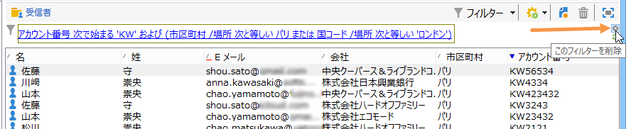

# フィルターの作成{#creating-filters}

## はじめに {#introduction}

ホームページの&#x200B;**[!UICONTROL エクスプローラー]**&#x200B;メニューから Adobe Campaign ツリー内を移動すると、データベースに含まれているデータがリストに表示されます。これらのリストは、オペレーターが必要とするデータのみが表示されるように設定できます。これにより、フィルターされたデータに対してアクションを起動できます。フィルター設定を使用すると、リストから&#x200B;**[!UICONTROL 動的に]**&#x200B;データを選択できます。データが変更されると、フィルターされたデータは更新されます。

>[!NOTE]
>
>表示設定は、ワークステーションレベルでローカルに定義されます。これは非表示のファイルに保存されていますが、このデータのクリーンアップが必要になることがあります（特に、データの更新時に問題が発生した場合）。そのためには、**[!UICONTROL ファイル／ローカルキャッシュをクリア]**&#x200B;メニューを使用します。

## 使用可能なフィルターのタイポロジ {#typology-of-available-filters}

Adobe Campaign では、データリストにフィルターを適用できます。

これらのフィルターは、1 回だけ使用したり、今後の使用のために保存したりすることができます。複数のフィルターを同時に適用できます。

Adobe Campaign では、次のフィルタータイプを使用できます。

* デフォルトのフィルター

   **デフォルトのフィルター**&#x200B;には、リストの上にあるフィールドからアクセスできます。定義済みのフィールドをフィルターできます（受信者プロファイルの場合、デフォルトでは名前および E メールアドレスです）。フィールドを使用して、フィルターする文字を入力するか、ドロップダウンリストからフィルター条件を選択します。

   
<!--
  >[!NOTE]
  >
  >The **%** character replaces any character string. For example, the string `%@yahoo.com` lets you display all the profiles with an e-mail address in the domain "yahoo.com".
-->
リストのデフォルトのフィルターを変更できます。詳しくは、[デフォルトのフィルターの変更](#altering-the-default-filter)を参照してください。

* 標準フィルター

   **標準フィルター**&#x200B;は、列に対する 1 回限りのフィルターです。表示される列に対する 1 つ以上の単純な検索基準を使用して定義されます。

   同じデータリストに対して複数の標準フィルターを組み合わせて、検索を絞り込むことができます。フィルターフィールドは上下に並んで表示されます。これらは、それぞれ個別に削除できます。

   

   標準フィルターについて詳しくは、[標準フィルターの作成](#creating-a-simple-filter)で説明しています。

* 詳細フィルター

   **詳細フィルター**&#x200B;は、データに対する単一のクエリや連結したクエリを使用して作成されます。

   詳細フィルターの作成について詳しくは、[詳細フィルターの作成](#creating-an-advanced-filter)を参照してください。

   関数を使用してフィルターのコンテンツを定義できます。詳しくは、[関数を使用した詳細フィルターの作成](#creating-an-advanced-filter-with-functions)を参照してください。

   >[!NOTE]
   >
   >Adobe Campaign でのクエリの作成について詳しくは、[この節](../../platform/using/about-queries-in-campaign.md)を参照してください。

* ユーザーフィルター

   **アプリケーションフィルター**&#x200B;は、その設定を他のオペレーターと使用および共有するために保存された詳細フィルターです。

   リストの上にある「**[!UICONTROL フィルター]**」ボタンを使用すると、組み合わせてフィルターを絞り込むことができる一連のアプリケーションフィルターが表示されます。これらのフィルターを作成する方法については、[フィルターの保存](#saving-a-filter)で説明しています。

## デフォルトのフィルターの変更 {#altering-the-default-filter}

受信者リストのデフォルトのフィルターを変更するには、ツリーの&#x200B;**[!UICONTROL プロファイルとターゲット／定義済みフィルター]**&#x200B;ノードをクリックします。

その他のすべてのタイプのデータについては、**[!UICONTROL 管理／設定／定義済みフィルター]**&#x200B;ノードを使用してデフォルトのフィルターを設定します。

次の手順に従います。

1. デフォルトで使用するフィルターを選択します。
1. 「**[!UICONTROL パラメーター]**」タブをクリックし、「**[!UICONTROL 関連付けられたドキュメントタイプのデフォルトのフィルター]**」を選択します。

   

   >[!CAUTION]
   >
   >デフォルトのフィルターが既にリストに適用されている場合は、新しいフィルターを適用する前に無効にする必要があります。そのためには、フィルターフィールドの右側にある赤色のバツ印をクリックします。

1. 「**[!UICONTROL 保存]**」をクリックしてフィルターを適用します。

   >[!NOTE]
   >
   >フィルター定義ウィンドウについて詳しくは、[詳細フィルターの作成](#creating-an-advanced-filter)および[フィルターの保存](#saving-a-filter)で説明しています。

## 標準フィルターの作成 {#creating-a-simple-filter}

**標準フィルター**&#x200B;を作成するには、次の手順に従います。

1. フィルターするフィールドを右クリックし、「**[!UICONTROL このフィールドでフィルター]**」を選択します。

   

   デフォルトのフィルターフィールドがリストの上に表示されます。

1. ドロップダウンリストからフィルターオプションを選択するか、適用するフィルター基準を入力します（基準を選択または入力する方法は、テキスト、列挙などのフィールドのタイプによって異なります）。

   

1. フィルターを有効化するには、キーボードの Enter キーを押すか、フィルターフィールドの右側にある緑色の矢印をクリックします。

データをフィルターするフィールドがプロファイルのフォームに表示されていない場合、表示される列にそのフィールドを追加すると、その列でフィルターできます。手順は次のとおりです。

1. **[!UICONTROL リストを設定]**&#x200B;アイコンをクリックします。

   

1. 表示される列を選択します（例えば、受信者の年齢）。

   

1. 受信者リストで「**年齢**」列を右クリックし、「**[!UICONTROL この列でフィルター]**」を選択します。

   

   年齢のフィルターオプションを選択できるようになります。

   

## 詳細フィルターの作成 {#creating-an-advanced-filter}

**詳細フィルター**&#x200B;を作成するには、次の手順に従います。

1. 「**[!UICONTROL フィルター]**」ボタンをクリックして、「**[!UICONTROL 詳細フィルター...]**」を選択します。

   

   フィルターするデータのリストを右クリックして、「**[!UICONTROL 詳細フィルター...]**」を選択することもできます。

   フィルター条件定義ウィンドウが表示されます。

1. 「**[!UICONTROL 式]**」列をクリックして、入力値を定義します。
1. **[!UICONTROL 式を編集]**&#x200B;をクリックして、フィルターを適用するフィールドを選択します。

   

1. リストから、データをフィルターする基準となるフィールドを選択します。「**[!UICONTROL 完了]**」をクリックして確定します。
1. 「**[!UICONTROL 演算子]**」列をクリックして、適用する演算子をドロップダウンリストから選択します。
1. 期待される値を「**[!UICONTROL 値]**」列から選択します。複数のフィルターを組み合わせてクエリを絞り込むことができます。フィルター条件を追加するには、「**[!UICONTROL 追加]**」をクリックします。

   

1. 式に階層を割り当てたり、ツールバーの矢印を使用してクエリ式の順序を変更したりすることができます。
1. 式の間のデフォルトの演算子は「**および**」ですが、これはフィールドをクリックすることで変更できます。「**または**」演算子を選択できます。

   

1. 「**[!UICONTROL OK]**」をクリックしてフィルター作成を確定し、リストに適用します。

適用されるフィルターがリストの上に表示されます。

このフィルターを編集または変更するには、そのラベルをクリックします。

このフィルターをキャンセルするには、フィルターの右側にある&#x200B;**[!UICONTROL このフィルターを削除]**&#x200B;アイコンをクリックします。

詳細フィルターを保存して、今後の使用のために保持できます。このタイプのフィルターについて詳しくは、[フィルターの保存](#saving-a-filter)を参照してください。

### 関数を使用した詳細フィルターの作成 {#creating-an-advanced-filter-with-functions}

詳細フィルターでは関数を使用できます。**関数を使用したフィルター**&#x200B;は式エディターを使用して作成されますが、式エディターでは、データベースデータと高度な関数を使用して数式を作成できます。関数を使用してフィルターを作成するには、詳細フィルターの作成手順の 1、2 および 3 を繰り返してから、次の手順に従います。

1. フィールドの選択ウィンドウで、「**[!UICONTROL 詳細選択]**」をクリックします。
1. 使用する数式のタイプ（集計、既存のユーザーフィルターまたは式）を選択します。

   

   次のオプションを使用できます。

   * 「**[!UICONTROL フィールドのみ]**」は、フィールドを選択する場合に使用します。これはデフォルトのモードです。
   * 「**[!UICONTROL 集計]**」は、使用する集計数式（カウント、合計、平均、最大、最小）を選択する場合に使用します。
   * 「**[!UICONTROL ユーザーフィルター]**」は、既存のユーザーフィルターのいずれかを選択する場合に使用します。ユーザーフィルターについて詳しくは、[フィルターの保存](#saving-a-filter)で説明しています。
   * 「**[!UICONTROL 式]**」は、式エディターにアクセスする場合に使用します。

      式エディターでは、詳細フィルターを定義できます。次のような画面です。

      

      データベーステーブル内のフィールドを選択し、それらに高度な機能を追加できます。**[!UICONTROL 関数のリスト]**&#x200B;で使用する関数を選択します。使用できる関数について詳しくは、[関数のリスト](../../platform/using/defining-filter-conditions.md#list-of-functions)で説明しています。次に、関数の対象となるフィールド（複数可）を選択し、「**[!UICONTROL OK]**」をクリックして式を承認します。

      >[!NOTE]
      >
      >式に基づくフィルターの作成の例については、[その日が誕生日の受信者の識別](../../workflow/using/sending-a-birthday-email.md#identifying-recipients-whose-birthday-it-is)を参照してください。

## フィルターの保存 {#saving-a-filter}

フィルターは各オペレーター専用であり、オペレーターがクライアントコンソールのキャッシュをクリアするたびに再初期化されます。

詳細フィルターを保存することによって、**アプリケーションフィルター**&#x200B;を作成できます。アプリケーションフィルターは、リスト内を右クリックするか、リストの上にある「**[!UICONTROL フィルター]**」ボタンを使用して再利用できます。

これらのフィルターには、配信ウィザードのターゲット選択ステージで直接アクセスすることもできます（配信の作成について詳しくは、[この節](../../delivery/using/creating-an-email-delivery.md)を参照してください）。アプリケーションフィルターを作成するには、次の操作をおこなうことができます。

* 詳細フィルターをアプリケーションフィルターに変換します。そのためには、詳細フィルターエディターを閉じる前に、「**[!UICONTROL 保存]**」をクリックします。

   

* このアプリケーションフィルターを、ツリーの&#x200B;**[!UICONTROL 管理／設定／定義済みフィルター]**（または受信者の&#x200B;**[!UICONTROL プロファイルとターゲット／定義済みフィルター]**）ノードを使用して作成します。そのためには、フィルターのリストを右クリックして、「**[!UICONTROL 新規...]**」を選択します。手順は、詳細フィルターを作成する場合と同じです。

   「**[!UICONTROL ラベル]**」フィールドで、このフィルターに名前を付けることができます。この名前は、「**[!UICONTROL フィルター]**」ボタンのコンボボックス内に表示されます。

   

現在のリストにあるすべてのフィルターを削除できます。右クリックして「**[!UICONTROL フィルターなし]**」を選択するか、リストの上にある「**[!UICONTROL フィルター]**」アイコンを使用します。

「**[!UICONTROL フィルター]**」ボタンをクリックして「**[!UICONTROL および]**」メニューを使用することで、フィルターを組み合わせることができます。

## 受信者のフィルター {#filtering-recipients}

定義済みフィルター（[フィルターの保存](#saving-a-filter)を参照）を使用すれば、データベースに含まれている受信者のプロファイルをフィルターできます。フィルターは、ツリーの&#x200B;**[!UICONTROL プロファイルとターゲット／定義済みフィルター]**&#x200B;ノードから編集できます。「**[!UICONTROL フィルター]**」ボタンを使用すると、ワークスペースの上部セクションにフィルターが表示されます。

フィルターを選択してその定義を表示し、フィルターされたデータのプレビューにアクセスします。

>[!NOTE]
>
>定義済みフィルターの作成の詳細な例については、[使用例](../../platform/using/use-case.md)を参照してください。

定義済みフィルターは、次のとおりです。

<table> 
 <tbody> 
  <tr> 
   <td> <strong>ラベル</strong>  </td> 
   <td> <strong>クエリ</strong>  </td> 
  </tr> 
  <tr> 
   <td> 開封済み  </td> 
   <td> 配信を開封した受信者を選択します。  </td> 
  </tr> 
  <tr> 
   <td> 開封したがクリックしなかった  </td> 
   <td> 配信を開封したがリンクをクリックしていなかった受信者を選択します。  </td> 
  </tr> 
  <tr> 
   <td> アクティブでない受信者  </td> 
   <td> 配信を X ヶ月間開封していない受信者を選択します。  </td> 
  </tr> 
  <tr> 
   <td> デバイスタイプ別の最後のアクティビティ  </td> 
   <td> 過去 Z 日間にデバイス X を使用して配信 Y をクリックしたか開封した受信者を選択します。  </td> 
  </tr> 
  <tr> 
   <td> デバイスタイプ別の最後のアクティビティ（トラッキング）  </td> 
   <td> 過去 Z 日間にデバイス X を使用して配信 Y をクリックしたか開封した受信者を選択します。  </td> 
  </tr> 
  <tr> 
   <td> ターゲット解除された受信者  </td> 
   <td> チャネル Y 経由で X ヶ月間ターゲットとされていない受信者を選択します。  </td> 
  </tr> 
  <tr> 
   <td> 非常にアクティブな受信者  </td> 
   <td> 過去 Y ヶ月間に少なくとも X 回、配信内でクリックした受信者を選択します。  </td> 
  </tr> 
  <tr> 
   <td> ブラックリストに登録された E メールアドレス  </td> 
   <td> E メールアドレスがブラックリストに登録されている受信者を選択します。  </td> 
  </tr> 
  <tr> 
   <td> 強制隔離された E メールアドレス  </td> 
   <td> E メールアドレスが強制隔離されている受信者を選択します。  </td> 
  </tr> 
  <tr> 
   <td> フォルダー内で重複する E メールアドレス  </td> 
   <td> フォルダー内で E メールアドレスが重複している受信者を選択します。  </td> 
  </tr> 
  <tr> 
   <td> 開封もクリックもなし  </td> 
   <td> 配信を開封していなくかつ配信内でクリックもしていない受信者を選択します。  </td> 
  </tr> 
  <tr> 
   <td> 新しい受信者（日数）  </td> 
   <td> 過去 X 日間に作成された受信者を選択します。  </td> 
  </tr> 
  <tr> 
   <td> 新しい受信者（分）  </td> 
   <td> 過去 X 分間に作成された受信者を選択します。  </td> 
  </tr> 
  <tr> 
   <td> 新しい受信者（月）  </td> 
   <td> 過去 X ヶ月間に作成された受信者を選択します。  </td> 
  </tr> 
  <tr> 
   <td> 購読  </td> 
   <td> 購読別に受信者を選択します。  </td> 
  </tr> 
  <tr> 
   <td> 特定のリンクをクリックする  </td> 
   <td> 配信内の特定の URL をクリックした受信者を選択します。  </td> 
  </tr> 
  <tr> 
   <td> 配信後の行動別  </td> 
   <td> 配信の受信後の行動に従って受信者を選択します。  </td> 
  </tr> 
  <tr> 
   <td> 作成日別  </td> 
   <td> X ヶ月（現在の日付 - n ヶ月）から Y ヶ月（現在の日付 - n ヶ月）までの期間で、作成日別に受信者を選択します。  </td> 
  </tr> 
  <tr> 
   <td> リスト別  </td> 
   <td> リスト別に受信者を選択します。  </td> 
  </tr> 
  <tr> 
   <td> クリック数別  </td> 
   <td> 過去 X ヶ月間に配信内でクリックした受信者を選択します。  </td> 
  </tr> 
  <tr> 
   <td> 受信したメッセージ数別  </td> 
   <td> 受信したメッセージ数に従って受信者を選択します。  </td> 
  </tr> 
  <tr> 
   <td> 開封数別  </td> 
   <td> Z の期間で X 件から Y 件の配信を開封した受信者を選択します。  </td> 
  </tr> 
  <tr> 
   <td> 名前別または E メール別  </td> 
   <td> 名前または E メールに従って受信者を選択します。  </td> 
  </tr> 
  <tr> 
   <td> 年齢層別  </td> 
   <td> 年齢に従って受信者を選択します。  </td> 
  </tr> 
 </tbody> 
</table>

>[!NOTE]
>
>数および期間に関する条件式は、より広範囲な数値定義になっています（クエリの上限／下限として設定された数値に一致する受信者は、その条件式に含まれます）。

データの計算方法の例：

* 30 歳以下の受信者を選択します。

   

* 18 歳以上の受信者を選択します。

   

* 18 歳から 30 歳までの受信者を選択します。

   

## データフィルターの詳細設定 {#advanced-settings-for-data-filters}

「**[!UICONTROL パラメーター]**」タブをクリックして、次のオプションにアクセスします。

* **[!UICONTROL 関連付けられたドキュメントタイプのデフォルトのフィルター]**：このオプションにより、並べ替えの対象となるリストのエディターで、デフォルトでこのフィルターを利用できます。

   例えば、**[!UICONTROL 名前またはログイン別]**&#x200B;フィルターがオペレーターに適用されている場合、このオプションを選択すると、このフィルターがすべてのオペレーターリストで常に利用できます。

* **[!UICONTROL 他のオペレーターと共有するフィルター]**：このオプションにより、他のすべてのオペレーターが現在のデータベースに対してこのフィルターを使用できます。
* **[!UICONTROL パラメーター入力フォームを使用する]**：このオプションにより、このフィルターが選択されている場合にリストの上に表示されるフィルターフィールドを定義できます。これらのフィールドでフィルター設定を定義できます。このフォームは、「**[!UICONTROL フォーム]**」ボタンを使用して XML フォーマットで入力する必要があります。例えば、受信者リストから使用可能な定義済みフィルター「**[!UICONTROL 開封済み]**」では、フィルターの対象の配信を選択できるフィルターフィールドが表示されます。

   「**[!UICONTROL プレビュー]**」ボタンを使用すると、選択したフィルターの結果が表示されます。

* 「**[!UICONTROL 詳細設定パラメーター]**」リンクを使用すると、追加設定を定義できます。特に、SQL テーブルをフィルターに関連付けて、そのテーブルを共有するすべてのエディターでそのフィルターを共通にすることができます。

   このフィルターがユーザーにより上書きされないようにする場合は、「**[!UICONTROL フィルターを制限しない]**」オプションを選択します。

   このオプションは、配信ウィザードで提供される多重定義できない「配信の受信者」および「フォルダーに属する配信の受信者」フィルターに対して有効です。

   

