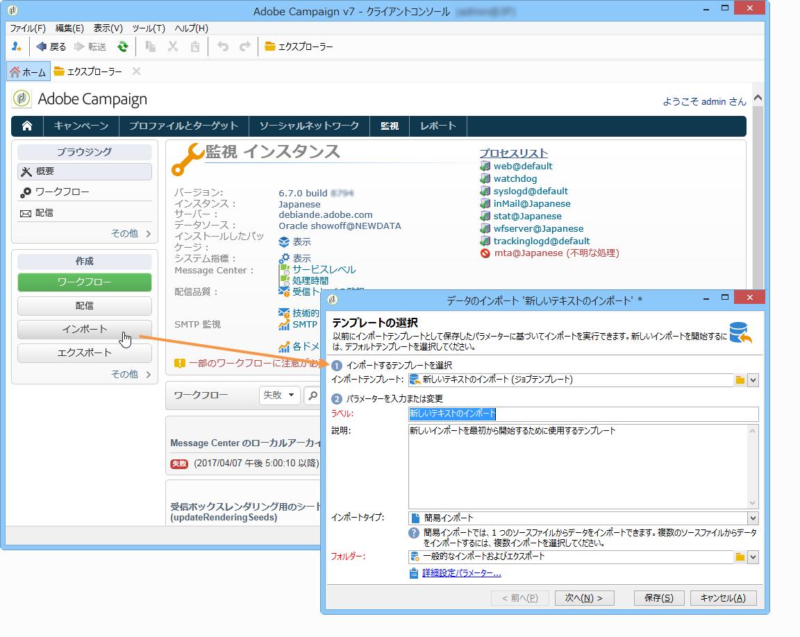

# インポートジョブおよびエクスポートジョブの作成 {#creating-import-export-jobs}

テンプレートを設定したら、Adobe Campaign の複数のコンテキストでインポートおよびエクスポート操作を開始することができます。

* Adobe Campaign ワークスペースの「**[!UICONTROL プロファイルとターゲット]**」セクションで、「**[!UICONTROL ジョブ]**」リンクをクリックします。これにより、既存のインポートおよびエクスポートのリストが表示されます。

  「**[!UICONTROL 作成]**」ボタンをクリックして、実行するジョブのタイプを選択します。

  

* Workspace の「**[!UICONTROL 監視]**」セクションからインポートおよびエクスポートを開始することもできます。2 つの専用リンクを使用して、インポートまたはエクスポートを直接開始できます。

  

* さらに、インポートおよびエクスポートは、Adobe Campaign エクスプローラーから開始することもできます。

  

これらはすべて、データのインポートウィザードまたはエクスポートウィザードを開きます。これらの詳細については以下の節で説明します。

* [インポートジョブの設定](../../platform/using/executing-import-jobs.md)
* [エクスポートジョブの設定](../../platform/using/executing-export-jobs.md)
