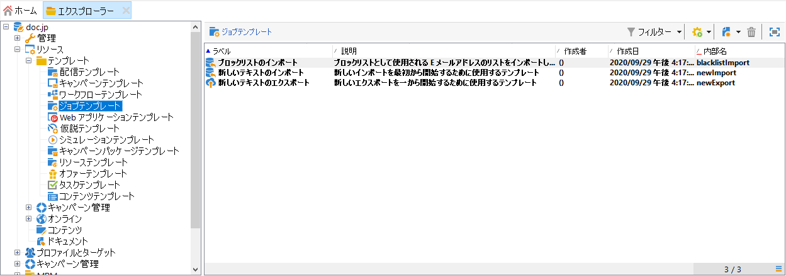

# インポートテンプレートおよびエクスポートテンプレートの作成 {#creating-import-export-templates}

インポートおよびエクスポートテンプレートは、Adobe Campaign ツリーの&#x200B;**[!UICONTROL リソース／テンプレート／ジョブテンプレート]**&#x200B;ディレクトリに保存されています。

このディレクトリには、デフォルトで 3 つのインポートテンプレートと 1 つのエクスポートテンプレートがあります。 これらは変更できません。

* ネイティブテンプレートの「**[!UICONTROL ブロックリストをインポート]**」は、ブロックリストに追加されたメールアドレスのリストをインポートするように既に設定されています。

* 「**[!UICONTROL 新しいテキストのインポート]**」および「**[!UICONTROL 新しいテキストのエクスポート]**」テンプレートでは、インポートまたはエクスポートをゼロから設定することができます。

既存のテンプレートを複製して独自のテンプレートを作成するか、**[!UICONTROL 新規／インポートテンプレート]**&#x200B;または&#x200B;**[!UICONTROL エクスポートテンプレート]**&#x200B;メニューを使用して新しいテンプレートを作成できます。

テンプレートを設定するプロセスは、次の節で示したプロセスと同じです。

* [インポートジョブの設定](../../platform/using/executing-import-jobs.md)
* [エクスポートジョブの設定](../../platform/using/executing-export-jobs.md)
