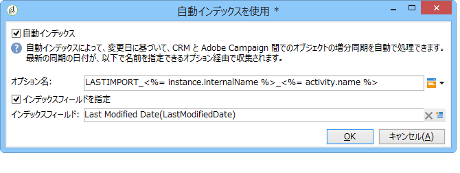

# CRM コネクタ{#crm-connectors}

## CRM コネクタについて {#about-crm-connectors}

Adobe Campaign では、Adobe Campaign プラットフォームをサードパーティのシステムにリンクするための様々な CRM コネクタが提供されています。これらの CRM コネクタにより、連絡先、アカウント、購入などを同期したり、アプリケーションを様々なサードパーティおよびビジネスアプリケーションと簡単に統合したりすることができます。

これらのコネクタを使用すると、データを迅速かつ容易に統合できます。Adobe Campaign には、CRM のテーブルを収集して選択するための専用のウィザードが用意されています。これにより、システム全体でデータを常に最新にするための双方向の同期が保証されます。

>[!NOTE]
>
>この機能は、**CRM コネクタ**&#x200B;専用パッケージを通じて Adobe Campaign で使用できます。

CRM への接続は、専用のワークフローアクティビティを使用して実行します。これらのアクティビティについて、[この節](../../workflow/using/crm-connector.md)の章で詳しく説明しています。

### 互換性のある CRM システムと制限事項 {#compatible-crm-systems-and-limitations}

Adobe Campaign に統合できる CRM を次に示します。

サポートされているバージョンは、[互換性マトリックス](https://helpx.adobe.com/jp/campaign/kb/compatibility-matrix.html)に詳述されています。

* **Salesforce.com**

   Salesforce.com との接続を設定する方法については、[この節](#example-for-salesforce-com)を参照してください。

   >[!CAUTION]
   >
   >Adobe Campaign を Salesforce.com に接続する場合の制限事項を次に示します。
   >
   >    
   >    
   >    * 本番テスト用インスタンスがサポートされます。
   >    * 割り当てルールがサポートされます。
   >    * 複数選択列挙は Adobe Campaign でサポートされません。

* **Oracle On Demand**

   Oracle On Demand との接続を設定する方法については、[この節](#example-for-oracle-on-demand)を参照してください。

   >[!CAUTION]
   >
   >Adobe Campaign を Oracle On Demand に接続する場合の制限事項を次に示します。
   >
   >    
   >    
   >    * Adobe Campaign は、標準の Oracle On Demand テンプレートで利用可能などのオブジェクトでも同期できます。Oracle On Demand にパーソナライズしたテーブルを追加している場合、これらのテーブルは Adobe Campaign で回復されません。
   >    * API バージョン v1.0 では、クエリ中にデータを並べ替えたり、フィルタリングしたりできますが、両方の操作を同時に実行することはできません。
   >    * Oracle On Demand から送信される日付には、タイムゾーン情報が含まれません。
   >    * 複数選択列挙は Adobe Campaign でサポートされません。

* **MS Dynamics CRM** および **MS Dynamics Online**

   Microsot Dynamics との接続を設定する方法については、[この節](#example-for-microsoft-dynamics)を参照してください。

   Adobe Campaign と Microsoft Dynamics 統合の使用例については、[このビデオ](https://helpx.adobe.com/campaign/kt/acc/using/acc-integrate-dynamics365-with-acc-feature-video-set-up.html)を参照してください。

   >[!CAUTION]
   >
   >Adobe Campaign を Microsoft Dynamics に接続する場合の制限事項を次に示します。
   >
   >    
   >    
   >    * プラグインをインストールすると CRM の動作が変わり、Adobe Campaign との互換性の問題が生じる可能性があります。
   >    * 複数選択列挙は Adobe Campaign でサポートされません。

## 接続の設定 {#setting-up-the-connection}

Adobe Campaign で CRM コネクタを使用するには、次の手順に従います。

1. 外部アカウントの作成
1. CRM テーブルの収集
1. 列挙の同期
1. 同期ワークフローの作成

>[!NOTE]
>
>CRM コネクタはセキュア URL（https）でのみ動作します。

### Salesforce.com の例 {#example-for-salesforce-com}

Adobe Campaign で **Salesforce.com** コネクタを設定するには、次の手順に従います。

1. Adobe Campaign ツリーの&#x200B;**[!UICONTROL 管理／プラットフォーム／外部アカウント]**&#x200B;ノードを使用して、新しい外部アカウントを作成します。
1. 設定ウィザードを実行し、使用可能な CRM テーブルを生成します。

   

   設定ウィザードでは、テーブルを収集し、対応するスキーマを作成できます。

   「**[!UICONTROL 開始]**」をクリックして実行します。

   

   >[!NOTE]
   >
   >設定を承認するには、Adobe Campaign コンソールからログオフし、再度ログオンする必要があります。

1. **[!UICONTROL 管理／設定／データスキーマ]**&#x200B;ノードで、Adobe Campaign で生成されたスキーマを確認します。

   

1. スキーマが作成された後、CRM 経由で列挙を Adobe Campaign に自動的に同期することができます。

   そのためには、「**[!UICONTROL 列挙を同期しています...]**」リンクをクリックし、CRM 列挙に対応する Adobe Campaign の列挙を選択します。

   Adobe Campaign の列挙のすべての値を CRM の値に置き換えることができます。そのためには、**[!UICONTROL 置換]**&#x200B;列の「**[!UICONTROL はい]**」を選択します。

   

   「**[!UICONTROL 次へ]**」をクリックしてから「**[!UICONTROL 開始]**」をクリックし、リストのインポートを開始します。

1. **[!UICONTROL 管理／プラットフォーム／列挙]**&#x200B;メニューで、インポートされた値を確認します。

   

1. Salesforce データをインポートしたり、Adobe Campaign データを Salesforce にエクスポートしたりするには、ワークフローを作成し、「**[!UICONTROL CRM コネクタ]**」アクティビティを使用する必要があります。

   

### Oracle On Demand の例 {#example-for-oracle-on-demand}

Adobe Campaign と連携するように **Oracle On Demand** コネクタを設定するには、次の手順に従います。

1. Adobe Campaign ツリーの&#x200B;**[!UICONTROL 管理／プラットフォーム／外部アカウント]**&#x200B;ノードを使用して、新しい外部アカウントを作成します。

   

1. 設定ウィザードを開きます。Oracle データモデルのテーブルが自動的に表示されます。収集するテーブルを選択します。

   

1. 「**[!UICONTROL 次へ]**」をクリックし、対応するスキーマの作成を開始します。

   対応するデータスキーマが Adobe Campaign で使用可能になります。

   

1. Adobe Campaign と Oracle On Demand の間の列挙の同期を開始します。

   

1. Oracle On Demand データを Adobe Campaign にインポートするには、次のタイプのワークフローを作成します。

   

   このワークフローでは、Oracle On Demand 経由で連絡先がインポートされ、それらが既存の Adobe Campaign データと同期され、重複する連絡先は削除され、Adobe Campaign データベースが更新されます。

   「**[!UICONTROL CRM コネクタ]**」アクティビティを、次に示すように設定する必要があります。

   

1. Adobe Campaign データを Oracle On Demand にエクスポートするには、次のワークフローを作成します。

   

   このワークフローでは、クエリを使用して関連データが収集されてから、Oracle On Demand 連絡先テーブルにエクスポートされます。

### Microsoft Dynamics の例 {#example-for-microsoft-dynamics}

Adobe Campaign と連携するように Microsoft Dynamics コネクタを設定するには、次の手順に従います。

1. Adobe Campaign ツリーの&#x200B;**[!UICONTROL 管理／プラットフォーム／外部アカウント]**&#x200B;ノードを使用して、新しい外部アカウントを作成します。

   

1. **デプロイメントタイプ**&#x200B;を選択します。「**[!UICONTROL オンプレミス]**」、「**[!UICONTROL Office 365]**」または「**[!UICONTROL Web API]**」を、設定するコネクタに応じて選択します。

   Adobe Campaign Classic は、Dynamics 365 REST インターフェイスと OAuth プロトコルによる認証をサポートしています。

   **[!UICONTROL WebAPI]** デプロイメントを選択している場合は、Azure Directory にアプリを登録し、Azure Directory から **clientId** を取得する必要があります。この登録については、[このページ](https://msdn.microsoft.com/ja-jp/library/mt622431.aspx)を参照してください。

   >[!NOTE]
   >
   >Adobe Campaign Classic では、redirectURL パラメーターは必須ではありません。

   **clientId** 値は、付与タイプのパスワードを使用してベアラートークンを取得するために、ユーザー名やパスワードとともに使用します。この方式は、**リソース所有者パスワード資格情報付与（Resource Owner Password Credentials Grant）**&#x200B;と呼ばれます。詳しくは、[このページ](https://blogs.msdn.microsoft.com/wushuai/2016/09/25/resource-owner-password-credentials-grant-in-azure-ad-oauth/)を参照してください。

   

   この CRM バージョンの互換性について詳しくは、[互換性マトリックス](https://helpx.adobe.com/jp/campaign/kb/compatibility-matrix.html)を参照してください。

1. 設定ウィザードを開きます。Microsoft Dynamics データテンプレートからテーブルが自動的に検出されます。

   

   収集するテーブルを選択します。

   

1. 「**[!UICONTROL 次へ]**」をクリックし、対応するスキーマの作成を開始します。

   

   >[!NOTE]
   >
   >設定を承認するには、Adobe Campaign コンソールから切断し、再接続する必要があります。

   対応するデータスキーマが Adobe Campaign で使用可能になります。

   

1. Adobe Campaign と Microsoft Dynamics の間の列挙の同期を開始します。

   

1. Microsoft Dynamics データを Adobe Campaign にインポートするには、次のタイプのワークフローを作成します。

   

   このワークフローでは、Microsoft Dynamics 経由で連絡先がインポートされ、それらが既存の Adobe Campaign データと同期され、重複する連絡先は削除され、Adobe Campaign データベースが更新されます。

   **[!UICONTROL CRM コネクタ]**&#x200B;アクティビティを、次に示すように設定する必要があります。

   

## データの同期 {#data-synchronization}

Adobe Campaign と CRM の間の同期は、専用のワークフローアクティビティである「[CRM コネクタ](../../workflow/using/crm-connector.md)」で実行されます。

このアクティビティを使用して、次のことを実行できます。

* CRM からインポート（[CRM からのインポート](#importing-from-the-crm)を参照）。
* CRM にエクスポート（[CRM へのエクスポート](#exporting-to-the-crm)を参照）。
* CRM で削除されたオブジェクトをインポート（[CRM で削除されたオブジェクトのインポート](#importing-objects-deleted-in-the-crm)を参照）。
* CRM のオブジェクトを削除（[CRM でのオブジェクトの削除](#deleting-objects-in-the-crm)を参照）。

同期対象とする CRM に対応する外部アカウントを選択し、同期するオブジェクト（アカウント、オポチュニティ、リード、連絡先など）を選択します。

このアクティビティの設定は、実行するプロセスによって異なります。次に、様々な設定について詳しく説明します。

### CRM からのインポート {#importing-from-the-crm}

データを CRM 経由で Adobe Campaign にインポートするには、次のタイプのワークフローを作成する必要があります。

インポートアクティビティの場合、「**CRM コネクタ**」アクティビティの設定手順は次のとおりです。

1. 「**[!UICONTROL CRM からインポート]**」操作を選択します。
1. **[!UICONTROL リモートオブジェクト]**&#x200B;ドロップダウンリストに移動し、プロセスの対象となるオブジェクトを選択します。このオブジェクトは、コネクタの設定時に Adobe Campaign で作成されたテーブルのいずれかと一致します。
1. 「**[!UICONTROL リモートフィールド]**」セクションに移動し、インポートするフィールドを入力します。

   フィールドを追加するには、ツールバーの&#x200B;**[!UICONTROL 追加]**&#x200B;ボタンをクリックし、**[!UICONTROL 式を編集]**&#x200B;アイコンをクリックします。

   

   必要に応じて、「**[!UICONTROL コンバージョン]**」列のドロップダウンリストでデータフォーマットを変更します。使用可能なコンバージョンタイプについて詳しくは、[データフォーマット](#data-format)を参照してください。

   >[!CAUTION]
   >
   >CRM と Adobe Campaign のオブジェクトをリンクするには、CRM でのレコードの識別子が必須です。これは、ボックスが承認されると自動的に追加されます。
   >
   >増分データインポートの場合は、CRM 側での最終変更日も必須です。

1. 必要に応じて、インポートするデータをフィルターすることもできます。そのためには、「**[!UICONTROL フィルターを編集...]**」リンクをクリックします。

   次の例では、2012 年 11 月 1 日以降にアクティビティが記録された連絡先のみが Adobe Campaign によってインポートされます。

   

   >[!CAUTION]
   >
   >データのフィルターモードに関連する制限について詳しくは、[フィルターデータ](#filtering-data)を参照してください。

1. 「**[!UICONTROL 自動インデックスを使用]**」オプションを使用すると、CRM と Adobe Campaign の間の増分オブジェクト同期を日付と最終変更に応じて自動的に管理できます。

   詳しくは、[変数管理](#variable-management)を参照してください。

#### 変数管理 {#variable-management}

「**[!UICONTROL 自動インデックス]**」オプションを使用すると、最後のインポート以降に変更されたオブジェクトのみを収集できます。

最後の同期の日付が、設定ウィンドウで指定したオプションに保存されます。デフォルトでは、**LASTIMPORT_&lt;%=instance.internalName%>_&lt;%=activityName%>** です。

>[!NOTE]
>
>このメモは、一般的な「**[!UICONTROL CRM コネクタ]**」アクティビティにのみ適用されます。他の CRM アクティビティの場合、プロセスは自動です。
>
>このオプションは、**[!UICONTROL 管理]**／**[!UICONTROL プラットフォーム]**／**[!UICONTROL オプション]**&#x200B;を使用して手動で作成および設定する必要があります。これはテキストオプションである必要があり、その値は、**yyyy/MM/dd hh:mm:ss** というフォーマットに一致する必要があります。
> 
>以降のインポートではこのオプションを手動で更新する必要があります。

最新の変更を識別するために考慮するリモート CRM フィールドを指定できます。

デフォルトでは、次のフィールドが（指定した順序で）使用されます。

* Microsoft Dynamics の場合：**modifiedon**。
* Oracle On Demand の場合：**LastUpdated**、**ModifiedDate**、**LastLoggedIn**。
* Salesforce.com の場合：**LastModifiedDate**、**SystemModstamp**。

「**[!UICONTROL 自動インデックス]**」オプションをオンにすると、「**[!UICONTROL JavaScript コード]**」タイプのアクティビティによって、同期ワークフローで使用できる 3 つの変数が生成されます。これらのアクティビティは、次のとおりです。

* **vars.crmOptionName**：最後のインポート日を含むオプションの名前を表します。
* **vars.crmStartImport**：最後のデータ収集の開始日（この日を含む）を表します。
* **vars.crmEndDate**：最後のデータ収集の終了日（この日を含まない）を表します。

   >[!NOTE]
   >
   >これらの日付は、**yyyy/MM/dd hh:mm:ss** というフォーマットで表示されます。

#### フィルターデータ {#filtering-data}

様々な CRM で効率的に操作をおこなうために、次のルールを使用してフィルターを作成する必要があります。

* 各フィルターレベルでは、1 つのタイプの演算子のみを使用できます。
* AND NOT 演算子はサポートされていません。
* 比較は、null 値（「空である」／「空でない」タイプ）または数値にのみ関係します。つまり、値（右側の列）が評価され、この評価の結果は数値である必要があります。したがって、JOIN タイプの比較はサポートされていません。
* 右側の列の値は、JavaScript で評価されます。
* JOIN 比較はサポートされていません。
* 左側の列の式は、フィールドである必要があります。複数の式の組み合わせ、数値などは使用できません。

例えば、次のフィルター条件は、OR 演算子が AND 演算子と同じレベルに配置されているので、CRM インポートで有効になりません。

* OR 演算子が AND 演算子と同じレベルに配置されている。
* 比較の実行対象がテキスト文字列である。

#### 並べ替え順 {#order-by}

Microsoft Dynamics および Salesforce.com では、インポートされるリモートフィールドを昇順または降順で並べ替えることができます。

そのためには、「**[!UICONTROL 並べ替え順]**」リンクをクリックし、列をリストに追加します。

リストでの列の順序が、並べ替え順です。

#### レコード識別 {#record-identification}

CRM に含まれる（フィルターされた可能性がある）要素をインポートするのではなく、ワークフローで事前に計算された母集団を使用できます。

そのためには、「**[!UICONTROL アップストリームを計算した母集団を使用]**」オプションを選択し、リモート識別子を含むフィールドを指定します。

次に、インポートするインバウンドの母集団のフィールドを次に示すように選択します。

### CRM へのエクスポート {#exporting-to-the-crm}

Adobe Campaign データを CRM にエクスポートすると、コンテンツ全体を CRM データベースにコピーできます。

データを CRM にエクスポートするには、次のタイプのワークフローを作成する必要があります。

エクスポートの場合、次の設定を「**CRM コネクタ**」アクティビティに適用します。

1. 「**[!UICONTROL CRM にエクスポート]**」操作を選択します。
1. **[!UICONTROL リモートオブジェクト]**&#x200B;ドロップダウンリストに移動し、プロセスの対象となるオブジェクトを選択します。このオブジェクトは、コネクタの設定時に Adobe Campaign で作成されたテーブルのいずれかと一致します。

   >[!CAUTION]
   >
   >「**CRM コネクタ**」アクティビティのエクスポート機能では、CRM 側のフィールドを挿入または更新できます。CRM でのフィールド更新を有効にするには、リモートテーブルのプライマリキーを指定する必要があります。キーがない場合、データは（更新ではなく）挿入されます。

1. 「**[!UICONTROL マッピング]**」セクションで、エクスポートされるフィールドと CRM でのそれらのマッピングを指定します。

   

   フィールドを追加するには、ツールバーの&#x200B;**[!UICONTROL 追加]**&#x200B;ボタンをクリックし、**[!UICONTROL 式を編集]**&#x200B;アイコンをクリックします。

   >[!NOTE]
   >
   >特定のフィールドについて、CRM 側で対応が定義されていない場合は、値を更新できません。値は CRM に直接挿入されます。

   必要に応じて、「**[!UICONTROL コンバージョン]**」列のドロップダウンリストでデータフォーマットを変更します。使用可能なコンバージョンタイプについて詳しくは、[データフォーマット](#data-format)を参照してください。

   >[!NOTE]
   >
   >エクスポートされるレコードのリストとエクスポートの結果は、ワークフローが終了または再開されるまでアクセス可能な一時ファイルに保存されます。これにより、同じレコードを複数回エクスポートしたりデータを失ったりすることなく、エラーが発生した場合にプロセスを再度開始できます。

### 任意の追加設定 {#additional-configurations}

#### データフォーマット {#data-format}

CRM へのインポートまたは CRM からのインポート中にデータフォーマットを変換できます。

そのためには、適用する変換を対応する列で選択します。

「**[!UICONTROL デフォルト]**」モードでは、自動データ変換が適用されます。ほとんどの場合、これはデータのコピー／貼り付けと同じです。ただし、タイムゾーン管理が適用されます。

その他の使用可能な変換は、次のとおりです。

* **[!UICONTROL 日付のみ]**：このモードでは、日付 + 時刻タイプのフィールドは削除されます。
* **[!UICONTROL 時間オフセットなし]**：このモードでは、デフォルトモードで適用されるタイムゾーン管理がキャンセルされます。
* **[!UICONTROL コピー／貼り付け]**：このモードでは、文字列などの生データが使用されます（変換なし）。

#### エラー処理 {#error-processing}

データのインポートまたはエクスポートのフレームワーク内で、エラーおよび却下に対して特定のプロセスを適用できます。そのためには、「**[!UICONTROL 行動]**」タブで「**[!UICONTROL 却下を処理]**」および「**[!UICONTROL エラーを処理]**」オプションを選択します。

これらのオプションを使用すると、対応する出力トランジションが配置されます。

次に、適用するプロセスに関連するアクティビティを配置します。

例えば、エラーを処理するために、待機ボックスを追加して再試行をスケジュールできます。

却下は、エラーコードおよび関連メッセージとともに収集されます。つまり、却下のトラッキングを設定して同期プロセスを最適化できます。

>[!NOTE]
>
>「**[!UICONTROL 却下を処理]**」オプションがオフの場合でも、却下された列ごとに警告がエラーコードおよびメッセージとともに生成されます。

「**[!UICONTROL 却下]**」出力トランジションでは、エラーメッセージおよびコードに関連する特定の列を含む出力スキーマにアクセスできます。これらの列は、次のとおりです。

* Oracle On Demand の場合：**errorLogFilename**（Oracle 側でのログファイルの名前）、**errorCode**（エラーコード）、**errorSymbol**（エラーコードとは別のエラー記号）、**errorMessage**（エラーコンテキストの説明）。
* Salesforce.com の場合：**errorSymbol**（エラーコードとは別のエラー記号）、**errorMessage**（エラーコンテキストの説明）。

### CRM で削除されたオブジェクトのインポート {#importing-objects-deleted-in-the-crm}

広範なデータ同期プロセスの設定を可能にするために、CRM で削除されたオブジェクトを Adobe Campaign にインポートできます。

それには、次の手順に従います。

1. 「**[!UICONTROL CRM で削除されたオブジェクトをインポート]**」操作を選択します。
1. **[!UICONTROL リモートオブジェクト]**&#x200B;ドロップダウンリストに移動し、プロセスの対象となるオブジェクトを選択します。このオブジェクトは、コネクタの設定時に Adobe Campaign で作成されたテーブルのいずれかと一致します。
1. 考慮する削除期間を「**[!UICONTROL 開始日]**」および「**[!UICONTROL 終了日]**」フィールドで指定します。これらの日付も期間に含まれます。

   

   >[!CAUTION]
   >
   >要素の削除期間は、CRM に固有の制限と一致している必要があります。したがって、例えば Salesforce.com の場合、削除されてから 30 日を経過した要素は収集することができません。

### CRM でのオブジェクトの削除 {#deleting-objects-in-the-crm}

CRM 側でオブジェクトを削除するには、削除するリモート要素のプライマリキーを指定する必要があります。

「**[!UICONTROL 行動]**」タブで、却下の処理を有効にすることができます。このオプションを使用すると、「**[!UICONTROL CRM コネクタ]**」アクティビティの 2 つ目の出力トランジションが生成されます。詳しくは、[エラー処理](#error-processing)を参照してください。

>[!NOTE]
>
>「**[!UICONTROL 却下を処理]**」オプションがオフの場合でも、却下された列ごとに警告が生成されます。

