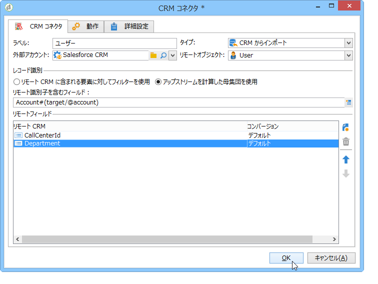

# CRM コネクタ{#crm-connectors}

## CRM コネクタについて {#about-crm-connectors}

Adobe Campaign では、Adobe Campaign プラットフォームをサードパーティのシステムにリンクするための様々な CRM コネクタが提供されています。これらの CRM コネクタにより、連絡先、アカウント、購入などを同期したり、アプリケーションを様々なサードパーティおよびビジネスアプリケーションと簡単に統合したりすることができます。

これらのコネクタを使用すると、データを迅速かつ容易に統合できます。Adobe Campaignには、CRMで使用可能なテーブルを収集して選択するための専用のウィザードが用意されています。 これにより、システム全体でデータを常に最新にするための双方向の同期が保証されます。

>[!NOTE]
>
>この機能は、**CRM コネクタ**&#x200B;専用パッケージを通じて Adobe Campaign で使用できます。

CRM への接続は、専用のワークフローアクティビティを使用して実行します。これらのアクティビティについて、[この節](../../workflow/using/crm-connector.md)の章で詳しく説明しています。

### 互換性のある CRM システムと制限事項 {#compatible-crm-systems-and-limitations}

Adobe Campaign に統合できる CRM を次に示します。

サポートされているバージョンは、[互換性マトリックス](https://helpx.adobe.com/campaign/kb/compatibility-matrix.html)に詳述されています。

* **Salesforce.com**

   Salesforce.com との接続を設定する方法については、[この節](#example-for-salesforce-com)を参照してください。

   >[!CAUTION]
   >
   >Adobe Campaign を Salesforce.com に接続する場合の制限事項を次に示します。
   >
   >    
   >    
   >    * 本番テスト用インスタンスがサポートされます。
   >    * 割り当てルールがサポートされます。
   >    * 複数選択列挙は Adobe Campaign でサポートされません。

* **Oracle On Demand**

   Oracle On Demand との接続を設定する方法については、[この節](#example-for-oracle-on-demand)を参照してください。

   >[!CAUTION]
   >
   >Adobe Campaign を Oracle On Demand に接続する場合の制限事項を次に示します。
   >
   >    
   >    
   >    * Adobe Campaign は、標準の Oracle On Demand テンプレートで利用可能などのオブジェクトでも同期できます。Oracle On Demand にパーソナライズしたテーブルを追加している場合、これらのテーブルは Adobe Campaign で回復されません。
   >    * API バージョン v1.0 では、クエリ中にデータを並べ替えたり、フィルタリングしたりできますが、両方の操作を同時に実行することはできません。
   >    * Oracle On Demand から送信される日付には、タイムゾーン情報が含まれません。
   >    * 複数選択列挙は Adobe Campaign でサポートされません。

* **MS Dynamics CRM** および **MS Dynamics Online**

   Microsot Dynamics との接続を設定する方法については、[この節](#example-for-microsoft-dynamics)を参照してください。

   Adobe Campaign と Microsoft Dynamics 統合の使用例については、[このビデオ](https://helpx.adobe.com/campaign/kt/acc/using/acc-integrate-dynamics365-with-acc-feature-video-set-up.html)を参照してください。

   >[!CAUTION]
   >
   >Adobe Campaign を Microsoft Dynamics に接続する場合の制限事項を次に示します。
   >
   >    
   >    
   >    * プラグインをインストールすると CRM の動作が変わり、Adobe Campaign との互換性の問題が生じる可能性があります。
   >    * 複数選択列挙は Adobe Campaign でサポートされません。

## 接続の設定 {#setting-up-the-connection}

Adobe Campaign で CRM コネクタを使用するには、次の手順に従います。

1. 外部アカウントの作成
1. CRM テーブルの収集
1. 列挙の同期
1. 同期ワークフローの作成

>[!NOTE]
>
>CRM コネクタはセキュア URL（https）でのみ動作します。

### Salesforce.com の例 {#example-for-salesforce-com}

Adobe Campaign で **Salesforce.com** コネクタを設定するには、次の手順に従います。

1. Create a new external account via the **[!UICONTROL Administration > Platform > External accounts]** node of the Adobe Campaign tree.
1. 設定ウィザードを実行し、使用可能な CRM テーブルを生成します。

   

   設定ウィザードでは、テーブルを収集し、対応するスキーマを作成できます。

   Click **[!UICONTROL Start]** to run the execution.

   

   >[!NOTE]
   >
   >設定を承認するには、Adobe Campaign コンソールからログオフし、再度ログオンする必要があります。

1. ノードのAdobe Campaignで生成されたスキーマを確認し **[!UICONTROL Administration > Configuration > Data schemas]** ます。

   

1. スキーマが作成された後、CRM 経由で列挙を Adobe Campaign に自動的に同期することができます。

   To do this, click the **[!UICONTROL Synchronizing enumerations...]** link and select the Adobe Campaign enumeration that matches the CRM enumeration.

   You can replace all values of an Adobe Campaign enumeration with those of the CRM: to do this, select **[!UICONTROL Yes]** in the **[!UICONTROL Replace]** column.

   

   Click **[!UICONTROL Next]** and then **[!UICONTROL Start]** to start importing the list.

1. メニューで読み込んだ値を確認 **[!UICONTROL Administration > Platform > Enumerations]** します。

   

1. To import Salesforce data or to export Adobe Campaign data to Salesforce, you need to create a workflow and use the **[!UICONTROL CRM connector]** activity.

   

### Oracle On Demand の例 {#example-for-oracle-on-demand}

Adobe Campaign と連携するように **Oracle On Demand** コネクタを設定するには、次の手順に従います。

1. Create a new external account via the **[!UICONTROL Administration > Platform > External accounts]** node of the Adobe Campaign tree.

   

1. 構成ウィザードを開きます。Adobe CampaignはOracleデータモデルの表を自動的に表示します。 収集するテーブルを選択します。

   

1. Click **[!UICONTROL Next]** to start creating the matching schema.

   対応するデータスキーマが Adobe Campaign で使用可能になります。

   

1. Adobe Campaign と Oracle On Demand の間の列挙の同期を開始します。

   

1. Oracle On Demand データを Adobe Campaign にインポートするには、次のタイプのワークフローを作成します。

   

   このワークフローでは、Oracle On Demand 経由で連絡先がインポートされ、それらが既存の Adobe Campaign データと同期され、重複する連絡先は削除され、Adobe Campaign データベースが更新されます。

   The **[!UICONTROL CRM Connector]** activity needs to be configured as shown here:

   

1. Adobe Campaign データを Oracle On Demand にエクスポートするには、次のワークフローを作成します。

   

   このワークフローでは、クエリを使用して関連データが収集されてから、Oracle On Demand 連絡先テーブルにエクスポートされます。

### Microsoft Dynamics の例 {#example-for-microsoft-dynamics}

Adobe Campaign と連携するように Microsoft Dynamics コネクタを設定するには、次の手順に従います。

1. Create a new external account via the **[!UICONTROL Administration > Platform > External accounts]** node of the Adobe Campaign tree.

   

1. デプロイメン **トの種類**:ま **[!UICONTROL On-premise]**&#x200B;たは、設 **[!UICONTROL Office 365]** 定 **[!UICONTROL Web API]**&#x200B;するコネクタに応じて異なります。

   Adobe Campaign Classic は、Dynamics 365 REST インターフェイスと OAuth プロトコルによる認証をサポートしています。

   **[!UICONTROL WebAPI]** デプロイメントを選択している場合は、Azure Directory にアプリを登録し、Azure Directory から **clientId** を取得する必要があります。この登録については、[このページ](https://msdn.microsoft.com/en-us/library/mt622431.aspx)を参照してください。

   >[!NOTE]
   >
   >Adobe Campaign Classic では、redirectURL パラメーターは必須ではありません。

   **clientId** 値は、付与タイプのパスワードを使用してベアラートークンを取得するために、ユーザー名やパスワードとともに使用します。この方式は、**リソース所有者パスワード資格情報付与（Resource Owner Password Credentials Grant）**&#x200B;と呼ばれます。詳しくは、[このページ](https://blogs.msdn.microsoft.com/wushuai/2016/09/25/resource-owner-password-credentials-grant-in-azure-ad-oauth/)を参照してください。

   

   この CRM バージョンの互換性について詳しくは、[互換性マトリックス](https://helpx.adobe.com/campaign/kb/compatibility-matrix.html)を参照してください。

1. 設定ウィザードを開きます。Microsoft Dynamics データテンプレートからテーブルが自動的に検出されます。

   

   収集するテーブルを選択します。

   

1. Click **[!UICONTROL Next]** and start creating the corresponding schema.

   

   >[!NOTE]
   >
   >設定を承認するには、Adobe Campaign コンソールから切断し、再接続する必要があります。

   対応するデータスキーマが Adobe Campaign で使用可能になります。

   

1. Adobe Campaign と Microsoft Dynamics の間の列挙の同期を開始します。

   

1. Microsoft Dynamics データを Adobe Campaign にインポートするには、次のタイプのワークフローを作成します。

   

   このワークフローでは、Microsoft Dynamics 経由で連絡先がインポートされ、それらが既存の Adobe Campaign データと同期され、重複する連絡先は削除され、Adobe Campaign データベースが更新されます。

   The **[!UICONTROL CRM Connector]** activity needs to be configured as below:

   

## データの同期 {#data-synchronization}

Synchronization between Adobe Campaign and the CRM is carried out via a dedicated workflow activity: [CRM connector](../../workflow/using/crm-connector.md).

このアクティビティを使用して、次のことを実行できます。

* CRMからのインポート(CRMから [のインポートを参照](#importing-from-the-crm))、
* CRMへのエクスポート(CRM [へのエクスポート](#exporting-to-the-crm)を参照)、
* CRMで削除されたオブジェクトのインポート(CRMで削 [除されたオブジェクトのインポート](#importing-objects-deleted-in-the-crm))、
* CRM内のオブジェクトを削除します(CRM内の [オブジェクトの削除を参照](#deleting-objects-in-the-crm))。

同期対象とする CRM に対応する外部アカウントを選択し、同期するオブジェクト（アカウント、オポチュニティ、リード、連絡先など）を選択します。

このアクティビティの設定は、実行するプロセスによって異なります。次に、様々な設定について詳しく説明します。

### CRM からのインポート {#importing-from-the-crm}

データを CRM 経由で Adobe Campaign にインポートするには、次のタイプのワークフローを作成する必要があります。

インポートアクティビティの場合、「**CRM コネクタ**」アクティビティの設定手順は次のとおりです。

1. 操作を選択 **[!UICONTROL Import from the CRM]** します。
1. Go to the **[!UICONTROL Remote object]** drop-down list and select the object concerned by the process. このオブジェクトは、コネクタの設定時に Adobe Campaign で作成されたテーブルのいずれかと一致します。
1. Go to the **[!UICONTROL Remote fields]** section and enter the fields to be imported.

   To add a field, click the **[!UICONTROL Add]** button in the toolbar, then click the **[!UICONTROL Edit expression]** icon.

   

   If necessary, alter the data format via the drop-down list of the **[!UICONTROL Conversion]** columns. Possible conversion types are detailed in [Data format](#data-format).

   >[!CAUTION]
   >
   >CRM と Adobe Campaign のオブジェクトをリンクするには、CRM でのレコードの識別子が必須です。これは、ボックスが承認されると自動的に追加されます。
   >
   >増分データインポートの場合は、CRM 側での最終変更日も必須です。

1. 必要に応じて、インポートするデータをフィルターすることもできます。これを行うには、リンクをクリック **[!UICONTROL Edit the filter...]** します。

   次の例では、2012 年 11 月 1 日以降にアクティビティが記録された連絡先のみが Adobe Campaign によってインポートされます。

   

   >[!CAUTION]
   >
   >The limitations linked to data filtering modes are detailed in [Filtering data](#filtering-data).

1. The **[!UICONTROL Use automatic index...]** option enables you to automatically manage incremental object synchronization between the CRM and Adobe Campaign, depending on the date and their last modification.

   For more on this, refer to [Variable management](#variable-management).

#### 変数管理 {#variable-management}

Enabling the **[!UICONTROL Automatic index]** option lets you collect only objects modified since the last import.

The date of the last synchronization is stored in an option specified in the configuration window, by default: **LASTIMPORT_&lt;%=instance.internalName%>_&lt;%=activityName%>**.

>[!NOTE]
>
>This note only applies to the generic **[!UICONTROL CRM Connector]** activity. 他の CRM アクティビティの場合、プロセスは自動です。
>
>This option has to be manually created and populated under **[!UICONTROL Administration]** > **[!UICONTROL Platform]** > **[!UICONTROL Options]**. この値はテキストオプションである必要があり、次の形式と一致する必要があります。 **yyyy/MM/dd hh:mm:ss**.
> 
>以降のインポートではこのオプションを手動で更新する必要があります。

最新の変更を識別するために考慮するリモート CRM フィールドを指定できます。

デフォルトでは、次のフィールドが（指定した順序で）使用されます。

* Microsoft Dynamicsの場合： **modifiedon**、
* Oracle On Demandの場合： **LastUpdate**、 **ModifiedDate**、 **LastLoggedIn**、
* Salesforce.comの場合： **LastModifiedDate**、SystemModstamp ****。

Activating the **[!UICONTROL Automatic index]** option generates three variables that can be used in the synchronization workflow via a **[!UICONTROL JavaScript code]** type activity. これらのアクティビティは、次のとおりです。

* **vars.crmOptionName**：最後のインポート日を含むオプションの名前を表します。
* **vars.crmStartImport**：最後のデータ収集の開始日（この日を含む）を表します。
* **vars.crmEndDate**：最後のデータ収集の終了日（この日を含まない）を表します。

   >[!NOTE]
   >
   >これらの日付は、次の形式で表示されます。 **yyyy/MM/dd hh:mm:ss**.

#### データのフィルター {#filtering-data}

様々な CRM で効率的に操作をおこなうために、次のルールを使用してフィルターを作成する必要があります。

* 各フィルターレベルでは、1 つのタイプの演算子のみを使用できます。
* AND NOT 演算子はサポートされていません。
* 比較は、null 値（「空である」／「空でない」タイプ）または数値にのみ関係します。つまり、値（右側の列）が評価され、この評価の結果は数値である必要があります。したがって、JOIN タイプの比較はサポートされていません。
* 右側の列の値は、JavaScript で評価されます。
* JOIN 比較はサポートされていません。
* 左側の列の式は、フィールドである必要があります。複数の式の組み合わせ、数値などは使用できません。

例えば、次のフィルター条件は、OR 演算子が AND 演算子と同じレベルに配置されているので、CRM インポートで有効になりません。

* OR 演算子が AND 演算子と同じレベルに配置されている。
* 比較の実行対象がテキスト文字列である。

#### 並べ替え順 {#order-by}

Microsoft Dynamics および Salesforce.com では、インポートされるリモートフィールドを昇順または降順で並べ替えることができます。

To do this, click the **[!UICONTROL Order by]** link and add the columns to the list.

リストでの列の順序が、並べ替え順です。

#### レコード識別 {#record-identification}

CRM に含まれる（フィルターされた可能性がある）要素をインポートするのではなく、ワークフローで事前に計算された母集団を使用できます。

これを行うには、オプションを選択 **[!UICONTROL Use the population calculated upstream]** し、リモート識別子を含むフィールドを指定します。

次に、インポートするインバウンドの母集団のフィールドを次に示すように選択します。

### CRM へのエクスポート {#exporting-to-the-crm}

Adobe Campaign データを CRM にエクスポートすると、コンテンツ全体を CRM データベースにコピーできます。

データを CRM にエクスポートするには、次のタイプのワークフローを作成する必要があります。

エクスポートの場合、次の設定を「**CRM コネクタ**」アクティビティに適用します。

1. 操作を選択 **[!UICONTROL Export to CRM]** します。
1. Go to the **[!UICONTROL Remote object]** drop-down list and select the object concerned by the process. このオブジェクトは、コネクタの設定時に Adobe Campaign で作成されたテーブルのいずれかと一致します。

   >[!CAUTION]
   >
   >「**CRM コネクタ**」アクティビティのエクスポート機能では、CRM 側のフィールドを挿入または更新できます。CRM でのフィールド更新を有効にするには、リモートテーブルのプライマリキーを指定する必要があります。キーがない場合、データは（更新ではなく）挿入されます。

1. In the **[!UICONTROL Mapping]** section, specify the fields to be exported and their mapping in the CRM.

   

   To add a field, click the **[!UICONTROL Add]** button in the toolbar, then click the **[!UICONTROL Edit expression]** icon.

   >[!NOTE]
   >
   >特定のフィールドについて、CRM 側で対応が定義されていない場合は、値を更新できません。値は CRM に直接挿入されます。

   If necessary, alter the data format via the drop-down list of the **[!UICONTROL Conversion]** columns. Possible conversion types are detailed in [Data format](#data-format).

   >[!NOTE]
   >
   >エクスポートされるレコードのリストとエクスポートの結果は、ワークフローが終了または再開されるまでアクセス可能な一時ファイルに保存されます。これにより、同じレコードを複数回エクスポートしたりデータを失ったりすることなく、エラーが発生した場合にプロセスを再度開始できます。

### 任意の追加設定 {#additional-configurations}

#### データフォーマット {#data-format}

CRM へのインポートまたは CRM からのインポート中にデータフォーマットを変換できます。

そのためには、適用する変換を対応する列で選択します。

The **[!UICONTROL Default]** mode applies automatic data conversion, which in most cases equals a copy/paste of the data. ただし、タイムゾーン管理が適用されます。

その他の使用可能な変換は、次のとおりです。

* **[!UICONTROL Date only]**:このモードでは、日付+時間タイプのフィールドが削除されます。
* **[!UICONTROL Without time offset]**:このモードは、デフォルトモードで適用されたタイムゾーン管理をキャンセルします。
* **[!UICONTROL Copy/Paste]**:このモードでは、文字列などの生データを使用します（変換なし）。

#### エラー処理 {#error-processing}

データのインポートまたはエクスポートのフレームワーク内で、エラーおよび却下に対して特定のプロセスを適用できます。これを行うには、タブのと **[!UICONTROL Process rejects]** オプション **[!UICONTROL Process errors]** を選択し **[!UICONTROL Behavior]** ます。

これらのオプションを使用すると、対応する出力トランジションが配置されます。

次に、適用するプロセスに関連するアクティビティを配置します。

例えば、エラーを処理するために、待機ボックスを追加して再試行をスケジュールできます。

却下は、エラーコードおよび関連メッセージとともに収集されます。つまり、却下のトラッキングを設定して同期プロセスを最適化できます。

>[!NOTE]
>
>Even when the **[!UICONTROL Process rejects]** option isn&#39;t enabled, a warning is generated for each rejected column with an error code and message.

The **[!UICONTROL Reject]** output transition lets you access the output schema that contains the specific columns relevant to error messages and codes. これらの列は、次のとおりです。

* For Oracle On Demand: **errorLogFilename** (name of the log file on the Oracle side), **errorCode** (error code), **errorSymbol** (error symbol, different from the error code), **errorMessage** (description of the error context).
* For Salesforce.com: **errorSymbol** (error symbol, different from the error code), **errorMessage** (description of the error context).

### CRM で削除されたオブジェクトのインポート {#importing-objects-deleted-in-the-crm}

広範なデータ同期プロセスの設定を可能にするために、CRM で削除されたオブジェクトを Adobe Campaign にインポートできます。

それには、次の手順に従います。

1. 操作を選択 **[!UICONTROL Import objects deleted in the CRM]** します。
1. Go to the **[!UICONTROL Remote object]** drop-down list and select the object concerned by the process. このオブジェクトは、コネクタの設定時に Adobe Campaign で作成されたテーブルのいずれかと一致します。
1. Specify the deletion period to be taken into account in the **[!UICONTROL Start date]** and the **[!UICONTROL End date]** fields. これらの日付も期間に含まれます。

   

   >[!CAUTION]
   >
   >要素の削除期間は、CRM に固有の制限と一致している必要があります。したがって、例えば Salesforce.com の場合、削除されてから 30 日を経過した要素は収集することができません。

### CRM でのオブジェクトの削除 {#deleting-objects-in-the-crm}

CRM 側でオブジェクトを削除するには、削除するリモート要素のプライマリキーを指定する必要があります。

The **[!UICONTROL Behavior]** tab lets you enable the processing of rejects. This option generates a second output transition for the **[!UICONTROL CRM connector]** activity. For more on this, refer to [Error processing](#error-processing).

>[!NOTE]
>
>Even when the **[!UICONTROL Process rejects]** option is disabled, a warning is generated for each rejected column.

