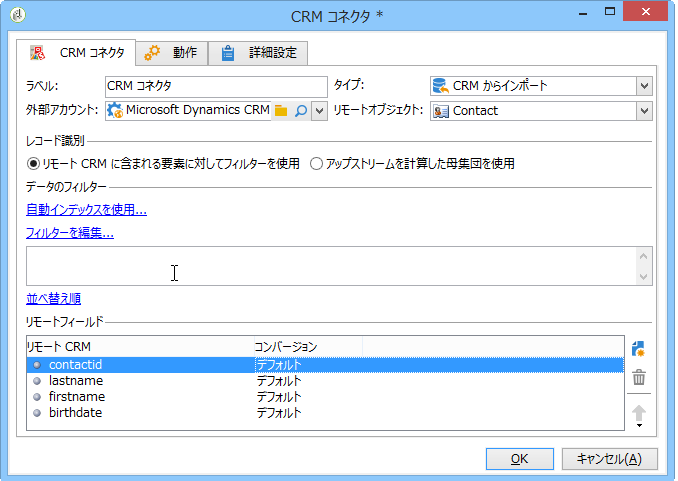
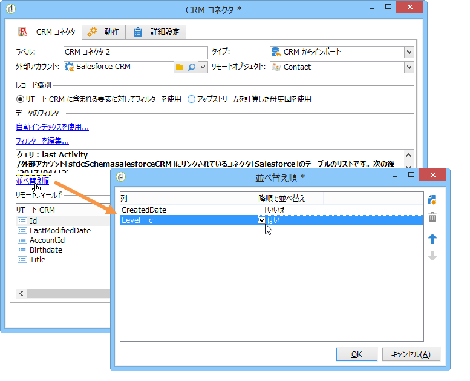
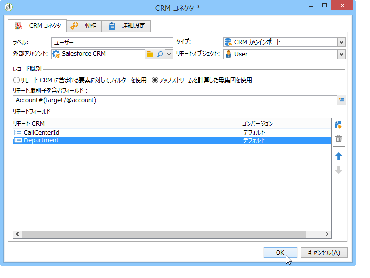
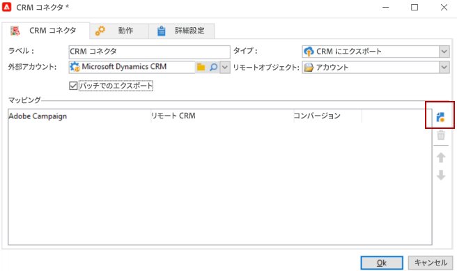
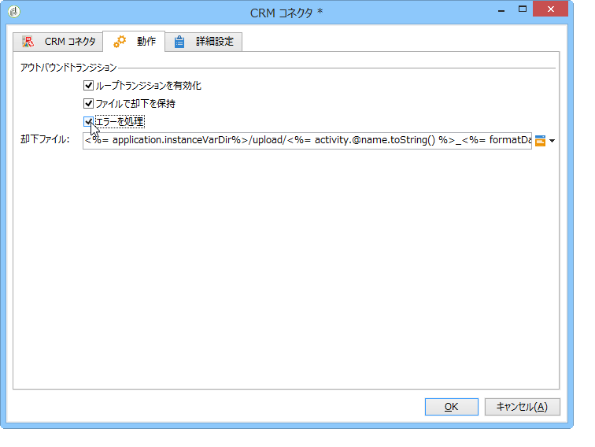

# Campaign と CRM の間のデータ同期 {#data-synchronization}

Adobe Campaign と CRM の間の同期は、専用のワークフローアクティビティである「[CRM コネクタ](../../workflow/using/crm-connector.md)」で実行されます。

Microsoft Dynamics データを Adobe Campaign にインポートするには、次のタイプのワークフローを作成します。

このワークフローでは、Microsoft Dynamics 経由で連絡先がインポートされ、それらが既存の Adobe Campaign データと同期され、重複する連絡先が削除され、Adobe Campaign データベースが更新されます。

**[!UICONTROL CRM コネクタ]**&#x200B;アクティビティは、データを同期するように設定する必要があります。

このアクティビティを使用すると、次のことができます。

* CRM からのインポート - [詳細情報](#importing-from-the-crm)
* CRM へのエクスポート - [詳細情報](#exporting-to-the-crm)
* CRM で削除されたオブジェクトのインポート - [詳細情報](#importing-objects-deleted-in-the-crm)
* CRM 内のオブジェクトの削除 - [詳細情報](#deleting-objects-in-the-crm)

同期の設定対象となる CRM に対応する外部アカウントを選択し、同期するオブジェクト（アカウント、オポチュニティ、リード、連絡先など）を選択します。

このアクティビティの設定は、実行するプロセスによって異なります。次に、様々な設定について詳しく説明します。

## CRM からのインポート {#importing-from-the-crm}

データを CRM 経由で Adobe Campaign にインポートするには、次のタイプのワークフローを作成する必要があります。

インポートアクティビティの場合、「**[!UICONTROL CRM コネクタ]**」アクティビティの設定手順は次のとおりです。

1. 「**[!UICONTROL CRM からインポート]**」操作を選択します。
1. **[!UICONTROL リモートオブジェクト]**&#x200B;ドロップダウンリストに移動し、プロセスの対象となるオブジェクトを選択します。このオブジェクトは、コネクタの設定時に Adobe Campaign で作成されたテーブルのいずれかと一致します。
1. 「**[!UICONTROL リモートフィールド]**」セクションに移動し、インポートするフィールドを入力します。

   フィールドを追加するには、ツールバーの&#x200B;**[!UICONTROL 追加]**&#x200B;ボタンをクリックし、**[!UICONTROL 式を編集]**&#x200B;アイコンをクリックします。

   

   必要に応じて、「**[!UICONTROL コンバージョン]**」列のドロップダウンリストでデータフォーマットを変更します。使用可能なコンバージョンタイプについて詳しくは、[データフォーマット](#data-format)を参照してください。

   >[!IMPORTANT]
   >
   >CRM と Adobe Campaign のオブジェクトをリンクするには、CRM でのレコードの識別子が必須です。これは、ボックスが承認されると自動的に追加されます。
   >
   >増分データインポートの場合は、CRM 側での最終変更日も必須です。

1. 必要に応じて、インポートするデータをフィルターすることもできます。そのためには、「**[!UICONTROL フィルターを編集...]**」リンクをクリックします。

   次の例では、2012 年 11 月 1 日以降にアクティビティが記録された連絡先のみが Adobe Campaign によってインポートされます。

   

   >[!IMPORTANT]
   >
   >データのフィルターモードに関連する制限について詳しくは、[フィルターデータ](#filtering-data)を参照してください。

1. 「**[!UICONTROL 自動インデックスを使用]**」オプションを使用すると、CRM と Adobe Campaign の間の増分オブジェクト同期を日付と最終変更に応じて自動的に管理できます。

   詳しくは、[変数管理](#variable-management)を参照してください。

### 変数の管理 {#variable-management}

「**[!UICONTROL 自動インデックス]**」オプションを有効にすると、前回のインポート以降に変更されたオブジェクトのみを収集できます。

最後の同期の日付が、設定ウィンドウで指定したオプションに保存されます。デフォルトでは、**LASTIMPORT_&lt;%=instance.internalName%>_&lt;%=activityName%>** です。

>[!NOTE]
>
>このメモは、一般的な **[!UICONTROL CRM コネクタ]**&#x200B;アクティビティにのみ適用されます。他の CRM アクティビティの場合、プロセスは自動です。
>
>このオプションは、**[!UICONTROL 管理]**／**[!UICONTROL プラットフォーム]**／**[!UICONTROL オプション]**&#x200B;を使用して手動で作成および設定する必要があります。これはテキストオプションである必要があり、その値は **`yyyy/MM/dd hh:mm:ss`** 形式に一致する必要があります。
> 
>以降のインポートではこのオプションを手動で更新する必要があります。

最新の変更を識別するために考慮するリモート CRM フィールドを指定できます。

デフォルトでは、次のフィールドが（指定した順序で）使用されます。

* Microsoft Dynamics の場合：**modifiedon**。
* Salesforce.com の場合：**LastModifiedDate**、**SystemModstamp**。

「**[!UICONTROL 自動インデックス]**」オプションをオンにすると、**[!UICONTROL JavaScript コード]**&#x200B;タイプのアクティビティによって、同期ワークフローで使用できる 3 つの変数が生成されます。これらのアクティビティは、次のとおりです。

* **vars.crmOptionName**：最後のインポート日を含むオプションの名前を表します。
* **vars.crmStartImport**：最後のデータ収集の開始日（この日を含む）を表します。
* **vars.crmEndDate**：最後のデータ収集の終了日（この日を含まない）を表します。

  >[!NOTE]
  >
  >これらの日付は、**`yyyy/MM/dd hh:mm:ss`** 形式で表示されます。

### データのフィルタリング {#filtering-data}

様々な CRM で効率的に操作を行うために、次のルールを使用してフィルターを作成する必要があります。

* 各フィルターレベルでは、1 つのタイプの演算子のみを使用できます。
* AND NOT 演算子はサポートされていません。
* 比較は、null 値（「空である」／「空でない」タイプ）または数値にのみ関係します。つまり、値（右側の列）が評価され、この評価の結果は数値である必要があります。したがって、JOIN タイプの比較はサポートされていません。
* 右側の列の値は、JavaScript で評価されます。
* JOIN 比較はサポートされていません。
* 左側の列の式は、フィールドである必要があります。複数の式の組み合わせ、数値などは使用できません。

例えば、次のフィルター条件は、OR 演算子が AND 演算子と同じレベルに配置されているので、CRM インポートには有効ではありません。

* OR 演算子が AND 演算子と同じレベルに配置されています。
* 比較の実行対象はテキスト文字列です。

### 並べ替え順 {#order-by}

Microsoft Dynamics および Salesforce.com では、インポートされるリモートフィールドを昇順または降順で並べ替えることができます。

そのためには、「**[!UICONTROL 並べ替え順]**」リンクをクリックし、列をリストに追加します。

リストでの列の順序が、並べ替え順です。

### レコード識別 {#record-identification}

CRM に含まれる（フィルターされた可能性がある）要素をインポートするのではなく、ワークフローで事前に計算された母集団を使用できます。

そのためには、「**[!UICONTROL アップストリームを計算した母集団を使用]**」オプションを選択し、リモート識別子を含むフィールドを指定します。

次に、インポートするインバウンドの母集団のフィールドを次に示すように選択します。

## CRM へのエクスポート {#exporting-to-the-crm}

Adobe Campaign データを CRM にエクスポートすると、コンテンツ全体を CRM データベースにコピーできます。

データを CRM にエクスポートするには、次のタイプのワークフローを作成する必要があります。

エクスポートの場合、次の設定を「**[!UICONTROL CRM コネクタ]**」アクティビティに適用します。

1. 「**[!UICONTROL CRM にエクスポート]**」操作を選択します。
1. **[!UICONTROL リモートオブジェクト]**&#x200B;ドロップダウンリストに移動し、プロセスの対象となるオブジェクトを選択します。このオブジェクトは、コネクタの設定時に Adobe Campaign で作成されたテーブルのいずれかと一致します。

   >[!IMPORTANT]
   >
   >**[!UICONTROL CRM コネクタ]**&#x200B;アクティビティのエクスポート機能では、CRM 側のフィールドを挿入または更新できます。CRM でのフィールド更新を有効にするには、リモートテーブルのプライマリキーを指定する必要があります。キーがない場合、データは（更新ではなく）挿入されます。

1. より高速な書き出しが必要な場合、**[!UICONTROL バッチでのエクスポート]**&#x200B;をチェックしてください。

   

1. 「**[!UICONTROL マッピング]**」セクションで、「**[!UICONTROL 新規]**」をクリックし、エクスポートされるフィールドと CRM でのそれらのマッピングを指定します。

   

   フィールドを追加するには、ツールバーの&#x200B;**[!UICONTROL 追加]**&#x200B;ボタンをクリックし、**[!UICONTROL 式を編集]**&#x200B;アイコンをクリックします。

   >[!NOTE]
   >
   >特定のフィールドについて、CRM 側で対応が定義されていない場合は、値を更新できません。値は CRM に直接挿入されます。

   必要に応じて、「**[!UICONTROL コンバージョン]**」列のドロップダウンリストでデータフォーマットを変更します。使用可能なコンバージョンタイプについて詳しくは、[データフォーマット](#data-format)を参照してください。

   >[!NOTE]
   >
   >エクスポートされるレコードのリストとエクスポートの結果は、ワークフローが終了または再開されるまでアクセス可能な一時ファイルに保存されます。これにより、同じレコードを複数回エクスポートしたりデータを失ったりすることなく、エラーが発生した場合にプロセスを再度開始できます。

## その他の設定 {#additional-configurations}

### データフォーマット {#data-format}

CRM へのインポートまたは CRM からのインポート中にデータフォーマットを変換できます。

そのためには、適用する変換を対応する列で選択します。

「**[!UICONTROL デフォルト]**」モードでは、自動データ変換が適用されます。ほとんどの場合、これはデータのコピー／貼り付けと同じです。ただし、タイムゾーン管理が適用されます。

その他の使用可能な変換は、次のとおりです。

* **[!UICONTROL 日付のみ]**：このモードでは、日付 + 時刻タイプのフィールドは削除されます。
* **[!UICONTROL 時間オフセットなし]**：このモードでは、デフォルトモードで適用されるタイムゾーン管理がキャンセルされます。
* **[!UICONTROL コピー／貼り付け]**：このモードでは、文字列などの生データが使用されます（変換なし）。

### エラー処理 {#error-processing}

データのインポートまたはエクスポートのフレームワーク内で、エラーおよび却下に対して特定のプロセスを適用できます。そのためには、「**[!UICONTROL 行動]**」タブで「**[!UICONTROL 却下を処理]**」および「**[!UICONTROL エラーを処理]**」オプションを選択します。

これらのオプションを使用すると、対応する出力トランジションが配置されます。

次に、適用するプロセスに関連するアクティビティを配置します。

例えば、エラーを処理するために、待機ボックスを追加して再試行をスケジュールできます。

却下は、エラーコードおよび関連メッセージとともに収集されます。つまり、却下のトラッキングを設定して同期プロセスを最適化できます。

>[!NOTE]
>
>「**[!UICONTROL 却下を処理]**」オプションがオフの場合でも、却下された列ごとに警告がエラーコードおよびメッセージとともに生成されます。

「**[!UICONTROL 却下]**」出力トランジションでは、エラーメッセージおよびコードに関連する特定の列を含む出力スキーマにアクセスできます。Salesforce.com の場合、この列は **errorSymbol**（エラーコードとは別のエラー記号）、**errorMessage**（エラーコンテキストの説明）です。

## CRM で削除されたオブジェクトのインポート {#importing-objects-deleted-in-the-crm}

広範なデータ同期プロセスの設定を可能にするために、CRM で削除されたオブジェクトを Adobe Campaign にインポートできます。

それには、次の手順に従います。

1. 「**[!UICONTROL CRM で削除されたオブジェクトをインポート]**」操作を選択します。
1. **[!UICONTROL リモートオブジェクト]**&#x200B;ドロップダウンリストに移動し、プロセスの対象となるオブジェクトを選択します。このオブジェクトは、コネクタの設定時に Adobe Campaign で作成されたテーブルのいずれかと一致します。
1. 考慮する削除期間を「**[!UICONTROL 開始日]**」および「**[!UICONTROL 終了日]**」フィールドで指定します。これらの日付も期間に含まれます。

   

   >[!IMPORTANT]
   >
   >要素の削除期間は、CRM に固有の制限と一致している必要があります。したがって、例えば Salesforce.com の場合、削除されてから 30 日を経過した要素は収集することができません。

## CRM 内のオブジェクトの削除 {#deleting-objects-in-the-crm}

CRM 側でオブジェクトを削除するには、削除するリモート要素のプライマリキーを指定する必要があります。

「**[!UICONTROL 行動]**」タブで、却下の処理を有効にすることができます。このオプションを使用すると、「**[!UICONTROL CRM コネクタ]**」アクティビティの 2 つ目の出力トランジションが生成されます。詳しくは、[エラー処理](#error-processing)を参照してください。

>[!NOTE]
>
>「**[!UICONTROL 却下を処理]**」オプションがオフの場合でも、却下された列ごとに警告が生成されます。
>
