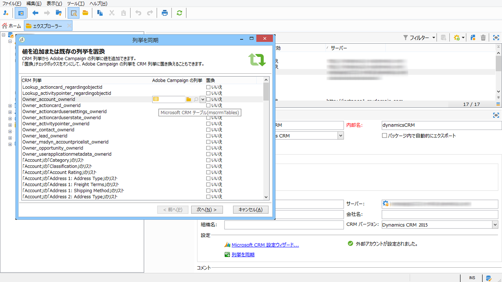

# Campaign と Microsoft Dynamics 365 の接続{#connect-to-msdyn}

このページでは、Campaign Classic を **Microsoft Dynamics CRM 365** に接続する方法について説明します。

可能なデプロイメントは次のとおりです。

* **Web API** 経由（推奨）。 Microsot Dynamics との接続を設定する手順については、[以下の節](#microsoft-dynamics-implementation-step)を参照してください。
* **Office 365** と共に使用します。 この統合を設定する主な手順については、[こちらのビデオ](#microsoft-dynamics-office-365)を参照してください。
* **オンプレミス**&#x200B;デプロイメントの場合は、Office 365 の主な手順を適用します。

データ同期は、専用のワークフローアクティビティを使用して実行します。 [詳細情報](../../platform/using/crm-data-sync.md)。


>[!NOTE]
>
> Campaign と互換性のある CRM システムのバージョンは、[互換性マトリックス](../../rn/using/compatibility-matrix.md#CRMconnectors)に記載されています。


## 実装手順{#microsoft-dynamics-implementation-steps}

**Web API** を介して Adobe Campaign と連携するように Microsoft Dynamics 365 に接続するには、次の手順を適用する必要があります。

Microsoft Dynamics CRM 内：
1. Microsoft Dynamics クライアント ID の取得
1. Microsoft Dynamics Client シークレットの生成
1. 権限の設定
1. アプリユーザーの作成
1. 秘密鍵のエンコード

詳しくは、[こちらの節](#config-crm-microsoft)を参照してください。

Campaign Classic 内：
1. 新しい外部アカウントの作成
1. Microsoft Dynamics 設定を使用した外部アカウントの設定
1. 設定ウィザードを使用したテーブルのマッピングと列挙の同期
1. 同期ワークフローの作成

詳しくは、[こちらの節](#configure-acc-for-microsoft)を参照してください


>[!CAUTION]
> Adobe Campaign を Microsoft Dynamics に接続する場合、次のことはできません。
> * CRM の動作が変わり Adobe Campaign との互換性の問題が生じる可能性があるプラグインのインストール
> * 複数の列挙の選択

>


## Microsoft Dynamics CRM の設定 {#config-crm-microsoft}

アカウントをセットアップするためのアクセストークンとキーを生成するには、**グローバル管理者**&#x200B;の資格情報を使用して [Microsoft Azure Directory](https://portal.azure.com) にログインする必要があります。 次に、以下に示す手順に従います。

### Microsoft Dynamics クライアント ID の取得 {#get-client-id-microsoft}

クライアント ID を取得するには、Azure Active Directory にアプリを登録する必要があります。 クライアント ID はアプリケーション ID と同じです。

1. **Azure Active Directory／アプリ登録**&#x200B;に移動し、「**新しいアプリケーションの登録**」をクリックします。
1. **adobecampaign`<instance identifier>`** など、インスタンスの識別に役立つ一意の名前を指定します。
1. 「**アプリケーションの種類**」を **web アプリ／API** として選択します。
1. 「**サインオン URL**」には `http://localhost` を使用します。

保存すると、Campaign のクライアント識別子である&#x200B;**アプリケーション ID** が取得されます。

詳しくは、[こちらのページ](https://docs.microsoft.com/en-us/powerapps/developer/common-data-service/walkthrough-register-app-azure-active-directory)を参照してください。

### Microsoft Dynamics クライアントシークレットの生成 {#config-client-secret-microsoft}

クライアントシークレットは、クライアント ID に対して一意のキーです。 証明書キー識別子を取得するには、次の手順に従います。

1. **Azure Active Directory／アプリ登録**&#x200B;に移動し、以前に作成されたアプリケーションを選択します。
1. 「**証明書とシークレット**」をクリックします。
1. 「**証明書をアップロード**」をクリックし、生成された公開証明書を参照してアップロードします。
1. 証明書を生成するには、OpenSSL を使用します。

   例：

   ```
   - openssl req -x509 -sha256 -nodes -days 365 -newkey rsa:2048 -keyout '<'private key name'>' -out '<'public certificate name'>
   ```

1. 「**マニフェスト**」リンクをクリックして、**証明書キー識別子**&#x200B;と&#x200B;**キー ID** を取得します。

### 権限の設定 {#config-permissions-microsoft}

作成したアプリに対する&#x200B;**必要な権限**&#x200B;を設定する必要があります。

1. **Azure Active Directory／アプリ登録**&#x200B;に移動し、以前に作成されたアプリケーションを選択します。
1. 左上の「**設定**」をクリックします。
1. 「**必要な権限**」で、「**追加**」と **API／Dynamics CRM オンライン**&#x200B;をクリックします。
1. 次に、「**選択**」をクリックし、「**組織ユーザーとして Dynamics 365 にアクセス**」チェックボックスを有効にして、「**選択**」をクリックします。

### アプリユーザーの作成 {#create-app-user-microsoft}

アプリユーザーとは、上で登録したアプリケーションで使用するユーザーです。 上記の登録済みのアプリを使用して Microsoft Dynamics に対しておこなった変更は、このユーザーを通じておこなわれます。

**手順 1**：Azure Active Directory に非インタラクティブユーザーを作成する

1. **Azure Active Directory／ユーザー**&#x200B;をクリックし、「**新しいユーザー**」をクリックします。
1. 使用する適切な名前を指定し、ユーザー名は E メールフォーマットにする必要があります。
1. **ディレクトリロール**&#x200B;の **Dynamics 365 管理者**&#x200B;を選択します。

**手順 2**：作成したユーザーに適切なライセンスを割り当てる

1. [Microsoft Azure](https://portal.azure.com) から、「**管理者アプリ**」をクリックします。
1. **ユーザー／アクティブなユーザー**&#x200B;に移動し、新しく作成したユーザーをクリックします。
1. 「**製品ライセンスを編集**」をクリックし、**Dynamics 365 顧客エンゲージメントプラン**&#x200B;を選択します。
1. 「**閉じる**」をクリックします。

**手順 3**：Dynamics CRM でアプリケーションユーザーを作成する

1. [Microsoft Azure](https://portal.azure.com) から、**設定／セキュリティ／ユーザー**&#x200B;に移動します。
1. ドロップダウンをクリックし、「**アプリケーションユーザー**」を選択して「**新規**」をクリックします。
1. 上の Active Directory に作成されたユーザーと同じユーザー名を使用します

   >[!NOTE]
   >
   >同じ名前を使用すると、重複キーエラーがスローされるので、この手順が必要かどうかの確認が得られるまで、別のユーザー名を使用して先に進みます。

1. **アプリケーション ID** を[以前に作成したアプリケーション](#get-client-id-microsoft)に割り当てます。
1. 「**ロールの管理**」をクリックし、ユーザーに対して&#x200B;**システム管理者**&#x200B;ロールを選択します。

## Campaign の設定 {#configure-acc-for-microsoft}

Microsoft Dynamics 365 と Campaign を接続するには、Campaign で専用外部アカウントを作成し、設定する必要があります。

1. **[!UICONTROL 管理／プラットフォーム／外部アカウント]**&#x200B;に移動します。

1. 新しい外部アカウントを作成し、**[!UICONTROL Microsoft Dynamics CRM]** を選択し、「**[!UICONTROL 有効にする]**」オプションを選択します。

1. **[!UICONTROL Web API]** デプロイメントの種類を選択します。

   Adobe Campaign Classic は、**[!UICONTROL 証明書]**&#x200B;または&#x200B;**[!UICONTROL パスワード資格情報]**&#x200B;による認証用に、OAuth プロトコルを使用した Dynamics 365 REST インターフェイスをサポートしています。

   Azure Directory で[以前に定義された](#get-client-id-microsoft)設定を使用して、外部アカウントを設定します。

   

   >[!NOTE]
   >
   >Microsoft Dynamics CRM 外部アカウント設定の詳細については、[こちらの節](../../installation/using/external-accounts.md#microsoft-dynamics-crm-external-account)を参照してください。

1. 「**[!UICONTROL Microsoft CRM 設定ウィザード...]**」リンクをクリックします：Adobe Campaign は、Microsoft Dynamics データテンプレートからテーブルを自動的に検出します。

   

1. 復元するテーブルを選択します。

   

1. 「**[!UICONTROL 次へ]**」をクリックして、対応するスキーマの作成を開始します。

   

   >[!NOTE]
   >
   >設定を承認するには、Adobe Campaign コンソールからいったん切断し、再接続する必要があります。

   一致するデータスキーマが Adobe Campaign で使用可能になったことを確認できます。

   

1. 「**[!UICONTROL 列挙を同期]**」リンクをクリックし、Adobe Campaign と Microsoft Dynamics 間の列挙の同期を開始します。

   

これで Campaign と Microsoft Dynamics が接続されました。 2 つのシステム間でデータの同期を設定できます。 詳しくは、[データ同期](../../platform/using/crm-data-sync.md)の節を参照してください。

## Microsoft Dynamics CRM Office 365 統合の設定{#microsoft-dynamics-office-365}

このビデオでは、Office 365 デプロイメントのコンテキストで、Dynamics 365 と Adobe Campaign Classic を統合する方法を説明します。

>[!VIDEO](https://video.tv.adobe.com/v/23837?quality=12)


## サポートされるフィールドデータ型 {#ms-dyn-supported-types}

Microsoft Dynamics 365 でサポートされる／サポートされない属性タイプは、次のとおりです。


| 属性タイプ | サポート対象 |
| --------------------------------------------------------------------------------- | --------- |
| 基本型：ブール、日時、小数、浮動小数点数、倍精度浮動小数点数、整数、bigint、文字列 | はい |
| 金額（倍精度浮動小数点数） | はい |
| memo、entityname、primarykey、uniqueidentifier（文字列） | はい |
| ステータス、ピックリスト（使用可能な値を列挙型に格納）、ステート（文字列） | はい |
| 所有者（文字列） | はい |
| ルックアップ（単一のエンティティ参照ルックアップのみ） | はい |
| 顧客 | いいえ |
| 関連 | いいえ |
| PartyList | いいえ |
| ManagedProperty | いいえ |
