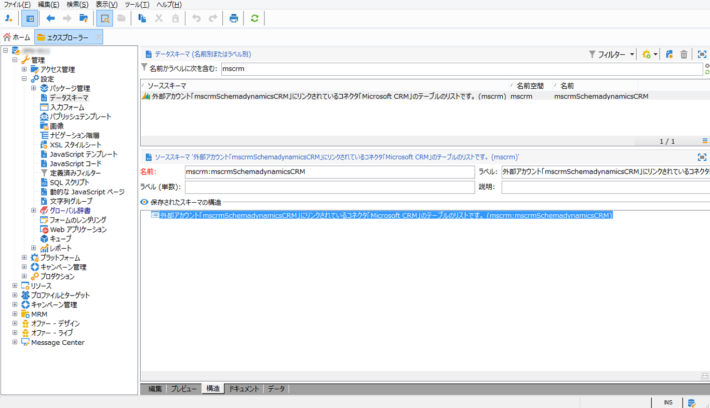

# キャンペーンとMicrosoft Dynamics 365の接続{#connect-to-msdyn}

このページでは、Campaign Classicを&#x200B;**Microsoft Dynamics CRM 365**&#x200B;に接続する方法を学びます。

可能な展開は次のとおりです。

* **Web API**&#x200B;経由（推奨）。 Microsoft Dynamicsとの接続を設定する手順については、[](#microsoft-dynamics-implementation-step)のセクションを参照してください。
* **Office 365**&#x200B;と共に使用します。 この統合を設定する主な手順については、[このビデオ](#microsoft-dynamics-office-365)を参照してください。
* **オンプレミス**&#x200B;展開の場合は、Office 365のキーステップを適用します。

専用のワークフローアクティビティを介してデータ同期を行う。 [詳細情報](../../platform/using/crm-data-sync.md)。


>[!NOTE]
>
> キャンペーンと互換性のあるCRMシステムのバージョンは、[互換表](../../rn/using/compatibility-matrix.md#CRMconnectors)に記載されています。


## 実装の手順{#microsoft-dynamics-implementation-steps}

**Web API**&#x200B;を介してAdobe Campaignと連携するようにMicrosoft Dynamics 365に接続するには、次の手順を適用する必要があります。

Microsoft Dynamics CRM内：
1. Microsoft DynamicsクライアントIDの取得
1. Microsoft Dynamics Clientシークレットの生成
1. 権限の設定
1. アプリユーザーの作成
1. 秘密鍵をエンコードする

[詳しくは、この節](#config-crm-microsoft)を参照してください。

Campaign Classic内：
1. 新しい外部アカウントの作成
1. Microsoft Dynamics設定で外部アカウントを構成する
1. 構成ウィザードを使用したテーブルのマッピングと定義済みリストの同期
1. 同期ワークフローの作成

[詳しくは、この節](#configure-acc-for-microsoft)を参照してください。


>[!CAUTION]
> Adobe CampaignをMicrosoft Dynamicsに接続する場合、次の操作はできません。
> * CRMの動作を変更し、Adobe Campaignとの互換性の問題を引き起こす可能性のあるプラグインをインストールします。
> * 複数の定義済みリストの選択

>


## Microsoft Dynamics CRM {#config-crm-microsoft}の構成

アカウントをセットアップするアクセストークンとキーを生成するには、**グローバル管理者**&#x200B;資格情報を使用して[Microsoft Azure Directory](https://portal.azure.com)にログインする必要があります。 次に、以下に示す手順に従います。

### Microsoft DynamicsクライアントIDの取得{#get-client-id-microsoft}

クライアントIDを取得するには、Azure Active Directoryにアプリを登録する必要があります。 クライアントIDはアプリケーション IDと同じです。

1. **Azure Active Directory/アプリ登録**&#x200B;に移動し、**新しいアプリケーション登録**&#x200B;をクリックします。
1. **adobecampaign`<instance identifier>`**&#x200B;など、インスタンスの識別に役立つ一意の名前を指定します。
1. 「**アプリケーションの種類**」を&#x200B;**Webアプリ/API**&#x200B;として選択します。
1. **サインオンURL**&#x200B;には`http://localhost`を使用します。

保存すると、キャンペーン用のクライアントIDである&#x200B;**アプリケーション ID**&#x200B;が取得されます。

詳しくは、[このページ](https://docs.microsoft.com/en-us/powerapps/developer/common-data-service/walkthrough-register-app-azure-active-directory)を参照してください。

### Microsoft Dynamicsクライアントシークレットの生成{#config-client-secret-microsoft}

クライアントシークレットは、クライアントIDに対して一意のキーです。 証明書キー識別子を取得するには、次の手順に従います。

1. **Azure Active Directory/アプリ登録**&#x200B;に移動し、以前に作成されたアプリケーションを選択します。
1. 「**証明書とシークレット**」をクリックします。
1. 「**証明書**&#x200B;をアップロード」をクリックし、生成された公開証明書を参照してアップロードします。
1. 証明書を生成するには、opensslを使用できます。

   例：

   ```
   - openssl req -x509 -sha256 -nodes -days 365 -newkey rsa:2048 -keyout '<'private key name'>' -out '<'public certificate name'>
   ```

1. **マニフェスト**&#x200B;リンクをクリックして、**証明書キー識別子**&#x200B;と&#x200B;**キーID**&#x200B;を取得します。

### 権限の設定{#config-permissions-microsoft}

作成したアプリに対して&#x200B;**必要な権限**&#x200B;を設定する必要があります。

1. **Azure Active Directory/アプリ登録**&#x200B;に移動し、以前に作成されたアプリケーションを選択します。
1. 左上の&#x200B;**設定**&#x200B;をクリックします。
1. **必要な権限**&#x200B;で、**追加**&#x200B;と&#x200B;**API/Dynamics CRM Online**&#x200B;をクリックします。
1. 次に、**「**&#x200B;を選択」をクリックし、「**組織ユーザーとしてDynamics 365にアクセス**」チェックボックスを有効にして、**「**&#x200B;を選択」をクリックします。

### アプリユーザーの作成{#create-app-user-microsoft}

アプリユーザーとは、上で登録したアプリケーションが使用するユーザーです。 上記の登録済みのアプリを使用してMicrosoft Dynamicsに対して行った変更は、このユーザーを通じて行われます。

**手順1**:Azure Active Directoryに非インタラクティブユーザーを作成する

1. **Azure Active Directory/ユーザー**&#x200B;をクリックし、**新しいユーザー**&#x200B;をクリックします。
1. 使用する正しい名前を指定し、E メールフォーマット名を入力します。
1. **ディレクトリロール**&#x200B;の&#x200B;**Dynamics 365管理者**&#x200B;を選択します。

**手順2**:作成したユーザーに適切なライセンスを割り当てる

1. [Microsoft Azure](https://portal.azure.com)から、**管理者アプリ**&#x200B;をクリックします。
1. **ユーザー/アクティブなユーザー**&#x200B;に移動し、新しく作成したユーザーをクリックします。
1. **製品ライセンスを編集**&#x200B;をクリックし、**Dynamics 365 Customer Engagement Plan**&#x200B;を選択します。
1. 「**閉じる**」をクリックします。

**手順3**:Dynamics CRMでのアプリケーションユーザーの作成

1. [Microsoft Azure](https://portal.azure.com)から、**設定/セキュリティ/ユーザー**&#x200B;に移動します。
1. ドロップダウンをクリックし、「**アプリケーションユーザー**」を選択して「**新規**」をクリックします。
1. 上のActive Directoryに作成されたユーザーと同じユーザー名を使用します

   >[!NOTE]
   >
   >同じ名前を使用すると、重複キーエラーがスローされるので、この手順が必要かどうかの確認が得られるまで、別のユーザー名を使用して先に進みます。

1. **アプリケーション ID**&#x200B;を[以前に作成したアプリケーション](#get-client-id-microsoft)に割り当てます。
1. 「**ロールの管理**」をクリックし、ユーザーに対して&#x200B;**システム管理者**&#x200B;ロールを選択します。

## キャンペーンの構成{#configure-acc-for-microsoft}

Microsoft Dynamics 365とキャンペーンを接続するには、キャンペーンで専用外部アカウントを作成し、構成する必要があります。

1. **[!UICONTROL 管理/プラットフォーム/外部アカウント]**&#x200B;に移動します。

1. 新しい外部アカウントを作成し、種類&#x200B;**[!UICONTROL Microsoft Dynamics CRM]**&#x200B;を選択し、**[!UICONTROL 有効にする]**&#x200B;オプションを選択します。

1. **[!UICONTROL Web API]**&#x200B;展開の種類を選択します。

   Adobe Campaign Classicは、**[!UICONTROL 証明書]**&#x200B;または&#x200B;**[!UICONTROL パスワード資格情報]**&#x200B;での認証用に、OAuthプロトコルを使用したDynamics 365 RESTインターフェイスをサポートしています。

   Azure Directoryで[定義済みの設定](#get-client-id-microsoft)を使用して、外部アカウントを構成します。

   

   >[!NOTE]
   >
   >Microsoft Dynamics CRM外部アカウント構成の詳細は、このセクション](../../installation/using/external-accounts.md#microsoft-dynamics-crm-external-account)[に記載されています。

1. **[!UICONTROL Microsoft CRM構成ウィザードをクリックします…]**&#x200B;リンク：Adobe Campaignは、Microsoft Dynamicsデータテンプレートからテーブルを自動的に検出します。

   

1. 収集するテーブルを選択します。

   

1. 「**[!UICONTROL 次へ]**」をクリックして、対応するスキーマの作成を開始します。

   

   >[!NOTE]
   >
   >設定を承認するには、Adobe Campaign コンソールから切断し、再接続する必要があります。

   一致するデータスキーマがAdobe Campaignで使用可能になったことを確認できます。

   

1. **[!UICONTROL [同期中]定義済みリストをクリックします…]** Adobe CampaignとMicrosoft Dynamicsの間の開始同期定義済みリストへのリンク。

   

キャンペーンとMicrosoft Dynamicsが接続されました。 2つのシステム間でデータの同期を設定できます。 詳しくは、[データ同期](../../platform/using/crm-data-sync.md)の節を参照してください。

## Microsoft Dynamics CRM Office 365統合を構成{#microsoft-dynamics-office-365}

このビデオでは、Office 365展開のコンテキストで、Dynamics 365をAdobe Campaign Classicと統合する方法を学習します。

>[!VIDEO](https://video.tv.adobe.com/v/23837?quality=12)


## サポートされるフィールドデータ型{#ms-dyn-supported-types}

Microsoft Dynamics 365でサポートされる/サポートされない属性の種類は、次のとおりです。


| 属性タイプ | サポート対象 |
| --------------------------------------------------------------------------------- | --------- |
| 基本型：boolean, datetime, decimal, float,重複，整数， bigint, string | Yes |
| お金(重複) | はい |
| memo、entityname、primarykey、uniqueidentifier（文字列） | はい |
| ステータス、picklist(定義済みリストーに使用可能な値を格納)、state（文字列） | はい |
| owner（文字列） | はい |
| 参照（単一のエンティティ参照参照のみ） | はい |
| 顧客 | No |
| 関連 | いいえ |
| PartyList | いいえ |
| ManagedProperty | いいえ |
