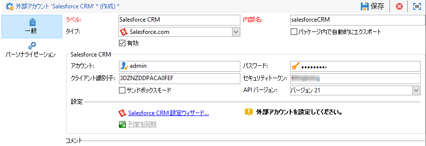
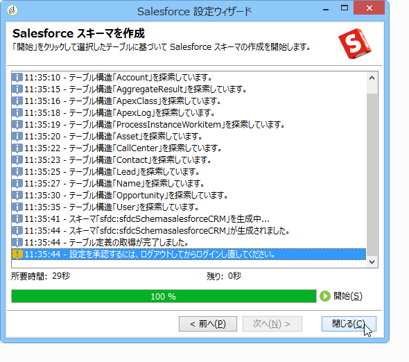
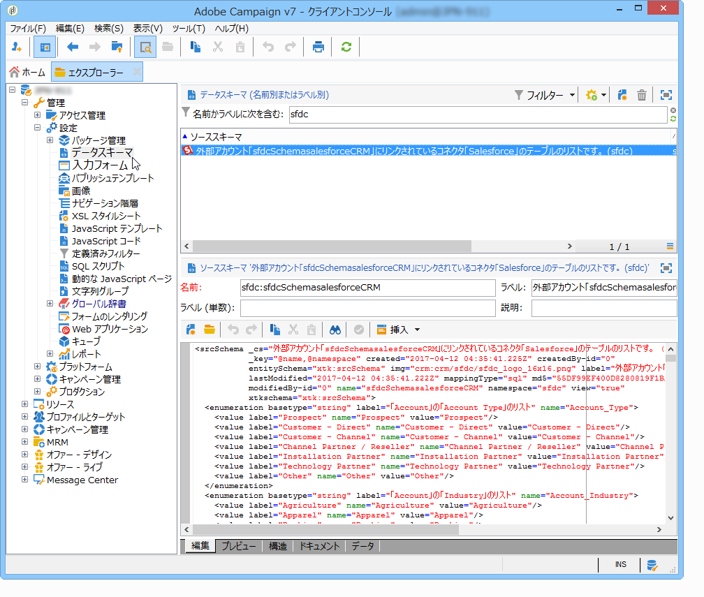
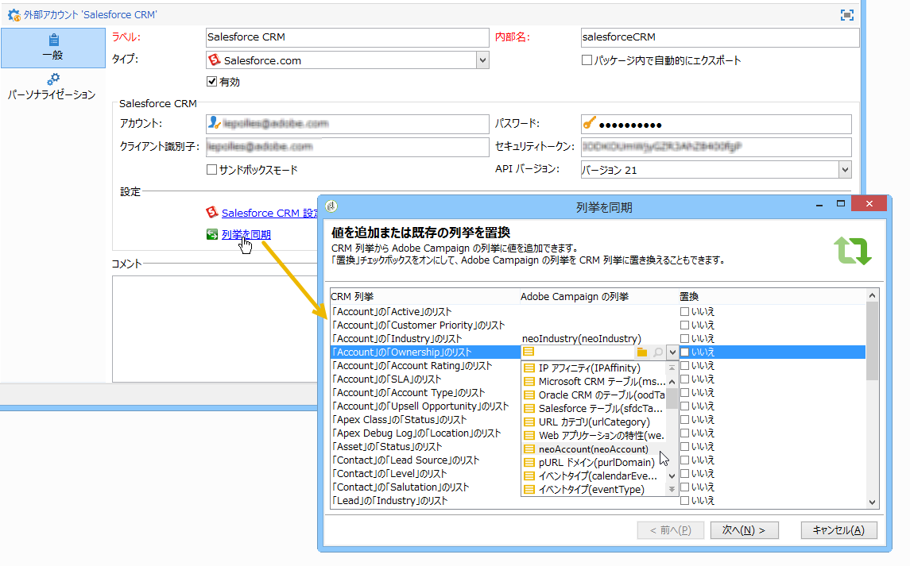
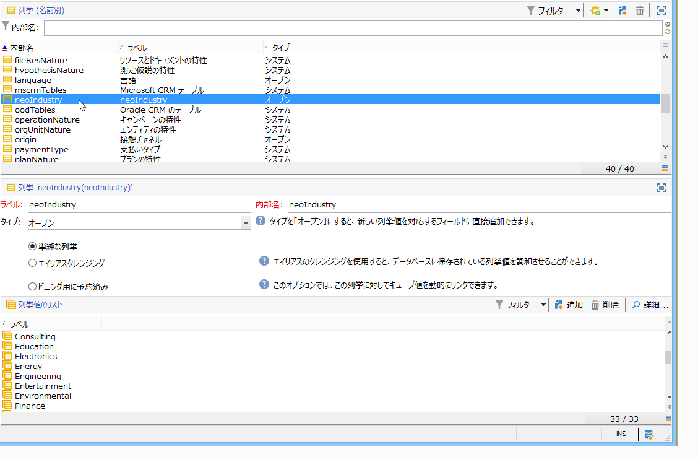
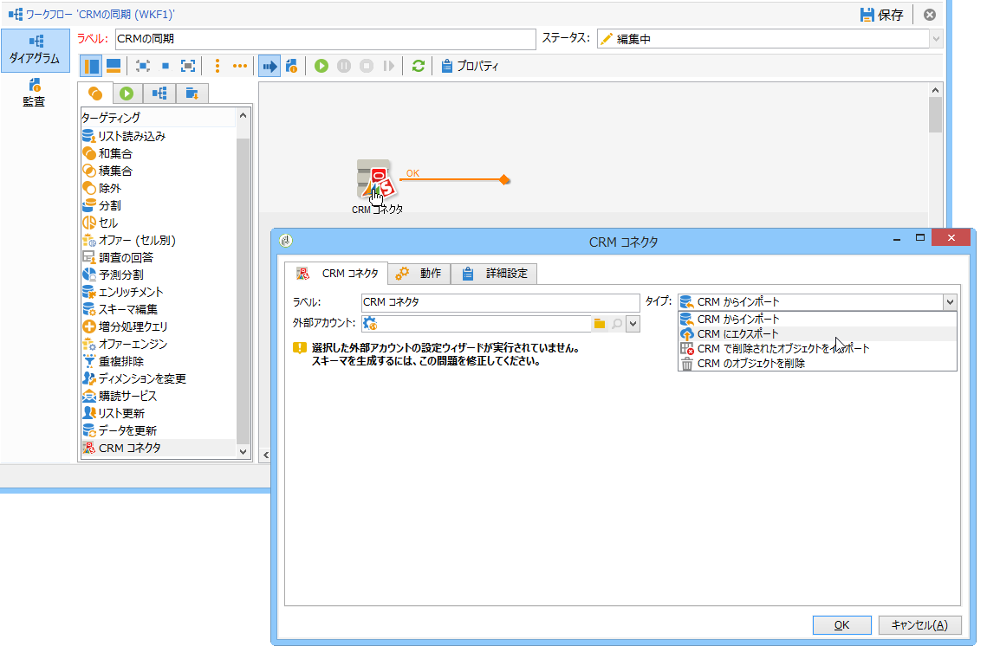

# Campaign と Salesforce.com の接続{#connect-to-sfdc}

このページでは、Campaign Classic を **Salesforce** に接続する方法について説明します。

データ同期は、専用のワークフローアクティビティを使用して実行します。 [詳細情報](../../platform/using/crm-data-sync.md)。

外部アカウントを使用すると、Salesforce データをAdobe Campaignに読み込んだり書き出したりできます。
Salesforce用のCRM コネクタを設定するには、次の手順に従います。

1. Adobe Campaign ツリーの&#x200B;**[!UICONTROL 管理／プラットフォーム／外部アカウント]**&#x200B;ノードを使用して、新しい外部アカウントを作成します。
1. **[!UICONTROL Salesforce.com]** を選択します。
1. 接続を有効にするための設定を入力します。

   

   Salesforce CRM 外部アカウントを Adobe Campaign で使用できるように設定するには、次の情報を提供する必要があります。

   * **[!UICONTROL アカウント]**
Salesforce CRMへのログインに使用するアカウント。

   * **[!UICONTROL パスワード]**
Salesforce CRMへのログインに使用するパスワード。

   * **[!UICONTROL クライアント ID]**
クライアント IDの検索場所については、この[ ページ ](https://help.salesforce.com/articleView?id=000205876&type=1)を参照してください。

   * **[!UICONTROL セキュリティトークン]**
セキュリティトークンの場所については、この[ ページ ](https://help.salesforce.com/articleView?id=000205876&type=1)を参照してください。

   * **[!UICONTROL API バージョン]**
APIのバージョンを選択します。
1. 設定アシスタントを実行して、使用可能な CRM テーブルを生成します。設定アシスタントでは、テーブルを収集し、一致するスキーマを作成できます。

   

   >[!NOTE]
   >
   >設定を承認するには、Adobe Campaign コンソールからログオフし、再度ログオンする必要があります。

1. **[!UICONTROL 管理／設定／データスキーマ]**&#x200B;ノードで、Adobe Campaign で生成されたスキーマを確認します。

   **Salesforce** スキーマの例：

   

1. スキーマを作成したら、列挙を Salesforce から Adobe Campaign に自動的に同期することができます。

   それには、「**[!UICONTROL 列挙を同期...]**」リンクをクリックし、Salesforce 列挙に対応する Adobe Campaign 列挙を選択します。

   

   >[!NOTE]
   >
   >Adobe Campaign の列挙のすべての値を CRM の値に置き換えることができます。そのためには、**[!UICONTROL 置換]**&#x200B;列の「**[!UICONTROL はい]**」を選択します。

   「**[!UICONTROL 次へ]**」をクリックしてから「**[!UICONTROL 開始]**」をクリックし、リストのインポートを開始します。

1. **[!UICONTROL 管理／プラットフォーム／列挙]**&#x200B;メニューで、インポートされた値を確認します。

   

   >[!NOTE]
   >
   > 複数選択列挙はサポートされていません。

これで Campaign と Salesforce.com が接続されました。 2 つのシステム間にデータの同期を設定できます。

Adobe Campaign データと SFDC の間でデータを同期させるには、ワークフローを作成し、**[!UICONTROL CRM コネクタ]**&#x200B;アクティビティを使用する必要があります。

データの同期について詳しくは、[このページ](../../platform/using/crm-data-sync.md)を参照してください。
