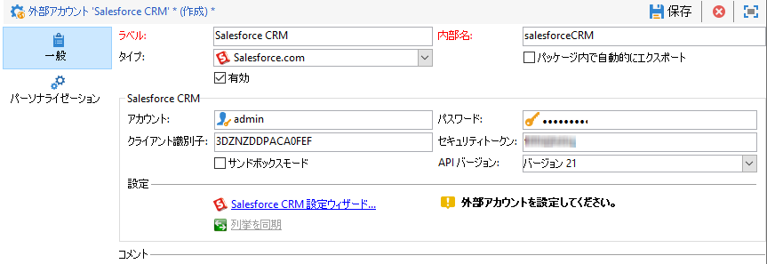
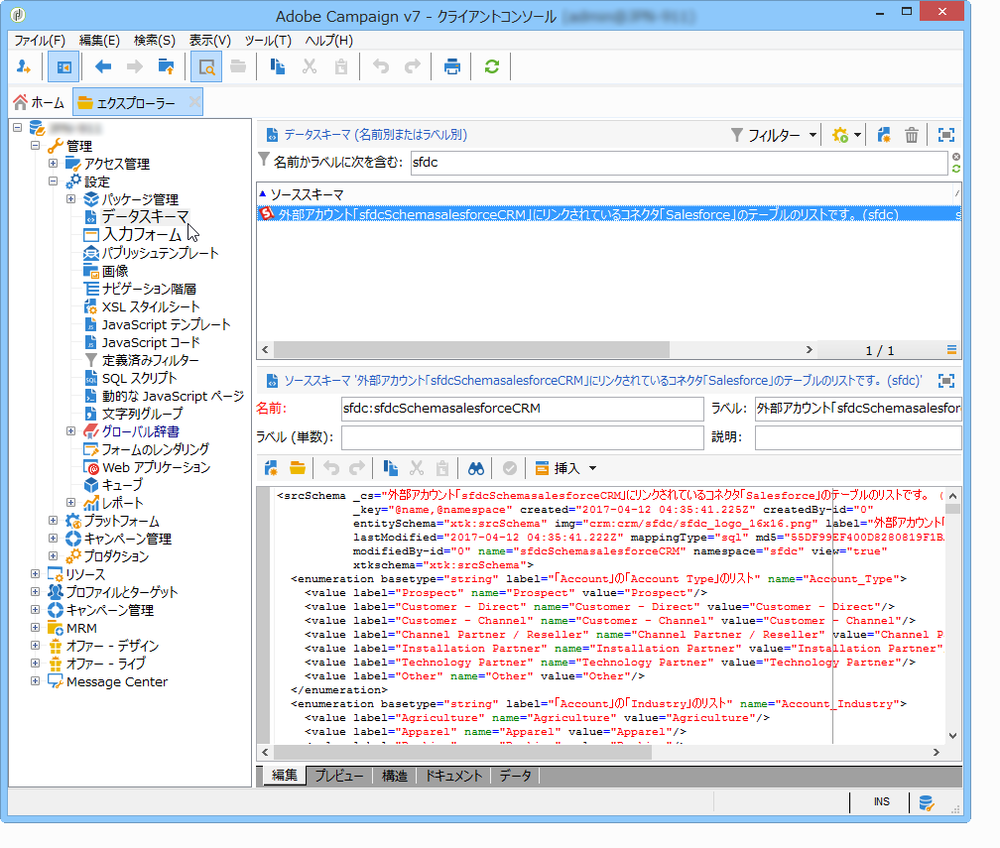

# Campaign と Microsoft Dynamics 365 の接続{#connect-to-msdyn}

このページでは、Campaign Classicを&#x200B;**Salesforce**&#x200B;に接続する方法を学びます。

データ同期は、専用のワークフローアクティビティを使用して実行します。 [詳細情報](../../platform/using/crm-data-sync.md)。

 外部アカウントを使用すれば、Adobe Campaign から Salesforce データをインポートおよびエクスポートできます。Salesforce用CRMコネクタを設定するには、次の手順に従います。

1. Adobe Campaign ツリーの&#x200B;**[!UICONTROL 管理／プラットフォーム／外部アカウント]**&#x200B;ノードを使用して、新しい外部アカウントを作成します。
1. **[!UICONTROL Salesforce.com]**&#x200B;を選択します。
1. 接続を有効にする設定を入力します。

   

   Salesforce CRM 外部アカウントを Adobe Campaign で使用できるように設定するには、次の情報を提供する必要があります。

   * **[!UICONTROL アカウント]** Salesforce CRM へのログインに使用するアカウント。

   * **[!UICONTROL Salesforce CRMへのサインインに使用する]**
パスワード。

   * **[!UICONTROL クライアント]**
識別子クライアント識別子の場所を知るには、この [ページを参照してください](https://help.salesforce.com/articleView?id=000205876&amp;type=1)。

   * **[!UICONTROL セキュリティト]**
ークンセキュリティトークンの場所を知るには、この [ページを参照してください](https://help.salesforce.com/articleView?id=000205876&amp;type=1)。

   * **[!UICONTROL API]**
バージョンAPIのバージョンを選択します。
1. 設定ウィザードを実行して、使用可能な CRM テーブルを生成します。設定ウィザードでは、テーブルを収集し、一致するスキーマを作成できます。

   

   >[!NOTE]
   >
   >設定を承認するには、Adobe Campaign コンソールからログオフし、再度ログオンする必要があります。

1. **[!UICONTROL 管理／設定／データスキーマ]**&#x200B;ノードで、Adobe Campaign で生成されたスキーマを確認します。

   **Salesforce** スキーマの例：

   

1. スキーマを作成すると、定義済みリストをSalesforceからAdobe Campaignに自動的に同期できます。

   これを行うには、**[!UICONTROL 同期定義済みリストをクリックします…]**&#x200B;リンクをクリックし、Salesforce定義済みリストに一致するAdobe Campaign定義済みリストを選択します。

   

   >[!NOTE]
   >
   >Adobe Campaign の列挙のすべての値を CRM の値に置き換えることができます。そのためには、**[!UICONTROL 置換]**&#x200B;列の「**[!UICONTROL はい]**」を選択します。

   「**[!UICONTROL 次へ]**」をクリックしてから「**[!UICONTROL 開始]**」をクリックし、リストのインポートを開始します。

1. **[!UICONTROL 管理／プラットフォーム／列挙]**&#x200B;メニューで、インポートされた値を確認します。

   

   >[!NOTE]
   >
   > 複数の選択定義済みリストはサポートされていません。

キャンペーンとSalesforce.comが接続されました。 2 つのシステム間でデータの同期を設定できます。 

Adobe CampaignデータとSFDCの間でデータを同期するには、ワークフローを作成し、**[!UICONTROL CRMコネクタ]**&#x200B;アクティビティを使用する必要があります。

データ同期の詳細については、[こちらのページ](../../platform/using/crm-data-sync.md)を参照してください。
