# フィルター条件の定義{#defining-filter-conditions}

## 演算子の選択 {#choosing-the-operator}

フィルター条件内で、演算子を使用して 2 つの値をリンクする必要があります。

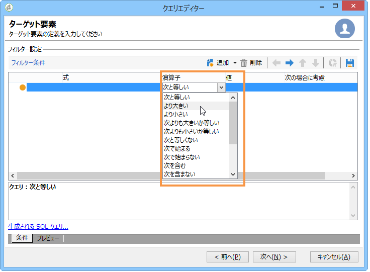

次に、使用可能な演算子のリストを示します。

<table> 
 <thead> 
  <tr> 
   <th> 演算子  </th> 
   <th> 目的  </th> 
   <th> 例  </th> 
  </tr> 
 </thead> 
 <tbody> 
  <tr> 
   <td> 次と等しい   </td> 
   <td> 2 番目の「値」列に入力されたデータと同一の結果を返します。  </td> 
   <td> <strong>姓（@lastName）が「佐藤」と等しい</strong>は、姓が佐藤の受信者のみを返します。  </td> 
  </tr> 
  <tr> 
   <td> より大きい   </td> 
   <td> 入力された値より大きい値を返します。  </td> 
   <td> <strong>年齢（@age）が 50 より大きい</strong>は、「50」より大きいすべての値（「51」、「52」など）を返します。  </td> 
  </tr> 
  <tr> 
   <td> より小さい   </td> 
   <td> 入力された値より小さい値を返します。  </td> 
   <td> <strong>作成日（@created）が「DaysAgo(100)」より小さい</strong>は、過去 100 日以内に作成されたすべての受信者を返します。  </td> 
  </tr> 
  <tr> 
   <td> 次よりも大きいか等しい   </td> 
   <td> 入力された値より大きいか等しいすべての値を返します。  </td> 
   <td> <strong>年齢（@age）が「30」よりも大きいか等しい</strong>は、30 歳以上のすべての受信者を返します。  </td> 
  </tr> 
  <tr> 
   <td> 次よりも小さいか等しい   </td> 
   <td> 入力された値より小さいか等しいすべての値を返します。  </td> 
   <td> <strong>年齢（@age）が「60」よりも小さいか等しい</strong>は、60 歳以下のすべての受信者を返します。  </td> 
  </tr> 
  <tr> 
   <td> 次と等しくない   </td> 
   <td> 入力された値と等しくないすべての値を返します。  </td> 
   <td> <strong>言語（@language）が「英語」と等しくない</strong>。  </td> 
  </tr> 
  <tr> 
   <td> 次で始まる   </td> 
   <td> 入力された値で始まる結果を返します。  </td> 
   <td> <strong>アカウント番号（@account）が「32010」で始まる。</strong>  </td> 
  </tr> 
  <tr> 
   <td> 次で始まらない   </td> 
   <td> 入力された値で始まらない結果を返します。  </td> 
   <td> <strong>アカウント番号（@account）が「20」で始まらない</strong>。  </td> 
  </tr> 
  <tr> 
   <td> 次を含む   </td> 
   <td> 入力された値を含む結果を返します。  </td> 
   <td> <strong>E メールドメイン（@domain）が「mail」を含む</strong>は、「mail」を含むすべてのドメイン名を返します。したがって、「gmail.com」ドメインも返されます。  </td> 
  </tr> 
  <tr> 
   <td> 次を含まない   </td> 
   <td> 入力された値を含まない結果を返します。  </td> 
   <td> <strong>E メールドメイン（@domain）が「vo」を含まない</strong>。この場合、「vo」を含むドメイン名は返されません。結果には「Voila.jp」ドメイン名は表示されません。  </td> 
  </tr> 
  <tr> 
   <td> 次に類似   </td> 
   <td> 「次に類似」は、「次を含む」演算子と非常によく似ています。値に % ワイルドカード文字を挿入できます。  </td> 
   <td> <strong>姓（@lastName）が「Jon%s」に類似している</strong>。ここでは、オペレーターが「n」と「s」の間の欠落している英数字を忘れたので、ワイルドカード文字が「Jones」という名前を検索するための「ジョーカー」として使用されています。  </td> 
  </tr> 
  <tr> 
   <td> 次に類似しない   </td> 
   <td> 「次に類似」と似ています。入力した値を収集しないようにすることができます。この演算子でも、入力した値に ％ ワイルドカード文字が含まれている必要があります。  </td> 
   <td> <strong>姓（@lastName）が「Smi%h」に類似していない</strong>。この場合、姓が「Smi%h」の受信者は返されません。  </td> 
  </tr> 
  <tr> 
   <td> 空である   </td> 
   <td> この場合、検索する結果は、2 番目の「値」列にある空の値と一致します。  </td> 
   <td> <strong>モバイル（@mobilePhone）が空である</strong>は、モバイル番号がないすべての受信者を返します。  </td> 
  </tr> 
  <tr> 
   <td> 空でない   </td> 
   <td> 「空である」演算子の逆の機能です。2 番目の「値」列にあるデータを入力する必要はありません。  </td> 
   <td> <strong>E メール（@email）は空でない</strong>。  </td> 
  </tr> 
  <tr> 
   <td> 次に含まれる   </td> 
   <td> 指定された値に含まれる結果を返します。これらの値はコンマで区切る必要があります。  </td> 
   <td> <strong>生年月日（@birthDate）が「1979/12/10, 1984/12/10」に含まれる</strong>は、これらの日付の間に生まれた受信者を返します。  </td> 
  </tr> 
  <tr> 
   <td> 次に含まれない   </td> 
   <td> 「次に含まれる」演算子と同様に機能します。ここでは、入力された値に基づいて受信者を除外します。  </td> 
   <td> <strong>生年月日（@birthDate）が「1972/12/10, 1984/12/10」に含まれない</strong>。前の例とは異なり、これらの日付の間に生まれた受信者は返されません。  </td> 
  </tr> 
 </tbody> 
</table>

## 「および」、「または」、「例外」の使用{#using-and--or--except}

複数のフィルター条件を使用するクエリでは、条件間のリンクを定義する必要があります。次の 3 つのリンクが使用可能です。

* 「**[!UICONTROL および]**」では、2 つのフィルター条件を組み合わせることができます。
* 「**[!UICONTROL または]**」では、別の選択肢を指定できます。
* 「**[!UICONTROL 例外]**」では、例外を定義できます。

デフォルトで表示されている「**[!UICONTROL および]**」をクリックし、ドロップダウンリストから選択します。

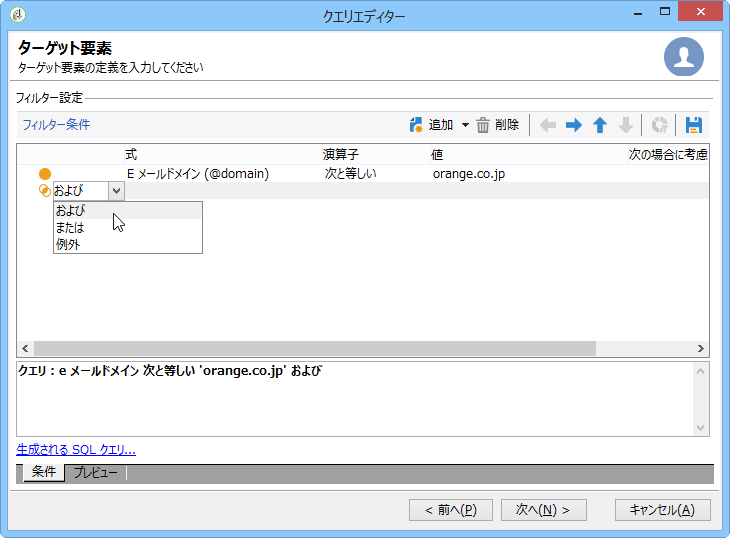

* **[!UICONTROL および]**：条件を追加し、オーバーフィルターが可能です。
* **[!UICONTROL または]**：条件を追加し、オーバーフィルターが可能です。

   次の例では、E メールドメインに「orange.co.jp」が含まれているか、郵便番号が「123」で始まる受信者を検索できます。

   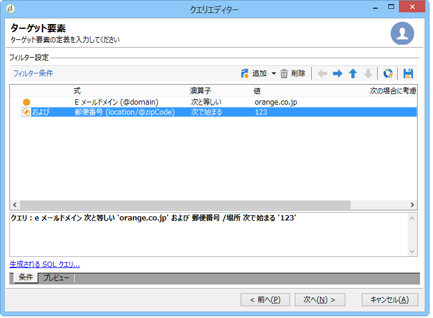

* **[!UICONTROL 例外]**：2 つのフィルターがあり、最初のフィルターで値が返されない場合、このタイプのリンクでは例外が作成されます。

   次の例では、E メールドメインに「orange.co.jp」が含まれている受信者が返されますが、受信者の姓が「田中」である場合を除きます。

   

次の例のフィルターでは、スペイン語を話す受信者、またはモバイル番号がある女性、またはアカウント番号がない受信者、および会社名が「N」の文字で始まる受信者が表示されます。

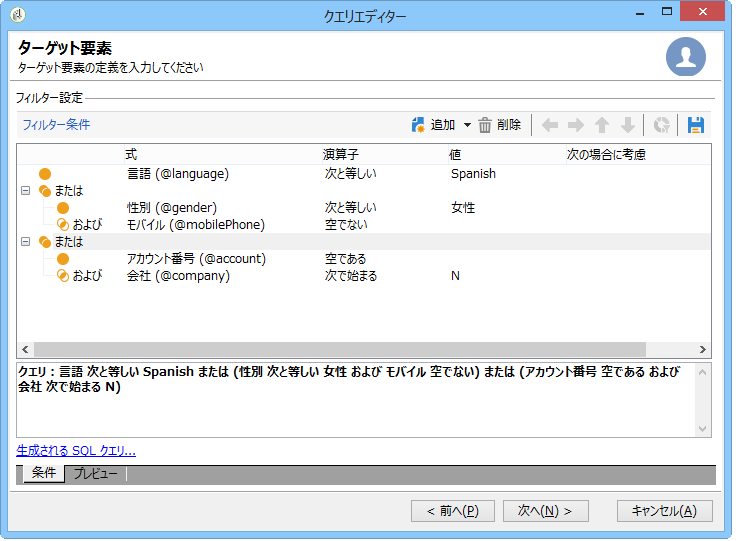

## 条件の優先順位付け {#prioritizing-conditions}

この節では、ツールバーの青色の矢印を使用して条件を優先順位付けする方法について説明します。

* 右向き矢印を使用して、括弧レベルをフィルターに追加できます。
* 左向き矢印を使用して、選択した括弧レベルをフィルターから削除できます。

   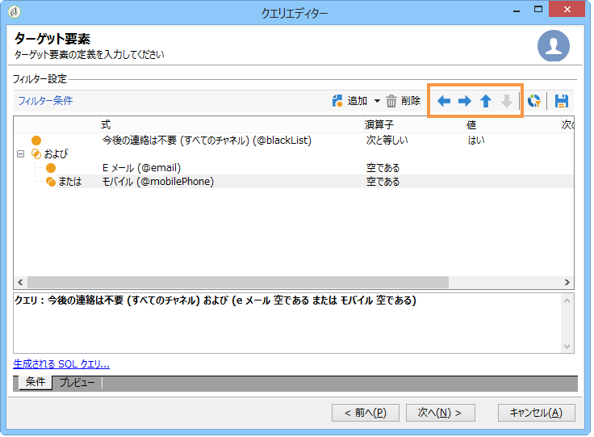

* 上下矢印を使用して、条件を移動することで実行順序を変更できます。

この例では、矢印を使用して括弧レベルを削除する方法を示します。まず、次のフィルター条件を作成します。**[!UICONTROL 市区町村が横浜市と等しい、または性別が男性と等しい、およびモバイルが指定されていない、またはアカウント番号が「95」で始まる、および会社名が「A」で始まる]**。

**[!UICONTROL 性別（@gender）が男性と等しい]**&#x200B;フィルター条件にカーソルを置き、**[!UICONTROL 括弧レベルを削除]**&#x200B;矢印をクリックします。

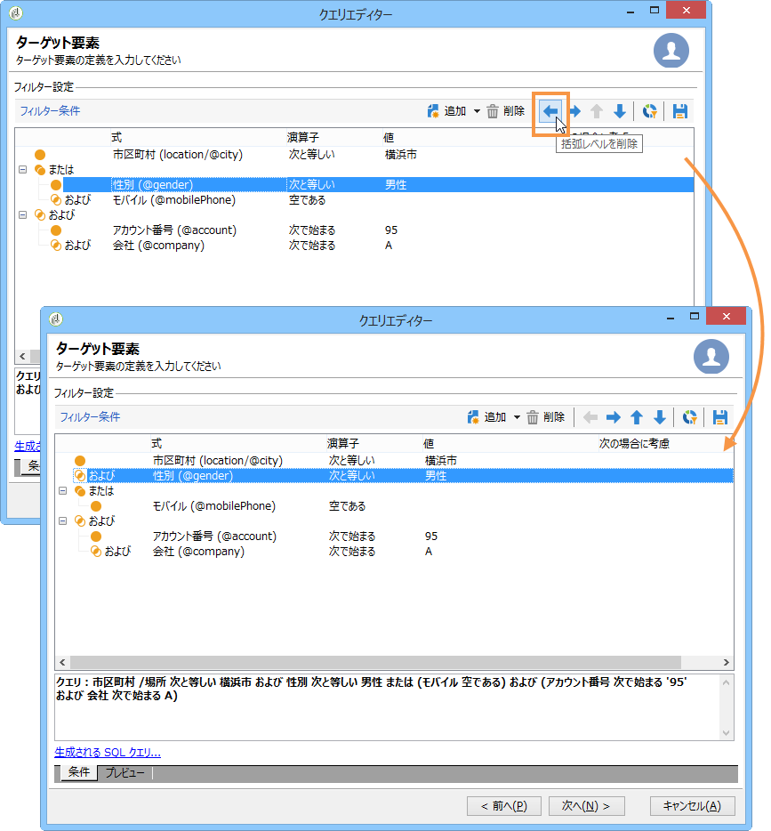

「**[!UICONTROL 性別（@gender）が男性と等しい]**」条件が括弧の外に出されます。この条件は、「市区町村が横浜市と等しい」条件と同じレベルに移動しました。これらの条件は、「**[!UICONTROL および]**」でリンクされます。

## 抽出するデータの選択 {#selecting-data-to-extract}

使用可能フィールドはテーブルごとに異なります。すべてのフィールドは、**[!UICONTROL メイン要素]**&#x200B;と呼ばれるメインノードに保存されます。次の例では、使用可能フィールドは受信者テーブルにあります。フィールドは常にアルファベット順に表示されます。

選択したフィールドの詳細がウィンドウの下部に表示されます。例えば、「**[!UICONTROL E メールドメイン]**」フィールドは「**[!UICONTROL SQL 計算フィールド]**」であり、拡張は&#x200B;**[!UICONTROL （@domain）]**&#x200B;です。

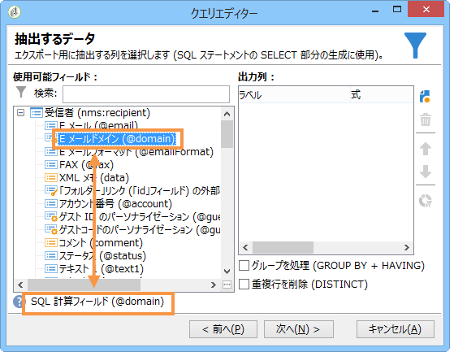

>[!NOTE]
>
>使用可能フィールドを検索するには、**[!UICONTROL 検索]**&#x200B;ツールを使用します。

出力列に追加するには、使用可能フィールドをダブルクリックします。クエリの最後に、選択した各フィールドに&#x200B;**[!UICONTROL データのプレビュー]**&#x200B;ウィンドウで列が作成されます。

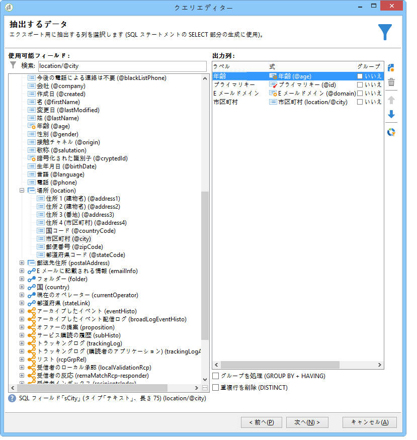

詳細フィールドはデフォルトでは表示されません。すべてを表示するには、使用可能フィールドの右下隅で&#x200B;**[!UICONTROL 詳細フィールドを表示]**&#x200B;をクリックします。前のビューに戻るには、再度クリックします。

例えば、受信者テーブルで、詳細フィールドは「**ブール値 1**」、「**[!UICONTROL ブール値 2]**」、「**[!UICONTROL ブール値 3]**」、「**[!UICONTROL 「フォルダー」リンクの外部キー]**」などです。

次の例は、受信者テーブルの使用可能フィールドを示しています。

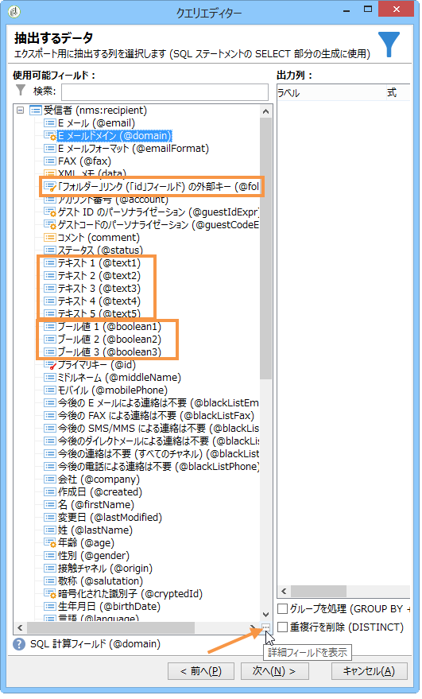

フィールドの各種カテゴリ：

<table> 
 <thead> 
  <tr> 
   <th> アイコン  </th> 
   <th> 説明  </th> 
   <th> 例  </th> 
  </tr> 
 </thead> 
 <tbody> 
  <tr> 
   <td>  </td> 
   <td> 単純フィールド  </td> 
   <td> E メール、性別など  </td> 
  </tr> 
  <tr> 
   <td>  </td> 
   <td> プライマリキー.この SQL フィールドによって、テーブル内のレコードが識別されます。  </td> 
   <td> 識別子受信者はプライマリキーであり、識別子は定義ごとに一意です。  </td> 
  </tr> 
  <tr> 
   <td>  </td> 
   <td> 外部キー。別のテーブルへのリンクとして使用されます。  </td> 
   <td> 受信者外部キー、サービス外部キーなど。  </td> 
  </tr> 
  <tr> 
   <td>  </td> 
   <td> 計算フィールド。このタイプのフィールドは、リクエストに応じてデータベース内の値を使用して計算されます。  </td> 
   <td> 年齢、E メールドメインなど。  </td> 
  </tr> 
  <tr> 
   <td>  </td> 
   <td> 長いテキストを含むフィールド。  </td> 
   <td> コメント、住所全体など。  </td> 
  </tr> 
  <tr> 
   <td>  </td> 
   <td> インデックス付きの SQL フィールド。  </td> 
   <td> 姓名、ISO コードなど。  </td> 
  </tr> 
 </tbody> 
</table>

テーブルおよびコレクション要素へのリンク：

<table> 
 <thead> 
  <tr> 
   <th> アイコン  </th> 
   <th> 説明  </th> 
   <th> 例  </th> 
  </tr> 
 </thead> 
 <tbody> 
  <tr> 
   <td>  </td> 
   <td> 特定のテーブルへのリンク。これらは 1 対 1 タイプの関連付けと一致します。1 つのソーステーブルは、1 つのターゲットテーブルにのみ一致します。例えば、1 人の受信者は 1 つの国にのみリンクすることができます。  </td> 
   <td> フォルダー、都道府県、国など。  </td> 
  </tr> 
  <tr> 
   <td>  </td> 
   <td> 特定のテーブルのコレクション要素。これらは 1 対 N タイプの関連付けと一致します。1 つのソーステーブルは複数のターゲットテーブルと一致することができますが、1 つのターゲットテーブルは 1 つのソーステーブルとのみ一致することができます。例えば、1 人の受信者は「n」個の購読レターを購読することができます。  </td> 
   <td> 購読、リスト、除外ログなど。  </td> 
  </tr> 
 </tbody> 
</table>

>[!NOTE]
>
>* 式を編集する出力列を追加するには、**[!UICONTROL 追加]**&#x200B;ボタン（サイドアイコンバーの上部）を使用します。式の編集について詳しくは、[式の作成](#building-expressions)を参照してください。
>* 出力列を削除するには、赤い「x」（**削除**）をクリックします。
>* 出力列の順序を変更するには、矢印を使用します。
>* **[!UICONTROL 値の配分]**&#x200B;は、選択したフィールドの値の配分を表示する方法として機能します（例えば、受信者の市区町村、受信者の言語などにリンクした配信）。

## 計算フィールドの作成 {#creating-calculated-fields}

必要に応じて、データフォーマット中に列を追加します。計算フィールドによって、データのプレビューセクションに列が追加されます。**[!UICONTROL 計算フィールドを追加]**&#x200B;をクリックします。

次の 4 つのタイプの計算フィールドがあります。

* **[!UICONTROL 固定文字列]**：一連の文字列を追加できます。

   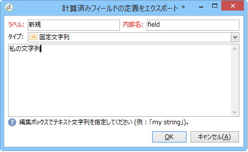

* **[!UICONTROL JavaScript タグを含む文字列]**：一連の文字列と JavaScript ディレクティブを組み合わせた計算フィールドの値。

   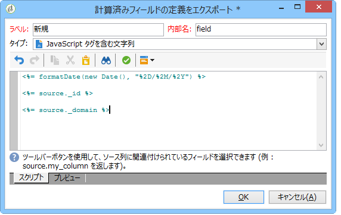

* **[!UICONTROL JavaScript 式]**：計算フィールドの値は JavaScript 関数評価の結果です。返される値はタイプ指定できます（数値、日付など）。

   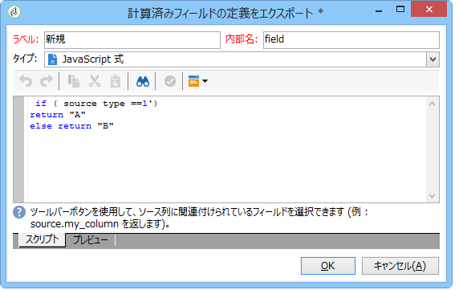

* **[!UICONTROL 列挙]**：このタイプのフィールドでは、いずれかの出力列の内容を新しい列で使用または変更できます。

   列のソース値を使用し、宛先値を割り当てることができます。この宛先値は新しい出力列に表示されます。

   「**[!UICONTROL 列挙]**」タイプ計算フィールドを追加する例は、[この節](../../workflow/using/adding-enumeration-type-calculated-field.md)で確認できます。

   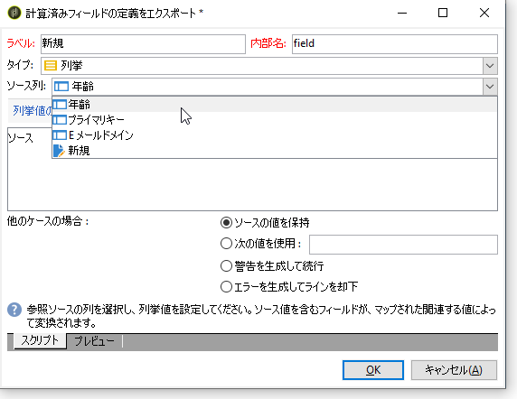

   「**[!UICONTROL 列挙]**」タイプ計算フィールドには、次の 4 つの条件を含めることができます。

   * 「**[!UICONTROL ソースの値を保持]**」では、ソース値が変更されずにターゲットに復元されます。
   * 「**[!UICONTROL 次の値を使用]**」では、定義されていないソース値に対してデフォルトの宛先値を入力できます。
   * 「**[!UICONTROL 警告を生成して続行]**」では、ソース値を変更できないことがユーザーに警告されます。
   * 「**[!UICONTROL エラーを生成してラインを却下]**」では、ラインの計算およびインポートが回避されます。

挿入したフィールドの詳細を表示するには、**[!UICONTROL 計算済みフィールドの詳細]**&#x200B;をクリックします。

この計算フィールドを削除するには、**[!UICONTROL 計算フィールドを削除]**&#x200B;のバツ印をクリックします。

## 式の作成 {#building-expressions}

式編集ツールを使用すると、集計の計算、関数の生成または式を使用した数式の編集をおこなうことができます。

次の例は、プライマリキーに対してカウントを実行する方法を示しています。

次の手順に従います。

1. **[!UICONTROL 抽出するデータ]**&#x200B;ウィンドウで「**[!UICONTROL 追加]**」をクリックします。**[!UICONTROL 数式のタイプ]**&#x200B;ウィンドウで、式を入力する数式のタイプを選択します。

   「**[!UICONTROL フィールドのみ]**」、「**[!UICONTROL 集計]**」、「**[!UICONTROL 式]**」など、様々なタイプの数式を使用できます。

   「**[!UICONTROL 集計関数のプロセス]**」および「**[!UICONTROL カウント]**」を選択します。「**[!UICONTROL 次へ]**」をクリックします。

   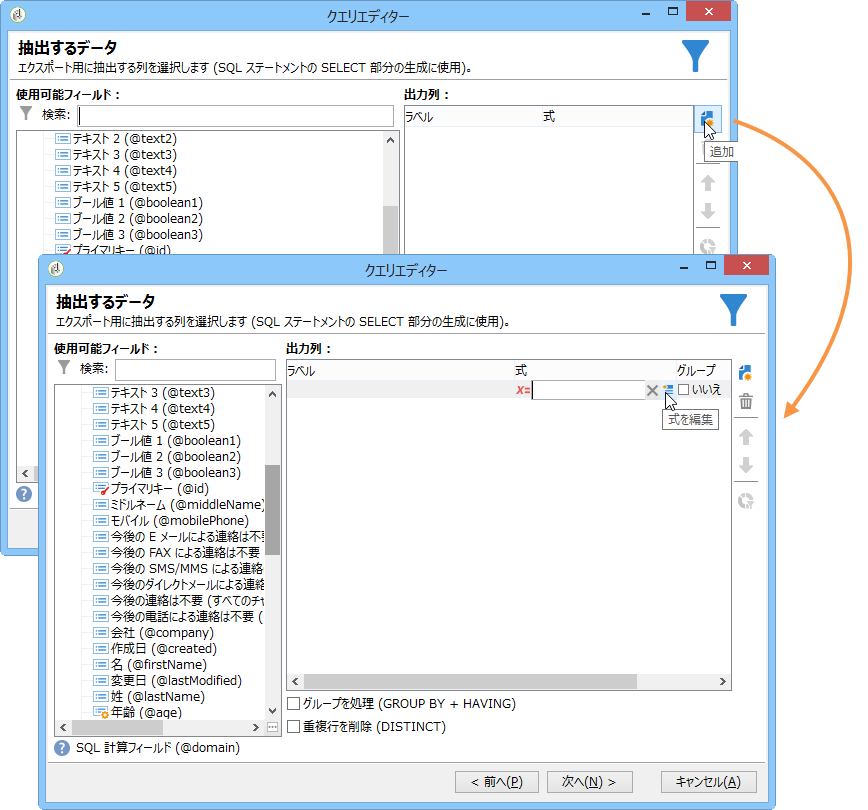

1. プライマリキーが計算されます。

   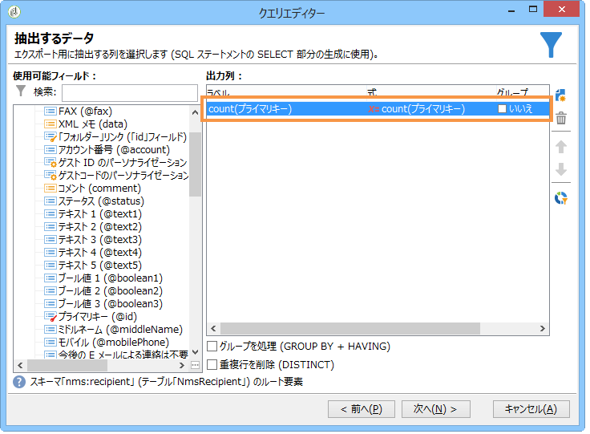

次に、**[!UICONTROL 数式のタイプ]**&#x200B;ウィンドウで使用可能な選択肢の詳細な表示を示します。

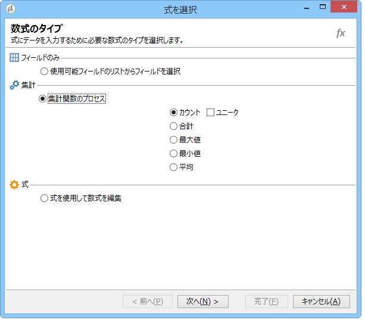

1. 「**[!UICONTROL 「フィールドのみ]****[!UICONTROL 」では、選択するフィールドウィンドウに戻ることができます。]**
1. 「**[!UICONTROL 集計]**」（「集計関数のプロセス」）。使用する集計の例は次のとおりです。

   * 「**[!UICONTROL カウント]**」では、プライマリキーカウントを実行できます。
   * 「**[!UICONTROL 合計]**」では、顧客による 1 年間のすべての購入を合計できます。
   * 「**[!UICONTROL 最大値]**」では、「n」製品を最も多く購入した顧客を検索できます。
   * 「**[!UICONTROL 最小値]**」では、顧客を並べ替え、最近オファーを購読した顧客を検索できます。
   * 「**[!UICONTROL 平均]**」。この関数では、受信者の平均年齢を計算できます。

      「**[!UICONTROL ユニーク]**」ボックスでは、列の一意のゼロ以外の値を収集できます。例えば、受信者のすべてのトラッキングログを収集し、すべて同じ受信者に関連するトラッキングログを値 1 に変更できます。

1. 「**[!UICONTROL 式]**」では、**[!UICONTROL 式を編集]**&#x200B;ウィンドウを開きます。これにより、数字が非常に多く、入力エラーを起こしやすい電話番号を検出できます。

   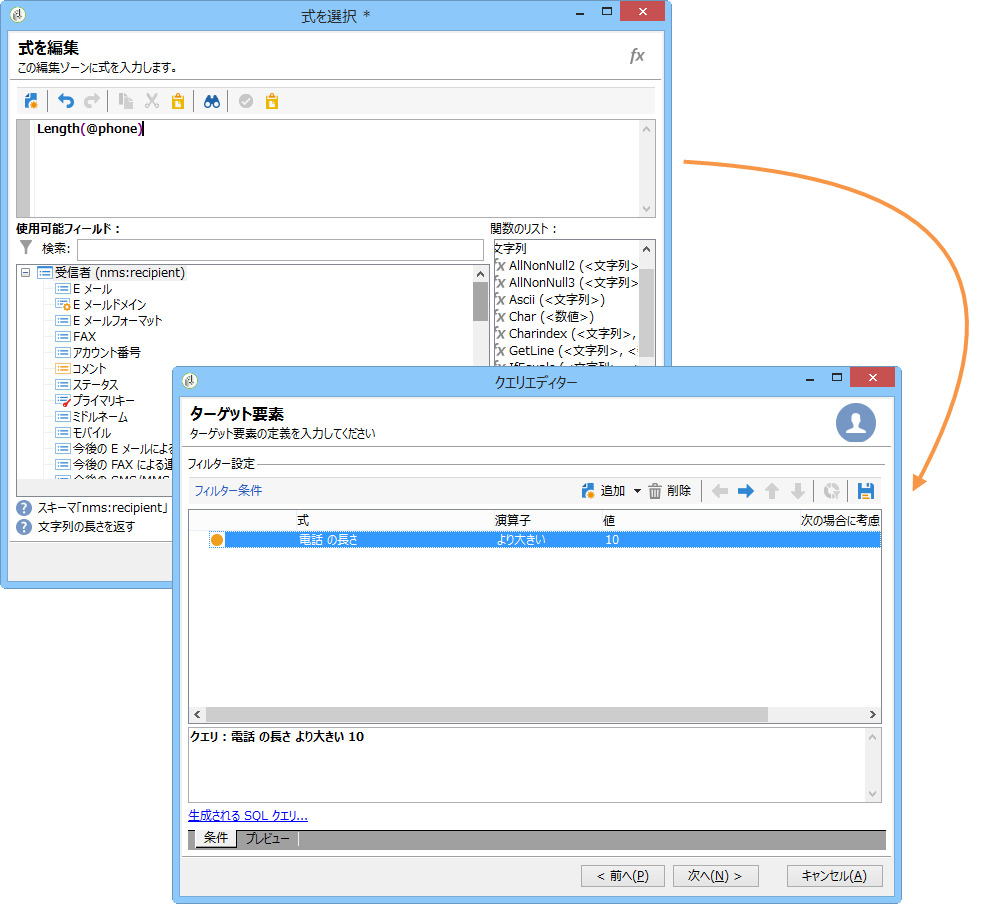

   使用可能なすべての関数のリストについては、[関数のリスト](#list-of-functions)を参照してください。

## 関数のリスト {#list-of-functions}

「**[!UICONTROL 式]**」タイプの数式を選択すると、式を編集ウィンドウが表示されます。「**[!UICONTROL 集計]**」、「**[!UICONTROL 文字列]**」、「**[!UICONTROL 日付]**」、「**[!UICONTROL 数値]**」、「**[!UICONTROL 通貨]**」、「**[!UICONTROL ジオマーケティング]**」、「**[!UICONTROL ウィンドウイング関数]**」、「**[!UICONTROL その他]**」など、様々なカテゴリの関数を使用可能フィールドに関連付けることができます。

式エディターは次のように表示されます。

式エディターではデータベーステーブルのフィールドを選択し、高度な関数を追加できます。次の関数を使用できます。

**集計**

<table> 
 <tbody> 
  <tr> 
   <td> <strong>名前</strong>  </td> 
   <td> <strong>説明</strong>  </td> 
   <td> <strong>構文</strong>  </td> 
  </tr> 
  <tr> 
   <td> <strong>Avg</strong>  </td> 
   <td> 数値タイプの列の平均を返します  </td> 
   <td> Avg(&lt;値&gt;) </td> 
  </tr> 
  <tr> 
   <td> <strong>Count</strong>  </td> 
   <td> 列の null でない値をカウントします  </td> 
   <td> Count(&lt;値&gt;) </td>  
  </tr> 
  <tr> 
   <td> <strong>CountAll</strong>  </td> 
   <td> 返される値をカウントします（すべてのフィールド）  </td> 
   <td> CountAll()  </td> 
  </tr> 
  <tr> 
   <td> <strong>Countdistinct</strong>  </td> 
   <td> 列の null でないユニーク値をカウントします  </td> 
   <td> Countdistinct(&lt;値&gt;) </td> 
  </tr> 
  <tr> 
   <td> <strong>Max</strong>  </td> 
   <td> 数値、文字列または日付タイプの列の最大値を返します  </td> 
   <td> Max(&lt;値&gt;) </td>  
  </tr> 
  <tr> 
   <td> <strong>Min</strong>  </td> 
   <td> 数値、文字列または日付タイプの列の最小値を返します  </td> 
   <td> Min(&lt;値&gt;) </td> 
  </tr> 
  <tr> 
   <td> <strong>StdDev</strong>  </td> 
   <td> 数値、文字列または日付タイプの列の標準偏差を返します  </td> 
   <td> StdDev(&lt;値&gt;) </td> 
  </tr> 
  <tr> 
   <td> <strong>Sum</strong>  </td> 
   <td> 数値、文字列または日付タイプの列の値の合計を返します  </td> 
   <td> Sum(&lt;値&gt;) </td> 
  </tr> 
 </tbody> 
</table>

**文字列**

<table> 
 <tbody> 
  <tr> 
   <td> <strong>名前</strong>  </td> 
   <td> <strong>説明</strong>  </td> 
   <td> <strong>構文</strong>  </td> 
  </tr> 
  <tr> 
   <td> <strong>AllNonNull2</strong>  </td> 
   <td> すべてのパラメーターが null でなく空でもないかどうかを示します  </td> 
   <td> AllNonNull2(&lt;文字列&gt;, &lt;文字列&gt;) </td> 
  </tr> 
  <tr> 
   <td> <strong>AllNonNull3</strong>  </td> 
   <td> すべてのパラメーターが null でなく空でもないかどうかを示します  </td> 
   <td> AllNonNull3(&lt;文字列&gt;, &lt;文字列&gt;, &lt;文字列&gt;) </td> 
  </tr> 
  <tr> 
   <td> <strong>Ascii</strong>  </td> 
   <td> 文字列の最初の文字の ASCII 値を返します  </td> 
   <td> Ascii(&lt;文字列&gt;) </td> 
  </tr> 
  <tr> 
   <td> <strong>Char</strong>  </td> 
   <td> ASCII コード「n」に対応する文字を返します  </td> 
   <td> Char(&lt;数値&gt;) </td>  
  </tr> 
  <tr> 
   <td> <strong>Charindex</strong>  </td> 
   <td> 文字列 1 における文字列 2 の位置を返します  </td> 
   <td> Charindex(&lt;文字列&gt;, &lt;文字列&gt;) </td> 
  </tr> 
  <tr> 
   <td> <strong>GetLine</strong>  </td> 
   <td> 文字列の n 番目（1 から n）のラインを返します  </td> 
   <td> GetLine(&lt;文字列&gt;) </td> 
  </tr> 
  <tr> 
   <td> <strong>IfEquals</strong>  </td> 
   <td> 最初の 2 つのパラメーターが等しい場合に、3 番目のパラメーターを返します。等しくない場合は、最後のパラメーターを返します  </td> 
   <td> IfEquals(&lt;文字列&gt;, &lt;文字列&gt;, &lt;文字列&gt;, &lt;文字列&gt;) </td> 
  </tr> 
  <tr> 
   <td> <strong>IsMemoNull</strong>  </td> 
   <td> パラメーターとして渡されたメモが null かどうかを示します  </td> 
   <td> IsMemoNull(&lt;メモ&gt;) </td> 
  </tr> 
  <tr> 
   <td> <strong>JuxtWords</strong>  </td> 
   <td> パラメーターとして渡された文字列を連結します。必要に応じて、文字列間にスペースを追加します.  </td> 
   <td> JuxtWords(&lt;文字列&gt;, &lt;文字列&gt;) </td> 
  </tr> 
  <tr> 
   <td> <strong>JuxtWords3</strong>  </td> 
   <td> パラメーターとして渡された文字列を連結します。必要に応じて、文字列間にスペースを追加します  </td> 
   <td> JuxtWords3(&lt;文字列&gt;, &lt;文字列&gt;, &lt;文字列&gt;) </td>  
  </tr> 
  <tr> 
   <td> <strong>LPad</strong>  </td> 
   <td> 左側の完成した文字列を返します  </td> 
   <td> LPad(&lt;文字列&gt;, &lt;数値&gt;, &lt;文字&gt;) </td> 
  </tr> 
  <tr> 
   <td> <strong>Left</strong>  </td> 
   <td> 文字列の最初の n 文字を返します  </td> 
   <td> Left(&lt;文字列&gt;, &lt;数値&gt;) </td> 
  </tr> 
  <tr> 
   <td> <strong>Length</strong>  </td> 
   <td> 文字列の長さを返します  </td> 
   <td> Length(&lt;文字列&gt;) </td> 
  </tr> 
  <tr> 
   <td> <strong>Lower</strong>  </td> 
   <td> 文字列を小文字で返します  </td> 
   <td> Lower(&lt;文字列&gt;) </td> 
  </tr> 
  <tr> 
   <td> <strong>Ltrim</strong>  </td> 
   <td> 文字列の左側の空白を削除します  </td> 
   <td> Ltrim(&lt;文字列&gt;) </td> 
  </tr> 
  <tr> 
   <td> <strong>Md5Digest</strong>  </td> 
   <td> 文字列の MD5 キーの 16 進数表現を返します  </td> 
   <td> Md5Digest(&lt;文字列&gt;) </td> 
  </tr> 
  <tr> 
   <td> <strong>MemoContains</strong>  </td> 
   <td> パラメーターとして渡す文字列をメモに含めるかどうかを指定します  </td> 
   <td> MemoContains(&lt;メモ&gt;、&lt;文字列&gt;) </td> 
  </tr> 
  <tr> 
   <td> <strong>RPad</strong>  </td> 
   <td> 右側の完成した文字列を返します  </td> 
   <td> RPad(&lt;文字列&gt;, &lt;数値&gt;, &lt;文字&gt;) </td> 
  </tr> 
  <tr> 
   <td> <strong>Right</strong>  </td> 
   <td> 文字列の最後の n 文字を返します  </td> 
   <td> Right(&lt;文字列&gt;)  </td> 
  </tr> 
  <tr> 
   <td> <strong>Rtrim</strong>  </td> 
   <td> 文字列の右側の空白を削除します  </td> 
   <td> Rtrim(&lt;文字列&gt;)  </td> 
  </tr> 
  <tr> 
   <td> <strong>Smart</strong>  </td> 
   <td> 各単語の最初の文字を大文字にして文字列を返します  </td> 
   <td> Smart(&lt;文字列&gt;)  </td> 
  </tr> 
  <tr> 
   <td> <strong>Substring</strong>  </td> 
   <td> 文字列の n1 文字目から始まる長さ n2 文字の部分文字列を抽出します  </td> 
   <td> Substring(&lt;文字列&gt;, &lt;オフセット&gt;, &lt;長さ&gt;)  </td>  
  </tr> 
  <tr> 
   <td> <strong>ToString</strong>  </td> 
   <td> 数値を文字列に変換します  </td> 
   <td> ToString(&lt;数値&gt;, &lt;数値&gt;)  </td>  
  </tr> 
  <tr> 
   <td> <strong>Upper</strong>  </td> 
   <td> 文字列を大文字で返します  </td> 
   <td> Upper(&lt;文字列&gt;)  </td>  
  </tr> 
  <tr> 
   <td> <strong>VirtualLink</strong>  </td> 
   <td> 他の 2 つのパラメーターが等しい場合に、パラメーターとして渡されたリンクの外部キーを返します  </td> 
   <td> VirtualLink(&lt;数値&gt;, &lt;数値&gt;, &lt;数値&gt;)  </td>  
  </tr> 
  <tr> 
   <td> <strong>VirtualLinkStr</strong>  </td> 
   <td> 他の 2 つのパラメーターが等しい場合に、パラメーターとして渡されたリンクの外部（テキスト）キーを返します  </td> 
   <td> VirtualLinkStr(&lt;文字列&gt;, &lt;数値&gt;, &lt;数値&gt;)  </td>  
  </tr> 
  <tr> 
   <td> <strong>dataLength</strong>  </td> 
   <td> 文字列のサイズを返します  </td> 
   <td> dataLength(&lt;文字列&gt;)  </td>  
  </tr> 
 </tbody> 
</table>

**日付**

<table> 
 <tbody> 
  <tr> 
   <td> <strong>名前</strong>  </td> 
   <td> <strong>説明</strong>  </td> 
   <td> <strong>構文</strong>  </td> 
  </tr> 
  <tr> 
   <td> <strong>AddDays</strong>  </td> 
   <td> 日付に日数を追加します  </td> 
   <td> AddDays(&lt;日付&gt;, &lt;数値&gt;)  </td>  
  </tr> 
  <tr> 
   <td> <strong>AddHours</strong>  </td> 
   <td> 日付に時間数を追加します  </td> 
   <td> AddHours(&lt;日付&gt;, &lt;数値&gt;)  </td>  
  </tr> 
  <tr> 
   <td> <strong>AddMinutes</strong>  </td> 
   <td> 日付に分数を追加します  </td> 
   <td> AddMinutes(&lt;日付&gt;, &lt;数値&gt;)  </td>  
  </tr> 
  <tr> 
   <td> <strong>AddMonths</strong>  </td> 
   <td> 日付に月数を追加します  </td> 
   <td> AddMonths(&lt;日付&gt;, &lt;数値&gt;)  </td>  
  </tr> 
  <tr> 
   <td> <strong>AddSeconds</strong>  </td> 
   <td> 日付に秒数を追加します  </td> 
   <td> AddSeconds(&lt;日付&gt;, &lt;数値&gt;)  </td>  
  </tr> 
  <tr> 
   <td> <strong>AddYears</strong>  </td> 
   <td> 日付に年数を追加します  </td> 
   <td> AddYears(&lt;日付&gt;, &lt;数値&gt;)  </td>  
  </tr> 
  <tr> 
   <td> <strong>DateOnly</strong>  </td> 
   <td> 日付のみを返します（時刻は 0:00）*  </td> 
   <td> DateOnly(&lt;日付&gt;)  </td>  
  </tr> 
  <tr> 
   <td> <strong>Day</strong>  </td> 
   <td> 日付の日を表す数を返します  </td> 
   <td> Day(&lt;日付&gt;)  </td>  
  </tr> 
  <tr> 
   <td> <strong>DayOfYear</strong>  </td> 
   <td> 日付の年の日数を返します  </td> 
   <td> DayOfYear(&lt;日付&gt;)  </td>  
  </tr> 
  <tr> 
   <td> <strong>DaysAgo</strong>  </td> 
   <td> 現在の日付 - n 日に対応する日付を返します  </td> 
   <td> DaysAgo(&lt;数値&gt;)  </td>  
  </tr> 
  <tr> 
   <td> <strong>DaysAgoInt</strong>  </td> 
   <td> 現在の日付 - n 日に対応する日付（整数 yyyymmdd）を返します  </td> 
   <td> DaysAgoInt(&lt;数値&gt;)  </td>  
  </tr> 
  <tr> 
   <td> <strong>DaysDiff</strong>  </td> 
   <td> 2 つの日付の間の日数を返します  </td> 
   <td> DaysDiff(&lt;終了日&gt;, &lt;開始日&gt;)  </td>  
  </tr> 
  <tr> 
   <td> <strong>DaysOld</strong>  </td> 
   <td> 年齢（日数）を返します  </td> 
   <td> DaysOld(&lt;日付&gt;)  </td>  
  </tr> 
  <tr> 
   <td> <strong>GetDate</strong>  </td> 
   <td> サーバーの現在のシステム日付を返します  </td> 
   <td> GetDate()  </td> 
  </tr> 
  <tr> 
   <td> <strong>Hour</strong>  </td> 
   <td> 日付の時間を返します  </td> 
   <td> Hour(&lt;日付&gt;)  </td>  
  </tr> 
  <tr> 
   <td> <strong>HoursDiff</strong>  </td> 
   <td> 2 つの日付の間の時間数を返します  </td> 
   <td> HoursDiff(&lt;終了日&gt;, &lt;開始日&gt;)  </td>  
  </tr> 
  <tr> 
   <td> <strong>Minute</strong>  </td> 
   <td> 日付の分を返します  </td> 
   <td> Minute(&lt;日付&gt;)  </td>  
  </tr> 
  <tr> 
   <td> <strong>MinutesDiff</strong>  </td> 
   <td> 2 つの日付の間の分数を返します  </td> 
   <td> MinutesDiff(&lt;終了日&gt;, &lt;開始日&gt;)  </td>  
  </tr> 
  <tr> 
   <td> <strong>Month</strong>  </td> 
   <td> 日付の月を表す数を返します  </td> 
   <td> Month(&lt;日付&gt;)  </td>  
  </tr> 
  <tr> 
   <td> <strong>MonthsAgo</strong>  </td> 
   <td> 現在の日付 - n ヶ月に対応する日付を返します  </td> 
   <td> MonthsAgo(&lt;数値&gt;)  </td>  
  </tr> 
  <tr> 
   <td> <strong>MonthsDiff</strong>  </td> 
   <td> 2 つの日付の間の月数を返します  </td> 
   <td> MonthsDiff(&lt;終了日&gt;, &lt;開始日&gt;)  </td>  
  </tr> 
  <tr> 
   <td> <strong>MonthsOld</strong>  </td> 
   <td> 年齢（月数）を返します  </td> 
   <td> MonthsOld(&lt;日付&gt;)  </td>  
  </tr> 
  <tr> 
   <td> <strong>Second</strong>  </td> 
   <td> 日付の秒を返します  </td> 
   <td> Second(&lt;日付&gt;)  </td>  
  </tr> 
  <tr> 
   <td> <strong>SecondsDiff</strong>  </td> 
   <td> 2 つの日付の間の秒数を返します  </td> 
   <td> SecondsDiff(&lt;終了日&gt;, &lt;開始日&gt;)  </td>  
  </tr> 
  <tr> 
   <td> <strong>SubDays</strong>  </td> 
   <td> 日付から日数を引きます  </td> 
   <td> SubDays(&lt;日付&gt;, &lt;数値&gt;)  </td>  
  </tr> 
  <tr> 
   <td> <strong>SubHours</strong>  </td> 
   <td> 日付から時間数を引きます  </td> 
   <td> SubHours(&lt;日付&gt;, &lt;数値&gt;)  </td>  
  </tr> 
  <tr> 
   <td> <strong>SubMinutes</strong>  </td> 
   <td> 日付から分数を引きます  </td> 
   <td> SubMinutes(&lt;日付&gt;, &lt;数値&gt;)  </td>  
  </tr> 
  <tr> 
   <td> <strong>SubMonths</strong>  </td> 
   <td> 日付から月数を引きます  </td> 
   <td> SubMonths(&lt;日付&gt;, &lt;数値&gt;)  </td>  
  </tr> 
  <tr> 
   <td> <strong>SubSeconds</strong>  </td> 
   <td> 日付から秒数を引きます  </td> 
   <td> SubSeconds(&lt;日付&gt;, &lt;数値&gt;)  </td>  
  </tr> 
  <tr> 
   <td> <strong>SubYears</strong>  </td> 
   <td> 日付から年数を引きます  </td> 
   <td> SubYears(&lt;日付&gt;, &lt;数値&gt;)  </td>  
  </tr> 
  <tr> 
   <td> <strong>ToDate</strong>  </td> 
   <td> 日付 + 時間を日付に変換します  </td> 
   <td> ToDate(&lt;日付 + 時刻&gt;)  </td>  
  </tr> 
  <tr> 
   <td> <strong>ToDateTime</strong>  </td> 
   <td> 文字列を日付 + 時刻に変換します  </td> 
   <td> ToDateTime(&lt;文字列&gt;)  </td>  
  </tr> 
  <tr> 
   <td> <strong>TruncDate</strong>  </td> 
   <td> 日付 + 時刻を最も近い秒に丸めます  </td> 
   <td> TruncDate(@lastModified, &lt;秒数&gt;)  </td> 
  </tr> 
  <tr> 
   <td> <strong>TruncDateTZ</strong>  </td> 
   <td> 日付と時刻を指定された精度（秒）に丸めます  </td> 
   <td> TruncDateTZ(&lt;日付&gt;, &lt;秒数&gt;, &lt;タイムゾーン&gt;)  </td> 
  </tr> 
  <tr> 
   <td> <strong>TruncQuarter</strong>  </td> 
   <td> 日付を四半期に丸めます  </td> 
   <td> TruncQuarter(&lt;日付&gt;)  </td>  
  </tr> 
  <tr> 
   <td> <strong>TruncTime</strong>  </td> 
   <td> 時刻部分を最も近い秒に丸めます  </td> 
   <td> TruncTime(&lt;日付&gt;, &lt;秒数&gt;)  </td>  
  </tr> 
  <tr> 
   <td> <strong>TruncWeek</strong>  </td> 
   <td> 日付を週に丸めます  </td> 
   <td> TruncWeek(&lt;日付&gt;)  </td>  
  </tr> 
  <tr> 
   <td> <strong>TruncYear</strong>  </td> 
   <td> 日付 + 時刻をその年の 1 月 1 日に丸めます  </td> 
   <td> TruncYear(&lt;日付&gt;)  </td>  
  </tr> 
  <tr> 
   <td> <strong>TruncWeek</strong>  </td> 
   <td> 日付の週の日を表す数を返します  </td> 
   <td> WeekDay(&lt;日付&gt;)  </td>  
  </tr> 
  <tr> 
   <td> <strong>Year</strong>  </td> 
   <td> 日付の年を表す数を返します  </td> 
   <td> Year(&lt;日付&gt;)  </td>  
  </tr> 
  <tr> 
   <td> <strong>YearAnd Month</strong>  </td> 
   <td> 日付の年と月を表す数を返します  </td> 
   <td> YearAndMonth(&lt;日付&gt;)  </td>  
  </tr> 
  <tr> 
   <td> <strong>YearsDiff</strong>  </td> 
   <td> 2 つの日付の間の年数を返します  </td> 
   <td> YearsDiff(&lt;終了日&gt;, &lt;開始日&gt;)  </td>  
  </tr> 
  <tr> 
   <td> <strong>YearsOld</strong>  </td> 
   <td> 満年齢を返します  </td> 
   <td> YearsOld(&lt;日付&gt;)  </td>  
  </tr> 
 </tbody> 
</table>

>[!NOTE]
>
>**Dateonly** 関数はオペレーターのタイムゾーンではなく、サーバーのタイムゾーンを考慮することに注意してください。

**数値**

<table> 
 <tbody> 
  <tr> 
   <td> <strong>名前</strong>  </td> 
   <td> <strong>説明</strong>  </td> 
   <td> <strong>構文</strong>  </td> 
  </tr> 
  <tr> 
   <td> <strong>Abs</strong>  </td> 
   <td> 数値の絶対値を返します  </td> 
   <td> Abs(&lt;数値&gt;)  </td>  
  </tr> 
  <tr> 
   <td> <strong>Ceil</strong>  </td> 
   <td> ある特定の数値以上の最小の整数を返します  </td> 
   <td> Ceil(&lt;数値&gt;)  </td>  
  </tr> 
  <tr> 
   <td> <strong>Floor</strong>  </td> 
   <td> ある特定の数値以上の最大の整数を返します  </td> 
   <td> Floor(&lt;数値&gt;)  </td>  
  </tr> 
  <tr> 
   <td> <strong>Greatest</strong>  </td> 
   <td> 2 つの数のうち大きい方を返します  </td> 
   <td> Greatest(&lt;数値 1&gt;, &lt;数値 2&gt;)  </td>  
  </tr> 
  <tr> 
   <td> <strong>Least</strong>  </td> 
   <td> 2 つの数のうち小さい方を返します  </td> 
   <td> Least(&lt;数値 1&gt;, &lt;数値 2&gt;)  </td>  
  </tr> 
  <tr> 
   <td> <strong>Mod</strong>  </td> 
   <td> 整数の割り算 n1 ÷ n2 の余りを返します  </td> 
   <td> Mod(&lt;数値 1&gt;, &lt;数値 2&gt;)  </td>  
  </tr> 
  <tr> 
   <td> <strong>Percent</strong>  </td> 
   <td> 割合で表される 2 つの数の比率を返します  </td> 
   <td> Percent(&lt;数値 1&gt;, &lt;数値 2&gt;)  </td>  
  </tr> 
  <tr> 
   <td> <strong>Random</strong>  </td> 
   <td> ランダムな値を返します  </td> 
   <td> Random()  </td> 
  </tr> 
  <tr> 
   <td> <strong>Round</strong>  </td> 
   <td> 数値を n 桁に丸めます  </td> 
   <td> Round(&lt;数値&gt;, &lt;小数点以下の桁数&gt;)  </td>  
  </tr> 
  <tr> 
   <td> <strong>Sign</strong>  </td> 
   <td> 数値の符号を返します  </td> 
   <td> Sign(&lt;数値&gt;)  </td>  
  </tr> 
  <tr> 
   <td> <strong>ToDouble</strong>  </td> 
   <td> 整数を浮動小数に変換します  </td> 
   <td> ToDouble(&lt;数値&gt;)  </td>  
  </tr> 
  <tr> 
   <td> <strong>ToInt64</strong>  </td> 
   <td> 浮動小数を 64 ビットの整数に変換します  </td> 
   <td> ToInt64(&lt;数値&gt;)  </td>  
  </tr> 
  <tr> 
   <td> <strong>ToInteger</strong>  </td> 
   <td> 浮動小数を整数に変換します  </td> 
   <td> ToInteger(&lt;数値&gt;)  </td>  
  </tr> 
  <tr> 
   <td> <strong>Trunc</strong>  </td> 
   <td> n1 を n2 の桁数に切り捨てます  </td> 
   <td> Trunc(&lt;n1&gt;, &lt;n2&gt;)  </td>  
  </tr> 
 </tbody> 
</table>

1. 通貨

<table> 
 <tbody> 
  <tr> 
   <td> <strong>名前</strong>  </td> 
   <td> <strong>説明</strong>  </td> 
   <td> <strong>構文</strong>  </td> 
  </tr> 
  <tr> 
   <td> <strong>ConvertCurrency</strong>  </td> 
   <td> 変換元通貨の金額を変換先通貨の金額に換算します  </td> 
   <td> ConvertCurrency(&lt;金額&gt;, &lt;変換元通貨&gt;, &lt;変換先通貨&gt;, &lt;変換日&gt;)  </td>  
  </tr> 
  <tr> 
   <td> <strong>FormatCurrency</strong>  </td> 
   <td> 表示される金額を選択した通貨設定に基づいて書式設定します  </td> 
   <td> FormatCurrency(&lt;金額&gt;, &lt;通貨&gt;)  </td>  
  </tr> 
 </tbody> 
</table>

**Geomarketing**

<table> 
 <tbody> 
  <tr> 
   <td> <strong>名前</strong>  </td> 
   <td> <strong>説明</strong>  </td> 
   <td> <strong>構文</strong>  </td> 
  </tr> 
  <tr> 
   <td> <strong>Distance</strong>  </td> 
   <td> 経度と緯度で定義された 2 つのポイントの距離を返します。  </td> 
   <td> Distance(&lt;経度 A&gt;, &lt;緯度 A&gt;, &lt;経度 B&gt;, &lt;緯度 B&gt;)  </td>  
  </tr> 
 </tbody> 
</table>

**その他**

<table> 
 <tbody> 
  <tr> 
   <td> <strong>名前</strong>  </td> 
   <td> <strong>説明</strong>  </td> 
   <td> <strong>構文</strong>  </td> 
  </tr> 
  <tr> 
   <td> <strong>Case</strong>  </td> 
   <td> 条件が true の場合は値 1 を返します。そうでない場合は値 2 を返します  </td> 
   <td> (When(&lt;条件&gt;, &lt;値 1&gt;), Else(&lt;値 2&gt;))  </td> 
  </tr> 
  <tr> 
   <td> <strong>ClearBit</strong>  </td> 
   <td> 値のフラグを削除します  </td> 
   <td> ClearBit(&lt;識別子&gt;, &lt;フラグ&gt;)  </td>  
  </tr> 
  <tr> 
   <td> <strong>Coalesce</strong>  </td> 
   <td> 値 1 がゼロまたは null の場合は値 2 を返し、それ以外の場合は値 1 を返します  </td> 
   <td> Coalesce(&lt;値 1&gt;, &lt;値 2&gt;)  </td>  
  </tr> 
  <tr> 
   <td> <strong>Decode</strong>  </td> 
   <td> 値 1 = 値 2 の場合は値 3 を返します。そうでない場合は値 4 を返します  </td> 
   <td> Decode(&lt;値 1&gt;, &lt;値 2&gt;, &lt;値 3&gt;, &lt;値 4&gt;)  </td>  
  </tr> 
  <tr> 
   <td> <strong>Else</strong>  </td> 
   <td> 値 1 を返します（case 関数のパラメーターとしてのみ使用できます）  </td> 
   <td> Else(&lt;値 1&gt;, &lt;値 2&gt;)  </td>  
  </tr> 
  <tr> 
   <td> <strong>GetEmailDomain</strong>  </td> 
   <td> E メールアドレスからドメインを抽出します  </td> 
   <td> GetEmailDomain(&lt;値&gt;)  </td>  
  </tr> 
  <tr> 
   <td> <strong>GetMirrorURL</strong>  </td> 
   <td> ミラーページサーバーの URL を取得します  </td> 
   <td> GetMirrorURL(&lt;値&gt;)  </td>  
  </tr> 
  <tr> 
   <td> <strong>Iif</strong>  </td> 
   <td> 式が true の場合は値 1 を返します。そうでない場合は値 2 を返します  </td> 
   <td> Iif(&lt;条件&gt;, &lt;値 1&gt;, &lt;値 2&gt;)  </td>  
  </tr> 
  <tr> 
   <td> <strong>IsBitSet</strong>  </td> 
   <td> 値にフラグが含まれているかどうかを示します  </td> 
   <td> IsBitSet(&lt;識別子&gt;, &lt;フラグ&gt;)  </td>  
  </tr> 
  <tr> 
   <td> <strong>IsEmptyString</strong>  </td> 
   <td> 文字列 1 が空の場合は値 2 を返し、それ以外の場合は値 3 を返します  </td> 
   <td> IsEmptyString(&lt;値 1&gt;, &lt;値 2&gt;, &lt;値 3&gt;)  </td>  
  </tr> 
  <tr> 
   <td> <strong>NoNull</strong>  </td> 
   <td> 引数が NULL の場合は、空の文字列を返します  </td> 
   <td> NoNull(&lt;値&gt;)  </td>   
  </tr> 
  <tr> 
   <td> <strong>RowId</strong>  </td> 
   <td> ライン番号を返します  </td> 
   <td> RowId  </td> 
  </tr> 
  <tr> 
   <td> <strong>SetBit</strong>  </td> 
   <td> 値に強制的にフラグを指定します  </td> 
   <td> SetBit(&lt;識別子&gt;, &lt;フラグ&gt;)  </td>  
  </tr> 
  <tr> 
   <td> <strong>ToBoolean</strong>  </td> 
   <td> 数値をブール値に変換します  </td> 
   <td> ToBoolean(&lt;数値&gt;)  </td>   
  </tr> 
  <tr> 
   <td> <strong>When</strong>  </td> 
   <td> 式が true の場合は値 1 を返します。そうでない場合は値 2 を返します（case 関数のパラメーターとしてのみ使用できます）  </td> 
   <td> When(&lt;条件&gt;, &lt;値 1&gt;)  </td>  
  </tr> 
 </tbody> 
</table>

**ウィンドウイング関数**

<table> 
 <tbody> 
  <tr> 
   <td> <strong>名前</strong>  </td> 
   <td> <strong>説明</strong>  </td> 
   <td> <strong>構文</strong>  </td> 
  </tr> 
  <tr> 
   <td> <strong>Desc</strong>  </td> 
   <td> 降順ソートを適用します  </td> 
   <td> Desc(&lt;値 1&gt;)  </td>  
  </tr> 
  <tr> 
   <td> <strong>OrderBy</strong>  </td> 
   <td> パーティション内の結果を並べ替えます  </td> 
   <td> OrderBy(&lt;値 1&gt;)  </td>  
  </tr> 
  <tr> 
   <td> <strong>PartitionBy</strong>  </td> 
   <td> テーブルのクエリの結果を区分します  </td> 
   <td> PartitionBy(&lt;値 1&gt;)  </td>  
  </tr> 
  <tr> 
   <td> <strong>RowNum</strong>  </td> 
   <td> テーブルのパーティションと並べ替えシーケンスに基づいてライン番号を生成します  </td> 
   <td> RowNum(PartitionBy(&lt;値 1&gt;), OrderBy(&lt;値 1&gt;))  </td> 
  </tr> 
 </tbody> 
</table>