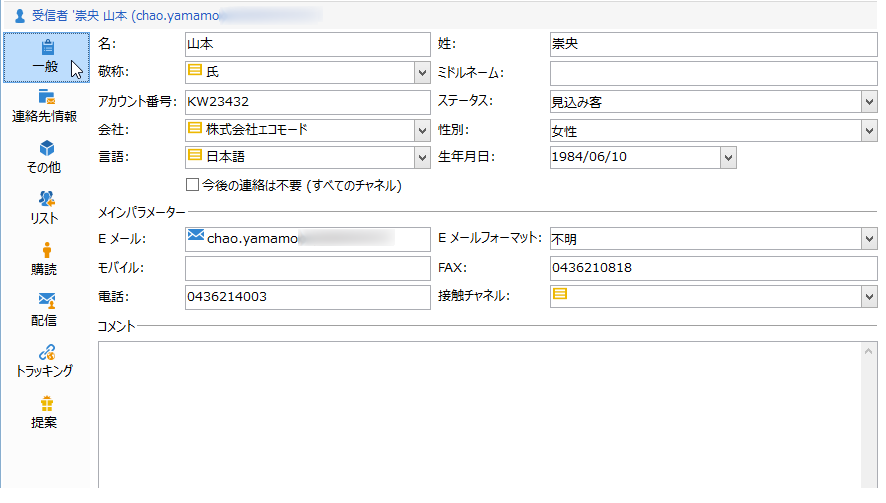
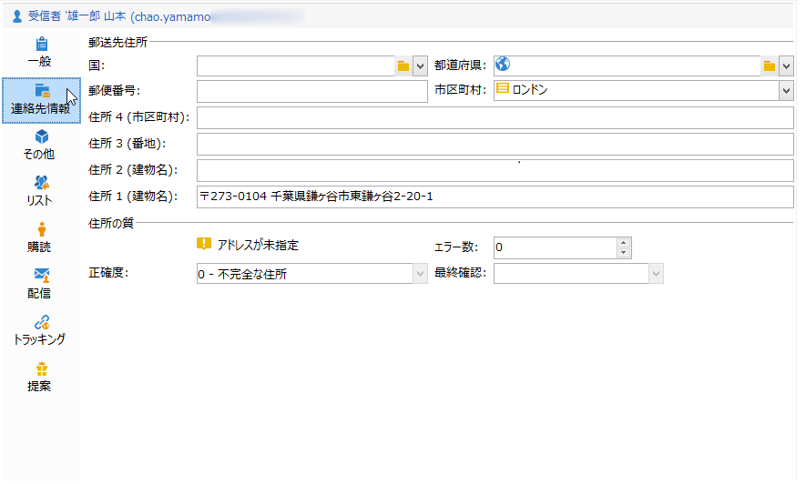
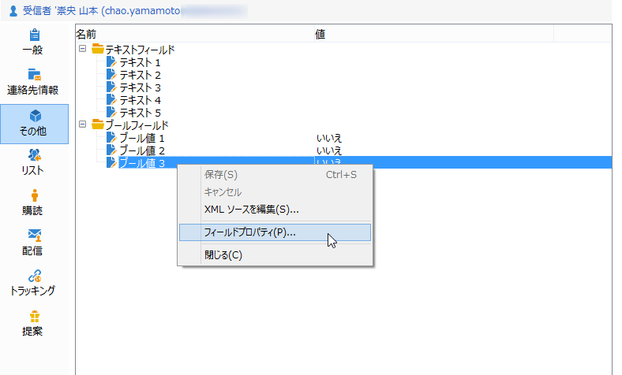
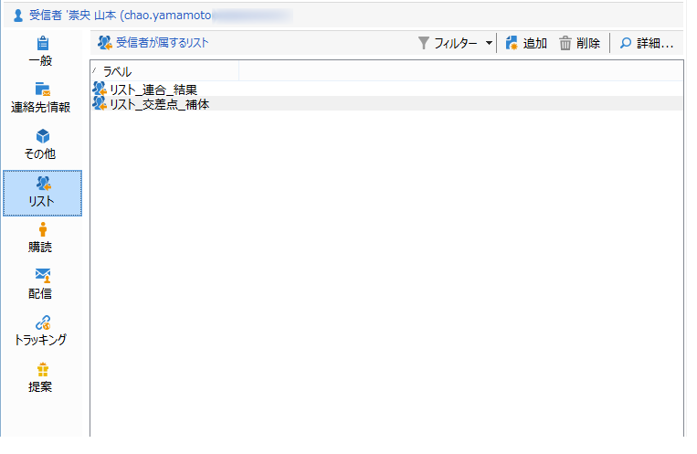
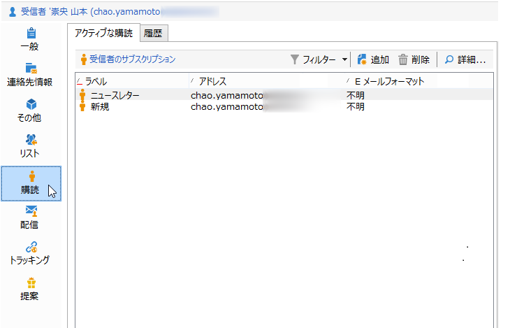
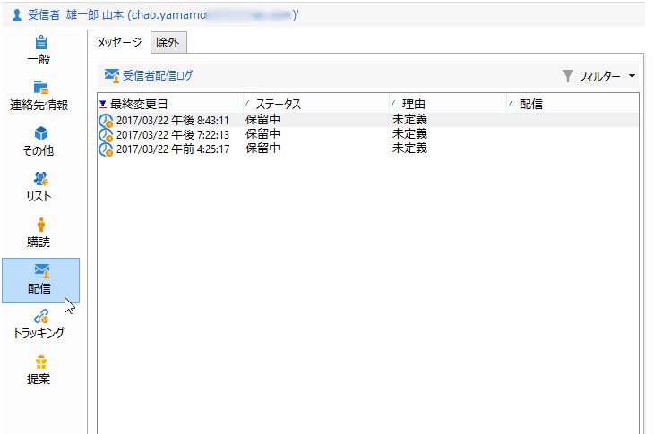
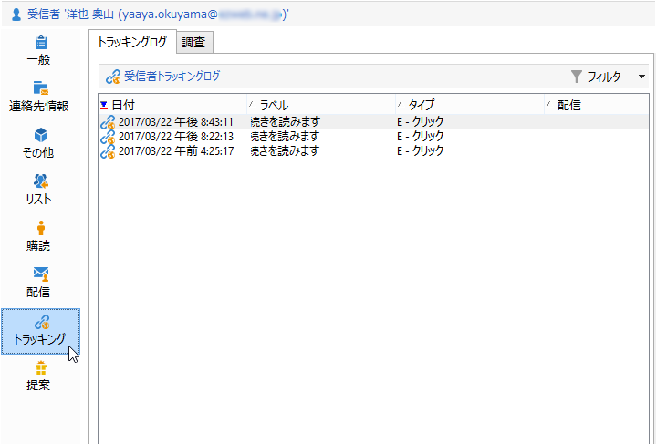

# プロファイルの編集{#editing-a-profile}

プロファイルに関連する情報を表示するには、プロファイルリストでプロファイルの名前をクリックします。

プロファイルの詳細が新しいタブで表示されます。

プロファイルに関するデータはタブにグループ化されています。

タブとその内容は、設定およびインストールされているパッケージに応じて異なります。

>[!CAUTION]
>
>プロファイルテーブルのフィールドに関係する XML スキーマおよびフォームにアクセスするには、Adobe Campaign ツリーの&#x200B;**[!UICONTROL 管理／設定／データスキーマ]**&#x200B;ノードを選択します。これらのスキーマを変更できるのは、エキスパートユーザーのみです。
>
>詳しくは、[このページ](../../configuration/using/about-schema-edition.md)を参照してください。

## 「一般」タブ{#general-tab}

この画面には、選択したプロファイルに関するすべての一般データが表示されます。特に、姓、名、E メールアドレス、E メール受信フォーマットなどが含まれています。次のような画面です。

>[!NOTE]
>
>「**[!UICONTROL 今後の連絡は不要（すべてのチャネル）]**」オプションが選択されている場合は、プロファイルがブラックリストに登録されていることを意味します。つまり、プロファイルは、ニュースレター内の購読解除リンクをクリックするなどして配信を受け取らないことを希望しています。このようなプロファイルは、どのチャネルの配信（E メール、ダイレクトメールなど）のターゲットにもなりません。詳しくは、[このページ](../../delivery/using/understanding-quarantine-management.md)を参照してください。

## 「連絡先情報」タブ{#contact-information-tab}

この画面には、選択したプロファイルのダイレクトメールの住所が表示されます。次のような画面です。

この画面には、住所の品質指標および住所に含まれるエラーの数が表示されます。この情報は、以前の配達時に見つかったエラーの数に基づいて郵便配達員が直接使用するもので、手動による変更はできません。

## 「その他」タブ{#other-tab}

この画面には、要件に基づいてパーソナライズできるユーザー定義のフィールドが表示されます。次に示すように、「**[!UICONTROL フィールドプロパティ...]**」を使用して、フィールドの名前を変更したり、フィールドのフォーマットを定義したりすることもできます。

>[!NOTE]
>
>フィールドプロパティおよびフィールドの追加について詳しくは、[このページ](../../configuration/using/new-field-wizard.md)を参照してください。

## 「リスト」タブ{#lists-tab}

この画面には、選択したプロファイルが属しているグループが表示されます。プロファイルをリストに登録するには、「**[!UICONTROL 追加]**」をクリックします。選択したリスト内のプロファイルの説明およびリストを表示するには、「**[!UICONTROL 詳細]**」をクリックします。

詳しくは、[リストの作成および管理](../../platform/using/creating-and-managing-lists.md)を参照してください。

## 「購読」タブ{#subscriptions-tab}

この画面には、プロファイルが購読登録した情報サービスが表示されます。

「**[!UICONTROL 詳細]**」ボタンでは、選択した購読のプロパティが表示されます。「**[!UICONTROL 追加]**」ボタンは、新しい購読を手動で追加する場合に使用します。

詳しくは、[このページ](../../delivery/using/managing-subscriptions.md)を参照してください。

## 「配信」タブ{#deliveries-tab}

この画面には、選択したプロファイルの配信ログが表示されます。すべてのチャネルにおけるプロファイル宛ての配信アクションのラベル、日付およびステータスを表示することもできます。

## 「トラッキング」タブ{#tracking-tab}

この画面では、選択したプロファイルのトラッキングログを表示できます。この情報は、配信後のプロファイルの行動をトラッキングする場合に使用します。

このタブには、配信でトラッキングされたすべての URL の累積合計が表示されます。

このリストは設定可能で、通常は、クリックされた URL、クリックの日時および URL が含まれていたドキュメントが表示されます。

>[!NOTE]
>
>トラッキング機能について詳しくは、[このページ](../../delivery/using/monitoring-a-delivery.md)を参照してください。

