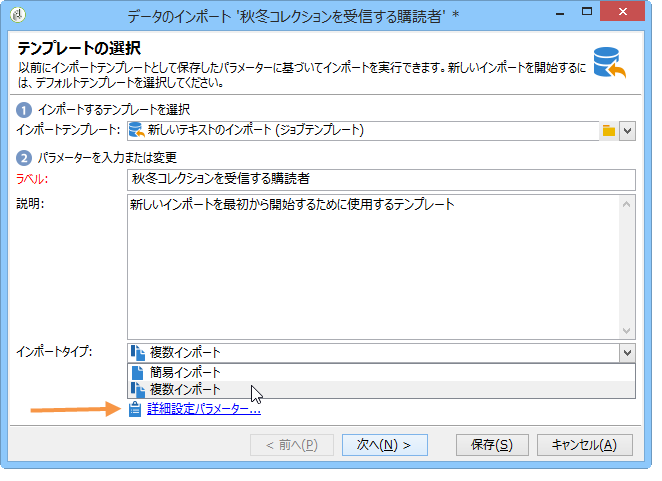
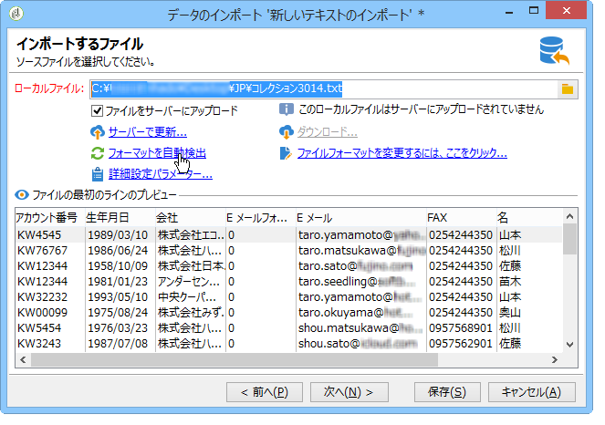
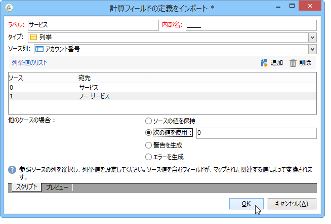
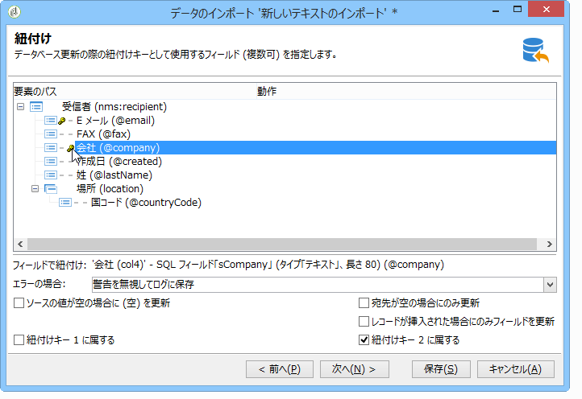
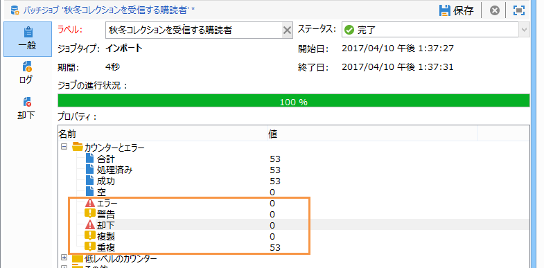
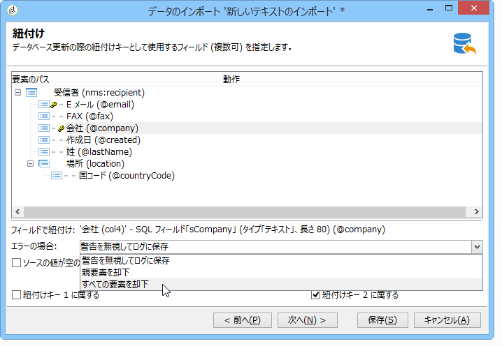
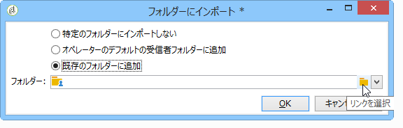
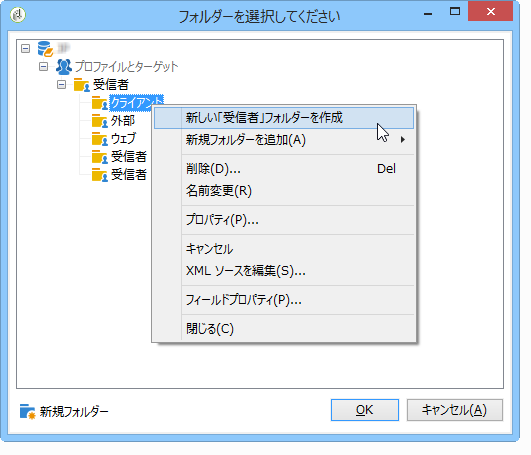
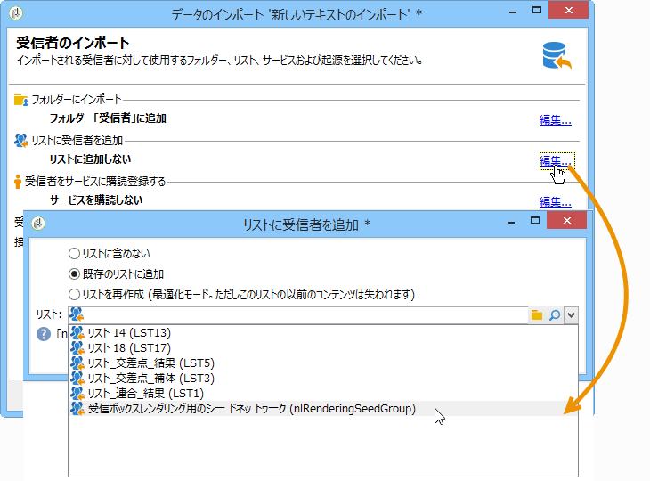
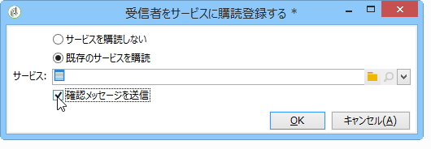

# インポートジョブの設定 {#executing-import-jobs}

Adobe Campaign では、テキスト、CSV、TAB、XML のいずれかの形式の 1 つ以上のファイルから、データベースにデータをインポートできます。これらのファイルはテーブル（メインテーブルまたはリンクされたテーブル）に関連付けられ、ソースファイルの各フィールドはデータベースのフィールドに関連付けられます。

>[!NOTE]
>
>「**[!UICONTROL リストをインポート]**」機能を使用して、データベースデータにマッピングせずにデータをインポートできます。このデータは、ワークフローの「**[!UICONTROL リストの読み込み]**」オブジェクト経由でのみ使用できます。詳しくは、[このページ](../../workflow/using/read-list.md)を参照してください。

インポートウィザードでは、インポートを設定し、そのオプション（データ変換など）を定義して、実行を開始できます。これは、インポートのタイプ（簡易または複数）やオペレーターの権限によって内容の異なる一連の画面です。

インポートウィザードは、新しいインポートジョブを作成すると表示されます（[インポートジョブとエクスポートジョブの作成](../../platform/using/creating-import-export-jobs.md)を参照）。

>[!NOTE]
>
>IIS Web サーバーを使用する場合、（28 MB を超える）大きいファイルのアップロードを許可するには、設定が必要になることがあります。詳しくは、[こちらの節](../../installation/using/integration-into-a-web-server-for-windows.md#changing-the-upload-file-size-limit)を参照してください。

## ソースファイル {#source-file}

ソースファイル内の各ラインは、レコードと一致しています。レコード内のデータは、スペース、タブ、文字などの区切り記号で区切られています。つまり、データは列の形式で取得され、各列はデータベースのフィールドに関連付けられます。

## 手順 1 - インポートテンプレートの選択 {#step-1---choosing-the-import-template}

インポートウィザードを起動するときは、まずテンプレートを選択する必要があります。例えば、ニュースレターを受け取った受信者のインポートを設定するには、以下の手順に従います。

1. **[!UICONTROL プロファイルとターゲット／ジョブ／一般的なインポートおよびエクスポート]**&#x200B;フォルダーを選択します。
1. 「**新規**」をクリックし、「**インポート**」をクリックして、インポートテンプレートを作成します。

   

1. 「**[!UICONTROL インポートテンプレート]**」フィールドの右側にある矢印をクリックしてテンプレートを選択するか、「**[!UICONTROL リンクを選択]**」をクリックしてツリーを参照します。

   ネイティブテンプレートは、「**[!UICONTROL 新しいテキストのインポート]**」です。このテンプレートは変更できませんが、必要に応じて、このテンプレートを複製して新しいテンプレートを設定できます。インポートテンプレートは、デフォルトで、**[!UICONTROL プロファイルとターゲット／テンプレート／ジョブテンプレート]**&#x200B;ノードに保存されます。

1. 「**[!UICONTROL ラベル]**」フィールドに、このインポートの名前を入力します。説明を追加できます。
1. 該当するフィールドでインポートタイプを選択します。インポートには、1 つのファイルのみをインポートする「**[!UICONTROL 簡易インポート]**」と、1 回の実行で複数のファイルをインポートする「**[!UICONTROL 複数インポート]**」の 2 つのタイプがあります。

   複数インポートの場合、インポートウィザードの最初の画面の&#x200B;**[!UICONTROL インポートタイプ]**&#x200B;ドロップダウンリストから「**[!UICONTROL 複数インポート]**」を選択します。

   

1. **[!UICONTROL 追加]**&#x200B;をクリックして、インポートするフィールドを指定します。

   

   ファイルを 1 つ追加するたびに、**[!UICONTROL インポートするファイル]**&#x200B;ウィザードの画面が表示されます。[手順 2 - ソースファイルの選択](#step-2---source-file-selection)の節を参照し、ウィザードの手順に従って、簡易インポートに関するインポートオプションを定義します。

   >[!NOTE]
   >
   >「複数インポート」は、具体的な必要性があるときにのみ使用してください。通常はお勧めしません。

### 詳細設定パラメーター {#advanced-parameters}

「**[!UICONTROL 詳細設定パラメーター]**」リンクを使用して、次のオプションにアクセスできます。

* 「**[!UICONTROL 一般]**」タブ

   * **[!UICONTROL 却下が多すぎる場合に実行を停止]**

      このオプションは、デフォルトで選択されています。却下の数に関係なくインポートの実行を続行する場合は、選択を解除できます。デフォルトでは、最初の 100 ラインが却下された場合、実行は停止されます。

   * **[!UICONTROL トレースモード]**

      インポートの実行をラインごとにトラッキングする場合に、このオプションを選択します。

   * **[!UICONTROL プロセスの分離でジョブを開始]**

      このオプションは、デフォルトで選択されています。データベースで処理中の他のジョブに影響しないように、インポートの実行を分離できます。

   * **[!UICONTROL 列挙を更新しない]**

      データベース内の列挙値のリストをエンリッチメントしない場合に、このオプションを選択します。[列挙の管理](../../platform/using/managing-enumerations.md)を参照してください。

* 「**[!UICONTROL 変数]**」タブ

   クエリエディターおよび計算フィールドでアクセス可能になる、ジョブに関連付けられた変数を定義できます。変数を作成するには、**[!UICONTROL 追加]**&#x200B;をクリックして変数エディターを使用します。

   >[!IMPORTANT]
   >
   >「**[!UICONTROL 変数]**」タブは、ワークフロータイプのプログラミングの場合にのみ使用するもので、設定するのはエキスパートユーザーのみである必要があります。

## 手順 2 - ソースファイルの選択 {#step-2---source-file-selection}

ソースファイルは、テキストフォーマット（txt、csv、tab、固定列）または xml です。

デフォルトでは、「**[!UICONTROL ファイルをサーバーにアップロードします]**」オプションが選択されています。「**[!UICONTROL ローカルファイル]**」フィールドの右側にあるフォルダーをクリックしてローカルディスクを参照し、インポートするファイルを選択します。インポートするファイルがサーバー上にある場合は、このオプションの選択を解除して、そのアクセスパスと名前を入力できます。

ファイルを指定したら、「**[!UICONTROL フォーマットを自動検出]**」をクリックすると、そのデータをウィンドウの下部セクションに表示できます。このプレビューでは、ソースファイルの最初の 200 ラインが表示されます。

このビューの上に表示されているオプションを使用して、インポートを設定できます。これらのオプションを使用して定義されたパラメーターは、プレビューに転送されます。次のオプションを使用できます。

* 「**[!UICONTROL ファイルフォーマットを変更するには、ここをクリックしてください...]**」では、ファイルフォーマットを確認し、設定を調整できます。
* 「**[!UICONTROL サーバーで更新...]**」では、ローカルファイルをサーバーに転送できます。このオプションは、「**[!UICONTROL ファイルをサーバーにアップロードします]**」オプションが選択されている場合にのみ使用できます。
* 「**[!UICONTROL ダウンロード]**」は、ファイルがサーバーにアップロードされている場合にのみ使用できます。
* 「**[!UICONTROL フォーマットを自動検出]**」は、データソースのフォーマットを再初期化する場合に使用します。このオプションを使用すると、「**[!UICONTROL ファイルフォーマットを変更するには、ここをクリックしてください...]**」オプションで書式設定したデータに、元のフォーマットを再適用できます。
* 「**[!UICONTROL 詳細設定パラメーター]**」リンクを使用すると、ソースデータをフィルターし、詳細設定オプションにアクセスできます。この画面から、インポート対象をファイルの一部のみにすることを選択できます。フィルターを定義して、例えば、対応するラインの値に従って、「見込み客」または「顧客」タイプのユーザーのみをインポートすることもできます。これらのオプションを使用するのは、エキスパート JavaScript ユーザーのみである必要があります。

### ファイルフォーマットの変更 {#changing-the-file-format}

「**[!UICONTROL ファイルフォーマットを変更するには、ここをクリックしてください...]**」オプションを使用すると、ソースファイルのデータを書式設定でき、特に列区切り記号および各フィールドのデータタイプを指定できます。この設定は、次のウィンドウで実行します。

この手順では、ファイルフィールドの値をどのように読み取るかを指定できます。例えば、日付の場合、日付データまたは日付 + 時刻データをフォーマット（yyyy/mm/dd、mm/dd/yyyy など）に関連付けることができます。入力データが想定されるフォーマットと一致していない場合、インポート中に却下が発生します。

ウィンドウの下部のプレビューゾーンで、設定の結果を表示できます。

「**[!UICONTROL OK]**」をクリックしてフォーマットを保存し、「**[!UICONTROL 次へ]**」をクリックして次の手順を表示します。

## 手順 3 - フィールドマッピング {#step-3---field-mapping}

次に、宛先スキーマを選択し、各列のデータをデータベースのフィールドにマッピングする必要があります。

* 「**[!UICONTROL 宛先スキーマ]**」フィールドで、データがインポートされるスキーマを選択できます。この情報は必須です。**[!UICONTROL リンクを選択]**&#x200B;アイコンをクリックして、既存のスキーマのいずれかを選択します。**[!UICONTROL リンクを編集]**&#x200B;をクリックして、選択したテーブルのコンテンツを表示します。
* 中央のテーブルには、ソースファイルで定義されているすべてのフィールドが表示されます。宛先ファイルを関連付けるために、インポートするフィールドを選択します。これらのフィールドは、手動または自動でマッピングできます。

   フィールドを手動でマッピングするには、チェックボックスをクリックしてソースフィールドを選択し、2 番目の列をクリックして、選択したフィールドに対応するセルを有効にします。次に、**[!UICONTROL 式を編集]**&#x200B;アイコンをクリックして、現在のテーブルのすべてのフィールドを表示します。宛先フィールドを選択し、「**[!UICONTROL OK]**」をクリックしてマッピングを検証します。

   ソースフィールドと宛先フィールドを自動的に関連付けるには、フィールドのリストの右側にある&#x200B;**[!UICONTROL 宛先フィールドを推測]**&#x200B;アイコンをクリックします。提案されたフィールドは、必要に応じて変更できます。

   >[!IMPORTANT]
   >
   >この操作の結果は、次の手順に進む前に必ず確認する必要があります。

* インポートされるフィールドに変換を適用できます。そのためには、該当するフィールドに対応する「**[!UICONTROL 変換]**」列のセル内をクリックし、適用する変換を選択します。

   

   >[!IMPORTANT]
   >
   >変換はインポート時に適用されます。ただし、宛先フィールドに対する制約が定義されている場合は（前述の例では、@lastname フィールドに対して）、制約が優先されます。

* 中央のテーブルの右側にある該当するアイコンを使用して、計算フィールドを追加できます。計算フィールドを使用すると、複雑な変換の実行、仮想列の追加または複数の列のデータの結合を実行できます。様々な可能性について詳しくは、以降の節を参照してください。

### 計算フィールド {#calculated-fields}

計算フィールドは、ソースファイルに追加される新しい列で、他の列から計算されます。計算フィールドは、Adobe Campaign データベースのフィールドに関連付けることができます。ただし、計算フィールドに対して紐付け操作は実行できません。

次の 4 つのタイプの計算フィールドがあります。

* **[!UICONTROL 固定文字列]**：計算フィールドの値は、ソースファイルのすべてのラインに対して同じです。挿入または更新されるレコードのフィールドの値を設定できます。例えば、インポートされるすべてのレコードに対して、マーカーを「はい」に設定できます。
* **[!UICONTROL JavaScript タグを含む文字列]**：計算フィールドの値は、JavaScript コマンドを含む文字列です。
* **[!UICONTROL JavaScript 式]**：計算フィールドの値は、JavaScript 関数の評価の結果です。返される値は、数値、日付などです。
* **[!UICONTROL 列挙]**：フィールドの値は、ソースファイルに含まれている値に従って決定されます。エディターを使用して、次の例に示すように、ソース列を指定して列挙値のリストを入力できます。

   

   「**[!UICONTROL プレビュー]**」タブで、定義した設定の結果を表示できます。ここでは、「**[!UICONTROL サービス]**」列が追加されています。値は「**ステータス**」フィールドから計算されます。

   

## 手順 4 - 紐付け {#step-4---reconciliation}

インポートウィザードでの紐付け手順では、ファイルのデータとデータベース内の既存のデータの紐付けのモードを定義し、ファイルデータとデータベースデータ間の優先順位ルールを設定できます。設定ウィンドウは次のように表示されます。

画面の中央のセクションには、データがインポートされる Adobe Campaign データベースのフィールドおよびテーブルのツリーがあります。

ノード（テーブルまたはフィールド）ごとに特別なオプションを使用できます。リスト内の該当するノードをクリックすると、そのパラメーターと簡単な説明が下に表示されます。各要素に対して定義されている行動が、対応する「**[!UICONTROL 行動]**」列に表示されます。

### 操作のタイプ {#types-of-operation}

インポート対象の各テーブルについて、操作のタイプを定義する必要があります。データベースの主要な要素に対して使用可能な操作は次のとおりです。

* **[!UICONTROL 更新または挿入]**：データベース内にレコードが存在する場合は更新し、存在しない場合は作成します。
* **[!UICONTROL 挿入]**：データベースにレコードを挿入します。
* **[!UICONTROL 更新]**：既存のレコードのみを更新します（その他のレコードは無視します）。
* **[!UICONTROL 紐付けのみ]**：データベース内のレコードを検索しますが、更新は実行しません。例えば、フォルダー内のデータを更新せずに、ファイルの列に従って、インポートする受信者のフォルダーを関連付けることができます。
* **[!UICONTROL 削除]**：データベース内のレコードを破棄できます。

インポート対象のテーブル内の各フィールドに対して使用可能なオプションは次のとおりです。

* **[!UICONTROL ソースの値が空の場合に（空）を更新]**：更新が発生した際に、ソースファイルで該当のフィールドが空の場合、フィールドの値によってデータベースの値が削除されます。それ以外の場合、データベースフィールドは保持されます。
* **[!UICONTROL 宛先が空の場合にのみ更新]**：データベースフィールドが空の場合を除き、ソースファイルの値によってデータベースフィールドの値が上書きされません。空の場合、ソースファイルの値が取得されます。
* **[!UICONTROL レコードが挿入された場合にのみフィールドを更新]**：更新または挿入操作中、ソースファイルレコードのうち新規のレコードのみがインポートされます。

>[!NOTE]
>
>重複のない挿入の場合を除き、紐付けキーの定義は常に&#x200B;**必須**&#x200B;です。

### 紐付けキー {#reconciliation-keys}

重複排除を管理するために、少なくとも 1 つの紐付けキーを入力する必要があります。

紐付けキーは、レコードを識別するために使用される一連のフィールドです。例えば、受信者をインポートする場合、紐付けキーは、アカウント番号、「E メール」フィールドまたは「姓」、「名」、「会社」フィールドなどです。

この場合、ファイルのラインがデータベース内の既存の受信者と一致するかどうかを判別するために、インポートエンジンでは、キーのすべてのフィールドについて、ファイルの値をデータベースの値と比較します。フィールドが 1 つのレコードに固有の場合、ソースデータと宛先データ間の適切な比較を実行でき、インポート後のデータの整合性が保証されます。同じテーブルに対して 2 番目の紐付けキーを入力できます。これは、最初のキーが空のラインに対して使用されます。

インポート中に変更される可能性があるフィールドを選択することは避けます。これが発生すると、エンジンにより追加レコードが作成される場合があります。

>[!NOTE]
>
>受信者のインポートでは、選択したフォルダーの識別子が暗黙的にキーに追加されます。
>
>したがって、紐付けはこのフォルダーに対してのみ実行されます（フォルダーが選択されない場合を除く）。

### 重複排除 {#deduplication}

>[!NOTE]
>
>「コピー」は、インポートされるファイル内に 2 回以上存在する項目です。
>
>「重複」は、インポートされるファイル内とデータベース内の両方に存在する項目です。

「**[!UICONTROL コピーの管理]**」フィールドで、データの重複排除を設定できます。重複排除は、**ソースファイル内**（複数ファイルのインポートの場合は複数のソースファイル）に複数回存在するレコード、つまり紐付けキーのフィールドが同一であるラインが対象となります。

* 「**[!UICONTROL 更新]**」モード（デフォルトのモード）での重複の管理では、重複排除は実行されません。直前のレコードのデータは更新されるので、結果として、最後のレコードが優先されます。このモードでは、重複のカウントは実行されません。
* 「**[!UICONTROL 無視]**」モードまたは「**[!UICONTROL エンティティを却下]**」モードでの重複の管理では、重複はインポートから除外されます。この場合、レコードはインポートされません。
* 「**[!UICONTROL エンティティを却下]**」モードでは、要素はインポートされず、インポートログにエラーが生成されます。
* 「**[!UICONTROL 無視]**」モードでは、要素はインポートされませんが、エラーのトレースは保持されません。このモードを使用すると、パフォーマンスを最適化できます。

>[!IMPORTANT]
>
>重複排除は、メモリ内のみで実行されます。そのため、重複排除でのインポートのサイズは制限されます。制限は、複数のパラメーター（アプリケーションサーバーの処理能力、アクティビティ、キーのフィールド数など）によって異なります。重複排除の最大サイズは、約 1,000,000 ラインです。

重複排除は、ソースファイルとデータベースの両方に存在するレコードを対象とします。更新を伴う操作（「**[!UICONTROL 更新または挿入]**」または「**[!UICONTROL 更新]**」）のみを対象とします。「**[!UICONTROL 重複の管理]**」オプションを使用すると、レコードがソースファイルとデータベースの両方に存在する場合にレコードを更新または無視できます。「**[!UICONTROL 起源に応じて更新または挿入]**」オプションは、オプションのモジュールに属しており、標準のコンテキストでは使用できません。

オプション「**[!UICONTROL 却下]**」および「**[!UICONTROL 無視]**」は、前述のように動作します。

### エラーの場合の動作 {#behavior-in-the-event-of-an-error}

ほとんどのデータ転送操作で、様々なタイプのエラーが発生します（一貫性のないラインフォーマット、無効な E メールアドレスなど）。インポートエンジンによって生成されるすべてのエラーおよびすべての警告は、保存され、インポートインスタンスにリンクされます。

これらの却下の詳細は、「**[!UICONTROL 却下]**」タブで表示できます。

次の 2 つのタイプの却下があります（タイプは「**[!UICONTROL コネクタ]**」列に表示されます）。

* テキストコネクタの却下は、ファイルラインの処理中に発生するエラーに関係します（計算フィールド、データ分析など）。この場合、エラーが発生すると、常にライン全体が却下されます。
* データベースコネクタの却下は、データの紐付けまたはデータベースへの書き込み中に発生するエラーに関係します。複数のテーブルへのインポートの場合は、却下はレコードの一部にのみ関係することがあります（例えば、受信者および関連するイベントのインポートの場合、エラーが発生すると、イベントの更新が回避され、受信者が却下されないことがあります）。

データの紐付けページで、目的のエラー管理タイプをフィールドごとおよびテーブルごとに定義できます。

* **[!UICONTROL 警告を無視してログに保存]**：エラーが発生したフィールドを除き、すべてのフィールドがデータベースにインポートされます。
* **[!UICONTROL 親要素を却下]**：エラーが発生したフィールドだけでなく、レコードのライン全体が却下されます。
* **[!UICONTROL すべての要素を却下]**：インポートは停止し、レコードのすべての要素が却下されます。

   

インポートインスタンスの却下画面のツリーには、却下されたフィールドとエラーが発生した場所が示されます。

**[!UICONTROL 却下をエクスポート]**&#x200B;アイコンを使用すると、これらのレコードを含むファイルを生成できます。

## 手順 5 - 受信者をインポートする際の追加手順 {#step-5---additional-step-when-importing-recipients}

インポートウィザードの次の手順では、データのインポート先となるフォルダーを選択または作成し、インポートされた受信者を（新規または既存の）リストと自動的にマッピングし、受信者をサービスに購読登録できます。

>[!NOTE]
>
>この手順は、受信者のみをインポートする場合と、デフォルトの Adobe Campaign 受信者テーブル（**nms:recipient**）を使用する場合に表示されます。

* 「**[!UICONTROL 編集]**」リンクをクリックして、受信者の関連付けまたは購読登録をおこなうフォルダー、リストまたはサービスを選択します。

   1. フォルダーへのインポート

      「**[!UICONTROL フォルダーにインポート]**」セクションの「**[!UICONTROL 編集...]**」リンクを使用して、受信者がインポートされるフォルダーを選択または作成できます。デフォルトでは、パーティションが定義されていない場合、データはオペレーターのデフォルトのフォルダーにインポートされます。

      >[!NOTE]
      >
      >オペレーターのデフォルトのフォルダーは、オペレーターが書き込みアクセス権を持つ最初のフォルダーです。詳しくは、[フォルダーアクセス管理](../../platform/using/access-management-folders.md)を参照してください。

      インポートフォルダーを選択するには、「**[!UICONTROL フォルダー]**」フィールドの右側にある矢印をクリックし、関係するフォルダーを選択します。**[!UICONTROL リンクを選択]**&#x200B;アイコンを使用して新しいウィンドウでツリーを表示するか、新しいフォルダーを作成することもできます。

      

      新しいフォルダーを作成するには、フォルダーを追加するノードを選択し、右クリックします。「**[!UICONTROL 新しい「受信者」フォルダーを作成]**」を選択します。

      

      現在のノードの下に新しいフォルダーが追加されます。新しいフォルダーの名前を入力し、Enter キーを押して確定して、「**[!UICONTROL OK]**」をクリックします。

      

   1. リストへの関連付け

      「**[!UICONTROL リストに受信者を追加]**」セクションの「**[!UICONTROL 編集...]**」リンクを使用して、受信者がインポートされるリストを選択または作成できます。

      

      これらの受信者用に新しいリストを作成するには、**[!UICONTROL リンクを選択]**&#x200B;をクリックしてから、**[!UICONTROL 作成]**&#x200B;をクリックします。リストの作成と管理については、[リストの作成および管理](../../platform/using/creating-and-managing-lists.md)で説明しています。

      

      受信者をリスト内の既存の受信者に追加するか、または新しい受信者でリストを再作成するかを決定できます。後者の場合、リストに既に受信者が含まれていた場合は、それらは削除され、インポートされた受信者に置き換えられます。

   1. サービスの購読登録

      インポートされたすべての受信者を情報サービスに購読登録するには、受信者を購読登録する対象となる情報サービスを選択または作成するために、「**[!UICONTROL 受信者をサービスに購読登録する]**」セクションの「**[!UICONTROL 編集...]**」リンクをクリックします。「**[!UICONTROL 確認メッセージを送信]**」オプションを選択できます。このメッセージの内容は、購読サービスに関連付けられた配信テンプレートで定義されています。

      

      これらの受信者用に新しいサービスを作成するには、**[!UICONTROL リンクを選択]**&#x200B;をクリックしてから、**[!UICONTROL 作成]**&#x200B;アイコンをクリックします。情報サービスの管理については、[この節](../../delivery/using/managing-subscriptions.md)で説明しています。

* 「**[!UICONTROL 接触チャネル]**」フィールドを使用して、受信者の接触チャネルに関する情報をプロファイルに追加します。この情報は、複数インポートのフレームワークで特に役立ちます。

この手順を検証して次の手順を表示するには、「**[!UICONTROL 次へ]**」をクリックします。

## 手順 6 - インポートの開始 {#step-6---launching-the-import}

ウィザードの最後の手順では、データのインポートを開始できます。そのためには、「**[!UICONTROL 開始]**」ボタンをクリックします。

その後、インポートジョブの実行を監視できます（[ジョブの実行の監視](../../platform/using/monitoring-jobs-execution.md)を参照）。
