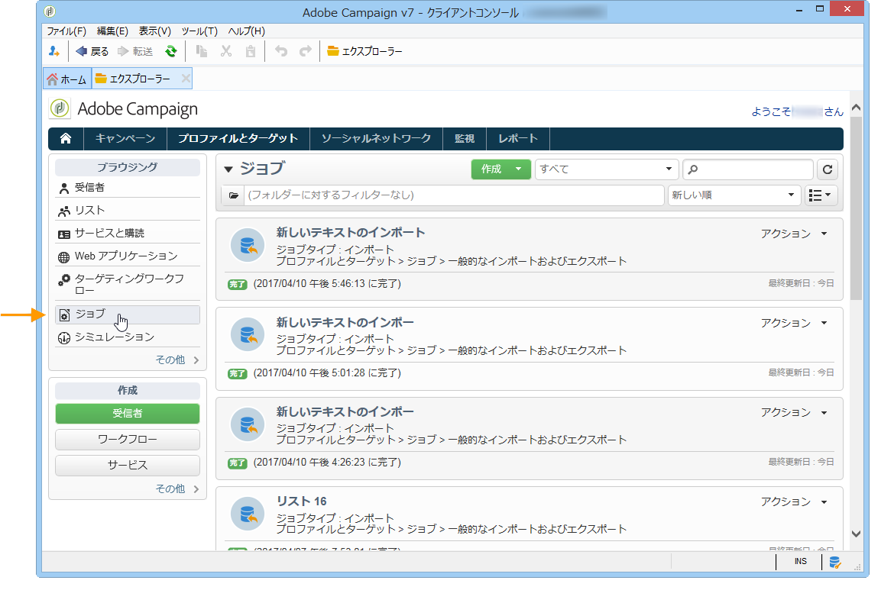

# プロファイルのエクスポートとインポート{#exporting-and-importing-profiles}

受信者プロファイルは Adobe Campaign データベースにインポートできます。また、データベース外のファイルにエクスポートし、保存することもできます。

データのインポートとエクスポートを設定、実行するには、**[!UICONTROL プロファイルとターゲット]**&#x200B;ウィンドウに移動し、「**[!UICONTROL ジョブ]**」リンクをクリックします。

>[!NOTE]
>
>データのインポートとエクスポートは、[一般的なインポートおよびエクスポート](../../platform/using/generic-imports-and-exports.md)および[このビデオ](https://docs.adobe.com/content/help/en/campaign-learn/campaign-classic-tutorials/getting-started/importing-profiles.html)で説明します。

