# データのエクスポート{#exporting-data}

## エクスポートウィザード {#export-wizard}

エクスポートパラメーターは、ウィザードを使用して記録されます。標準として使用可能な汎用エクスポートモジュールを使用し、データベースにアクセスして連絡先、クライアント、リスト、セグメントなどのデータを抽出できます。例えば、スプレッドシートのキャンペーントラッキングデータ（トラッキング履歴など）があると役立つ場合があります。出力データは、txt、CSV、TAB または XML フォーマットです。

### 手順 1 - エクスポートテンプレートの選択 {#step-1---choosing-the-export-template}

エクスポートウィザードを起動するときは、まずテンプレートを選択する必要があります。例えば、最近登録した受信者のエクスポートを設定するには、以下の手順に従います。

1. フォルダを選択 **[!UICONTROL Profiles and Targets > Job > Generic imports and exports]** します。
1. 「**新規**」をクリックし、「**エクスポート**」をクリックして、エクスポートテンプレートを作成します。

   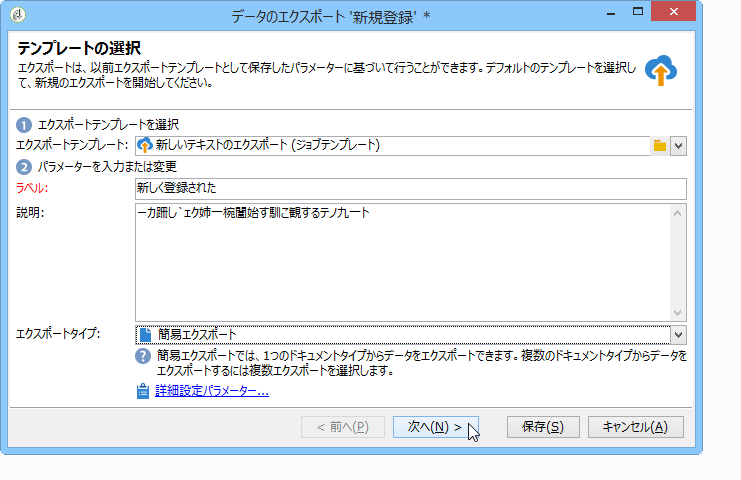

1. Click the arrow to the right of the **[!UICONTROL Export template]** field to select your template, or click **[!UICONTROL Select link]** to browse the tree.

   ネイティブテンプレートはで **[!UICONTROL New text export]**&#x200B;す。 このテンプレートは変更できませんが、このテンプレートを複製して新しいテンプレートを設定することができます。デフォルトでは、書き出しテンプレートはノードに保存さ **[!UICONTROL Resources > Templates > Job templates]** れます。

1. Enter a name for export in the **[!UICONTROL Label]** field. 説明を追加できます。
1. エクスポートタイプを選択します。書き出しには、次の2つのタイプがあります。1つ以 **[!UICONTROL Simple export]** 上の種類のソースドキュメントから、1 **[!UICONTROL Multiple export]** つのファイルのみをエクスポートし、1回の実行で複数のファイルをエクスポートする場合。

### 手順 2 - エクスポートするファイルのタイプ {#step-2---type-of-file-to-export}

エクスポートするドキュメントのタイプ、つまりエクスポートするデータのスキーマを選択します。

By default, when the export is launched from the **[!UICONTROL Jobs]** node the data comes from the recipient table. When the export is launched from a list of data (from the **[!UICONTROL right click > Export]** menu), the table to which the data belongs is automatically filled in in the **[!UICONTROL Document type]** field.

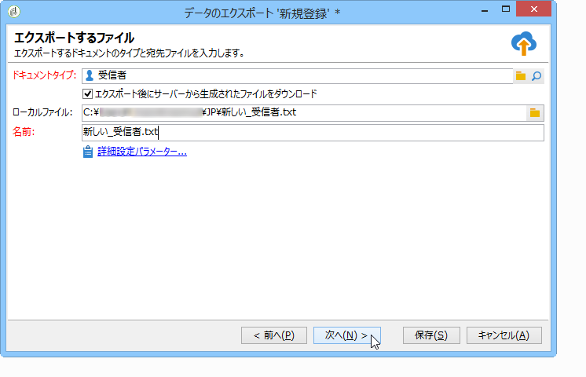

* デフォルトでは、このオ **[!UICONTROL Download the file generated on the server after the export]** プションは選択されています。 In the **[!UICONTROL Local file]** field, fill in the name and path of the file to be created, or browse your local disk by clicking the folder to the right of the field. このオプションの選択を解除して、サーバー出力ファイルのアクセスパスと名前を入力できます。

   >[!NOTE]
   >
   >自動インポートおよびエクスポートジョブは、常にサーバーで実行されます。
   >
   >To export only some of the data, click **[!UICONTROL Advanced parameters]** and enter the number of lines to be exported in the appropriate field.

* 差分エクスポートを作成して、最終実行以降に変更されたレコードのみをエクスポートできます。これを行うには、リンクをクリ **[!UICONTROL Advanced parameters]** ックし、タブをクリック **[!UICONTROL Differential export]** して、を選択しま **[!UICONTROL Activate differential export]**&#x200B;す。

   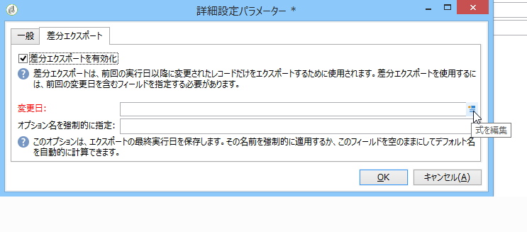

   前回の変更日を入力する必要があります。前回の変更日は、フィールドから取得するか、計算できます。

### 手順 3 - 出力フォーマットの定義 {#step-3---defining-the-output-format}

エクスポートファイルの出力フォーマットを選択します。テキスト、固定列テキスト、CSV および XML フォーマットを使用できます。

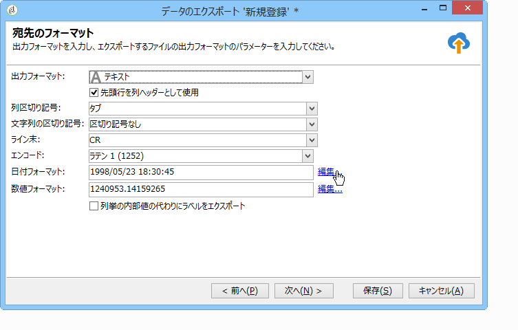

* For **[!UICONTROL Text]** format, select the delimiters to separate the columns (tabs, commas, semi-colons, or custom) and the strings (single or double quotes, or none).
* とに対し **[!UICONTROL text]** て、オ **[!UICONTROL CSV]**&#x200B;プションを選択することができま **[!UICONTROL Use first lines as column titles]**&#x200B;す。
* 日付フォーマットおよび数字のフォーマットを指定します。To do this, click the **[!UICONTROL Edit]** button for the field concerned and use the editor.
* 列挙値を含むフィールドの場合は、を選択できま **[!UICONTROL Export labels instead of internal values of enumerations]**&#x200B;す。 For example, the title can be stored in the form **1=Mr.**, **2=Miss**,** 3=Mrs.**. このオプションを選択した場合、**Mr.**、**Miss** および **Mrs.** がエクスポートされます。

### 手順 4 - データ選択 {#step-4---data-selection}

エクスポートするフィールドを選択します。手順は次のとおりです。

1. Double-click the desired fields in the **[!UICONTROL Available fields]** list in order to add them to the **[!UICONTROL Output columns]** section.
1. リストの右側にある矢印を使用して、出力ファイルでのフィールドの順序を定義します。

   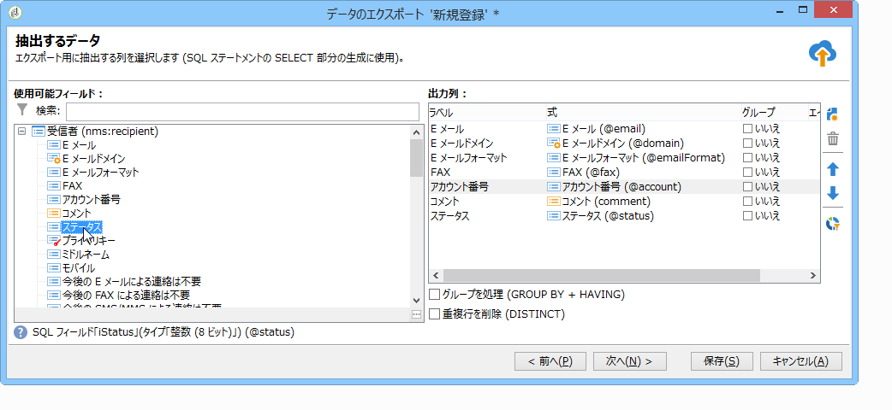

1. Click the **[!UICONTROL Add]** button to call on functions. 詳しくは、「関数のリスト」を参 [照してください](../../platform/using/defining-filter-conditions.md#list-of-functions)。

### 手順 5 - 列の並べ替え {#step-5---sorting-columns}

列の並べ替え順を選択します。

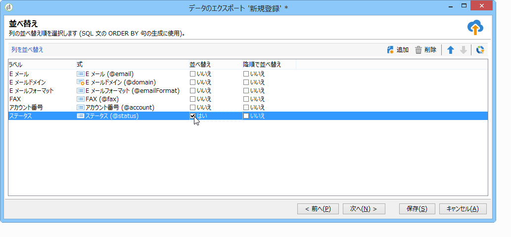

### 手順 6 - フィルター条件 {#step-6---filter-conditions-}

フィルター条件を追加して、すべてのデータがエクスポートされないようにすることができます。このフィルターの設定は、配信ウィザードでの受信者のターゲティングと同じです。[このページ](../../delivery/using/steps-defining-the-target-population.md)を参照してください。

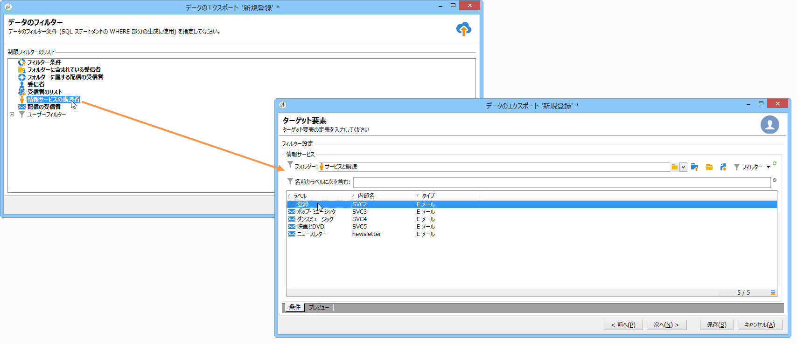

### 手順 7 - データフォーマット {#step-7---data-formatting}

出力ファイルのフィールドの順序およびラベルを変更し、ソースデータに変換を適用できます。

* エクスポートする列の順序を変更するには、該当する列を選択し、テーブルの右側の青色の矢印を使用します。
* To change the label of a field, click in the cell of the **[!UICONTROL Label]** column that matches the field to be modified, and enter the new label. キーボードの Enter キーを押して確定します。
* To apply a case transformation to the content of a field, select it from the **[!UICONTROL Transformation]** column. 次の項目を選択できます。

   * 小文字に切り替え
   * 大文字に切り替え
   * 最初の文字は大文字
   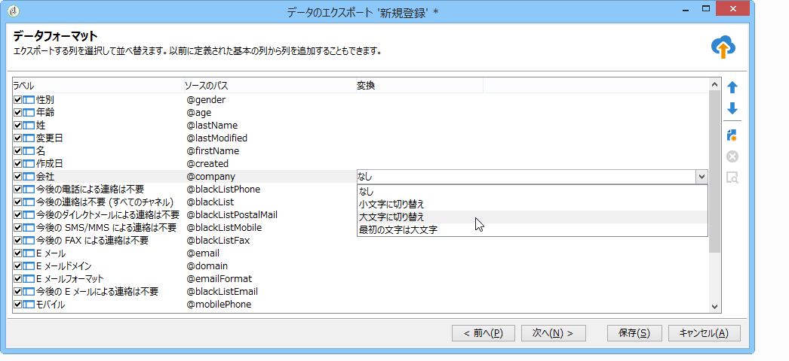

* Click **[!UICONTROL Add a calculated field]** if you want to create a new calculated field (for example, a column containing last name + first name). For more on this, refer to [Calculated fields](../../platform/using/importing-data.md#calculated-fields).

要素のコレクション（受信者の購読、受信者が属するリストなど）をエクスポートする場合は、エクスポートするコレクション内の要素数を指定する必要があります。

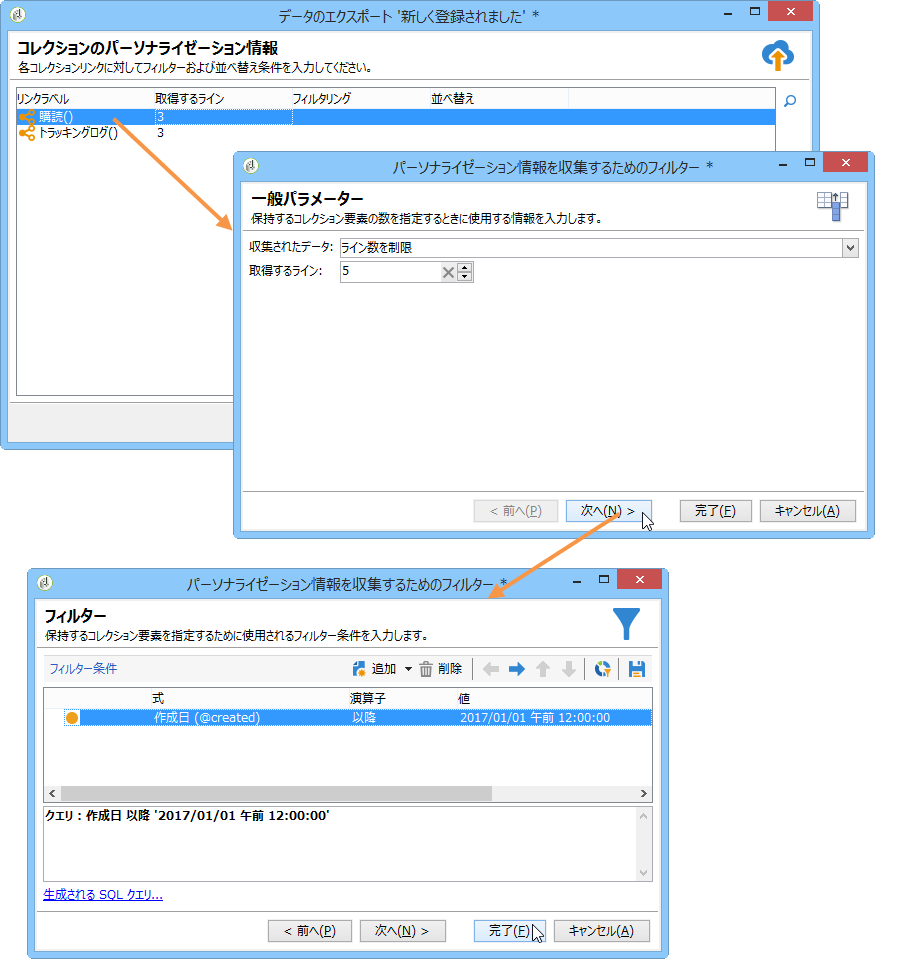

### 手順 8 - データのプレビュー {#step-8---data-preview}

をクリ **[!UICONTROL Start the preview of the data]** ックして、書き出し結果のプレビューを表示します。 デフォルトでは、最初の 200 ラインが表示されます。To change this value, click the arrows to the right of the **[!UICONTROL Lines to display]** field.

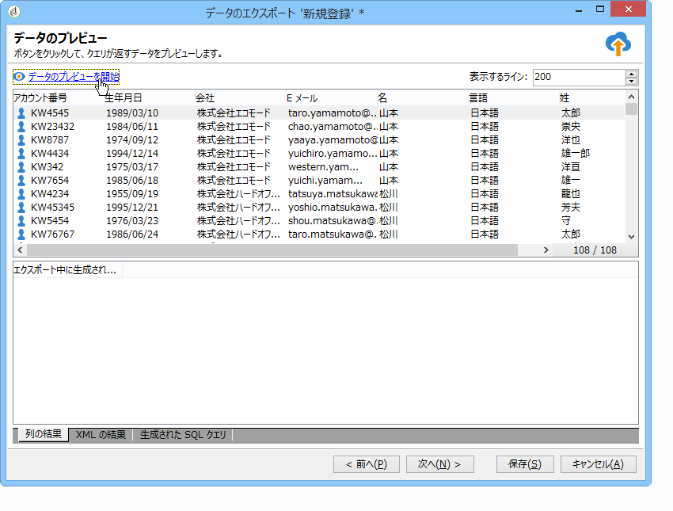

ウィザードの下部にあるタブをクリックして、列での結果のプレビューから XML での結果に切り替えます。生成された SQL クエリを表示することもできます。

### 手順 9 - エクスポートの開始 {#step-9---launching-the-export}

Click **[!UICONTROL Start]** to launch data export.

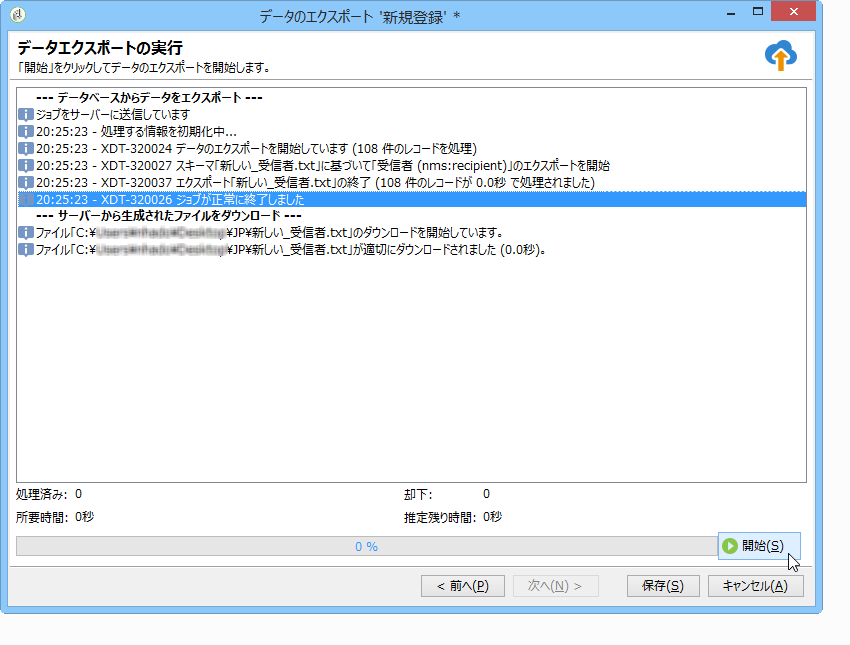

## ワークフローを介したデータのエクスポート {#exporting-data-via-a-workflow}

ワークフローは、エクスポート処理の一部を自動化したり、データの変換に使用できるデータ管理アクティビティの一部を使用した後に正確なデータセットをエクスポートしたりするための有効な手段になります。

ワークフローからのデータのエクスポートについて詳しくは、[この節](../../workflow/using/how-to-use-workflow-data.md)を参照してください。
