# 外部アカウント{#external-accounts}

外部アカウントとは、Adobe Campaign 外部にあるサーバーへのアクセスを設定およびテストできる設定です。これらの外部アカウントをキャンペーンワークフローで使用して、データへアクセスしたり、データを管理したりできます。

次のタイプの外部アカウントをセットアップできます。

* [ルーティング外部アカウント](#routing-external-account)
* [FTP 外部アカウント](#ftp-external-account)
* [外部データベース外部アカウント](#external-database-external-account)
* [Web 分析の外部アカウント](#web-analytics-external-account)
* [Facebook Connect 外部アカウント](#facebook-connect-external-account)
* [実行インスタンス外部アカウント](#execution-instance-external-account)
* [Adobe Experience Cloud 外部アカウント](#adobe-experience-cloud-external-account)
* [SFTP 外部アカウント](#sftp-external-account)
* [Adobe Experience Manager の外部アカウント](#adobe-experience-manager-external-account)
* [Amazon Simple Storage Service（S3）外部アカウント](#amazon-simple-storage-service--s3--external-account)
* [Azure 外部アカウント](#azure-external-account)
* [Hadoop 外部アカウント](#hadoop-external-account)
* [Microsoft Dynamics CRM 外部アカウント](#microsoft-dynamics-crm-external-account)
* [Oracle Oracle On Demand 外部アカウント](#oracle-on-demand-external-account)
* [Salesforce CRM 外部アカウント](#salesforce-crm-external-account)

## 外部アカウントの作成 {#creating-an-external-account}

Adobe Campaign には、事前定義済みの外部アカウントのセットが付属します。外部システム（ファイル転送に使用される FTP サーバーなど）との接続をセットアップするために、独自の外部アカウントを作成できます。

外部アカウントは、テクニカルワークフローやキャンペーンワークフロー等の技術プロセスで使用されます。ワークフローのファイル転送や、その他のアプリケーション（Adobe Target、Experience Manager など）とのデータ交換をセットアップする際には外部アカウントを選択する必要があります。

1. から、メニ **[!UICONTROL Explorer]**&#x200B;ューを展開し **[!UICONTROL Administration]** ます。
1. メニューを展開し **[!UICONTROL Platform]** 、をクリックしま **[!UICONTROL External accounts]**&#x200B;す。

   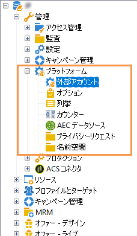

1. ボタンをクリッ **[!UICONTROL New]** クします。

   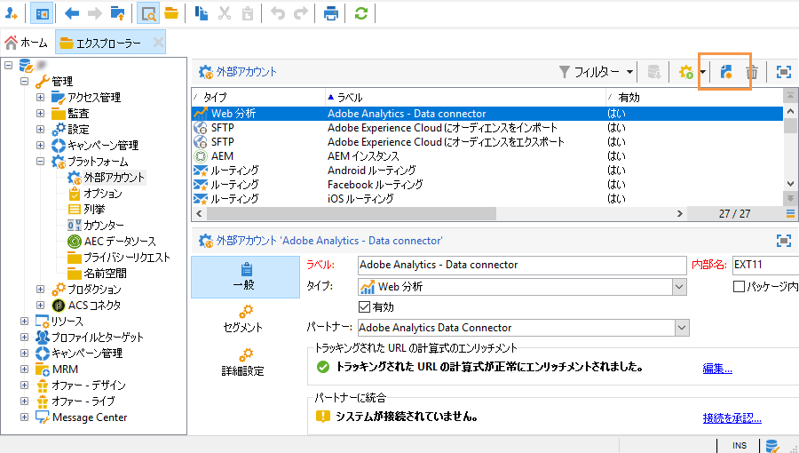

1. と入力し **[!UICONTROL Label]** ます **[!UICONTROL Internal Name]**。 これらは両方とも、ワークフローで外部アカウントを選択したときに使用されます。
1. Check **[!UICONTROL Enabled]** if you want your connection to be enabled.
1. Select your external account **[!UICONTROL Type]** which one you want to create.
1. 選択した外部アカウントタイプに応じて資格情報を指定し、アカウントへのアクセスを設定します。

   必要な情報は通常、接続しているサーバーのプロバイダーから提供されます。

1. クリック **[!UICONTROL Save]**.

外部アカウントが作成され、外部アカウントリストに追加されます。ワークフローアクティビティと配信プロパティで、データファイル転送またはルーティング設定を利用できるようになりました。

## バウンスメール外部アカウント {#bounce-mails-external-account}

**バウンスメール**&#x200B;外部アカウントで、電子メールサービスの接続に使用する外部 POP3 アカウントを指定します。この外部アカウントについて詳しくは、この[ページ](../../workflow/using/inbound-emails.md)を参照してください。

POP3 アクセス用に設定されたすべてのサーバーは、返信メールの受信に使用できます。


To configure the **[!UICONTROL Bounce mails (defaultPopAccount)]** external account:

* **[!UICONTROL Server]**

   POP3 サーバーの URL。

* **[!UICONTROL Port]**

   POP3 接続のポート番号デフォルトのポート番号は 110 です。

* **[!UICONTROL Account]**

   ユーザーの名前。

* **[!UICONTROL Password]**

   アカウントのパスワード

* **[!UICONTROL Encryption]**

   Type of chosen encryption between **[!UICONTROL By default]**, **[!UICONTROL POP3 + STARTTLS]**, **[!UICONTROL POP3]** or **[!UICONTROL POP3S]**.

## ルーティング外部アカウント {#routing-external-account}

The **[!UICONTROL Routing]** external account allows you to configure each channel available in Adobe Campaign depending on the packages installed.

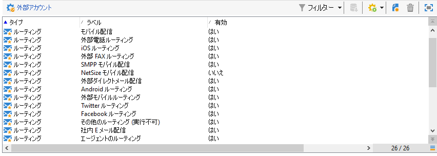

以下のチャネルを設定できます。

* [E メール](../../installation/using/deploying-an-instance.md#email-channel-parameters)
* [モバイル (SMS)](../../delivery/using/sms-channel.md#activating-an-external-account)。
* [電話](../../delivery/using/other-channels.md)
* [ダイレクトメール](../../delivery/using/about-direct-mail-channel.md)
* [エージェンシー](../../delivery/using/other-channels.md)
* [Facebook](../../social/using/publishing-on-facebook-walls.md#delegating-write-access-to-adobe-campaign)
* [Twitter](../../social/using/configuring-publishing-on-twitter.md)
* [iOS チャネル](../../delivery/using/setting-up-mobile-app-channel.md#ios-connectors)
* [Android チャネル](../../delivery/using/setting-up-mobile-app-channel.md#android-connectors)

## FTP 外部アカウント {#ftp-external-account}

FTP 外部アカウントを使用すれば、Adobe Campaign 外でサーバーへのアクセスを設定およびテストできます。外部システム（ファイル転送に使用される FTP サーバー 898 など）との接続をセットアップするために、独自の外部アカウントを作成できます。詳しくは、この[ページ](../../workflow/using/file-transfer.md)を参照してください。

これをおこなうには、この外部アカウントで、FTP サーバーへの接続を確立するために使用するアドレスと資格情報を指定します。

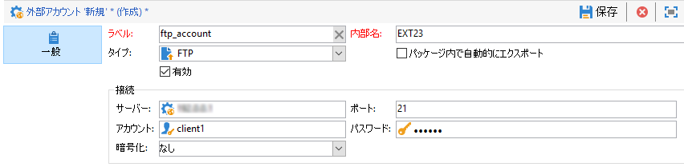

* **[!UICONTROL Server]**

   FTP サーバーの名前。

* **[!UICONTROL Port]**

   FTP 接続のポート番号。デフォルトのポート番号は 21 です。

* **[!UICONTROL Account]**

   ユーザーの名前。

* **[!UICONTROL Password]**

   アカウントのパスワード

* **[!UICONTROL Encryption]**

   Type of chosen encryption between **[!UICONTROL None]** or **[!UICONTROL SSL]**.

これらの資格情報の見つけ方については、この[ページ](https://help.dreamhost.com/hc/en-us/articles/115000675027-FTP-overview-and-credentials)を参照してください。

## 外部データベース外部アカウント {#external-database-external-account}

Adobe Campaign には、外部のアプリケーションとの通信やデータベースエンジンへの接続を可能にするいくつかのコネクタが用意されています。

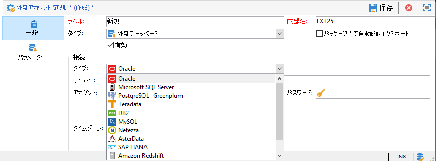

次の接続タイプを設定できます。

* Oracle. 詳しくは、この[ページ](../../platform/using/accessing-an-external-database.md#configure-access-to-oracle)を参照してください。
* MySQL. MYSQLへのアクセスを設定するには、このページを参照して [ください](../../platform/using/accessing-an-external-database.md#configure-access-to-mysql)。
* Netezza. 詳しくは、この[ページ](../../platform/using/accessing-an-external-database.md#configure-access-to-netezza)を参照してください。
* SAP HANA. 詳しくは、この[ページ](../../platform/using/accessing-an-external-database.md#configure-access-to-sap-hanaa)を参照してください。
* InfiniDB
* Microsoft SQL Server
* AsterData
* PostgreSQL
* Teradata
* DB2
* Amazon Redshift
* ODBC（Sybase ASE、Sybase IQ）
* リモートデータベースへの HTTP リレー

### Teradata 外部アカウント {#teradata-external-account}

**Teradata** 外部アカウントを使用すれば、Campaign インスタンスを Teradata 外部データベースに接続することができます。For more information on how to configure Campaign Classic with Teradata, refer to this [page](https://helpx.adobe.com/campaign/kb/campaign_fda_teradata.html) or this [section](../../platform/using/accessing-an-external-database.md#configure-access-to-teradata).

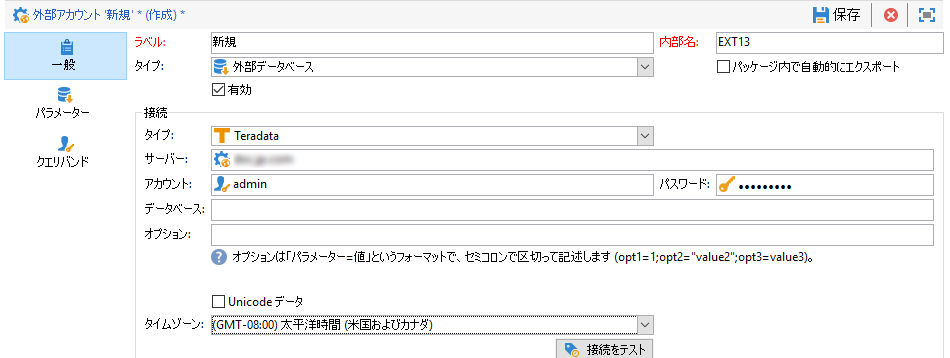

この外部アカウントを Adobe Campaign で使用できるように設定するには、次の情報を提供する必要があります。

* **[!UICONTROL Type]**

   Choose the **[!UICONTROL Teradata]** type.

* **[!UICONTROL Server]**

   Teradata サーバーの URL または名前。

* **[!UICONTROL Account]**

   Teradata データベースへのアクセスに使用するアカウントの名前。

* **[!UICONTROL Password]**

   Teradata データベースへの接続に使用するパスワード。

* **[!UICONTROL Database]**

   このフィールドは空のままにすることができます。

* **[!UICONTROL Options]**

   Teradata にパスするーするオプション

* **[!UICONTROL Timezone]**

   Teradata で設定されたタイムゾーン

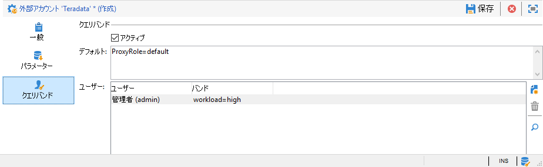

複数の Adobe Campaign ユーザーが同じ FDA Teradata 外部アカウントに接続する場合は、「**[!UICONTROL Query banding]**」タブを使用するとクエリバンドを設定できます（例：セッションでのキー／値のペアのセットなど）。

Campaign ユーザーが Teradata データベース上でクエリを実行するたびに、Adobe Campaign は、このユーザーに関連付けられたキーのリストで構成されたメタデータを送信します。Teradata 管理者は、このデータを監査目的や、アクセス権の管理に使用できます。

Check the **[!UICONTROL Active]** box to activate this feature

The **[!UICONTROL Default]** field lets you enter a default query band that will be used if a user has no associated query band. このフィールドが空になっている場合、クエリバンドがないユーザーは Teradata を使用できません。

The **[!UICONTROL Users]** field allows you to specify a query band for each user. キーと値のペアを必要な数だけ追加できます。例：priority=1;workload=highIf the user has no query band assigned, the **[!UICONTROL Default]** field will be applied.

**[!UICONTROL Query banding]** について詳しくは、[Teradata ドキュメント](https://docs.teradata.com/reader/cY5B~oeEUFWjgN2kBnH3Vw/a5G1iz~ve68yTMa24kVjVw)を参照してください。

## Web 分析の外部アカウント {#web-analytics-external-account}

The **[!UICONTROL Web Analytics (Adobe Analytics - Data connector)]** external account allows you to forward data from Adobe Analytics to Adobe Campaign in the form of segments. 反対に、Adobe Campaign から配信された E メールキャンペーンの指標と属性を Adobe Analytics - Data コネクタに送信します。


この外部アカウントの場合は、トラッキングされる URL の計算式を強化し、2 つのソリューション間の接続を承認する必要があります。詳しくは、この[ページ](../../platform/using/adobe-analytics-data-connector.md#step-2--create-the-external-account-in-campaign)を参照してください。

## Facebook Connect 外部アカウント {#facebook-connect-external-account}

**[!UICONTROL Facebook Connect]** 外部アカウントがあれば、Facebook アプリケーションにパーソナライズしたコンテンツを表示でき、このソーシャルネットワーク経由で見込み客を獲得しやすくなります。

Facebook アプリケーションごとに、**[!UICONTROL Facebook Connect]** タイプの外部アカウントを作成する必要があります。詳しくは、[ページ](../../social/using/creating-a-facebook-application.md#configuring-external-accounts)を参照してください。

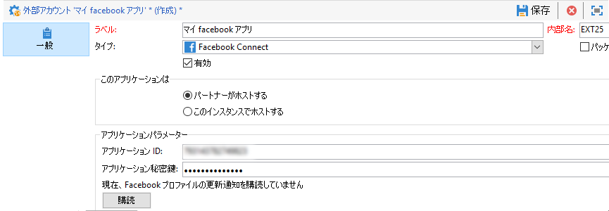

* **[!UICONTROL Hosting mode]**

   または間のアプリケーションのホスティング **[!UICONTROL hosted by a partner]** モードで **[!UICONTROL hosted by this instance]**&#x200B;す。

* **[!UICONTROL Application ID]**

   Facebook アプリケーションのアプリ ID。

* **[!UICONTROL Application secret]**

   Facebook アプリケーションのアプリケーション秘密鍵。

「このインスタンスでホストする」モードを使用した場合、セキュアキャンバス URL を Facebook の **Facebook Web ゲーム（https）**&#x200B;フィールドに貼り付ける必要があります。

これらの資格情報の見つけ方については、この[ページ](https://developers.facebook.com/docs/facebook-login/access-tokens)を参照してください。

## 実行インスタンス外部アカウント {#execution-instance-external-account}

分割アーキテクチャを使用している場合、コントロールインスタンスにリンクする実行インスタンスを指定し、両者を接続する必要があります。トランザクションメッセージテンプレートは実行インスタンスにデプロイされます。

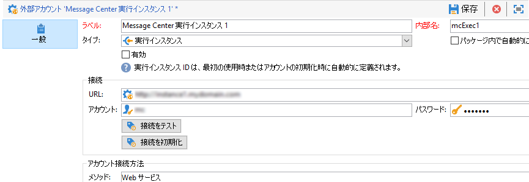

* **[!UICONTROL URL]**

   実行インスタンスがインストールされているサーバーの URL。

* **[!UICONTROL Account]**

   アカウント名、オペレーターフォルダーで定義されている Message Center エージェントと同じである必要があります。

* **[!UICONTROL Password]**

   「オペレーター」フォルダーで定義されたアカウントのパスワード。

この設定について詳しくは、この[ページ](../../message-center/using/creating-a-shared-connection.md#control-instance)を参照してください。

## Adobe Experience Cloud 外部アカウント {#adobe-experience-cloud-external-account}

To connect to the Adobe Campaign console using an Adobe ID, you must configure the **[!UICONTROL Adobe Experience Cloud (MAC)]** external account.

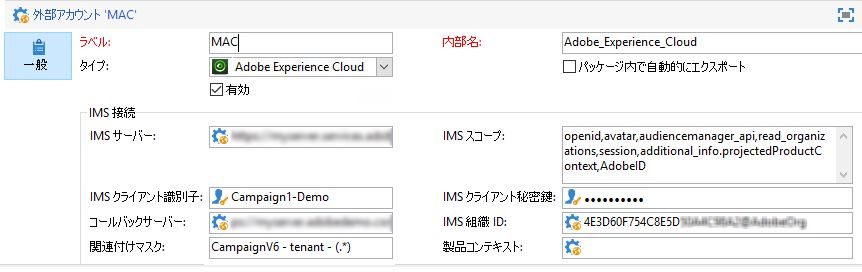

* **[!UICONTROL IMS server]**

   IMS サーバーの URL。また、ステージングと本番用のインスタンスがいずれも、同じ IMS 本番エンドポイントを指していることを確認します。

* **[!UICONTROL IMS scope]**

   スコープは、IMS によりプロビジョニングされているスコープのサブセットでなければなりません。

* **[!UICONTROL IMS client identifier]**

   IMS クライアントの ID。

* **[!UICONTROL IMS client secret]**

   IMS クライアント秘密鍵の資格情報

* **[!UICONTROL Callback server]**

   Adobe Campaign インスタンスのアクセス URL

* **[!UICONTROL IMS organization ID]**

   IMS 組織の ID。組織 ID を見つけるには、この[ページ](https://marketing.adobe.com/resources/help/en_US/mcloud/faq.html)（**IMS 組織 ID はどこにありますか？**）を参照してください。

* **[!UICONTROL Association mask]**

   このフィールドでは、Enterprise Dashboard の設定名を Adobe Campaign のグループと同期させる構文を定義することができます。

* **[!UICONTROL Server]**

   Adobe Experience Cloud インスタンスの URL。

* **[!UICONTROL Tenant]**

   Adobe Experience Cloud テナントの名前。

この設定について詳しくは、この[ページ](../../integrations/using/configuring-ims.md)を参照してください。

## SFTP 外部アカウント {#sftp-external-account}

SFTP 外部アカウントを使用すれば、Adobe Campaign 外でサーバーへのアクセスを設定およびテストできます。外部システム（ファイル転送に使用される SFTP など）との接続をセットアップするために、独自の外部アカウントを作成できます。詳しくは、この[ページ](../../workflow/using/file-transfer.md)を参照してください。

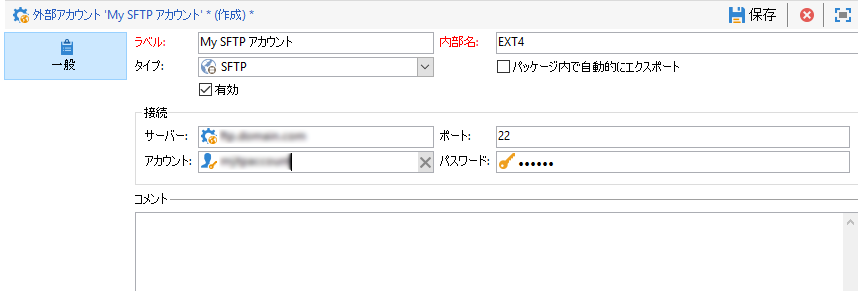

* **[!UICONTROL Server]**

   SFTP サーバーの URL。

* **[!UICONTROL Port]**

   FTP 接続のポート番号。デフォルトのポート番号は 22 です。

* **[!UICONTROL Account]**

   SFTP サーバーへの接続に使用するアカウント名。

* **[!UICONTROL Password]**

   SFTP サーバーへの接続に使用するパスワード。

## Adobe Experience Manager の外部アカウント {#adobe-experience-manager-external-account}

The **[!UICONTROL AEM (AEM instance)]** external account allows you to manage the content of your email deliveries as well as your forms directly in Adobe Experience Manager.

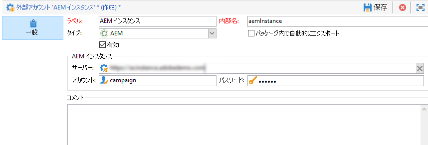

* **[!UICONTROL Server]**

   Adobe Experience Manager サーバーの URL。

* **[!UICONTROL Port]**

   Adobe Experience Manager オーサリングインスタンスへの接続に使用するアカウント名。

* **[!UICONTROL Password]**

   Adobe Experience Manager オーサリングインスタンスへの接続に使用するパスワード。

詳しくは、[この節](../../integrations/using/about-adobe-experience-manager.md)を参照してください。

## Amazon Simple Storage Service（S3）外部アカウント {#amazon-simple-storage-service--s3--external-account}

Amazon Simple Storage Service（S3）コネクタを使用して Adobe Campaign との間でデータのインポートまたはエクスポートをおこなうことができます。コネクタのセットアップはワークフローアクティビティでおこなえます。詳しくは、この[ページ](../../workflow/using/file-transfer.md)を参照してください。

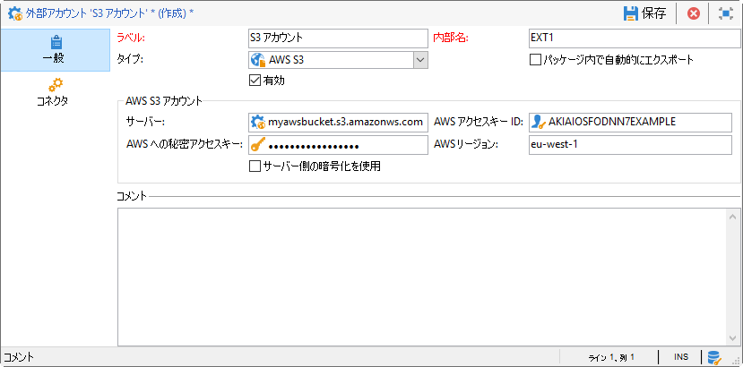

この新規外部アカウントを設定する際には、次の情報を提供する必要があります。

* **[!UICONTROL AWS S3 Account Server]**

   サーバーの URL。次のように入力する必要があります。

   ```
   <S3bucket name>.s3.amazonaws.com/<s3object path>
   ```

* **[!UICONTROL AWS access key ID]**

   AWS アクセスキー ID の見つけ方については、この[ページ](https://docs.aws.amazon.com/general/latest/gr/aws-sec-cred-types.html#access-keys-and-secret-access-keys)を参照してください。

* **[!UICONTROL Secret access key to AWS]**

   AWS への秘密アクセスキーの見つけ方については、この[ページ](https://aws.amazon.com/fr/blogs/security/wheres-my-secret-access-key/)を参照してください。

* **[!UICONTROL AWS Region]**

   AWSリージョンの詳細については、このページを参照してく [ださい](https://aws.amazon.com/about-aws/global-infrastructure/regions_az/)。

* The **[!UICONTROL Use server side encryption]** checkbox allows you to store your file in S3 encrypted mode.

アクセスキー ID および秘密アクセスキーの見つけ方については、Amazon Web サービス[ドキュメント](https://docs.aws.amazon.com/general/latest/gr/aws-sec-cred-types.html#access-keys-and-secret-access-keys)を参照してください。

## Azure 外部アカウント {#azure-external-account}

**[!UICONTROL Azure]** 外部データベースへの接続を有効にすると、この接続がアクティブである限り、データベースは Adobe Campaign 経由でアクセスできます。

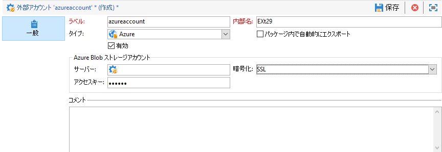

* **[!UICONTROL Server]**

   Azure サーバーの URL。

* **[!UICONTROL Encryption]**

   Type of chosen encryption between **[!UICONTROL None]** or **[!UICONTROL SSL]**.

* **[!UICONTROL Access key]**

   アクセスキーの見つけ方については、この[ページ](https://docs.microsoft.com/en-us/azure/storage/common/storage-account-manage)（**アクセスキーの表示とコピー**&#x200B;のセクション）を参照してください。

## Hadoop 外部アカウント {#hadoop-external-account}

**[!UICONTROL Hadoop]** 外部データベースへの接続を有効にすると、この接続がアクティブである限り、データベースは Adobe Campaign 経由でアクセスできます。Hadoopへのアクセスを設定する方法について詳しくは、この節を参照してく [ださい](../../platform/using/accessing-an-external-database.md#configure-access-to-hadoop)。


* **[!UICONTROL Server]**

   Hadoop サーバーの URL。

* **[!UICONTROL User account name]**

   Hadoop へのアクセスに使用するアカウントの名前。

## Microsoft Dynamics CRM 外部アカウント {#microsoft-dynamics-crm-external-account}

**[!UICONTROL Microsoft Dynamics CRM]** 外部アカウントがあれば、Microsoft Dynamics データを Adobe Campaign にインポートおよびエクスポートできます。

Adobe CampaignでMicrosoft Dynamics Connectorが動作するように設定するかどうかは、展開の種類によって異なります。
およびデ **[!UICONTROL On-premise]** プロイメ **[!UICONTROL Office 365]** ントタイプを使用する場合は、次の詳細を指定する必要があります。

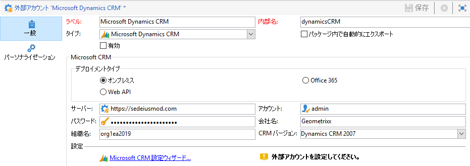

* **[!UICONTROL Account]**

   Microsoft CRM へのログインに使用するアカウント。

* **[!UICONTROL Server]**

   Microsoft CRM サーバーの URL。

* **[!UICONTROL Password]**

   Microsoft CRM へのログインに使用するパスワード。

* **[!UICONTROL Company name]** オンプレミスおよびOffice 365の展開

   会社の名前。

* **[!UICONTROL Organization name]** （オンプレミスデプロイメント用）

   組織の名前。Microsoft Dynamicsの開発者リソースダッシュボードのフィールドにある組織名 **[!UICONTROL Unique Name]** です。

* **[!UICONTROL CRM version]** オンプレミスの場合

   または間のCRMのバー **[!UICONTROL Dynamics CRM 2007]**&#x200B;ジョン **[!UICONTROL Dynamics CRM 2015]** です **[!UICONTROL Dynamics CRM 2016]**。

デプロ **[!UICONTROL Web API]** イメントの種類 **[!UICONTROL Password credentials]** と認証を使用する場合は、次の詳細を指定する必要があります。

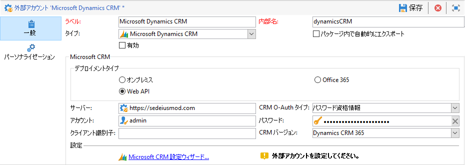

* **[!UICONTROL Account]**

   Microsoft CRM へのログインに使用するアカウント。

* **[!UICONTROL Server]**

   Microsoft CRM サーバーの URL。

* **[!UICONTROL Client identifier]**

   Microsoft azure管理ポータルの[カテゴリ]フィールドにある[クライアントID] **[!UICONTROL Update your code]** が表示さ **[!UICONTROL Client ID]** れます。

* **[!UICONTROL CRM version]**

   または間のCRMのバー **[!UICONTROL Dynamics CRM 2007]**&#x200B;ジョン **[!UICONTROL Dynamics CRM 2015]** です **[!UICONTROL Dynamics CRM 2016]**。

デプロ **[!UICONTROL Web API]** イメントの種類 **[!UICONTROL Certificate]** と認証を使用する場合は、次の詳細を指定する必要があります。

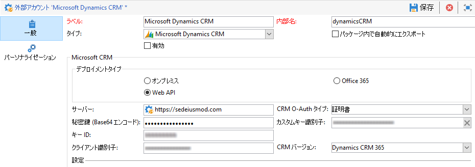

* **[!UICONTROL Server]**

   Microsoft CRM サーバーの URL。

* **[!UICONTROL Private Key (Base64 encoded)]**

   Base64にエンコードされた秘密鍵

* **[!UICONTROL Custom Key identifier]**


* **[!UICONTROL Key ID]**

* **[!UICONTROL Client identifier]**

   Microsoft azure管理ポータルの[カテゴリ]フィールドにある[クライアントID] **[!UICONTROL Update your code]** が表示さ **[!UICONTROL Client ID]** れます。

* **[!UICONTROL CRM version]**

   または間のCRMのバー **[!UICONTROL Dynamics CRM 2007]**&#x200B;ジョン **[!UICONTROL Dynamics CRM 2015]** です **[!UICONTROL Dynamics CRM 2016]**。

この設定について詳しくは、この[ページ](../../platform/using/crm-connectors.md#example-for-microsoft-dynamics)を参照してください。

## Oracle Oracle On Demand 外部アカウント {#oracle-on-demand-external-account}

**[!UICONTROL Oracle on demand]** 外部アカウントを使用すれば、Oracle データを Adobe Campaign にインポートおよびエクスポートできます。

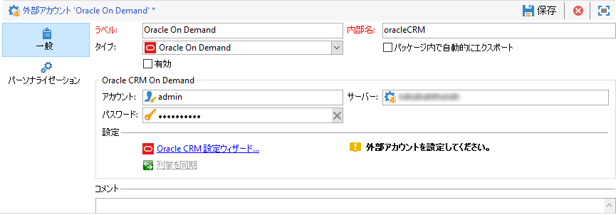

Oracle On Demand 外部アカウントを Adobe Campaign で使用できるように設定するには、次の情報を提供する必要があります。

* **[!UICONTROL Account]**

   Oracle CRM On Demand へのログインに使用するアカウント。

* **[!UICONTROL Server]**

   Oracle CRM On Demand サーバーの URL。

* **[!UICONTROL Password]**

   Oracle CRM On Demand へのログインに使用するパスワード。

この設定について詳しくは、この[ページ](../../platform/using/crm-connectors.md#example-for-oracle-on-demand)を参照してください。

## Salesforce CRM 外部アカウント {#salesforce-crm-external-account}

**[!UICONTROL Salesforce CRM]** 外部アカウントを使用すれば、Adobe Campaign から Salesforce データをインポートおよびエクスポートできます。

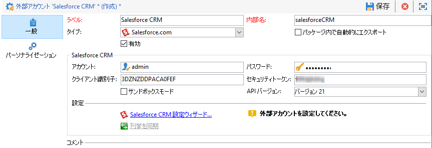

Salesforce CRM 外部アカウントを Adobe Campaign で使用できるように設定するには、次の情報を提供する必要があります。

* **[!UICONTROL Account]**

   Salesforce CRM へのログインに使用するアカウント。

* **[!UICONTROL Password]**

   Salesforce CRM へのログインに使用するパスワード。

* **[!UICONTROL Client identifier]**

   クライアント識別子の見つけ方については、この[ページ](https://help.salesforce.com/articleView?id=000205876&type=1)を参照してください。

* **[!UICONTROL Security token]**

   セキュリティトークンの見つけ方については、[ページ](https://help.salesforce.com/articleView?id=000205876&type=1)を参照してください。

* **[!UICONTROL API version]**

   または間のAPIのバー **[!UICONTROL Version 37]**&#x200B;ジョン **[!UICONTROL Version 21]** です **[!UICONTROL Version 15]**。

この外部アカウントの場合、設定ウィザードで Salesforce CRM を設定する必要があります。

この設定について詳しくは、この[ページ](../../platform/using/crm-connectors.md#example-for-salesforce-com)を参照してください。
