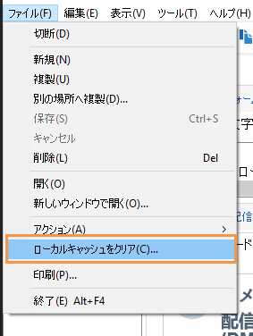

# Campaign 設定に関する FAQ {#settings-faq}

ニーズに合わせて Campaign インスタンスを設定するための主な設定内容について学習します。

## Campaign インターフェイスの言語を変更できますか？ {#can-i-change-the-language-of-campaign-interface-}

Campaign の言語はインスタンスを作成するときに選択します。後から変更することはできません。詳しくは、[この節](../../installation/using/creating-an-instance-and-logging-on.md)を参照してください。

Adobe Campaign のユーザーインターフェイスは、英語、フランス語、ドイツ語、日本語の 4 つの言語で利用できます。クライアントコンソールとサーバーは同一言語で設定する必要があるのでご注意ください。Campaign インスタンスはそれぞれ、1 つの言語でしか実行できません。

英語であれば、Campaign をインストールする際に米国英語か英国英語を選べます（それぞれ日時のフォーマットが異なります）。これらの差異について詳しくは、[この節](../../platform/using/adobe-campaign-workspace.md#date-and-time)を参照してください。

## 他のアドビソリューションで Campaign Classic を使用できますか？ {#can-i-use-campaign-classic-with-other-adobe-solutions-}

Adobe Campaign の配信機能と高度なキャンペーン管理機能を、一連のソリューションと組み合わせることで、顧客エクスペリエンスをパーソナライズできます。

[他のアドビソリューションとの連携方法](../../integrations/using/about-campaign-integrations.md)と、[Campaign での IMS の設定方法](../../integrations/using/about-adobe-id.md)を参照してください。

## トラッキング機能を Campaign インスタンスで設定するにはどうすればよいですか？ {#how-can-i-set-up-tracking-capabilities-on-my-campaign-instance-}

エキスパートユーザーは、Campaign インスタンス上でトラッキング機能を設定できます。

[詳しくはここをクリック](../../installation/using/deploying-an-instance.md#tracking-configuration)してください。

## E メール配信品質の設定方法は？ {#how-to-configure-email-deliverability-}

「 [配信品質の設定](../../delivery/using/about-deliverability.md#configuration) 」セクションに加えて、技術的な推奨事項の「配信品質」を読み、キャンペーン配信機能を最大限に活かすためにインスタンスの設定方法を理解してください。

[詳しくはここをクリック](../../delivery/using/technical-recommendations.md)してください。

## コンテンツの承認はどのように実行できますか？ {#how-can-i-implement-content-approval-}

Campaign では、マーケティングキャンペーンのメインステップの承認プロセスを協調モードで設定できます。キャンペーンごとに、配信ターゲット、コンテンツ、およびコストを承認できます。承認を担当する Adobe Campaign オペレーターは、E メールで通知を受け、コンソールから、または Web 接続を介して、承認を許可または却下できます。

Campaign で配信コンテンツの承認を実装する手順について[詳しくはここをクリック](../../campaign/using/marketing-campaign-approval.md#checking-and-approving-deliveries)してください。

## 外部データベースに保存されているデータにどうすればアクセスできますか？ {#how-can-i-access-data-stored-in-an-external-database-}

Adobe Campaign では、Federated Data Access（FDA）オプションを利用することができます。このオプションを使用すると、1 つ以上の外部データベースに格納されている情報を処理することが可能です。Adobe Campaign データの構造を変更しなくても、外部データにアクセスできます。

[詳しくはここをクリック](../../platform/using/connecting-to-database.md)してください。

## Campaign を接続できる外部データベースはどれですか？ {#which-external-databases-can-i-connect-campaign-to-}

Federated Data Access（FDA）を使用した Campaign と外部データベースとの互換性のリストについては、[互換性マトリックス](https://helpx.adobe.com/jp/campaign/kb/compatibility-matrix.html)を参照してください。

## Adobe Campaign を LDAP と統合できますか？ {#can-adobe-campaign-integrate-with-ldap-}

オンプレミス／ハイブリッドの顧客は、Campaign Classic と LDAP ディレクトリを統合できます。

[方法についてはここをクリック](../../installation/using/connecting-through-ldap.md)してください。

## どうすれば Campaign で CRM コネクタを設定できますか？ {#how-can-i-set-up-crm-connectors-in-campaign-}

Adobe Campaign では、Adobe Campaign プラットフォームをサードパーティのシステムにリンクするための様々な CRM コネクタが提供されています。これらの CRM コネクタにより、連絡先、アカウント、購入などを同期したり、アプリケーションを様々なサードパーティおよびビジネスアプリケーションと簡単に統合したりすることができます。

これらのコネクタを使用すると、データを迅速かつ容易に統合できます。Adobe Campaign には、CRM のテーブルを収集して選択するための専用のウィザードが用意されています。これにより、システム全体でデータを常に最新にするための双方向の同期が保証されます。

CRM ツールを Adobe Campaign と同期させる方法については、[CRM コネクタの設定](../../platform/using/crm-connectors.md)を参照してください。こちらの [Adobe Campaign と Microsoft Dynamics 365 の統合](https://helpx.adobe.com/campaign/kt/acc/using/acc-integrate-dynamics365-with-acc-feature-video-set-up.html)に関する使用例のビデオをご覧ください。

## 問題がマシン固有またはユーザー固有の場合にソフトキャッシュの消去を実行する方法を教えてください。{#perform-soft-cache-clear}

新しいロゴを正しく反映させる、マシン固有／ユーザ固有のデータを正しく書き出すなどの問題が発生した場合は、Windows（Windows 7、Windows XP、Windows 10）でソフトキャッシュの消去を実行する必要があります。

ログインしたら、**[!UICONTROL ファイル]**／**[!UICONTROL ローカルキャッシュを消去]**&#x200B;に移動します。その後、ログアウトしてから再度ログインします。

それでも問題が解決しない場合は、次の手順を実行して、ハードキャッシュを消去してみてください。

## 問題がマシン固有またはユーザー固有の場合にハードキャッシュの消去を実行する方法を教えてください。{#perform-hard-cache-clear}

新しいロゴを正しく反映させる、マシン固有／ユーザ固有のデータを正しく書き出すなどの問題が発生した場合は、Windows（Windows 7、Windows XP、Windows 10）でハードキャッシュの消去を実行する必要があります。

1. クライアントコンソールで、**[!UICONTROL ファイル]**／**[!UICONTROL ローカルキャッシュを消去]**&#x200B;を選択します。

1. ログアウトし、クライアントコンソール（リッチクライアント）を閉じます。

1. ご使用のオペレーティングシステムのバージョンに応じて、次の場所に移動します。

   * Windows 7：C:\Users\&lt;ユーザー名>\AppData\Roaming\Neolane\NL_5\
   * Windows XP：C:\Documents and Settings\&lt;ユーザー名>\Application Data\Neolane\NL_5
   「nlclient-config-&lt;英数字の値>.xml」という名前の xml ファイルが多数表示されます。

1. これらの xml ファイルと関連フォルダーを削除します。

   >[!IMPORTANT]
   >
   >nlclient_cnx.xml ファイルは削除しないでください。

1. クライアントコンソールにログインします。