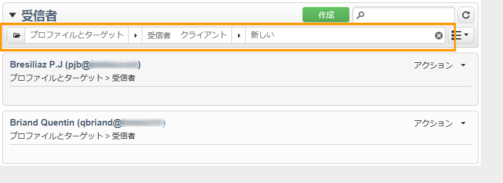

# フィルターオプション{#filtering-options}

## フィルタリングについて {#about-filtering}

デフォルトでは、Adobe Campaign には対象のオペレーターが読み取り権限を持っているデータベース内のすべてのデータが表示されます。

ブラウザーウィンドウの上部セクションにあるオプションを使用して、このデータをフィルターできます。

表示されるデータをフィルターする方法は複数あります。必要に応じて、これらを組み合わせて使用できます。

* フォルダーのフィルターについては、[フォルダーでフィルター](#filter-by-folder)を参照してください。
* ステータスのフィルターについては、[ステータスでフィルター](#filter-by-status)を参照してください。
* データの並べ替えについては、[並び替え順](#order-by)を参照してください。
* 検索については、[クイック検索](#quick-search)を参照してください。

## フォルダーでフィルター {#filter-by-folder}

**[!UICONTROL フォルダー]**&#x200B;アイコンをクリックして、表示するデータが含まれているフォルダーを選択します。

そのフォルダー内のプロファイルのみが表示されます。

デフォルトの表示モードに戻るには、フォルダー選択フィールドの右側にあるバツ印を使用します。

## ステータスでフィルタリング {#filter-by-status}

表示される情報のタイプに応じて、ステータスのフィルターを適用できます。例えば、配信の場合、次に示すように完了した配信のみが表示されるように選択できます。

## 並べ替え順 {#order-by}

「フォルダーごと」のフィルターフィールドの右側にあるドロップダウンリストで、ページに表示されるデータの並べ替え順を選択できます。このフィールドのコンテンツは、ページ上のデータのタイプによって異なります。

例えば、優先順位別、作成日別またはアルファベット順でタスクを並べ替えることができます。

## クイック検索 {#quick-search}

検索フィールドを使用して、探している項目にすばやくアクセスできます。表示する項目のラベルまたは内部名に含まれている文字を入力し、確定してページ上のデータに自動フィルターを適用します。

再度すべての項目を表示するには、バツ印をクリックして検索フィールドのコンテンツを削除します。
