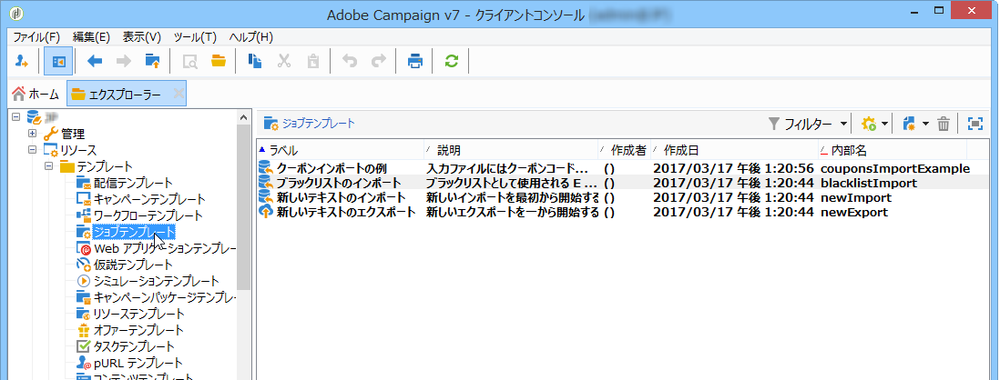
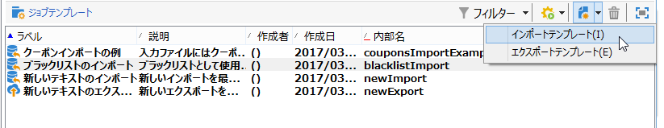
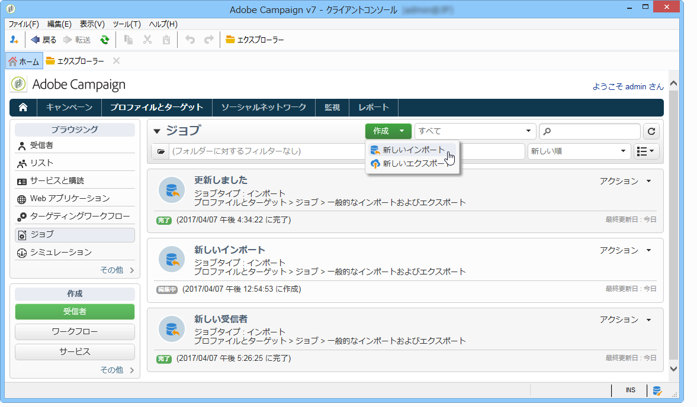
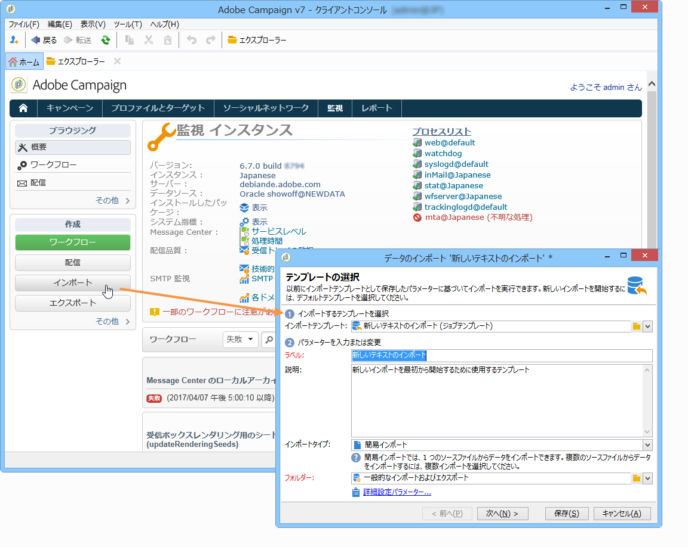
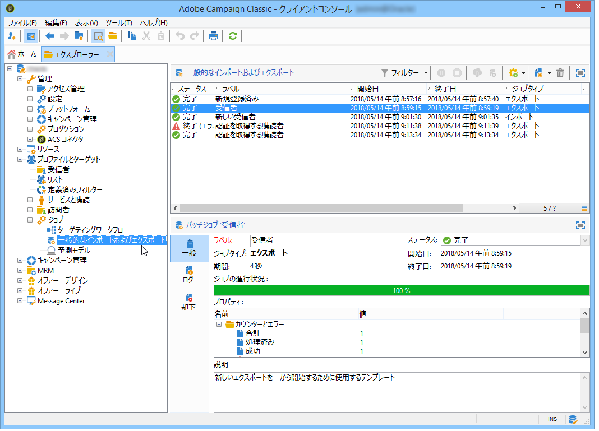
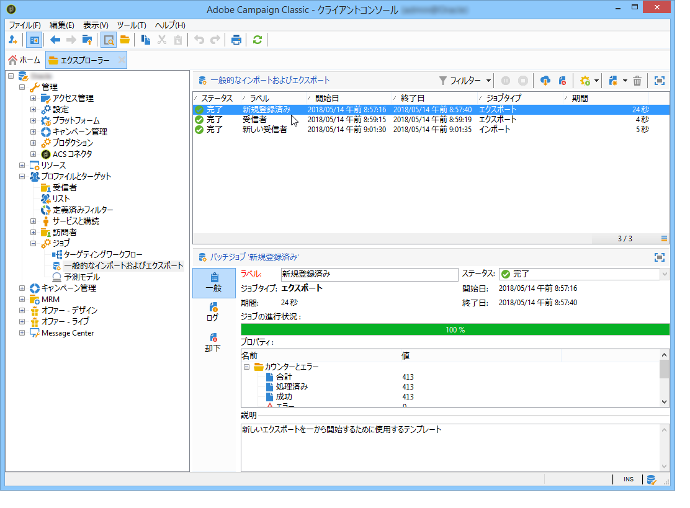

# 一般的なインポートおよびエクスポート{#generic-imports-and-exports}

Adobe Campaign には、顧客または（例えば、ターゲティング操作の後に）ターゲット母集団に含まれる予定の見込み客のリストを簡単に抽出するためのデータエクスポートモジュールが用意されています。

また、外部ファイルのデータをデータベースに取り込むことができるインポートモジュールもあります。

>[!NOTE]
>
>Exports and imports are configured in dedicated templates executed through workflows via the **[!UICONTROL Import]** and **[!UICONTROL Export]** activities. これらのキャンペーンは、例えば複数の情報システム間でデータ交換を自動化するために、スケジュールに従って自動的に繰り返すことができます。必要に応じて、Adobe Campaignツリーのノードを介して、インポートやエクスポ **[!UICONTROL Profiles and Targets > Jobs > Generic imports and exports]** ートをときどき作成できます。

次の操作をおこなうことができます。

* インポートまたはエクスポートテンプレートを作成して設定します（以下を参照）。
* インポートまたはエクスポートの作成：詳しくは、データのエク [スポートまたはデータのインポ](../../platform/using/exporting-data.md) ートを参照してくださ い。
* インポートまたはエクスポートを起動し、実行を監視します。 詳しくは、実行トラッ [キングを参照してください](#execution-tracking)。

>[!CAUTION]
>
>Campaign でのデータのインポートはデータの一貫性を確保し、効率性を向上させるために、ワークフロー経由で実行するようにしてください。詳しくは、[データのインポート](../../workflow/using/importing-data.md)、[インポートのベストプラクティス](../../workflow/using/importing-data.md#best-practices-when-importing-data)、[インポートテンプレートの例](../../workflow/using/importing-data.md#setting-up-a-recurring-import)の各節を参照してください。

## ジョブテンプレートの作成 {#creating-a-job-template}

Import and export templates are stored in the **[!UICONTROL Resources > Templates > Job templates]** directory of the Adobe Campaign tree.

このディレクトリには、デフォルトで 3 つのインポートテンプレートと 1 つのエクスポートテンプレートがあります。これらを変更することはできません。You can duplicate them to create your own templates or create a new template via the **[!UICONTROL New > Import template]** / **[!UICONTROL Export template]** menu.

プロセステンプレートの作成手順は、エクスポートウィザードとインポ [ートウィザ](../../platform/using/exporting-data.md#export-wizard) ードで [表示されます](../../platform/using/importing-data.md#import-wizard)。

>[!NOTE]
>
>The native template **[!UICONTROL Import blacklist]** is already configured to import a list of blacklisted e-mail addresses.
> 
>テンプレ **[!UICONTROL New text import]** ートとテ **[!UICONTROL New text export]** ンプレートを使用して、新規に読み込みまたは書き出しを設定できます。

## 新しいインポート／エクスポートの作成 {#creating-a-new-import-export}

テンプレートの設定後、Adobe Campaign の複数のコンテキストでインポートおよびエクスポート操作を開始することができます。

いずれの操作でも、[インポート](../../platform/using/importing-data.md)または[エクスポート](../../platform/using/exporting-data.md#export-wizard)ウィザードが開きます。

* In the **[!UICONTROL Profiles and targets]** section of Adobe Campaign workspace, click the **[!UICONTROL Jobs]** link: this takes you to the list of existing imports and exports.

   Click the **[!UICONTROL Create]** button and select the type of job you want to perform.

   

* ワークスペースの「監視」セクションからインポートおよびエクスポートを開始することもできます。2 つの専用リンクを使用して、インポートまたはエクスポートを直接開始できます。

   

* インポートおよびエクスポートは、Adobe Campaign エクスプローラーから開始することもできます。

   データを書き出し/読み込むには、ノードをク **[!UICONTROL Profiles and Targets > Jobs > Generic imports and exports]** リックし、アイコンをク **[!UICONTROL New]** リックして、またはを選 **[!UICONTROL Export]** 択しま **[!UICONTROL Import]**&#x200B;す。 これにより、適切なウィザードが開きます。

   

## 実行のトラッキング {#execution-tracking}

このエディターの上部セクションで、実行のトラッキングを表示できます。エクスポートウィザードを閉じ、インポートまたはエクスポートジョブのリストを使用してジョブの実行を表示できます。

* The **[!UICONTROL Log]** tab lets you look at log messages concerning execution.
* The **[!UICONTROL Rejects]** tab contains the rejected records. See [Behavior in the event of an error](../../platform/using/importing-data.md#behavior-in-the-event-of-an-error).

>[!NOTE]
>
>Import/export job statuses are presented in [Job statuses](../../platform/using/importing-data.md#job-statuses).

