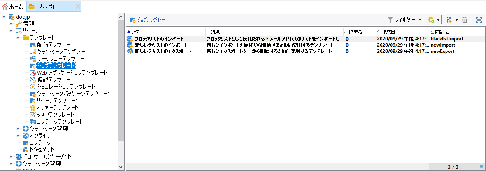

# 一般的なインポートおよびエクスポート{#generic-imports-and-exports}

Adobe Campaign には、顧客または（例えば、ターゲティング操作の後に）ターゲット母集団に含まれる予定の見込み客のリストを簡単に抽出するためのデータエクスポートモジュールが用意されています。

また、外部ファイルのデータをデータベースに取り込むことができるインポートモジュールもあります。

>[!NOTE]
>
>エクスポートとインポートは、ワークフローで「**[!UICONTROL インポート]**」アクティビティおよび「**[!UICONTROL エクスポート]**」アクティビティ経由で実行される専用のテンプレートで設定します。これらのキャンペーンは、例えば複数の情報システム間でデータ交換を自動化するために、スケジュールに従って自動的に繰り返すことができます。必要に応じて、Adobe Campaign ツリーの&#x200B;**[!UICONTROL プロファイルとターゲット／ジョブ／一般的なインポートおよびエクスポート]**&#x200B;ノードを使用して、不定期のインポートまたはエクスポートを作成できます。

次の操作をおこなうことができます。

* インポートまたはエクスポートテンプレートを作成して設定します（以下を参照）。
* インポートまたはエクスポートの作成については、[データのエクスポート](../../platform/using/exporting-data.md)または[データのインポート](../../platform/using/importing-data.md)を参照してください。
* インポートまたはエクスポートを開始して、その実行を監視します。[実行のトラッキング](#execution-tracking)を参照してください。

>[!CAUTION]
>
>Campaign でのデータのインポートはデータの一貫性を確保し、効率性を向上させるために、ワークフロー経由で実行するようにしてください。詳しくは、[データのインポート](../../workflow/using/importing-data.md)、[インポートのベストプラクティス](../../workflow/using/importing-data.md#best-practices-when-importing-data)、[インポートテンプレートの例](../../workflow/using/importing-data.md#setting-up-a-recurring-import)の各節を参照してください。

## ジョブテンプレートの作成 {#creating-a-job-template}

インポートおよびエクスポートテンプレートは、Adobe Campaign ツリーの&#x200B;**[!UICONTROL リソース／テンプレート／ジョブテンプレート]**&#x200B;ディレクトリに保存されています。

このディレクトリには、デフォルトで 3 つのインポートテンプレートと 1 つのエクスポートテンプレートがあります。これらを変更することはできません。これらを複製して独自のテンプレートを作成するか、**[!UICONTROL 新規／インポートテンプレート]**&#x200B;または&#x200B;**[!UICONTROL エクスポートテンプレート]**&#x200B;メニューを使用して新しいテンプレートを作成できます。

プロセステンプレートの作成手順は、[エクスポートウィザード](../../platform/using/exporting-data.md#export-wizard)および[インポートウィザード](../../platform/using/importing-data.md#import-wizard)で説明しています。

>[!NOTE]
>
>ネイティブテンプレートの「**[!UICONTROL ブラックリストをインポート]**」は、ブラックリストに登録されている E メールアドレスのリストをインポートするように設定されています。
> 
>「**[!UICONTROL 新しいテキストのインポート]**」および「**[!UICONTROL 新しいテキストのエクスポート]**」テンプレートを使用して、インポートまたはエクスポートをゼロから設定することができます。

## 新しいインポート／エクスポートの作成 {#creating-a-new-import-export}

テンプレートの設定後、Adobe Campaign の複数のコンテキストでインポートおよびエクスポート操作を開始することができます。

いずれの操作でも、[インポート](../../platform/using/importing-data.md)または[エクスポート](../../platform/using/exporting-data.md#export-wizard)ウィザードが開きます。

* Adobe Campaign ワークスペースの「**[!UICONTROL プロファイルとターゲット]**」セクションで、「**[!UICONTROL ジョブ]**」リンクをクリックします。これにより、既存のインポートおよびエクスポートのリストが表示されます。

   「**[!UICONTROL 作成]**」ボタンをクリックして、実行するジョブのタイプを選択します。

   

* ワークスペースの「監視」セクションからインポートおよびエクスポートを開始することもできます。2 つの専用リンクを使用して、インポートまたはエクスポートを直接開始できます。

   

* インポートおよびエクスポートは、Adobe Campaign エクスプローラーから開始することもできます。

   データをエクスポートまたはインポートするには、**[!UICONTROL プロファイルとターゲット／ジョブ／一般的なインポートおよびエクスポート]**&#x200B;ノードをクリックしてから&#x200B;**[!UICONTROL 新規]**&#x200B;アイコンをクリックし、「**[!UICONTROL エクスポート]**」または「**[!UICONTROL インポート]**」を選択します。これにより、適切なウィザードが開きます。

   

## 実行のトラッキング {#execution-tracking}

このエディターの上部セクションで、実行のトラッキングを表示できます。エクスポートウィザードを閉じ、インポートまたはエクスポートジョブのリストを使用してジョブの実行を表示できます。

* 「**[!UICONTROL ジャーナル]**」タブでは、実行に関するログメッセージを確認できます。
* 「**[!UICONTROL 却下]**」タブには、却下されたレコードが表示されます。[エラーの場合の動作](../../platform/using/importing-data.md#behavior-in-the-event-of-an-error)を参照してください。

>[!NOTE]
>
>インポートまたはエクスポートジョブのステータスについて詳しくは、](../../platform/using/importing-data.md#job-statuses)ジョブステータス[で説明しています。

