# 一般的なインポートのサンプル {#import-operations-samples}

## 受信者のリストからのインポート {#example--import-from-a-list-of-recipients}

リストの概要から受信者のリストを作成して提供するには、次の手順に従います。

1. リストの作成

   * Adobe Campaign ホームページの&#x200B;**[!UICONTROL プロファイルとターゲット]**&#x200B;メニューで「**[!UICONTROL リスト]**」リンクをクリックします。
   * 「**[!UICONTROL 作成]**」をクリックし、次に「**[!UICONTROL リストをインポート]**」ボタンをクリックします。

1. インポートするファイルの選択

   「**[!UICONTROL ローカルファイル]**」フィールドの右側にあるフォルダーをクリックし、インポートするリストを含むファイルを選択します。

   

1. リスト名および保存

   リストの名前を入力し、リストを保存するディレクトリを選択します。

   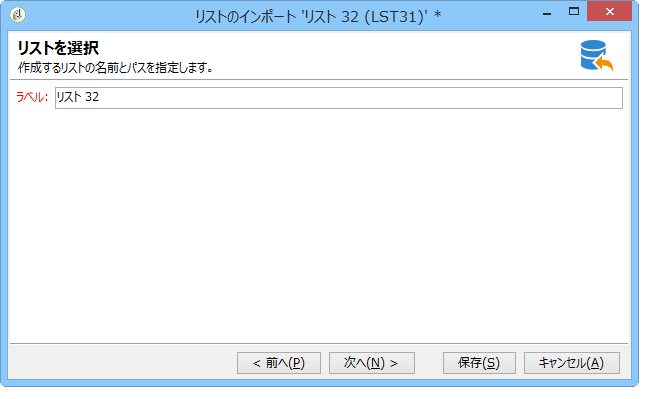

1. インポートの開始

   「**[!UICONTROL 次へ]**」をクリックしてから「**[!UICONTROL 開始]**」をクリックし、リストのインポートを開始します。

   

## テキストファイルからの新しいレコードのインポート {#example--import-new-records-from-a-text-file-}

テキストファイルに保存されている新しい受信者プロファイルを Adobe Campaign データベースにインポートするには、次の手順に従います。

1. テンプレートの選択

   * Adobe Campaign ホームページから、**[!UICONTROL プロファイルとターゲット]**&#x200B;リンクをクリックし、**[!UICONTROL ジョブ]**&#x200B;をクリックします。ジョブのリストの上にある「**[!UICONTROL 新しいインポート]**」をクリックします。
   * デフォルトで選択されている「**[!UICONTROL 新しいテキストのインポート]**」テンプレートのままにします。
   * ラベルおよび説明を変更します。
   * 「**[!UICONTROL 簡易インポート]**」を選択します。
   * デフォルトのジョブフォルダーのままにします。
   * 「**[!UICONTROL 詳細設定パラメーター]**」をクリックし、「**[!UICONTROL トレースモード]**」オプションを選択して、実行中にインポートの詳細を表示します。

1. インポートするファイルの選択

   「**[!UICONTROL ローカルファイル]**」フィールドの右側にあるフォルダーをクリックし、インポートするファイルを選択します。

   

1. フィールドの関連付け

   **[!UICONTROL 宛先フィールドを推測]**&#x200B;アイコンをクリックして、ソースと宛先スキーマを自動的にマッピングします。このウィンドウの情報を確認してから、「**[!UICONTROL 次へ]**」をクリックします。

   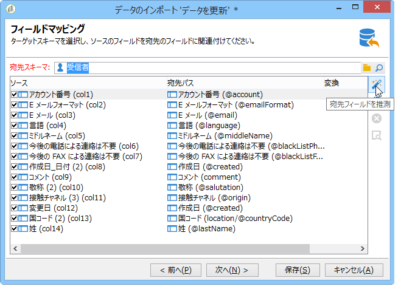

1. 紐付け

   * **受信者（nms:recipient）**&#x200B;テーブルに移動します。
   * 「**[!UICONTROL 挿入]**」操作を選択し、その他のフィールドはデフォルト値のままにします。

      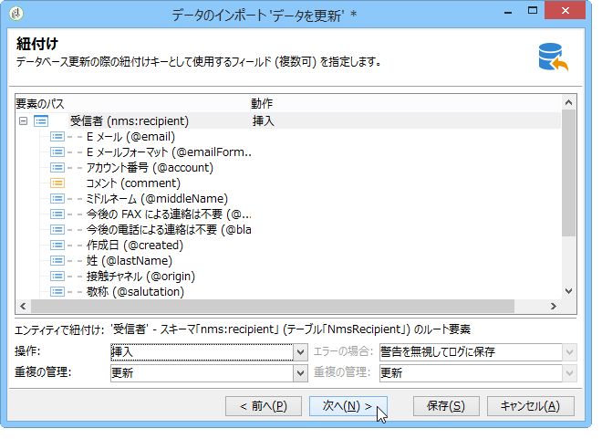

1. 受信者のインポート

   * 必要に応じて、レコードのインポート先フォルダーを指定します。

      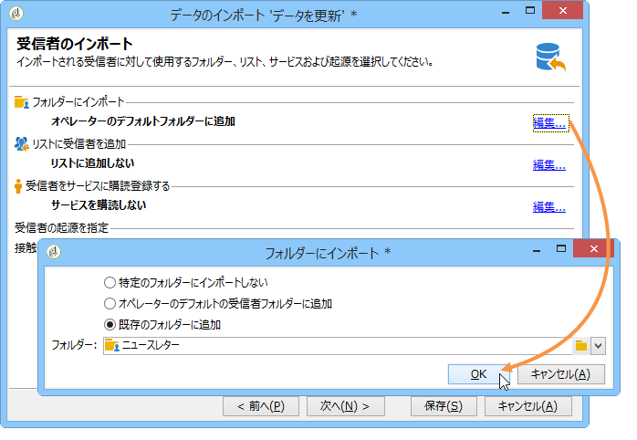

1. インポートの開始

   * 「**[!UICONTROL 開始]**」をクリックします。

      エディターの中央の領域で、インポート操作が成功したこと、および処理されたレコード数を確認することができます。

      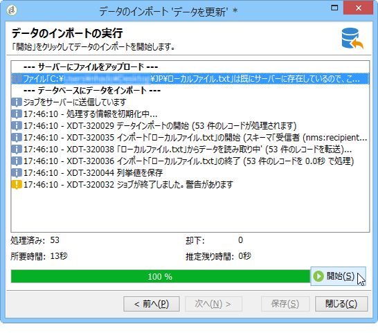

      「**[!UICONTROL トレース]**」モードでは、ソースファイル内の各レコードのインポートの詳細をトラッキングできます。そのためには、ホームページから「**[!UICONTROL プロファイルとターゲット]**」、「**[!UICONTROL プロセス]**」の順にクリックし、該当するインポートを選択して、「**[!UICONTROL 一般]**」、「**[!UICONTROL ジャーナル]**」および「**[!UICONTROL 却下]**」の各タブを調べます。

      * インポートの進捗状況の確認

         

      * 各レコードのプロセス表示

         

## 受信者の更新と挿入 {#example--update-and-insert-recipients}

データベース内の既存のレコードを更新し、テキストファイルから新しいレコードを作成します。この手順の例を示します。

1. テンプレートの選択

   前述の例 2 で説明した手順を繰り返します。

1. インポートするファイル

   インポートするファイルを選択します。

   この例では、ファイルの最初のラインの概要から、ファイルには 3 レコードの更新と 1 レコードの作成が含まれていることがわかります。

   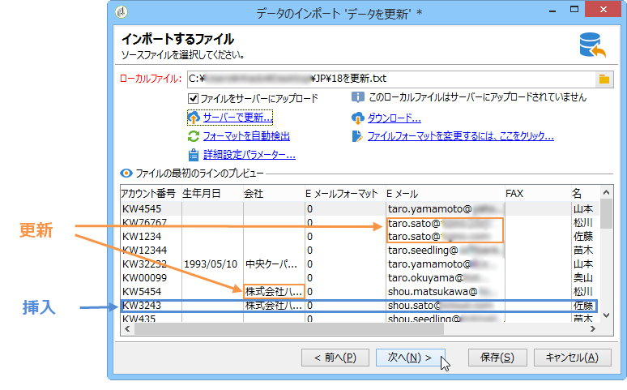

1. フィールドの関連付け

   前述の例 2 の手順を適用します。

1. 紐付け

   * デフォルトで選択されている「**[!UICONTROL 更新または挿入]**」のままにします。
   * データベース内の既存のデータがテキストファイルのデータで変更されるように、「**[!UICONTROL 重複の管理]**」フィールドは「**[!UICONTROL 更新]**」オプションのままにします。
   * 「**[!UICONTROL 生年月日]**」、「**[!UICONTROL 名]**」および「**[!UICONTROL 会社]**」の各フィールドを選択し、それらに紐付けキーを割り当てます。

      

1. インポートの開始

   * 「**[!UICONTROL 開始]**」をクリックします。

      トラッキングウィンドウで、インポートが成功したこと、および処理されたレコード数を確認することができます。

      

   * 受信者テーブルを調べ、この操作によってレコードが変更されたことを確認します。

      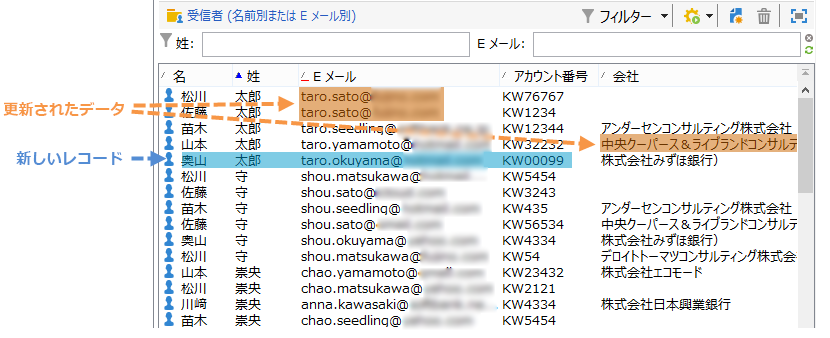

## 外部ファイルの値による値のエンリッチメント {#example--enrich-the-values-with-those-of-an-external-file}

データベーステーブル内のフィールドをテキストファイル内の値で更新しますが、その際、データベースに含まれている値が優先されるようにします。

この例では、テキストファイル内の一部のフィールドは値を含んでいますが、データベース内の対応するフィールドは空です。その他のフィールドは、データベース内の値とは異なる値を含んでいます。

* インポートするテキストファイルのコンテンツ

   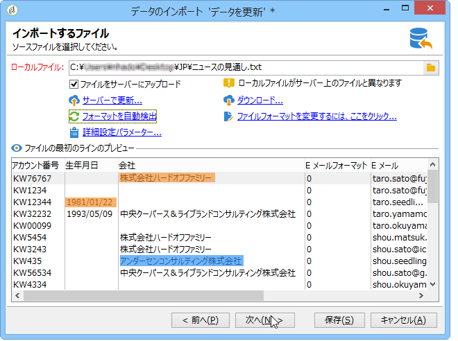

* インポート前のデータベースステータス

   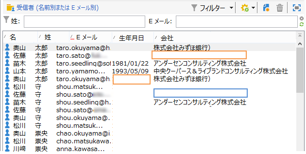

次の手順に従います。

1. テンプレートの選択

   前述の例 2 の手順を適用します。

1. インポートするファイル

   インポートするファイルを選択します。

1. フィールドの関連付け

   前述の例 2 の手順を適用します。

   ファイルの最初のラインのプレビューから、ファイルには特定のレコードの更新が含まれていることがわかります。

1. 紐付け

   * テーブルに移動し、「**[!UICONTROL 更新]**」操作を選択します。
   * 「**[!UICONTROL コピーの管理]**」フィールドのオプション「**[!UICONTROL エンティティを却下]**」を選択します。
   * データベース内の既存のデータがテキストファイルのデータで変更されるように、「**[!UICONTROL 重複の管理]**」フィールドは「**[!UICONTROL 更新]**」オプションのままにします。
   * 「**[!UICONTROL 姓（@lastName）]**」ノードにカーソルを置き、「**[!UICONTROL 宛先が空の場合にのみ更新]**」オプションを選択します。
   * 「**[!UICONTROL 会社（@company）]**」ノードに対して、この操作を繰り返します。
   * フィールド「**[!UICONTROL 生年月日]**」、「**[!UICONTROL E メール]**」および「**[!UICONTROL 名]**」に紐付けキーを割り当てます。

      

1. インポートの開始

   「**[!UICONTROL 開始]**」をクリックします。

   受信者テーブルを調べ、インポートによってレコードが変更されたことを確認します。

   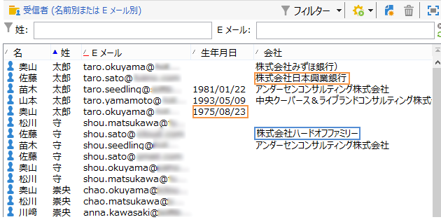

   空であった値のみがテキストファイルの値に置き換えられていますが、データベース内の既存の値はインポートファイルの値で上書きされていません。

## 外部ファイルの値による値の更新とエンリッチメント {#example--update-and-enrich-the-values-from-those-in-an-external-file}

データベーステーブル内のフィールドをテキストファイル内の値で更新しますが、その際、テキストファイルに含まれている値が優先されるようにします。

この例では、テキストファイル内の一部のフィールドは値が空ですが、データベース内の対応するフィールドは値を含んでいます。その他のフィールドは、データベース内の値とは異なる値を含んでいます。

* インポートするテキストファイルのコンテンツ

   

* インポート前のデータベースステータス

   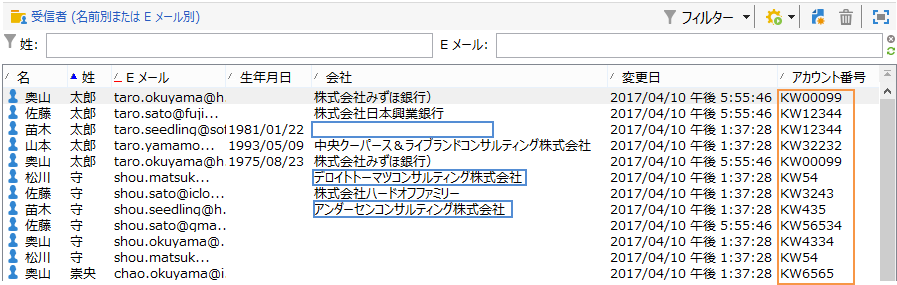

1. テンプレートの選択

   前述の例 2 の手順を適用します。

1. インポートするファイル

   インポートするファイルを選択します。

   ファイルの最初のラインのプレビューから、ファイルには特定のレコードの空のフィールドおよび更新が含まれていることがわかります。

1. フィールドの関連付け

   前述の例 2 の手順を適用します。

1. 紐付け

   * テーブルに移動し、「**[!UICONTROL 更新]**」を選択します。
   * 「**[!UICONTROL コピーの管理]**」フィールドのオプション「**[!UICONTROL エンティティを却下]**」を選択します。
   * データベース内の既存のデータがテキストファイルのデータで変更されるように、「**[!UICONTROL 重複の管理]**」フィールドは「**[!UICONTROL 更新]**」オプションのままにします。
   * 「**[!UICONTROL アカウント番号（@account）]**」ノードにカーソルを置き、オプション「**[!UICONTROL 空の値を考慮]**」を選択します。
   * フィールド「**[!UICONTROL 生年月日]**」、「**[!UICONTROL E メール]**」および「**[!UICONTROL 姓]**」を選択し、それらに紐付けキーを割り当てます。

      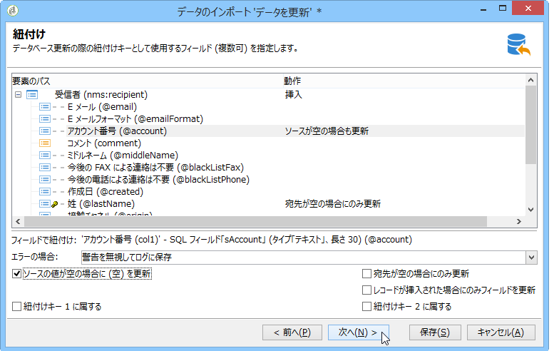

1. インポートの開始

   * 「**[!UICONTROL 開始]**」をクリックします。
   * 受信者テーブルを調べ、操作によってレコードが変更されたことを確認します。

      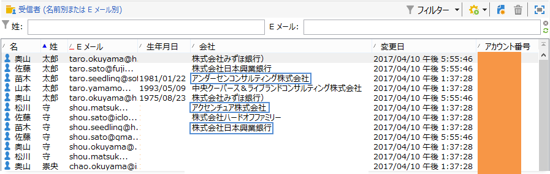

      テキストファイルの空であった値によって、データベースの値は上書きされています。データベースの既存の値は、手順 4 で重複について選択した「**[!UICONTROL 更新]**」オプションに従って、インポートファイルの値で更新されました。
