# データのインポート{#importing-data}

Adobe Campaign では、テキスト、CSV、TAB または XML フォーマットの 1 つ以上のファイルから、データベースにデータをインポートできます。これらのファイルはテーブル（メインまたはリンクされたテーブル）に関連付けられ、ソースファイルの各フィールドはデータベースのフィールドに関連付けられます。インポート設定は再利用のために保存することができるので、レプリケーション操作を自動化するインポートタスクをスケジュールできます。

>[!NOTE]
>
>You can import data without mapping it with the database data using the **[!UICONTROL Import a list]** function.
> 
>The data can then be used exclusively in workflows via the **[!UICONTROL Read list]** object. 詳しくは、[このページ](../../workflow/using/read-list.md)を参照してください。
>
>詳しくは、[プロファイルのインポート](https://docs.adobe.com/content/help/en/campaign-learn/campaign-classic-tutorials/getting-started/importing-profiles.html)ビデオをご覧ください。

## インポートするデータの構造 {#structure-of-the-data-to-import}

ソースファイル内の各ラインは、レコードと一致しています。レコード内のデータは、スペース、タブ、文字などの区切り記号で区切られています。つまり、データは列の形式で取得され、各列はデータベースのフィールドに関連付けられます。

## インポートウィザード {#import-wizard}

インポートウィザードでは、インポートを設定し、そのオプション（データ変換など）を定義して、実行を開始できます。インポートウィザードは一連の画面です。画面のコンテンツは、インポートのタイプ（シンプルまたは複数）やオペレーターの権限によって異なります。

>[!NOTE]
>
>IIS Web サーバーを使用する場合は、（28 MB を超える）大きいファイルのアップロードを許可するための設定が必要になることがあります
>
>詳しくは、[この節](../../installation/using/integration-into-a-web-server-for-windows.md#changing-the-upload-file-size-limit)を参照してください。

### 手順 1 - インポートテンプレートの選択 {#step-1---choosing-the-import-template}

インポートウィザードを起動するときは、まずテンプレートを選択する必要があります。例えば、ニュースレターを受け取った受信者のインポートを設定するには、以下の手順に従います。

1. フォルダを選択 **[!UICONTROL Profiles and Targets > Job > Generic imports and exports]** します。
1. 「**新規**」をクリックし、「**インポート**」をクリックして、インポートテンプレートを作成します。

   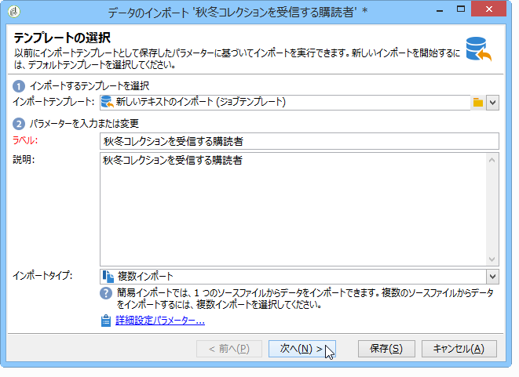

1. Click the arrow to the right of the **[!UICONTROL Import template]** field to select your template, or click **[!UICONTROL Select link]** to browse the tree.

   ネイティブテンプレートはで **[!UICONTROL New text import]**&#x200B;す。 このテンプレートは変更できませんが、必要に応じて、このテンプレートを複製して新しいテンプレートを設定できます。デフォルトでは、インポートテンプレートはノードに保存さ **[!UICONTROL Profiles and targets > Templates > Job templates]** れます。

1. Enter a name for this import in the **[!UICONTROL Label]** field. 説明を追加できます。
1. 該当するフィールドでインポートタイプを選択します。読み込みには、次の2つのタイプがあります。を使 **[!UICONTROL Simple import]** 用すると、1つのファイルのみをインポ **[!UICONTROL Multiple import]** ートし、複数のファイルを1回の実行でインポートできます。

   For a multiple import, select **[!UICONTROL Multiple import]** from the **[!UICONTROL Import type]** drop-down list in the first screen of the import wizard.

   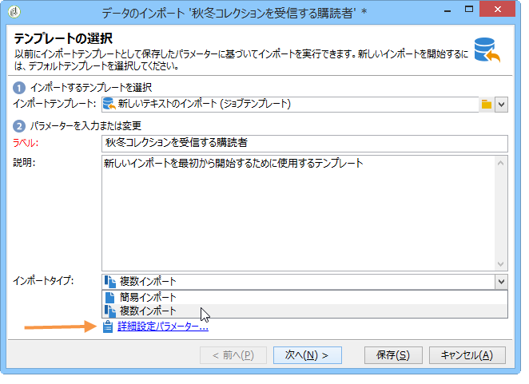

1. Specify the fields you want to import by clicking **[!UICONTROL Add]**.

   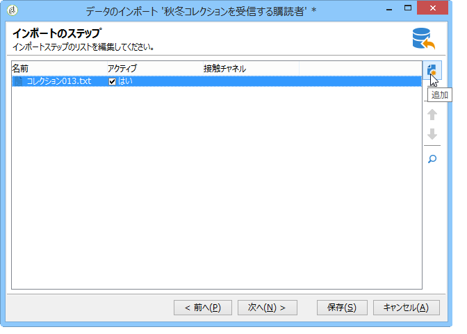

   Each time a file is added, the screen of the **[!UICONTROL File to import]** wizard is displayed. See section [Step 2 - Source file selection](#step-2---source-file-selection) and follow the steps in the wizard to define the import options as for a simple import.

   >[!NOTE]
   >
   >「複数のインポート」は、具体的な必要性があるときにのみ使用してください。通常はお勧めしません。

#### 詳細設定パラメーター {#advanced-parameters}

The **[!UICONTROL Advanced parameters]** link lets you access the following options:

* **[!UICONTROL General]** tab

   * **[!UICONTROL Stop execution if there are too many rejects]**

      このオプションは、デフォルトで選択されています。却下の数に関係なくインポートの実行を続行する場合は、選択を解除できます。デフォルトでは、最初の 100 ラインが却下された場合、実行は停止されます。

   * **[!UICONTROL Trace mode]**

      インポートの実行をラインごとにトラッキングする場合に、このオプションを選択します。

   * **[!UICONTROL Start the job in a detached process]**

      このオプションは、デフォルトで選択されています。データベースで処理中の他のジョブに影響しないように、インポートの実行を分離できます。

   * **[!UICONTROL Do not update enumerations]**

      データベース内の列挙値のリストをエンリッチメントしない場合に、このオプションを選択します。See [Managing enumerations](../../platform/using/managing-enumerations.md).

* **[!UICONTROL Variables]** tab

   クエリエディターおよび計算フィールドでアクセス可能になる、ジョブに関連付けられた変数を定義できます。To create a variable, click **[!UICONTROL Add]** and use the variable editor.

   >[!CAUTION]
   >
   >The **[!UICONTROL Variables]** tab is for Workflow-type programming use only, and should be configured by expert users only.

### 手順 2 - ソースファイルの選択 {#step-2---source-file-selection}

ソースファイルは、テキストフォーマット（txt、csv、tab、固定列）または xml です。

デフォルトでは、が選 **[!UICONTROL Upload file on the server]** 択されています。 Click the folder to the right of the **[!UICONTROL Local file]** field to browse the local disk and select the file to import. インポートするファイルがサーバー上にある場合は、このオプションの選択を解除して、そのアクセスパスと名前を入力できます。

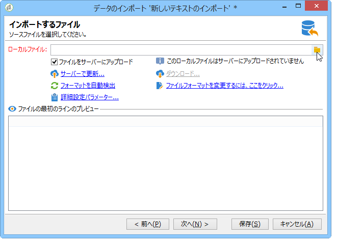

When the file has been specified, you can view its data in the lower section of the window by clicking **[!UICONTROL Auto-detect format]**. このプレビューでは、ソースファイルの最初の 200 ラインが表示されます。

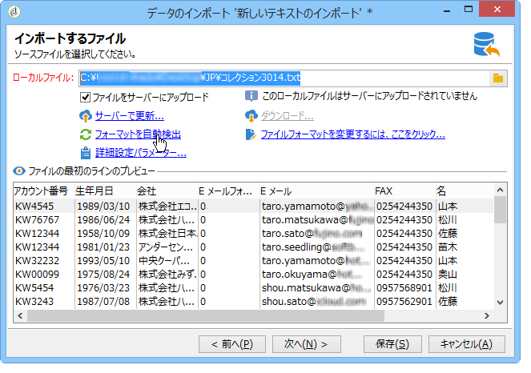

このビューの上に表示されているオプションを使用して、インポートを設定できます。これらのオプションを使用して定義されたパラメーターは、プレビューに転送されます。次のオプションを使用できます。

* **[!UICONTROL Click here to change the file format...]** ファイル形式を確認し、設定を微調整できます。
* **[!UICONTROL Update on server...]** ローカルファイルをサーバーに転送できます。 このオプションは、が選択されている場合にの **[!UICONTROL Upload file on the server]** み使用できます。
* **[!UICONTROL Download]** は、ファイルがサーバー上にアップロードされている場合にのみ使用できます。
* **[!UICONTROL Auto-detect format]** は、データソースの形式を再初期化するために使用されます。 このオプションを使用すると、オプションを使用してフォーマットされたデータに元の形式を再適用で **[!UICONTROL Click here to change the file format...]** きます。
* The **[!UICONTROL Advanced parameters]** link lets you filter the source data and access advanced options. この画面から、インポート対象をファイルの一部のみにすることを選択できます。フィルターを定義して、例えば、対応するラインの値に従って、「見込み客」または「顧客」タイプのユーザーのみをインポートすることもできます。これらのオプションを使用するのは、エキスパート JavaScript ユーザーのみである必要があります。

#### ファイルフォーマットの変更 {#changing-the-file-format}

The **[!UICONTROL Click here to change the file format...]** option lets you format the data of the source file, and in particular to specify the column separator and the type of data for each field. この設定は、次のウィンドウで実行します。

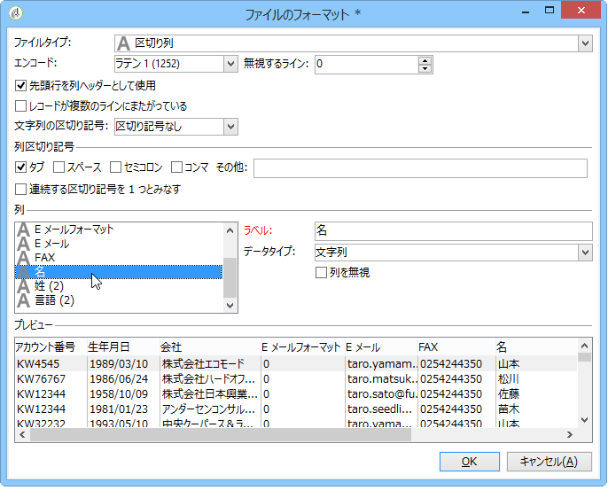

この手順では、ファイルフィールドの値をどのように読み取るかを指定できます。例えば、日付の場合、日付データまたは日付 + 時刻データをフォーマット（yyyy/mm/dd、mm/dd/yyyy など）に関連付けることができます。入力データが想定されるフォーマットと一致していない場合、インポート中に却下が発生します。

ウィンドウの下部のプレビューゾーンで、設定の結果を表示できます。

Click **[!UICONTROL OK]** to save the formatting, then click **[!UICONTROL Next]** to display the next step.

### 手順 3 - フィールドマッピング {#step-3---field-mapping}

次に、宛先スキーマを選択し、各列のデータをデータベースのフィールドにマッピングする必要があります。

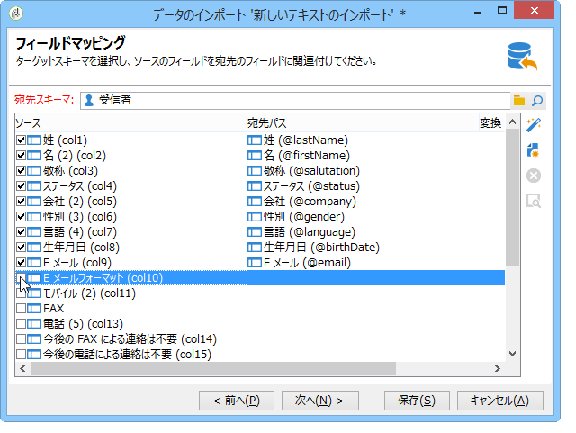

* The **[!UICONTROL Destination schema]** field lets you select the schema in which the data will be imported. この情報は必須です。Click the **[!UICONTROL Select link]** icon to select one of the existing schemas. Click **[!UICONTROL Edit link]** to display the content of the selected table.
* 中央のテーブルには、ソースファイルで定義されているすべてのフィールドが表示されます。宛先ファイルを関連付けるために、インポートするフィールドを選択します。これらのフィールドは、手動または自動でマッピングできます。

   フィールドを手動でマッピングするには、チェックボックスをクリックしてソースフィールドを選択し、2 番目の列をクリックして、選択したフィールドに対応するセルを有効にします。Next, click the **[!UICONTROL Edit expression]** icon to display all the fields of the current table. 宛先フィールドを選択し、「**[!UICONTROL OK]**」をクリックしてマッピングを検証します。

   To associate the source fields and destination fields automatically, click the **[!UICONTROL Guess the destination fields]** icon to the right of the list of fields. 提案されたフィールドは、必要に応じて変更できます。

   >[!CAUTION]
   >
   >この操作の結果は、次の手順に進む前に必ず確認する必要があります。

* インポートされるフィールドに変換を適用できます。To do this, click in the cell of the **[!UICONTROL Transformation]** column that relates to the field concerned, and select the transformation to be applied.

   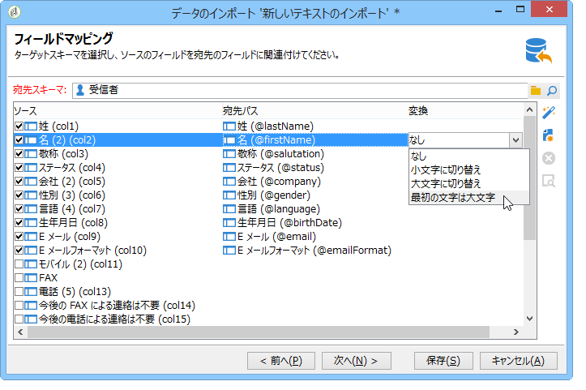

   >[!CAUTION]
   >
   >変換はインポート時に適用されます。ただし、宛先フィールドに対する制約が定義されている場合は（前述の例では、@firstName フィールドに対して）、制約が優先されます。

* 中央のテーブルの右側にある該当するアイコンを使用して、計算フィールドを追加できます。計算フィールドを使用すると、複雑な変換の実行、仮想列の追加または複数の列のデータの結合を実行できます。様々な可能性について詳しくは、以降の節を参照してください。

#### 計算フィールド {#calculated-fields}

計算フィールドは、ソースファイルに追加される新しい列で、他の列から計算されます。計算フィールドは、Adobe Campaign データベースのフィールドに関連付けることができます。ただし、計算フィールドに対して紐付け操作は実行できません。

次の 4 つのタイプの計算フィールドがあります。

* **[!UICONTROL Fixed string]**:計算フィールドの値は、ソースファイルのすべての行で同じです。 挿入または更新されるレコードのフィールドの値を設定できます。例えば、インポートされるすべてのレコードに対して、マーカーを「はい」に設定できます。
* **[!UICONTROL String with JavaScript tags]**:計算フィールドの値は、JavaScriptコマンドを含む文字列です。
* **[!UICONTROL JavaScript expression]**:計算済みフィールドの値は、JavaScript関数の評価結果です。 返される値は、数値、日付などです。
* **[!UICONTROL Enumeration]**:フィールドの値は、ソースファイルに含まれる値に従って属性付けされます。 エディターを使用して、次の例に示すように、ソース列を指定して列挙値のリストを入力できます。

   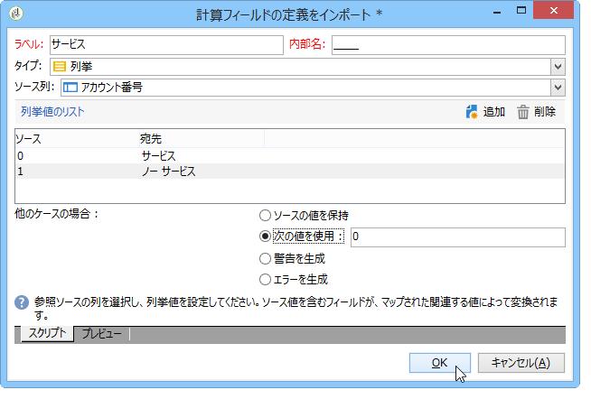

   The **[!UICONTROL Preview]** tab lets you view the result of the defined configuration. Here, the **[!UICONTROL Subscription]** column has been added. 値は「**ステータス**」フィールドから計算されます。

   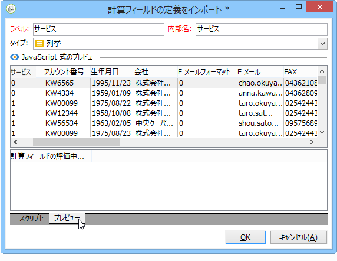

### 手順 4 - 紐付け {#step-4---reconciliation}

インポートウィザードでの紐付け手順では、ファイルのデータとデータベース内の既存のデータの紐付けのモードを定義し、ファイルデータとデータベースデータ間の優先順位ルールを設定できます。設定ウィンドウは次のように表示されます。

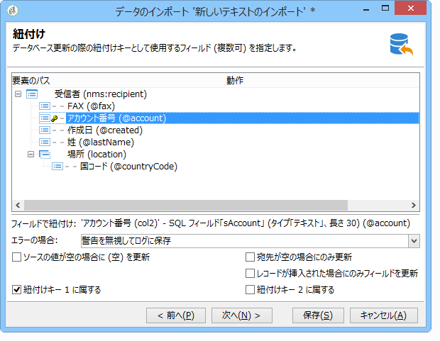

画面の中央のセクションには、データがインポートされる Adobe Campaign データベースのフィールドおよびテーブルのツリーがあります。

ノード（テーブルまたはフィールド）ごとに特別なオプションを使用できます。リスト内の該当するノードをクリックすると、そのパラメーターと簡単な説明が下に表示されます。The behavior defined for each element is displayed in the corresponding **[!UICONTROL Behavior]** column.

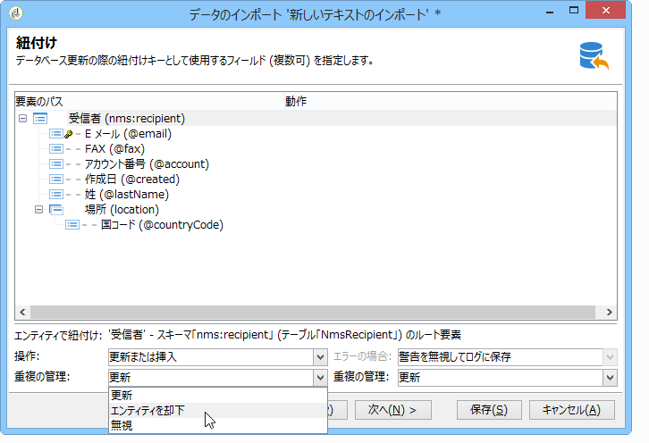

#### 操作のタイプ {#types-of-operation}

インポート対象の各テーブルについて、操作のタイプを定義する必要があります。データベースの主要な要素に対して使用可能な操作は次のとおりです。

* **[!UICONTROL Update or insertion]**:レコードがデータベースに存在する場合は更新し、存在しない場合は作成します。
* **[!UICONTROL Insertion]**:データベースにレコードを挿入します。
* **[!UICONTROL Update]**:既存のレコードのみを更新します（他のレコードは無視します）。
* **[!UICONTROL Reconciliation only]**:データベース内のレコードを検索しますが、更新は実行しません。 例えば、フォルダー内のデータを更新せずに、ファイルの列に従って、インポートする受信者のフォルダーを関連付けることができます。
* **[!UICONTROL Deletion]**:データベース内のレコードを破棄できます。

インポート対象のテーブル内の各フィールドに対して使用可能なオプションは次のとおりです。

* **[!UICONTROL Update (empty) if source value is empty]**:更新の場合、ソースファイル内のフィールドが空の場合、フィールドの値によってデータベースの値が削除されます。 それ以外の場合、データベースフィールドは保持されます。
* **[!UICONTROL Update only if destination is empty]**:データベースフィールドが空でない場合、ソースファイルの値によってデータベースフィールドの値が上書きされることはありません。 空の場合、ソースファイルの値が取得されます。
* **[!UICONTROL Update the field only when the record is inserted]**:更新または挿入操作中に、新しいソースファイルレコードのみがインポートされます。

>[!NOTE]
>
>重複のない挿入の場合を除き、紐付けキーの定義は常に&#x200B;**必須**&#x200B;です。

#### 紐付けキー {#reconciliation-keys}

重複排除を管理するために、少なくとも 1 つの紐付けキーを入力する必要があります。

紐付けキーは、レコードを識別するために使用される一連のフィールドです。例えば、受信者をインポートする場合、紐付けキーは、アカウント番号、「E メール」フィールドまたは「姓」、「名」、「会社」フィールドなどです。

この場合、ファイルのラインがデータベース内の既存の受信者と一致するかどうかを判別するために、インポートエンジンでは、キーのすべてのフィールドについて、ファイルの値をデータベースの値と比較します。フィールドが 1 つのレコードに固有の場合、ソースデータと宛先データ間の適切な比較を実行でき、インポート後のデータの整合性が保証されます。同じテーブルに対して 2 番目の紐付けキーを入力できます。これは、最初のキーが空のラインに対して使用されます。

インポート中に変更される可能性があるフィールドを選択することは避けます。これが発生すると、エンジンにより追加レコードが作成される場合があります。

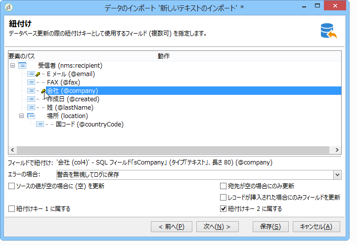

>[!NOTE]
>
>受信者のインポートでは、選択したフォルダーの識別子が暗黙的にキーに追加されます。
>
>したがって、紐付けはこのフォルダーに対してのみ実行されます（フォルダーが選択されない場合を除く）。

#### 重複排除 {#deduplication}

>[!NOTE]
>
>「コピー」は、インポートされるファイル内に 2 回以上存在する項目です。
>
>「重複」は、インポートされるファイル内とデータベース内の両方に存在する項目です。

このフィ **[!UICONTROL Management of doubles]** ールドでは、データの重複除外を設定できます。 重複排除は、**ソースファイル内**（複数ファイルのインポートの場合は複数のソースファイル）に複数回存在するレコード、つまり紐付けキーのフィールドが同一であるラインが対象となります。

* Duplicate management in **[!UICONTROL Update]** mode (the default mode) does not perform deduplication. 直前のレコードのデータは更新されるので、結果として、最後のレコードが優先されます。このモードでは、重複のカウントは実行されません。
* Duplicate management in **[!UICONTROL Ignore]** mode or **[!UICONTROL Reject entity]** excludes duplicates from the import. この場合、レコードはインポートされません。
* In **[!UICONTROL Reject entity]** mode, the element is not imported, and an error is generated in the import logs.
* In **[!UICONTROL Ignore]** mode, the element is not imported, but no trace of the error is kept. このモードを使用すると、パフォーマンスを最適化できます。

>[!CAUTION]
>
>重複排除は、メモリ内のみで実行されます。そのため、重複排除でのインポートのサイズは制限されます。制限は、複数のパラメーター（アプリケーションサーバーの処理能力、アクティビティ、キーのフィールド数など）によって異なります。重複排除の最大サイズは、約 1,000,000 ラインです。

重複排除は、ソースファイルとデータベースの両方に存在するレコードを対象とします。更新のみの操作(または **[!UICONTROL Update and insertion]** )に関 **[!UICONTROL Update]**&#x200B;する。 The **[!UICONTROL Duplicate management]** option lets you update or ignore the record if it is in both the source file and the database. このオ **[!UICONTROL Update or insert based on origin]** プションはオプションのモジュールに属し、標準コンテキストでは使用できません。

The options **[!UICONTROL Reject]** and **[!UICONTROL Ignore]** operate as presented above.

#### エラーの場合の動作 {#behavior-in-the-event-of-an-error}

ほとんどのデータ転送操作で、様々なタイプのエラーが発生します（一貫性のないラインフォーマット、無効な E メールアドレスなど）。インポートエンジンによって生成されるすべてのエラーおよびすべての警告は、保存され、インポートインスタンスにリンクされます。

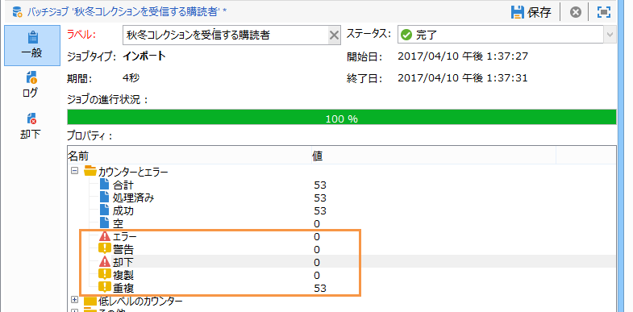

Details of these rejects can be viewed via the **[!UICONTROL Rejects]** tab.

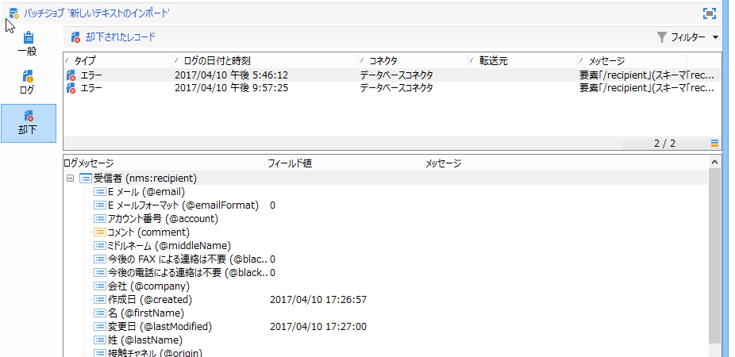

There are two types of rejects (the type is displayed in the **[!UICONTROL Connector]** column):

* テキストコネクタの却下は、ファイルラインの処理中に発生するエラーに関係します（計算フィールド、データ分析など）。この場合、エラーが発生すると、常にライン全体が却下されます。
* データベースコネクタの却下は、データの紐付けまたはデータベースへの書き込み中に発生するエラーに関係します。複数のテーブルへのインポートの場合は、却下はレコードの一部にのみ関係することがあります（例えば、受信者および関連するイベントのインポートの場合、エラーが発生すると、イベントの更新が回避され、受信者が却下されないことがあります）。

データの紐付けページで、目的のエラー管理タイプをフィールドごとおよびテーブルごとに定義できます。

* **[!UICONTROL Ignore and log a warning]**:エラーが発生したフィールド以外のフィールドは、すべてデータベースにインポートされます。
* **[!UICONTROL Reject parent element]**:エラーの原因となったフィールドだけでなく、レコードの行全体が拒否されます。
* **[!UICONTROL Reject all elements]**:インポートが停止し、レコードのすべての要素が拒否されます。

   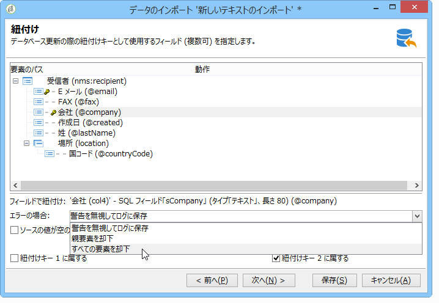

インポートインスタンスの却下画面のツリーには、却下されたフィールドとエラーが発生した場所が示されます。

You can generate a file containing these records via the **[!UICONTROL Export rejects]** icon:

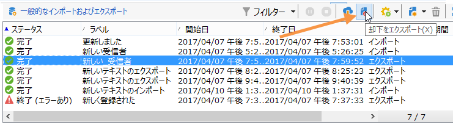

### 手順 5 - 受信者をインポートする際の追加手順 {#step-5---additional-step-when-importing-recipients}

インポートウィザードの次の手順では、データのインポート先となるフォルダーを選択または作成し、インポートされた受信者を（新規または既存の）リストと自動的にマッピングし、受信者をサービスに購読登録できます。

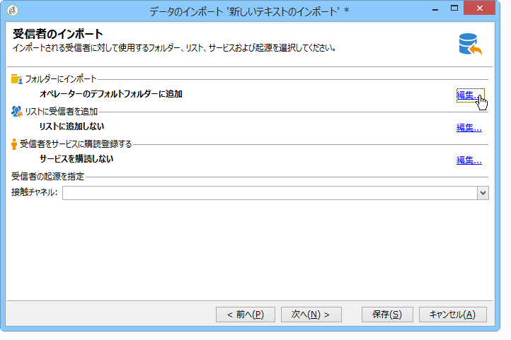

>[!NOTE]
>
>この手順は、受信者のみをインポートする場合と、デフォルトの Adobe Campaign 受信者テーブル（**nms:recipient**）を使用する場合に表示されます。

* Click the **[!UICONTROL Edit]** links to select the folder, the list, or the service to which you want to associate or subscribe the recipients.

   1. フォルダーへのインポート

      The **[!UICONTROL Edit...]** link of the **[!UICONTROL Import into a folder]** section lets you select or create the folder into which the recipients will be imported. デフォルトでは、パーティションが定義されていない場合、データはオペレーターのデフォルトのフォルダーにインポートされます。

      >[!NOTE]
      >
      >オペレーターのデフォルトのフォルダーは、オペレーターが書き込みアクセス権を持つ最初のフォルダーです。「フォルダ [ーアクセス管理」を参照](../../platform/using/access-management.md#folder-access-management)。

      To select the import folder, click the arrow to the right of the **[!UICONTROL Folder]** field and select the folder concerned. You can also use the **[!UICONTROL Select link]** icon to display the tree in a new window or create a new folder.

      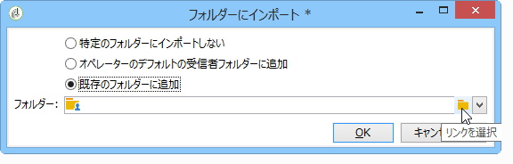

      新しいフォルダーを作成するには、フォルダーを追加するノードを選択し、右クリックします。選択 **[!UICONTROL Create a new 'Recipients' folder]**.

      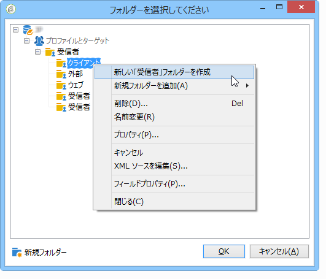

      現在のノードの下に新しいフォルダーが追加されます。新しいフォルダーの名前を入力し、Enter キーを押して確定して、「**[!UICONTROL OK]**」をクリックします。

      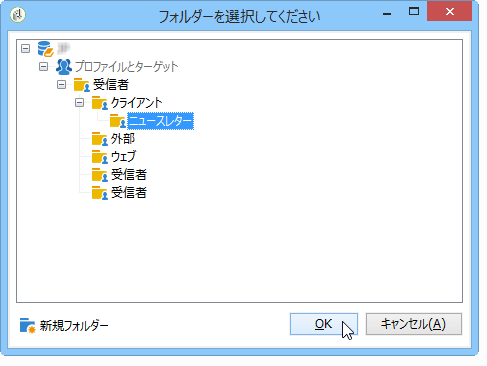

   1. リストへの関連付け

      The **[!UICONTROL Edit...]** link in the **[!UICONTROL Add recipients to a list]** section lets you select or create a list into which the recipients will be imported.

      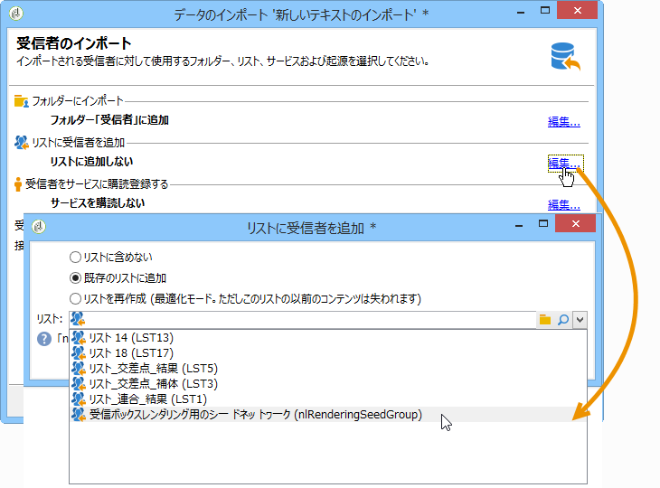

      You can create a new list for these recipients by clicking **[!UICONTROL Select link]**, then **[!UICONTROL Create]**. リストの作成と管理は、リストの作成と管 [理に表示されます](../../platform/using/creating-and-managing-lists.md)。

      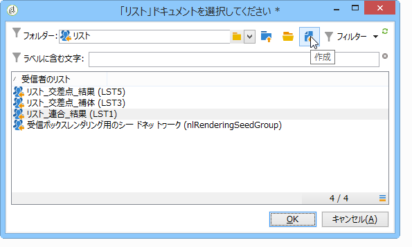

      受信者をリスト内の既存の受信者に追加するか、または新しい受信者でリストを再作成するかを決定できます。後者の場合、リストに既に受信者が含まれていた場合は、それらは削除され、インポートされた受信者に置き換えられます。

   1. サービスの購読登録

      To subscribe all imported recipients to an information service, click the **[!UICONTROL Edit...]** link of the **[!UICONTROL Subscribe recipients to a service]** section in order to select or create the information service which the recipients will be subscribed to. You can select the **[!UICONTROL Send a confirmation message]** option: The content of this message is defined in the delivery template associated with the subscription service.

      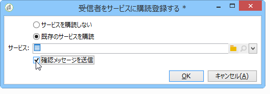

      You can create a new service for these recipients by clicking **[!UICONTROL Select link]** and then the **[!UICONTROL Create]** icon. 情報サービスの管理については、[この節](../../delivery/using/managing-subscriptions.md)で説明しています。

* Use the **[!UICONTROL Origin]** field to add information about the origin of recipients to their profiles. この情報は、複数のインポートのフレームワークで特に役立ちます。

Click **[!UICONTROL Next]** to validate this step and display the following step.

### 手順 6 - インポートの開始 {#step-6---launching-the-import}

ウィザードの最後の手順では、データのインポートを開始できます。To do this, click the **[!UICONTROL Start]** button.

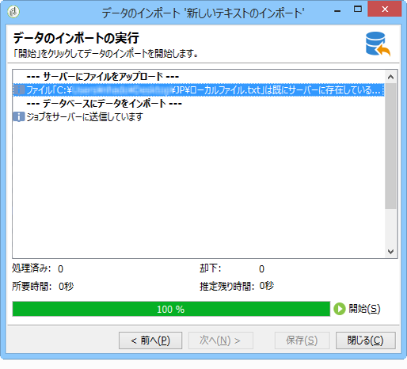

### ジョブステータス {#job-statuses}

ジョブステータスは、ジョブの現在のステータスを示します。各ステータスは、特別なアイコンおよびラベルで表されます。この情報は、ジョブのリストに表示されます。次に、ステータスとそのアイコンを示します。

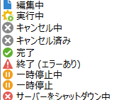

* **編集中**

   ジョブが作成されています。

* **処理中**

   ジョブが実行されています。

* **キャンセル済み**

   Click the **[!UICONTROL Cancel]** button: the job in progress is cancelled.

* **キャンセル中**

   キャンセルコマンドにより、ジョブがキャンセル中です。

* **一時停止中**

   Click **[!UICONTROL Pause]**: the job is being suspended.

* **一時停止**

   Click **[!UICONTROL Pause]**: the job is suspended. It can be restarted by clicking **[!UICONTROL Start]**.

* **終了**

   ジョブの実行が終了しました。

* **エラーあり**

   技術的エラーによりジョブは実行されませんでした。

* **サーバーをシャットダウン中**

   Adobe Campaign サーバーがシャットダウンされたので、処理中のジョブが中断されます。

## 一般的なインポートのサンプル {#generic-import-samples}

### Example: Import from a list of recipients {#example--import-from-a-list-of-recipients}

リストの概要から受信者のリストを作成して提供するには、次の手順に従います。

1. リストの作成

   * Adobe Campaignホーム **[!UICONTROL Lists]** ページのメニ **[!UICONTROL Profiles and targets]** ューにあるリンクをクリックします。
   * ボタンをク **[!UICONTROL Create]** リックし、次にボタンをクリ **[!UICONTROL Import a list]** ックします。

1. インポートするファイルの選択

   Click the folder to the right of the **[!UICONTROL Local file]** field and select the file containing the list to import.

   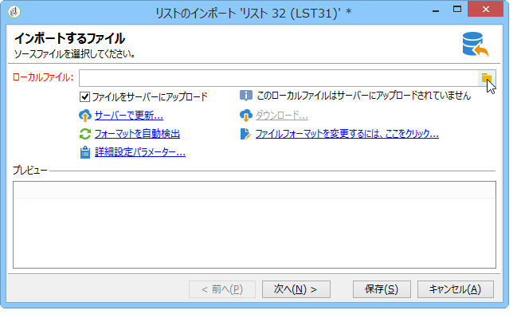

1. リスト名および保存

   リストの名前を入力し、リストを保存するディレクトリを選択します。

   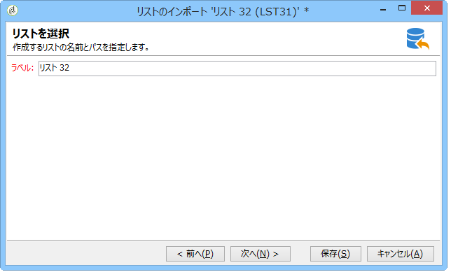

1. インポートの開始

   Click **[!UICONTROL Next]** and then **[!UICONTROL Start]** to start importing the list.

   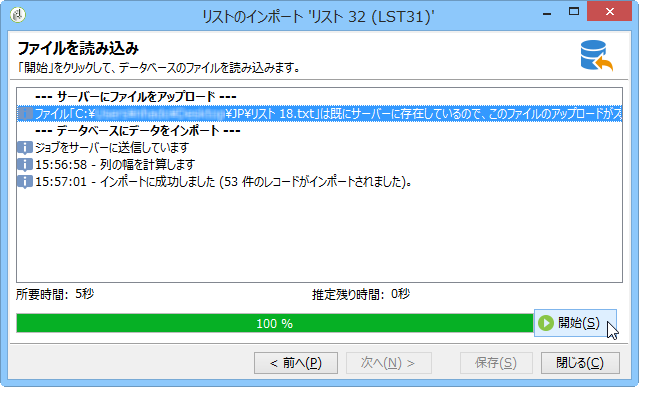

### 例：テキストファイルからの新しいレコードのインポート {#example--import-new-records-from-a-text-file-}

テキストファイルに保存されている新しい受信者プロファイルを Adobe Campaign データベースにインポートするには、次の手順に従います。

1. テンプレートの選択

   * Adobe Campaignのホームページで、リンクをクリックし **[!UICONTROL Profiles and targets]** てから、をクリックしま **[!UICONTROL Jobs]**&#x200B;す。 Above the list of jobs, click **[!UICONTROL New import]**.
   * デフォルトでは、テ **[!UICONTROL New text import]** ンプレートを選択したままにします。
   * ラベルおよび説明を変更します。
   * 選択 **[!UICONTROL Simple import]**.
   * デフォルトのジョブフォルダーのままにします。
   * Click **[!UICONTROL Advanced parameters]** and select the **[!UICONTROL Tracking mode]** option to view the details of your import during execution.

1. インポートするファイルの選択

   Click the folder to the right of the **[!UICONTROL Local file]** field and select the file you want to import.

   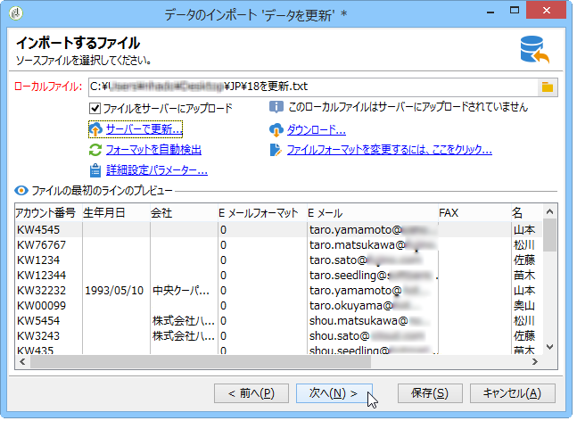

1. フィールドの関連付け

   アイコンをクリ **[!UICONTROL Guess the destination fields]** ックして、ソーススキーマと宛先スキーマを自動的にマッピングします。 Check the information in this window before clicking **[!UICONTROL Next]**.

   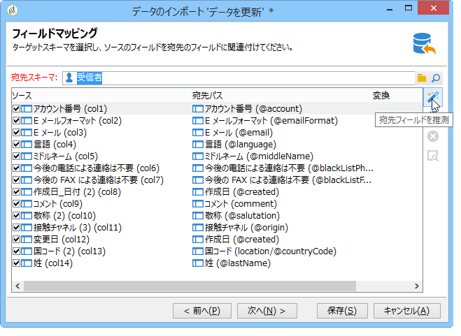

1. 紐付け

   * **受信者（nms:recipient）**&#x200B;テーブルに移動します。
   * Select the **[!UICONTROL Insertion]** operation and leave the default values in the other fields.

      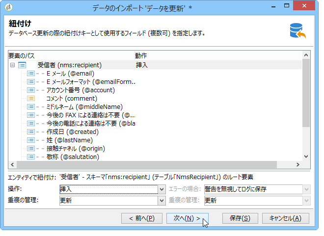

1. 受信者のインポート

   * 必要に応じて、レコードのインポート先フォルダーを指定します。

      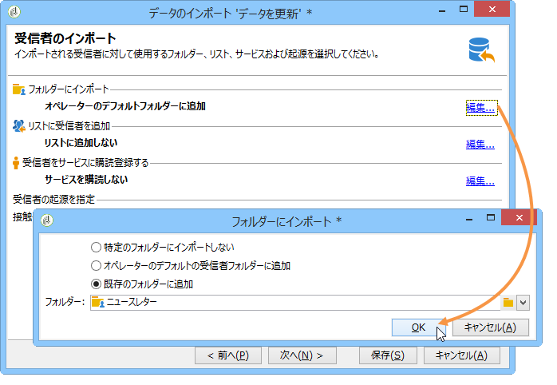

1. インポートの開始

   * クリック **[!UICONTROL Start]**.

      エディターの中央の領域で、インポート操作が成功したこと、および処理されたレコード数を確認することができます。

      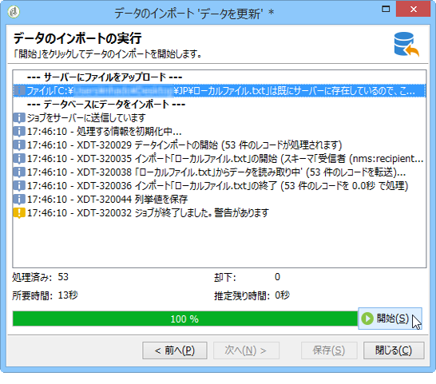

      The **[!UICONTROL Tracking]** mode lets you track the details of the import for each record in the source file. これを行うには、ホームページで「次へ」をク **[!UICONTROL Profiles and Targets]** リック **[!UICONTROL Processes]**&#x200B;し、関連するインポートを選択し、「」、「」、「」 **[!UICONTROL General]**&#x200B;の各タ **[!UICONTROL Journal]** ブを調 **[!UICONTROL Rejects]** べます。

      * インポートの進捗状況の確認

         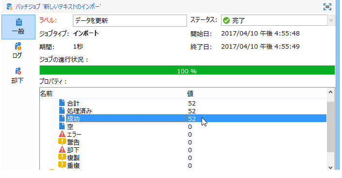

      * 各レコードのプロセス表示

         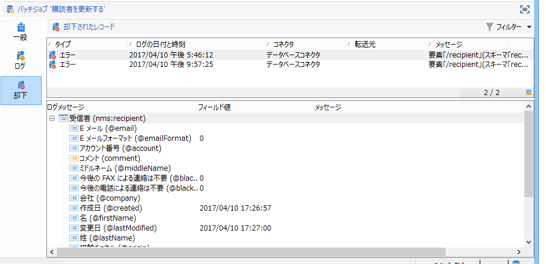

### Example: Update and insert recipients {#example--update-and-insert-recipients}

データベース内の既存のレコードを更新し、テキストファイルから新しいレコードを作成します。この手順の例を示します。

1. テンプレートの選択

   前述の例 2 で説明した手順を繰り返します。

1. インポートするファイル

   インポートするファイルを選択します。

   この例では、ファイルの最初のラインの概要から、ファイルには 3 レコードの更新と 1 レコードの作成が含まれていることがわかります。

   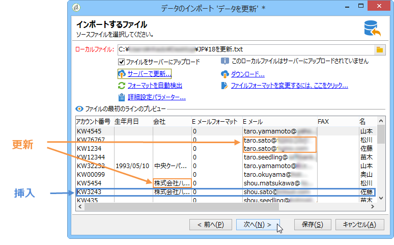

1. フィールドの関連付け

   前述の例 2 の手順を適用します。

1. 紐付け

   * デフォルト **[!UICONTROL Update or insert]** では選択されたままです。
   * Keep the option **[!UICONTROL Management of duplicates]** in **[!UICONTROL Update]** mode so that existing records in the database will be modified with data from the text file.
   * フィールドを選択 **[!UICONTROL Birth date]**&#x200B;し、調 **[!UICONTROL Name]** 整キ **[!UICONTROL Company]** ーを割り当てます。

      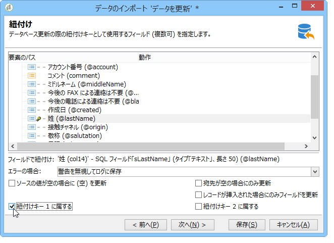

1. インポートの開始

   * クリック **[!UICONTROL Start]**.

      トラッキングウィンドウで、インポートが成功したこと、および処理されたレコード数を確認することができます。

      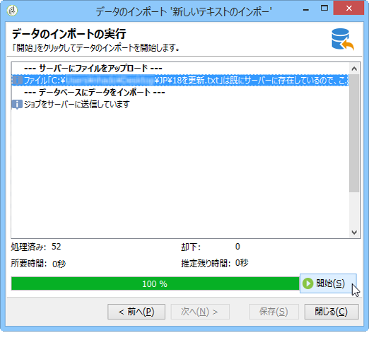

   * 受信者テーブルを調べ、この操作によってレコードが変更されたことを確認します。

      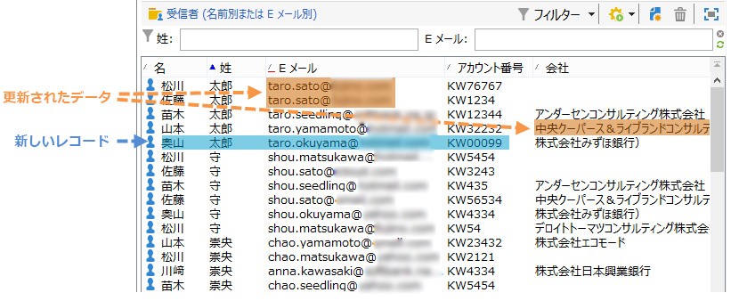

### Example: Enrich the values with those of an external file {#example--enrich-the-values-with-those-of-an-external-file}

データベーステーブル内のフィールドをテキストファイル内の値で更新しますが、その際、データベースに含まれている値が優先されるようにします。

この例では、テキストファイル内の一部のフィールドは値を含んでいますが、データベース内の対応するフィールドは空です。その他のフィールドは、データベース内の値とは異なる値を含んでいます。

* インポートするテキストファイルのコンテンツ

   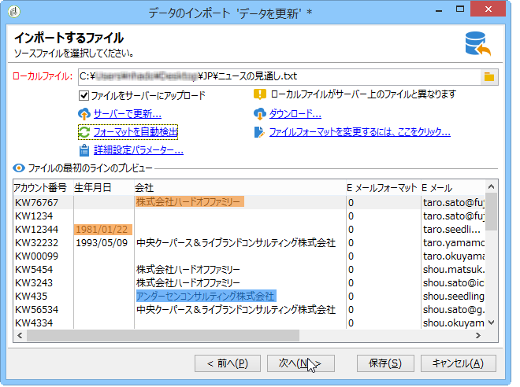

* インポート前のデータベースステータス

   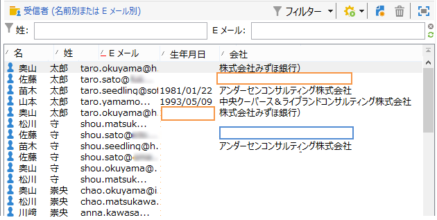

次の手順に従います。

1. テンプレートの選択

   前述の例 2 の手順を適用します。

1. インポートするファイル

   インポートするファイルを選択します。

1. フィールドの関連付け

   前述の例 2 の手順を適用します。

   ファイルの最初のラインのプレビューから、ファイルには特定のレコードの更新が含まれていることがわかります。

1. 紐付け

   * Go to the table and select the **[!UICONTROL Update]** operation.
   * フィールドのオプ **[!UICONTROL Reject entity]** ションを選択 **[!UICONTROL Management of doubles]** します。
   * Keep the option **[!UICONTROL Management of duplicates]** in **[!UICONTROL Update]** mode so that existing records in the database will be modified with data from the text file.
   * ノードにカーソルを置き、 **[!UICONTROL Last name (@lastName)]** オプションを選択 **[!UICONTROL Update only if destination is empty]** します。
   * ノードに対してこの操作を繰り返 **[!UICONTROL Company (@company)]** します。
   * フィールドに調整キーを割り当て、 **[!UICONTROL Birth date]**&#x200B;およびを **[!UICONTROL E-mail]** 指定しま **[!UICONTROL First name]**&#x200B;す。

      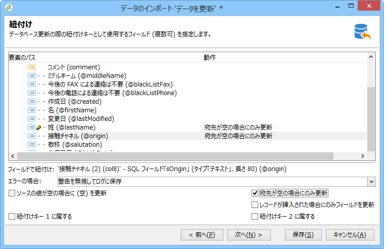

1. インポートの開始

   クリック **[!UICONTROL Start]**.

   受信者テーブルを調べ、インポートによってレコードが変更されたことを確認します。

   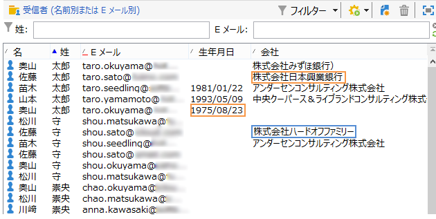

   空であった値のみがテキストファイルの値に置き換えられていますが、データベース内の既存の値はインポートファイルの値で上書きされていません。

### Example: Update and enrich the values from those in an external file {#example--update-and-enrich-the-values-from-those-in-an-external-file}

データベーステーブル内のフィールドをテキストファイル内の値で更新しますが、その際、テキストファイルに含まれている値が優先されるようにします。

この例では、テキストファイル内の一部のフィールドは値が空ですが、データベース内の対応するフィールドは値を含んでいます。その他のフィールドは、データベース内の値とは異なる値を含んでいます。

* インポートするテキストファイルのコンテンツ

   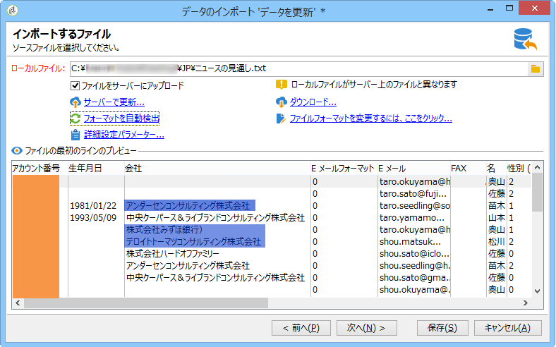

* インポート前のデータベースステータス

   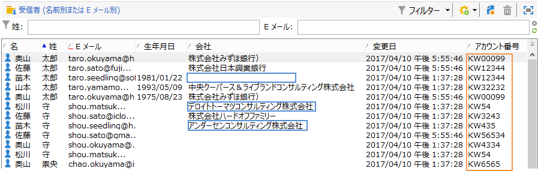

1. テンプレートの選択

   前述の例 2 の手順を適用します。

1. インポートするファイル

   インポートするファイルを選択します。

   ファイルの最初のラインのプレビューから、ファイルには特定のレコードの空のフィールドおよび更新が含まれていることがわかります。

1. フィールドの関連付け

   前述の例 2 の手順を適用します。

1. 紐付け

   * Go to the table and select **[!UICONTROL Update]**.
   * フィールドのオプ **[!UICONTROL Reject entity]** ションを選択 **[!UICONTROL Management of doubles]** します。
   * Leave the option **[!UICONTROL Management of duplicates]** in **[!UICONTROL Update]** mode for existing records in the database to be modified with data from the text file.
   * ノードにカーソルを置き、 **[!UICONTROL Account number (@account)]** オプションを選択しま **[!UICONTROL Take empty values into account]**&#x200B;す。
   * フィールドを選択 **[!UICONTROL Birth date]**&#x200B;し、調 **[!UICONTROL E-mail]** 整キ **[!UICONTROL First name]** ーを割り当てます。

      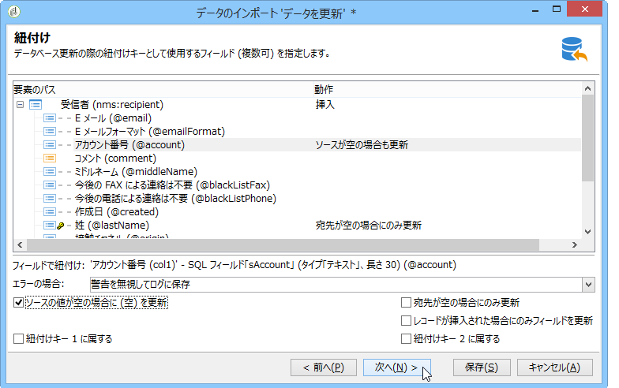

1. インポートの開始

   * クリック **[!UICONTROL Start]**.
   * 受信者テーブルを調べ、操作によってレコードが変更されたことを確認します。

      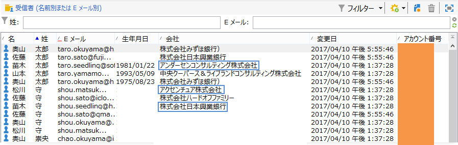

      テキストファイルの空であった値によって、データベースの値は上書きされています。The existing values in the database were updated with those in the import file in keeping with the **[!UICONTROL Update]** option selected for duplicates in step 4.

## ワークフローからのデータのインポート {#importing-data-from-a-workflow}

ワークフローは、一部のインポート処理を自動化する有効な手段になります。データをローカルファイルからインポートするか、SFTP からインポートするかに関係なく、ワークフローを使用してデータ管理手順を標準化することができます。

ワークフローからのデータのインポートについて詳しくは、[この節](../../workflow/using/importing-data.md)を参照してください。
