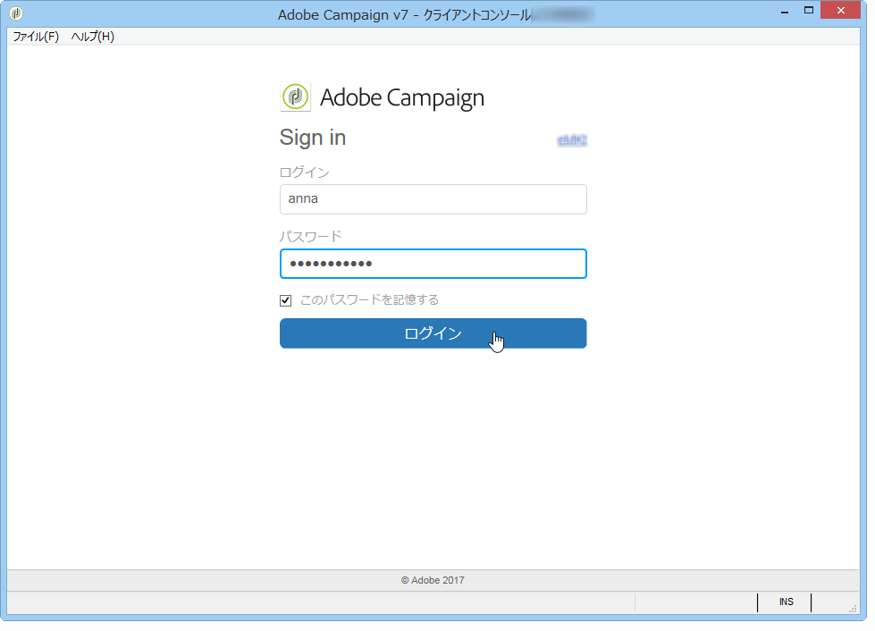
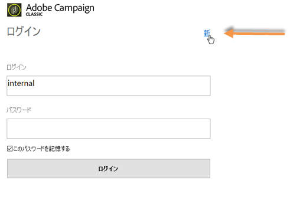
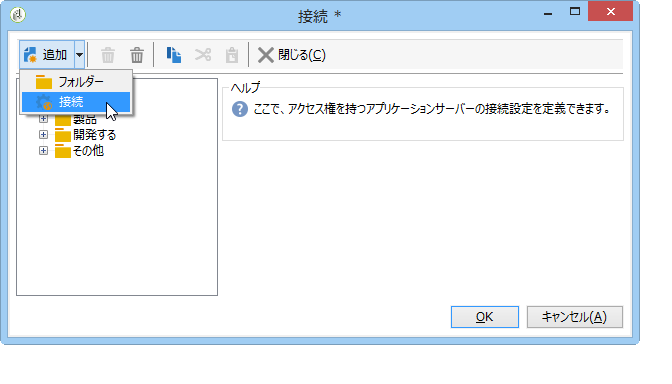
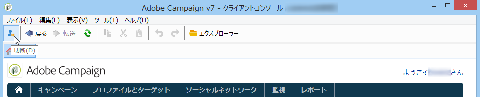

# Adobe Campaign の起動{#launching-adobe-campaign}

## Adobe Campaign の起動 {#starting-adobe-campaign}

Adobe Campaignは、を選択して起動できま **[!UICONTROL Start / All Programs / Adobe Campaign v.X / Adobe Campaign client console]**&#x200B;す。

クライアントコンソール接続ウィンドウで、既存のデータベースを選択するか設定し、ユーザー名およびパスワードを使用してデータベースに接続できます。

## Adobe Campaign への接続 {#connecting-to-adobe-campaign}

Adobe ID を使用して Adobe Campaign に接続できます。詳しくは、[このページ](../../integrations/using/about-adobe-id.md)を参照してください。

専用のログイン／パスワードを使用して接続することもできます。

1. Enter the operator account identifier in the **[!UICONTROL login]** field.

   ID は、Adobe Campaign プラットフォームの管理者から付与されます。

1. Enter your password in the **[!UICONTROL Password]** field.

   データベースに最初にアクセスする際のパスワードは、管理者が指定したものになります。Once you are connected, you can change your password via the **[!UICONTROL Tools > Change password...]** menu. Details on operators and connections are available in [Access management](../../platform/using/access-management.md).

1. Click **[!UICONTROL Log in]** to confirm.

これで、[Adobe Campaign ワークスペース](../../platform/using/adobe-campaign-workspace.md)にアクセスできるようになります。

## 接続の設定 {#setting-up-connections}

入力ゾーンの上にあるリンクから、サーバー接続設定にアクセスできます。

ウィンドウで、 **[!UICONTROL Connections]** をクリックしま **[!UICONTROL Add > Connection]**&#x200B;す。

次に、接続設定を定義する必要があります。手順は次のとおりです。

* Enter a **[!UICONTROL Label]** to assign a name to your database connection.
* 「**[!UICONTROL URL]**」フィールドで、アプリケーションサーバーのアドレスを追加します。接続 URL が不明な場合は、管理者にお問い合わせください。
* オペレー **[!UICONTROL Connect with an Adobe ID]** ターがAdobe IDを使用してコンソールに接続しているかどうかを確認します。 詳しくは、[このページ](../../integrations/using/about-adobe-id.md)を参照してください。
* Click **[!UICONTROL OK]** to validate.

>[!NOTE]
>
>The **[!UICONTROL Add]** button lets you create **[!UICONTROL folders]** to organize all your connections. 各接続をフォルダーにドラッグ＆ドロップします。

## オペレーターと権限 {#operators-and-permissions}

The identifiers and passwords of operators with access to the software and their respective permissions are defined by your Adobe Campaign system administrator in the **[!UICONTROL Administration > Access management > Operators]** node of the Adobe Campaign tree.

This functionality is detailed in the [Access management](../../platform/using/access-management.md) section.

## Adobe Campaign からの切断 {#disconnecting-from-adobe-campaign}

Adobe Campaign から切断するには、アイコンバーの最初のアイコンを使用します。

>[!NOTE]
>
>ログオフしないでアプリケーションを閉じることもできます。

## Campaign のバージョンの確認 {#getting-your-campaign-version}

The **[!UICONTROL Help > About...]** menu lets you access the following information:

* **バージョン**&#x200B;番号
* **ビルド**&#x200B;番号
* Adobe Campaign サポートに連絡するためのリンク

   >[!CAUTION]
   >
   >アドビサポートチームに連絡する場合は、Campaign クライアントコンソールおよびアプリケーションサーバーのバージョン番号とビルド番号を伝える必要があります。

