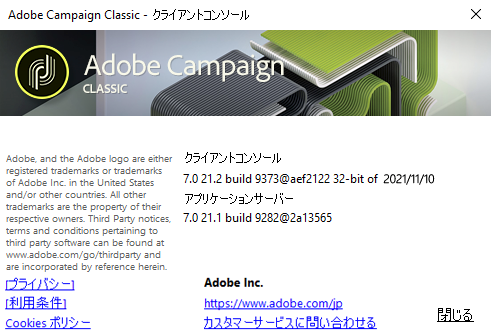
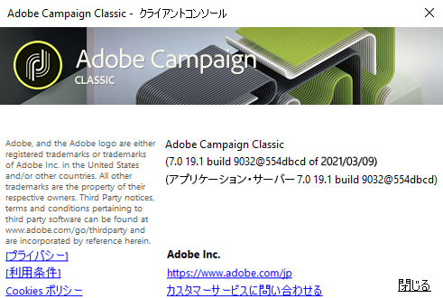

# Adobe Campaign の起動{#launching-adobe-campaign}

Campaign クライアントコンソールは、Campaign アプリケーションサーバーに接続できるリッチクライアントです。[このページ](../../installation/using/installing-the-client-console.md)では、クライアントコンソールをダウンロードして設定する方法を説明します。

## Adobe Campaign の起動 {#starting-adobe-campaign}

Adobe Campaign を起動するには、**[!UICONTROL スタート／すべてのプログラム／Adobe Campaign v.X／Adobe Campaign クライアントコンソール]**&#x200B;を選択します。

クライアントコンソール接続ウィンドウで、既存のデータベースを選択するか設定し、ユーザー名およびパスワードを使用してデータベースに接続できます。

## Adobe Campaign への接続 {#connecting-to-adobe-campaign}

Adobe ID を使用して Adobe Campaign に接続できます。詳しくは、[このページ](../../integrations/using/about-adobe-id.md)を参照してください。

専用のログイン／パスワードを使用して接続することもできます。

1. 「**[!UICONTROL ログイン]**」フィールドに、オペレーターのアカウント ID を入力します。

   ID は、Adobe Campaign プラットフォームの管理者から付与されます。

1. 「**[!UICONTROL パスワード]**」フィールドにパスワードを入力します。

   データベースに最初にアクセスする際のパスワードは、管理者が指定したものになります。接続すると、**[!UICONTROL ツール／パスワードを変更...]** メニューからパスワードを変更できます。オペレーターおよび接続について詳しくは、[アクセス管理](../../platform/using/access-management.md)を参照してください。

1. 「**[!UICONTROL ログイン]**」をクリックして確定します。

これで、[Adobe Campaign ワークスペース](../../platform/using/adobe-campaign-workspace.md)にアクセスできるようになります。

## 接続の設定 {#setting-up-connections}

入力ゾーンの上にあるリンクから、サーバー接続設定にアクセスできます。

**[!UICONTROL 接続]**&#x200B;ウィンドウで、**[!UICONTROL 追加／接続]**&#x200B;をクリックします。

次に、接続設定を定義する必要があります。手順は次のとおりです。

1. 「**[!UICONTROL ラベル]**」を入力して、データベース接続に名前を割り当てます。

1. 「**[!UICONTROL URL]**」フィールドで、アプリケーションサーバーのアドレスを追加します。接続 URL が不明な場合は、管理者にお問い合わせください。

1. オペレーターが Adobe ID を使用してコンソールに接続するには、「**[!UICONTROL Adobe ID を使用して接続]**」をオンにします。詳しくは、[このページ](../../integrations/using/about-adobe-id.md)を参照してください。

1. 「**[!UICONTROL OK]**」をクリックして検証します。

## オペレーターと権限 {#operators-and-permissions}

ソフトウェアにアクセスできるオペレーターの識別子とパスワードおよびそれぞれの権限は、Adobe Campaign システム管理者が Adobe Campaign ツリーの&#x200B;**[!UICONTROL 管理／アクセス管理／オペレーター]**&#x200B;ノードで定義します。

この機能について詳しくは、[アクセス管理](../../platform/using/access-management.md)の節で説明しています。

## Adobe Campaign からの切断 {#disconnecting-from-adobe-campaign}

Adobe Campaign から切断するには、アイコンバーの最初のアイコンを使用します。

>[!NOTE]
>
>ログオフしないでアプリケーションを閉じることもできます。

## Campaign のバージョンの確認 {#getting-your-campaign-version}

**[!UICONTROL ヘルプ／バージョン情報...]** メニューから、次の情報にアクセスできます。

* **version** number
* **ビルド** 番号
* adobeカスタマーケアに連絡するためのリンク
* adobeのプライバシーポリシー、利用条件、cookieポリシーへのリンク

アドビサポートチームに連絡する場合は、Campaign クライアントコンソールおよびアプリケーションサーバーのバージョン番号とビルド番号を伝える必要があります。

Gold Standard [キャンペーンで実行している場合は](../../rn/using/gold-standard.md)、「 **[!UICONTROL About]** 」ボックスに表示されるSHA/1文字も共有する必要があります。 例えば、Gold **Standard 10リリースの場合**、ビルド番号には **、次のように** build 9032@efd8a94（ビルド）と表示されます。

Learn more about Gold Standard [in this article](https://helpx.adobe.com/jp/campaign/kb/gold-standard.html).

**関連トピック**：

* [キャンペーンサポートオプション](https://helpx.adobe.com/jp/campaign/kb/ac-support.html#acc-support)
* [ソフトウェア配布](https://docs.adobe.com/content/help/ja-JP/experience-cloud/software-distribution/home.html)
* [Experience Cloudサポートとエキスパートセッション](https://helpx.adobe.com/enterprise/admin-guide.html/enterprise/using/support-for-experience-cloud.ug.html)
