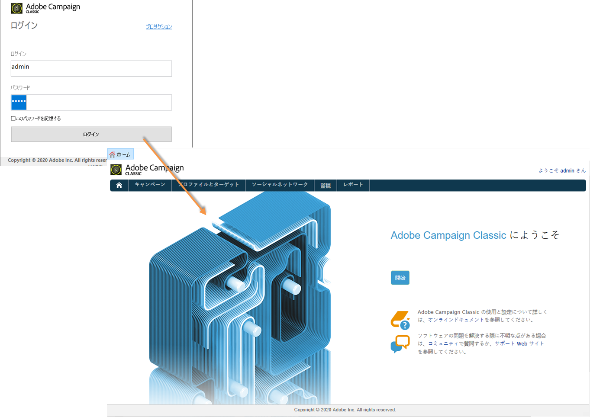
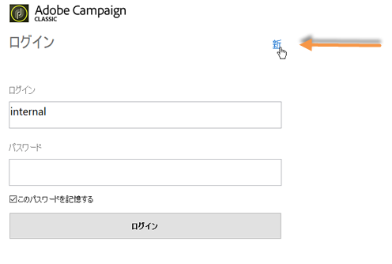
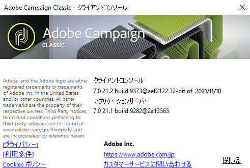

# Adobe Campaign のローンチ {#launching-adobe-campaign}

Campaign クライアントコンソールは、Campaign アプリケーションサーバーに接続できるリッチクライアントです。 [このページ](../../installation/using/installing-the-client-console.md)では、クライアントコンソールをダウンロードして設定する方法を説明します。

>[!CAUTION]
>
>お使いのシステムおよびツールと Adobe Campaign クライアントコンソールの互換性を確認するには、[互換性マトリックス](../../rn/using/compatibility-matrix.md#ClientConsoleoperatingsystems)を参照してください。

## Adobe Campaign の利用開始 {#starting-adobe-campaign}

Adobe Campaign を起動するには、**[!UICONTROL スタート／すべてのプログラム／Adobe Campaign v.X／Adobe Campaign クライアントコンソール]**&#x200B;を選択します。

クライアントコンソール接続ウィンドウで、既存のデータベースを選択するか設定し、ユーザー名およびパスワードを使用してデータベースに接続できます。

## Adobe Campaign への接続 {#connecting-to-adobe-campaign}

### Adobe ID を使用して接続

Campaign ユーザーは、Adobe Identity Management System（IMS）により、Adobe ID を使用して Adobe Campaign コンソールに接続できます。 すべてのアドビソリューションで同じ ID を使用できます。 Adobe Campaign を他のソリューションと併用する場合、接続は保存されます。 Adobe IMS について詳しくは、[このページ](https://helpx.adobe.com/jp/enterprise/using/identity.html)を参照してください。

Campaign Classic v7 接続を Adobe Identity Management サービス（IMS）に設定するには、[このページ](../../integrations/using/about-adobe-id.md)を参照してください。

設定が完了したら、Adobe ID を使用して Campaign に接続する方法について、[Campaign v8（コンソール）ドキュメント](https://experienceleague.adobe.com/ja/docs/campaign/campaign-v8/new/connect){target=_blank}を参照してください。

### ログイン／パスワードで接続

専用のログイン／パスワードを使用して接続することもできます。 この接続は、Campaign の「ネイティブ認証」と呼ばれます。

1. 「**[!UICONTROL ログイン]**」フィールドに、オペレーターのアカウント ID を入力します。

   ID は、Adobe Campaign プラットフォームの管理者から付与されます。

1. 「**[!UICONTROL パスワード]**」フィールドにパスワードを入力します。

   データベースに最初にアクセスする際のパスワードは、管理者が指定したものになります。 接続すると、**[!UICONTROL ツール／パスワードを変更...]** メニューからパスワードを変更できます。 オペレーターおよび接続について詳しくは、[アクセス管理](../../platform/using/access-management.md)を参照してください。

1. 「**[!UICONTROL ログイン]**」をクリックして確定します。

これで、[Adobe Campaign ワークスペース](../../platform/using/adobe-campaign-workspace.md)にアクセスできるようになります。

## 接続の設定 {#setting-up-connections}

入力ゾーンの上にあるリンクから、サーバー接続設定にアクセスできます。

接続を設定する方法について詳しくは、[Campaign v8（コンソール）ドキュメント](https://experienceleague.adobe.com/ja/docs/campaign/campaign-v8/new/connect#create-your-connection){target=_blank}を参照してください。

## オペレーターと権限 {#operators-and-permissions}

ソフトウェアにアクセスできるオペレーターの識別子とパスワードおよびそれぞれの権限は、Adobe Campaign システム管理者が Adobe Campaign ツリーの&#x200B;**[!UICONTROL 管理／アクセス管理／オペレーター]**&#x200B;ノードで定義します。

この機能について詳しくは、[アクセス管理](../../platform/using/access-management.md)の節で説明しています。

## Adobe Campaign のバージョンの確認 {#getting-your-campaign-version}

**[!UICONTROL ヘルプ／バージョン情報...]** メニューから、次の情報にアクセスできます。

* Campaign のクライアントコンソールとアプリケーションサーバーの&#x200B;**バージョン**&#x200B;番号
* Campaign のクライアントコンソールとアプリケーションサーバーの&#x200B;**ビルド**&#x200B;番号
* アドビカスタマーサポートに連絡するためのリンク
* アドビのプライバシーポリシー、利用条件、Cookie ポリシーへのリンク

アドビのカスタマーサポートチームに連絡する場合は、Adobe Campaign クライアントコンソールおよびアプリケーションサーバーのバージョン番号とビルド番号を伝える必要があります。

