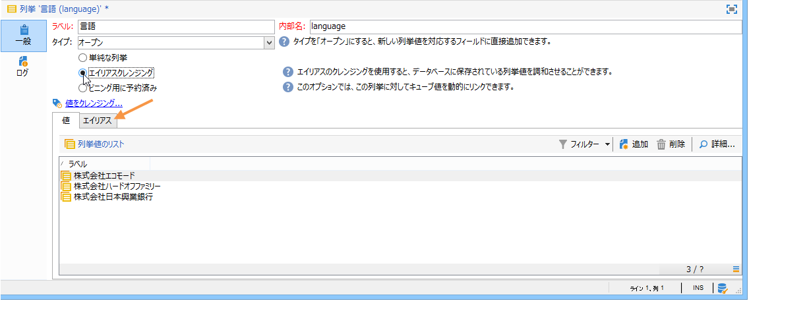
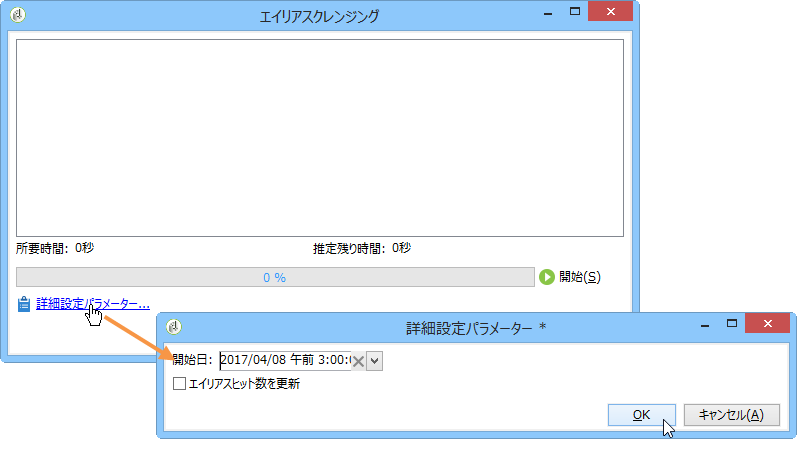

# 列挙の管理{#managing-enumerations}

## 列挙について {#about-enumerations}

列挙（「定義済みリスト」とも呼ばれます）とは、特定のフィールドへの入力候補としてシステムによって表示される値のリストです。列挙を利用することでフィールドの値を統一することができ、データ入力時やクエリでの利用に便利です。

値のリストはドロップダウンリストとして表示され、値を選択すると、その値がフィールドに入力されます。また、このドロップダウンリストには予測入力機能があり、オペレーターが最初の数文字を入力すると続きが自動的に補完されます。

コンソールの一部のフィールドは、この種の列挙を使用して定義されています。フィールドに値を直接入力してリストに追加できるタイプの列挙は、「オープン」な列挙と呼ばれます。

## 値に対するアクセス {#access-to-values}

この種のフィールドに関する、入力値の定義や全般的な管理作業（値の追加や削除）は、ツリーの&#x200B;**[!UICONTROL 管理／プラットフォーム／列挙]**&#x200B;ノードでおこなわれます。

* 上部セクションには、定義済みリストが設定されているフィールドのリストが表示されます。
* 下部セクションには、値の選択肢のリストが表示されます。これらの値は、そのフィールドを使用するエディター内にも重複して表示されます。

   

   列挙の新しい値を作成するには、「**[!UICONTROL 追加]**」をクリックします。

   

   「**[!UICONTROL オープン]**」オプションを選択すると、フィールドにユーザーが新しい値を入力することで、フィールドに対応する定義済みリストに値を直接追加できます。値を作成してよいかどうか確かめる確認メッセージが表示されます。

   

* 「**[!UICONTROL クローズ]**」オプションを選択すると、ユーザーは用意された選択肢の値を使用できますが新しい値を追加することはできません。

## データの標準化 {#standardizing-data}

### エイリアスクレンジングについて {#about-alias-cleansing}

定義済みリストフィールドには、列挙に含まれていない値を入力できます。それらの値は、そのまま格納することも、クレンジング処理を適用することもできます。

>[!CAUTION]
>
>データクレンジングは、データベース内のデータに大きな影響を及ぼす重大なプロセスです。Adobe Campaign の大規模なデータ更新が実行され、場合によっては一部の値が削除される結果になることもあります。したがって、この操作はエキスパートユーザー向け機能として予約されています。

入力値は次のいずれかの方法で使用できます。

* 定義済みリストの値に追加：この場合、「**[!UICONTROL オープン]**」オプションを選択する必要があります。
* 対応するエイリアスへと自動的に置換：この場合、定義済みリストの「**[!UICONTROL エイリアス]**」タブで設定をおこなう必要があります。
* エイリアスのリストに格納：エイリアスの割り当ては後で実行します。

   >[!NOTE]
   >
   >データのクレンジング機能を使用する必要がある場合は、定義済みリストで「**[!UICONTROL エイリアスクレンジング]**」オプションを選択します。

### エイリアスの利用 {#using-aliases}

「**[!UICONTROL エイリアスクレンジング]**」は、選択した定義済みリストにおいてエイリアスを使用するためのオプションです。このオプションを選択すると、ウィンドウの下部に「**[!UICONTROL エイリアス]**」タブが表示されます。

#### エイリアスの作成 {#creating-an-alias}

エイリアスを作成するには、「**[!UICONTROL 追加]**」をクリックします。

変換元となるエイリアスと、適用する値を入力し、「**[!UICONTROL Ok]**」をクリックします。

この操作を確定する前にパラメーターを確認します。

>[!CAUTION]
>
>この段階が完了すると、以前に入力されていた値は置き換えられます。以前の値を復元することはできません。

その後、ユーザーが（Adobe Campaign コンソールまたはフォームの）会社フィールドに **NEILSEN** と入力すると、**NIELSEN Ltd** という値に自動置換されます。値の置換は&#x200B;**エイリアスクレンジング**&#x200B;ワークフローによって実行されます。[データクレンジングの実行](#running-data-cleansing)を参照してください。

#### 値のエイリアスへの変換 {#converting-values-into-aliases}

列挙の値をエイリアスに変換するには、値のリストを右クリックし、「**[!UICONTROL 値をエイリアスに変換...]**」を選択します。

変換する値を選択し、「**[!UICONTROL 次へ]**」をクリックします。

「**[!UICONTROL 開始]**」をクリックして変換を実行します。

実行が完了すると、エイリアスのリストに新しいエイリアスが追加されます。

#### エイリアスのヒット数の取得 {#retrieving-alias-hits}

ユーザーによって入力された値をエイリアスに変換することもできます。定義済みリストに含まれない値がユーザーによって入力された場合に、その値が「**[!UICONTROL エイリアス]**」タブに追加されます。

入力値は&#x200B;**エイリアスクレンジング**&#x200B;テクニカルワークフローによって毎晩復元され、定義済みリストに反映されます。[データクレンジングの実行](#running-data-cleansing)を参照してください。

必要な場合は、その値が入力された回数を「**[!UICONTROL ヒット数]**」列に表示させることもできます。ただし、この値を計算するために長い時間と大量のメモリが必要となる場合があります。詳しくは、[入力の発生回数の計算](#calculating-entry-occurrences)を参照してください。

### データクレンジングの実行 {#running-data-cleansing}

データクレンジングは&#x200B;**[!UICONTROL エイリアスクレンジング]**&#x200B;ワークフローによって実行されます。列挙用に定義された設定は、実行時に適用されます。[エイリアスクレンジングワークフロー](#alias-cleansing-workflow)を参照してください。

「**[!UICONTROL 値をクレンジング]**」リンクでは、クレンジングの実行をトリガーできます。

「**[!UICONTROL 詳細設定パラメーター]**」リンクでは、収集される値を処理対象にし始める日付を設定できます。

「**[!UICONTROL 開始]**」ボタンをクリックすると、データクレンジングが実行されます。

#### 入力の発生回数の計算 {#calculating-entry-occurrences}

定義済みリストの「**[!UICONTROL エイリアス]**」サブタブでは、入力されたすべての値の中に特定のエイリアスが含まれていた回数を表示できます。この情報は推定値であり、「**[!UICONTROL ヒット数]**」列に表示されます。

>[!CAUTION]
>
>エイリアスの入力回数を計算するには、長い時間が必要となる場合があります。この機能を使用する際には注意してください。

「**[!UICONTROL 値をクレンジング]**」リンクを使用すると、ヒット数の計算を手動で実行することもできます。これをおこなうには、「**[!UICONTROL 詳細設定パラメーター]**」リンクをクリックし、目的に応じたオプションを選択します。

* 「**[!UICONTROL エイリアスヒット数を更新]**」：入力された日付に基づいて、既に計算済みのヒット数を更新する場合に選択します。
* 「**[!UICONTROL 開始からのエイリアスのヒット数を再計算]**」：Adobe Campaign プラットフォーム全体に対して計算処理を実行する場合に選択します。

指定した期間について計算を自動実行する（例：週に 1 回）ための専用ワークフローを作成することもできます。

そのためには、**[!UICONTROL エイリアスクレンジング]**&#x200B;ワークフローのコピーを作成し、スケジューラーを変更して、**[!UICONTROL 列挙値のクレンジング]**&#x200B;で次の設定を使用します。

* **-updateHits**：エイリアスのヒット数を更新する場合
* **-updateHits:full**：エイリアスのヒット数をすべて再計算する場合

#### エイリアスクレンジングワークフロー {#alias-cleansing-workflow}

**エイリアスクレンジング**&#x200B;ワークフローは、列挙値のクレンジングを実行します。デフォルトでは毎日実行されます。

このワークフローには、**[!UICONTROL 管理／プロダクション／テクニカルワークフロー]**&#x200B;ノードでアクセスできます。

