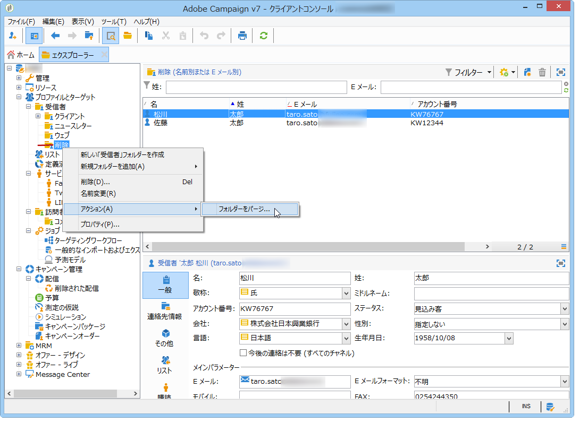
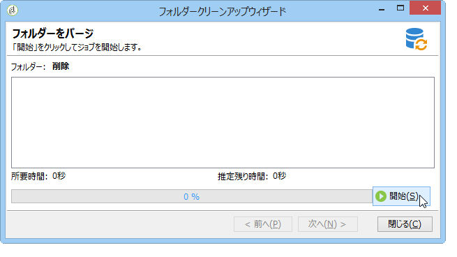

# プロファイルの管理{#managing-profiles}

## 受信者ツリー {#recipient-tree}

高度な受信者管理機能を使用するには、Adobe Campaign ツリーを編集する必要があります。そのためには、ツールバーの「**[!UICONTROL エクスプローラー]**」ボタンをクリックします。

デフォルトでは、受信者は Adobe Campaign ツリーの「**[!UICONTROL プロファイルとターゲット]**」ノードに保存されています。同じノードから、1 つ以上のフォルダーとサブフォルダーを作成して受信者プロファイルを保存できます。

各ノードはフォルダーに一致しています。各フォルダーのデータは、相互に分離されているとみなす必要があります。したがって、複数の受信者フォルダーがある場合、コピーは慎重におこなう必要があります。

>[!NOTE]
>
>データベース内のすべての受信者のリストを表示するには、ビューを作成する必要があります。[フォルダーとビュー](../../platform/using/access-management.md#folders-and-views)を参照してください。

## 受信者の移動 {#moving-recipients}

1 人以上の受信者を選択し、受信者リストからドラッグして目的のフォルダーにドロップすることができます。このアクションを確定するよう求める警告メッセージが表示されます。

## 受信者のコピー {#copying-a-recipient}

同じフォルダー内で受信者をコピーするには、目的の受信者を右クリックし、「**[!UICONTROL コピー]**」を選択します。

## 受信者の削除 {#deleting-recipients}

受信者を削除するには、受信者を特定のフォルダーに移動し、このフォルダーのコンテンツをパージします。この際に、「**[!UICONTROL 削除]**」オプションを&#x200B;**使用しないことを強くお勧めします**。

フォルダーをパージするには、目的のフォルダーを右クリックしてアクセスできる&#x200B;**[!UICONTROL アクション／フォルダーをパージ]**&#x200B;メニューを使用します。

「**[!UICONTROL 開始]**」をクリックして操作を起動します。次に示すように、ウィンドウの中ほどのセクションに進捗ステータスが表示されます。

