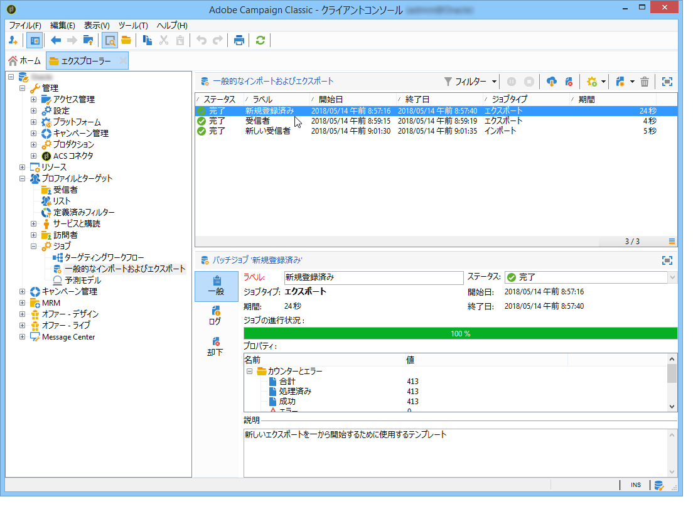
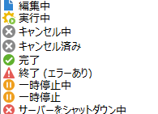

# ジョブの実行の監視 {#monitoring-job-execution}

インポートジョブとエクスポートジョブの実行は、インポート／エクスポートジョブのリストから直接追跡できます。

* 「**[!UICONTROL ジャーナル]**」タブでは、実行に関するログメッセージを確認できます。
* 「**[!UICONTROL 却下]**」タブには、却下されたレコードが表示されます。 詳しくは、[この節](../../platform/using/executing-import-jobs.md#behavior-in-the-event-of-an-error)を参照してください。

「**[!UICONTROL 一般]**」タブの&#x200B;**[!UICONTROL ステータス]**&#x200B;フィールドは、ジョブの現在のステータスを示します。

各ステータスは、特別なアイコンおよびラベルで表されます。 次に、ステータスとそのアイコンを示します。

* **編集中**

  ジョブが作成されています。

* **処理中**

  ジョブが実行されています。

* **キャンセル済み**

  「**[!UICONTROL キャンセル]**」ボタンがクリックされ、処理中のジョブがキャンセルされています。

* **キャンセル中**

  キャンセルコマンドにより、ジョブがキャンセル中です。

* **一時停止中**

  「**[!UICONTROL 一時停止]**」ボタンがクリックされ、ジョブが一時停止中です。

* **一時停止**

  「**[!UICONTROL 一時停止]**」ボタンがクリックされ、ジョブが一時停止しています。 「**[!UICONTROL 開始]**」をクリックして再開できます。

* **終了**

  ジョブの実行が終了しました。

* **エラーあり**

  技術的エラーによりジョブは実行されませんでした。

* **サーバーをシャットダウン中**

  Adobe Campaign サーバーがシャットダウンされたので、処理中のジョブが中断されます。
