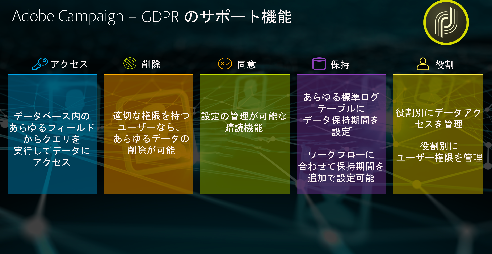
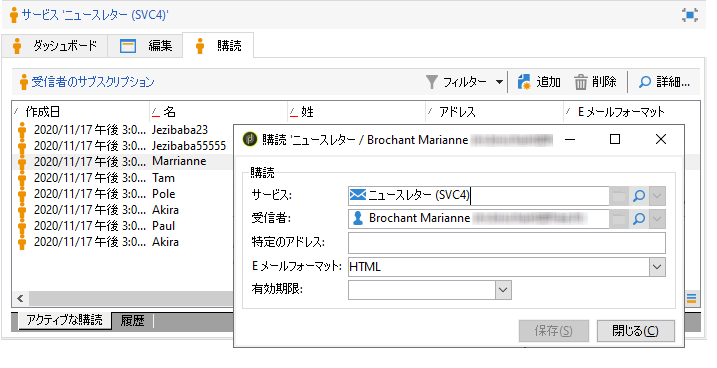
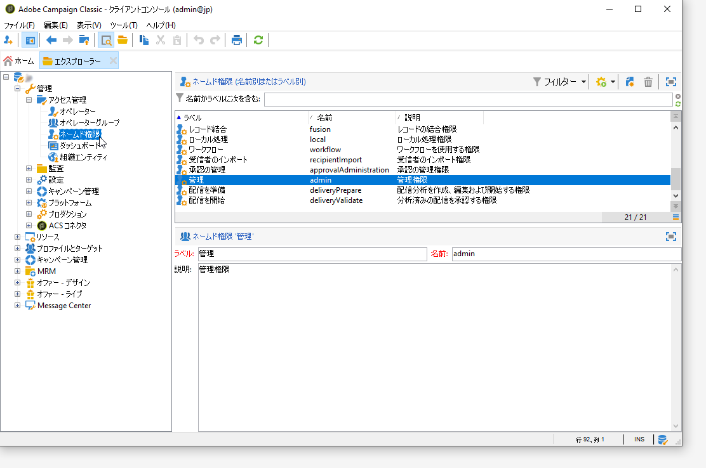

# プライバシー管理 {#privacy-management}

Adobe Campaign には、[プライバシー規制](#privacy-management-regulations)（GDPR、CCPA、PDPA、LGPD など）を遵守するのに役立つ各種のツールが用意されています。

プライバシー規制への対応を確実にするためにAdobe Campaignが提供する 5 つの主な機能を次に示します。

* **アクセスする権利**
* **削除する権利**
* **同意管理**
* **データ保持**
* **権限管理**

詳しくは、[アクセス権と忘れられる権利](#right-access-forgotten)および[同意、保存、役割](#consent-retention-roles)を参照してください。

<!--This section presents general information on what Privacy management is and the features provided by Adobe Campaign to manage the [Right to Access and Right to be Forgotten](#right-access-forgotten).

It also contains information on important features to manage Privacy ([Consent, Retention and Roles](#consent-retention-roles)), as well as best practices to help you with your Privacy compliance when using Adobe Campaign.-->

## プライバシー管理に関する規制 {#privacy-management-regulations}

Adobe Campaign の機能により、次の規制を遵守できるようになります。

* **GDPR** （EU 一般データ保護規則）は欧州連合（EU）で施行されているプライバシー保護法律で、EU 諸国のデータ保護要件を現代の状況に合わせて整合化することを目的としています。
* **CCPA** （カリフォルニア州消費者プライバシー法）は、カリフォルニア州の居住者に個人情報に関する新しい権利を提供し、カリフォルニア州でビジネスを行う特定の事業者に対してデータ保護の責任を課します。
* **PDPA** （個人情報の保護に関する法律）は、タイのプライバシー法で、データ保護要件を現代の状況に合わせて整合化することを目的としています。
* **LGPD** （Lei Geral de Proteção de Dados）は、ブラジルで個人データを収集または処理するすべての企業に適用されます。
* **CASL** （カナダのスパム対策法）は、カナダに出入りするすべてのメッセージを対象としていますが、カナダを経由してルーティングされるメッセージは含みません。
* **VCDPA** （バージニア州消費者データ保護法）および **公認会計士** （コロラドプライバシー法）は、事業を行うすべての企業に適用されるか、それらの州の住民をターゲットにします。

これらの規則はすべて、上記の各地域または国に居住するデータ主体のデータを保持するAdobe Campaignのお客様に適用されます。

<!--Several Privacy capabilities are available in Adobe Campaign, including consent management, data retention settings, and rights management. See [Consent, Retention and Roles](#consent-retention-roles). In addition to this, Adobe Campaign helps facilitate your readiness as Data Controller for certain Privacy requests. See [Right to Access and Right to be Forgotten](#right-access-forgotten).-->

>[!NOTE]
>
>個人データおよびデータを管理する様々なエンティティ（データ管理者、データ処理者、データ主体）について詳しくは、[個人データとペルソナ](../../platform/using/privacy-and-recommendations.md#personal-data)を参照してください。

## アクセス権と忘れられる権利 {#right-access-forgotten}

プライバシーの準備を容易にするために、Adobe Campaign では&#x200B;**アクセス**&#x200B;要求と&#x200B;**削除**&#x200B;要求の処理が可能になりました。

* **アクセスする権利**&#x200B;とは、データ主体がデータ管理者に、自分に関する個人データが処理されているかどうか、また処理されている場合はその場所と目的について確認できることを指します。データ管理者は、個人データのコピーを電子形式で無償提供する必要があります。

* データ消去としても知られている「**忘れられる権利**」（削除要求）は、データ主体がデータコントローラーに個人データを消去させ、データのさらなる拡散を中止させ、第三者にデータ処理を停止させることができる権利です。

**アクセス**&#x200B;リクエストと&#x200B;**削除**&#x200B;リクエストの作成方法、および Adobe Campaign によるリクエストの処理方法については、[実装手順](../../platform/using/privacy-requests.md)を参照してください。

<!--Tutorials on Privacy management in Campaign Standard are also available [here](https://experienceleague.adobe.com/docs/campaign-standard-learn/tutorials/privacy/privacy-overview.html).
https://experienceleague.adobe.com/docs/campaign-standard-learn/tutorials/privacy/privacy-overview.html-->

## 同意、保持、役割 {#consent-retention-roles}

新しく導入された&#x200B;**アクセスする権利**&#x200B;と&#x200B;**忘れられる権利**&#x200B;の他にも、Adobe Campaign はプライバシーに必要な重要機能を各種用意しています。

* [同意管理](#consent-management)：環境設定管理用の購読機能
* [データ保持](#data-retention)：すべての標準ログテーブルのデータ保持期間。保持期間の追加はワークフローで設定可能
* [権限管理](#rights-management)：ネームド権限により管理されるデータアクセス

### 同意管理 {#consent-management}

同意とは、データ主体に関する個人データの処理についてデータ主体からの同意を得ることを指します。処理に関して必要な同意を得ることは、データ管理者の責務です。Adobe Campaign には、サービスに関連する同意を顧客が管理するための機能はありますが、アドビは同意自体についての責任を負いません。顧客は自社内の法務部門と連携して、同意のプロセスと手続きを自ら確立する必要があります。

同意に関する側面を管理する機能は、発売当初から Adobe Campaign の中核機能でした。購読管理プロセスにより、顧客はどの受信者がどの種類の購読を登録しているかをトラッキングできます。購読の種類には、ニュースレター、毎日または毎週のプロモーションなどのマーケティングプログラムがあります。

同意の管理について詳しくは、[詳細なドキュメント](../../delivery/using/managing-subscriptions.md)を参照してください。

Adobe Campaign が提供する同意管理ツールに加えて、消費者が個人情報の販売をオプトアウトしたかどうかをトラッキングすることもできます。[こちらの節](../../platform/using/privacy-requests.md#sale-of-personal-information-ccpa)を参照してください。

### データ保持 {#data-retention}

Campaign のビルトインログテーブルには保持期間がプリセットされており、通常はデータ保存期間が 6 か月以内に制限されています。

組み込みテーブルのデフォルトの保持期間は以下のとおりです。リテンションは実装時にアドビの技術管理者が設定します。値は顧客の要件に基づくため、実装環境によって異なる場合があります。

* **統合されたトラッキング**：1 年
* **配信ログ**：6 か月
* **トラッキングログ**：1 年
* **削除された配信**：1 週間
* **却下をインポート**：6 か月
* **訪問者プロファイル**：1 か月
* **オファーの提案**：1 年
* **イベント**：1 ヶ月
* **イベント処理の統計**：1 か月
* **アーカイブしたイベント**：1 年
* **無視されたパイプラインイベント**：1 か月

削除の場合と同様、標準ワークフロー機能を使用して、任意のカスタムテーブルのリテンション期間を設定することができます。

リテンションの詳細について知りたい場合、またはカスタムテーブルの設定が必要な場合は、アドビのコンサルタントまたは技術管理者にお問い合わせください。

### 権限管理 {#rights-management}

Adobe Campaign では、事前作成された役割またはカスタムの役割を使用して、様々な Campaign オペレーターに割り当てられている権限を管理できます。

その利点の 1 つとして、各種類のデータについて社内のどのユーザーがアクセスできるかを管理できることが挙げられます。例えば、様々な地域を複数のマーケターで担当している場合に、各マーケターが自分の担当地域からのデータのみにアクセスできるようにすることが可能です。

同様に、ユーザーごとに各種の機能を設定することができます。例えば、配信の送信者を限定することができます。また、プライバシーの管理に関して言えば、データの変更やエクスポートをできるユーザーを限定することもできます。

アクセス管理について詳しくは、[詳細なドキュメント](../../platform/using/access-management.md)を参照してください。
