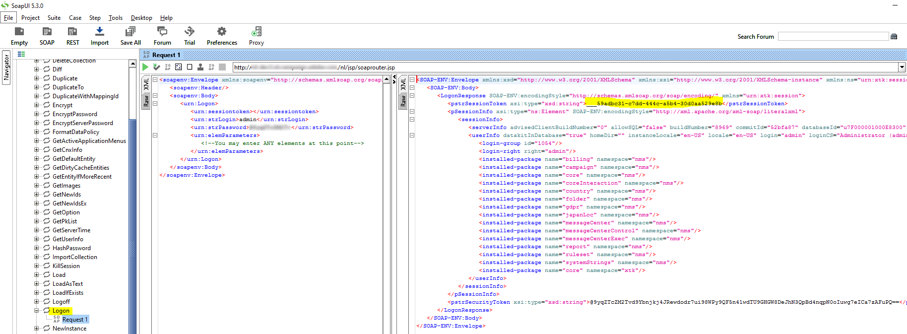

<?xml version="1.0" encoding="UTF-8"?>
<xliff xmlns="urn:oasis:names:tc:xliff:document:1.2" xmlns:okp="okapi-framework:xliff-extensions" xmlns:its="http://www.w3.org/2005/11/its" xmlns:itsxlf="http://www.w3.org/ns/its-xliff/" version="1.2" its:version="2.0">
<file original="help/platform/using/privacy-requests-api.md.mdsc" source-language="en-US" target-language="en-XX" datatype="x-text/markdown">
<body>
<trans-unit id="tu17" xml:space="preserve">
<source xml:lang="en-US">https://experienceleague.adobe.com/en/tools/campaign-api</source>
<target xml:lang="en-XX">https://experienceleague.adobe.com/ja/tools/campaign-api</target>
</trans-unit>
<trans-unit id="tu1" restype="x-YAML_METADATA_HEADER_VALUE" xml:space="preserve">
<source xml:lang="en-US">Automatic Privacy request process</source>
<target xml:lang="en-XX">自動プライバシーリクエストプロセス</target>
</trans-unit>
<trans-unit id="tu2" restype="x-YAML_METADATA_HEADER_VALUE" xml:space="preserve">
<source xml:lang="en-US">Learn how to setup an automatic Privacy request process</source>
<target xml:lang="en-XX">自動プライバシーリクエストプロセスを設定する方法の説明</target>
</trans-unit>
<trans-unit id="tu3" xml:space="preserve">
<source xml:lang="en-US">Automatic Privacy request process</source>
<target xml:lang="en-XX">自動プライバシーリクエストプロセス</target>
</trans-unit>
<trans-unit id="tu4" xml:space="preserve">
<source xml:lang="en-US">Adobe Campaign provides an <ph id="1" ctype="x-STRONG_EMPHASIS">**</ph>API<ph id="2" ctype="x-STRONG_EMPHASIS">**</ph> which allows you to setup an automatic Privacy request process.</source>
<target xml:lang="en-XX">Adobe Campaign には、プライバシーリクエストの自動プロセスを設定できる <ph id="1" ctype="x-STRONG_EMPHASIS">**</ph>API<ph id="2" ctype="x-STRONG_EMPHASIS">**</ph> があります。</target>
</trans-unit>
<trans-unit id="tu5" xml:space="preserve">
<source xml:lang="en-US">With the API, the general Privacy process is the same as <ph id="1" ctype="x-LINK">[</ph>using the interface<ph id="2" ctype="x-LINK">](privacy-requests-ui.md)</ph>. The only difference is the creation of the Privacy request. Instead of creating the request in Adobe Campaign, a POST containing the request information is sent to Campaign. For every request, a new entry is added in the <ph id="3" ctype="x-STRONG_EMPHASIS">**[!UICONTROL </ph>Privacy Requests<ph id="5" ctype="x-LINK_REF">]**</ph> screen. The Privacy technical workflows then process the request, the same way as for a request added using the interface.</source>
<target xml:lang="en-XX">この API を使用した場合の一般的なプライバシープロセスは、<ph id="1" ctype="x-LINK">[</ph>インターフェイスを使用<ph id="2" ctype="x-LINK">](privacy-requests-ui.md)</ph>した場合と変わりません。 ただし、プライバシーリクエストの作成のみが異なります。 Adobe Campaign でリクエストを作成するかわりに、リクエスト情報を含む POST が Campaign に送信されます。 リクエストごとに、新しいエントリが<ph id="3" ctype="x-STRONG_EMPHASIS">**[!UICONTROL </ph>プライバシーリクエスト<ph id="5" ctype="x-LINK_REF">]**</ph>画面に追加されます。 その後、プライバシーのテクニカルワークフローにおいてリクエストが処理されます。これもインターフェイスからリクエストを追加した場合と変わりません。</target>
</trans-unit>
<trans-unit id="tu6" xml:space="preserve">
<source xml:lang="en-US">If you're using the API to submit Privacy requests, we recommend that you leave the <ph id="1" ctype="x-STRONG_EMPHASIS">**</ph>2-step process<ph id="2" ctype="x-STRONG_EMPHASIS">**</ph> activated for the first Delete requests, in order to test the returned data. When your tests are finished, you can deactivate the 2-step process so that the Delete request process can run automatically.</source>
<target xml:lang="en-XX">API を使用してプライバシーリクエストを送信する場合、最初の削除リクエストについては、返されるデータをテストできるよう、<ph id="1" ctype="x-STRONG_EMPHASIS">**</ph>2 段階プロセス<ph id="2" ctype="x-STRONG_EMPHASIS">**</ph>を有効にしておくことをお勧めします。 テストが終了したら、削除リクエストプロセスが自動的に実行されるよう、2 段階プロセスを無効にできます。</target>
</trans-unit>
<trans-unit id="tu7" xml:space="preserve">
<source xml:lang="en-US">The <ph id="1" ctype="x-STRONG_EMPHASIS">**[!UICONTROL </ph>CreateRequestByName<ph id="3" ctype="x-LINK_REF">]**</ph> JS API is defined as follows.</source>
<target xml:lang="en-XX"><ph id="1" ctype="x-STRONG_EMPHASIS">**[!UICONTROL </ph>CreateRequestByName<ph id="3" ctype="x-LINK_REF">]**</ph> JS API は次のように定義されます。</target>
</trans-unit>
<trans-unit id="tu8" xml:space="preserve">
<source xml:lang="en-US"><ph id="1" ctype="x-regxph" equiv-text="&lbrack;!NOTE">[!NOTE]</ph></source>
<target xml:lang="en-XX"><ph id="1" ctype="x-regxph" equiv-text="&lbrack;!NOTE">[!NOTE]</ph></target>
</trans-unit>
<trans-unit id="tu9" xml:space="preserve">
<source xml:lang="en-US">If you were using the <ph id="1" ctype="x-STRONG_EMPHASIS">**</ph>gdprRequest<ph id="2" ctype="x-STRONG_EMPHASIS">**</ph> API, you can still use it but it is recommended to use the new <ph id="3" ctype="x-STRONG_EMPHASIS">**</ph>privacyRequest<ph id="4" ctype="x-STRONG_EMPHASIS">**</ph> API.</source>
<target xml:lang="en-XX"><ph id="1" ctype="x-STRONG_EMPHASIS">**</ph>gdprRequest<ph id="2" ctype="x-STRONG_EMPHASIS">**</ph> API を使用していた場合は引き続き使用できますが、新しい <ph id="3" ctype="x-STRONG_EMPHASIS">**</ph>privacyRequest<ph id="4" ctype="x-STRONG_EMPHASIS">**</ph> API を使用することをお勧めします。</target>
</trans-unit>
<trans-unit id="tu10" xml:space="preserve">
<source xml:lang="en-US"><ph id="1" ctype="x-regxph" equiv-text="&lbrack;!IMPORTANT">[!IMPORTANT]</ph></source>
<target xml:lang="en-XX"><ph id="1" ctype="x-regxph" equiv-text="&lbrack;!IMPORTANT">[!IMPORTANT]</ph></target>
</trans-unit>
<trans-unit id="tu11" xml:space="preserve">
<source xml:lang="en-US">The <ph id="1" ctype="x-STRONG_EMPHASIS">**[!UICONTROL </ph>Privacy Data Right<ph id="3" ctype="x-LINK_REF">]**</ph> named right is required to use the API.</source>
<target xml:lang="en-XX">この API を使用するには、<ph id="1" ctype="x-STRONG_EMPHASIS">**[!UICONTROL </ph>プライバシーデータ権限<ph id="3" ctype="x-LINK_REF">]**</ph>ネームド権限が必要です。</target>
</trans-unit>
<trans-unit id="tu12" xml:space="preserve">
<source xml:lang="en-US"><ph id="1" ctype="x-regxph" equiv-text="&lbrack;!NOTE">[!NOTE]</ph></source>
<target xml:lang="en-XX"><ph id="1" ctype="x-regxph" equiv-text="&lbrack;!NOTE">[!NOTE]</ph></target>
</trans-unit>
<trans-unit id="tu13" xml:space="preserve">
<source xml:lang="en-US">The 'regulation' field is only available if you are using Campaign Classic 20.2 (build 9178+).</source>
<target xml:lang="en-XX">「regulation」フィールドは、Campaign Classic 20.2（ビルド 9178 以降）を使用している場合にのみ使用可能です。</target>
</trans-unit>
<trans-unit id="tu14" xml:space="preserve">
<source xml:lang="en-US">If you are migrating to 20.2 and if you were already using the API, you must add the ‘regulation’ field as shown above. If you are using a previous build, you can continue to use the API without the ‘regulation’ field.</source>
<target xml:lang="en-XX">20.2 に移行しており既に API を使用している場合は、上記のように「regulation」フィールドを追加する必要があります。 以前のビルドを使用している場合は、「regulation」フィールドなしで API を引き続き使用できます。</target>
</trans-unit>
<trans-unit id="tu15" xml:space="preserve">
<source xml:lang="en-US">Invoking the API externally</source>
<target xml:lang="en-XX">外部からの API の呼び出し</target>
</trans-unit>
<trans-unit id="tu16" xml:space="preserve">
<source xml:lang="en-US">Here is an example of how you can invoke the API externally (authentication via the API and details about the Privacy API specifically). For more information on the Privacy API, consult the <ph id="1" ctype="x-LINK">&lbrack;</ph>API documentation<ph id="2" ctype="x-LINK">[#$tu17]</ph>. You can also consult the <ph id="3" ctype="x-LINK">[</ph>Web service calls documentation<ph id="4" ctype="x-LINK">](../../configuration/using/web-service-calls.md)</ph>.</source>
<target xml:lang="en-XX">外部から API を呼び出す方法の例（具体的には API を使用した認証と、プライバシー API の詳細）を以下に示します。 プライバシー API について詳しくは、<ph id="1" ctype="x-LINK">&lbrack;</ph>API のドキュメント<ph id="2" ctype="x-LINK">[#$tu17]</ph>を参照してください。 また、<ph id="3" ctype="x-LINK">[</ph>Web サービス呼び出しに関するドキュメント<ph id="4" ctype="x-LINK">](../../configuration/using/web-service-calls.md)</ph>も参照してください。</target>
</trans-unit>
<trans-unit id="tu18" xml:space="preserve">
<source xml:lang="en-US">First of all, you need to perform the authentication via the API:</source>
<target xml:lang="en-XX">最初に、API を通じて認証を実行する必要があります。</target>
</trans-unit>
<trans-unit id="tu19" xml:space="preserve">
<source xml:lang="en-US">Download the <ph id="1" ctype="x-STRONG_EMPHASIS">**</ph>xtk<ph id="2" ctype="x-inline-directive">:session**</ph> WSDL via this url: <ph id="4" ctype="x-STRONG_EMPHASIS">**`&lt;server url>`</ph>/nl/jsp/schemawsdl.jsp?schema=xtk<ph id="6" ctype="x-inline-directive">:session**</ph>.</source>
<target xml:lang="en-XX">URL <ph id="4" ctype="x-STRONG_EMPHASIS">**`&lt;server url>`</ph>/nl/jsp/schemawsdl.jsp?schema=xtk<ph id="6" ctype="x-inline-directive">:session**</ph> 経由で <ph id="1" ctype="x-STRONG_EMPHASIS">**</ph>xtk<ph id="2" ctype="x-inline-directive">:session**</ph> WSDL をダウンロードします。</target>
</trans-unit>
<trans-unit id="tu20" xml:space="preserve">
<source xml:lang="en-US">Use the "Logon" method and pass in a username and password as parameters in the request. You will get a response containing a session token. Here is an example using SoapUI.</source>
<target xml:lang="en-XX">"Logon" メソッドを使用し、リクエストのパラメーターとしてユーザー名とパスワードを渡します。 セッショントークンを含む応答が返されます。 SoapUI を使用する場合の例を以下に示します。</target>
</trans-unit>
<trans-unit id="tu21" xml:space="preserve">
<source xml:lang="en-US"><ph id="1" ctype="x-IMAGE"></ph></source>
<target xml:lang="en-XX"><ph id="1" ctype="x-IMAGE"></ph></target>
</trans-unit>
<trans-unit id="tu22" xml:space="preserve">
<source xml:lang="en-US">Use the returned Session Token as the authentication for all subsequence API calls. It expires after 24 hours.</source>
<target xml:lang="en-XX">返されたセッショントークンを後続のすべての API 呼び出しの認証として使用します。 これは 24 時間後に有効期限切れになります。</target>
</trans-unit>
<trans-unit id="tu23" xml:space="preserve">
<source xml:lang="en-US">Then invoke the Privacy API:</source>
<target xml:lang="en-XX">次に、プライバシー API を呼び出します。</target>
</trans-unit>
<trans-unit id="tu24" xml:space="preserve">
<source xml:lang="en-US">Download the WSDL from this URL: <ph id="1" ctype="x-STRONG_EMPHASIS">**`&lt;server url>`</ph>/nl/jsp/schemawsdl.jsp?schema=nms<ph id="3" ctype="x-inline-directive">:privacyRequest**</ph>.</source>
<target xml:lang="en-XX">URL <ph id="1" ctype="x-STRONG_EMPHASIS">**`&lt;server url>`</ph>/nl/jsp/schemawsdl.jsp?schema=nms<ph id="3" ctype="x-inline-directive">:privacyRequest**</ph> から WSDL をダウンロードします。</target>
</trans-unit>
<trans-unit id="tu25" xml:space="preserve">
<source xml:lang="en-US">Use <ph id="1" ctype="x-STRONG_EMPHASIS">**[!UICONTROL </ph>CreateRequestByName<ph id="3" ctype="x-LINK_REF">]**</ph> to create a specific Privacy request.</source>
<target xml:lang="en-XX"><ph id="1" ctype="x-STRONG_EMPHASIS">**[!UICONTROL </ph>CreateRequestByName<ph id="3" ctype="x-LINK_REF">]**</ph> を使用して、特定のプライバシーリクエストを作成します。</target>
</trans-unit>
<trans-unit id="tu26" xml:space="preserve">
<source xml:lang="en-US">Here is an example using the <ph id="1" ctype="x-STRONG_EMPHASIS">**[!UICONTROL </ph>CreateRequestByName<ph id="3" ctype="x-LINK_REF">]**</ph>. Note how we use the session token provided above as authentication. The response is the ID of the created request.</source>
<target xml:lang="en-XX"><ph id="1" ctype="x-STRONG_EMPHASIS">**[!UICONTROL </ph>CreateRequestByName<ph id="3" ctype="x-LINK_REF">]**</ph> を使用する場合の例を以下に示します。 上記で提供されたセッショントークンを認証として使用する方法に注目してください。 応答は、作成されたリクエストの ID になります。</target>
</trans-unit>
<trans-unit id="tu27" xml:space="preserve">
<source xml:lang="en-US"><ph id="1" ctype="x-IMAGE"></ph></source>
<target xml:lang="en-XX"><ph id="1" ctype="x-IMAGE"></ph></target>
</trans-unit>
<trans-unit id="tu28" xml:space="preserve">
<source xml:lang="en-US">To help you perform the steps above, consider the following:</source>
<target xml:lang="en-XX">上記の手順を実行するためには、以下の点を考慮してください。</target>
</trans-unit>
<trans-unit id="tu29" xml:space="preserve">
<source xml:lang="en-US">You can use a <ph id="1" ctype="x-STRONG_EMPHASIS">**</ph>queryDef<ph id="2" ctype="x-STRONG_EMPHASIS">**</ph> on the <ph id="3" ctype="x-STRONG_EMPHASIS">**</ph>nms<ph id="4" ctype="x-inline-directive">:gdprRequest**</ph> schema to check the status of the Access request.</source>
<target xml:lang="en-XX"><ph id="3" ctype="x-STRONG_EMPHASIS">**</ph>nms<ph id="4" ctype="x-inline-directive">:gdprRequest**</ph> スキーマで <ph id="1" ctype="x-STRONG_EMPHASIS">**</ph>queryDef<ph id="2" ctype="x-STRONG_EMPHASIS">**</ph> を使用すると、アクセスリクエストのステータスを確認できます。</target>
</trans-unit>
<trans-unit id="tu30" xml:space="preserve">
<source xml:lang="en-US">You can use a <ph id="1" ctype="x-STRONG_EMPHASIS">**</ph>queryDef<ph id="2" ctype="x-STRONG_EMPHASIS">**</ph> on the <ph id="3" ctype="x-STRONG_EMPHASIS">**</ph>nms<ph id="4" ctype="x-inline-directive">:gdprRequestData**</ph> schema to get the result of the Access request.</source>
<target xml:lang="en-XX"><ph id="3" ctype="x-STRONG_EMPHASIS">**</ph>nms<ph id="4" ctype="x-inline-directive">:gdprRequestData**</ph> スキーマで <ph id="1" ctype="x-STRONG_EMPHASIS">**</ph>queryDef<ph id="2" ctype="x-STRONG_EMPHASIS">**</ph> を使用すると、アクセスリクエストの結果を取得できます。</target>
</trans-unit>
<trans-unit id="tu31" xml:space="preserve">
<source xml:lang="en-US">To be able to download the XML file from <ph id="1" ctype="x-STRONG_EMPHASIS">**</ph>"$(serverUrl)'/nms/gdpr.jssp?id='@id"<ph id="2" ctype="x-STRONG_EMPHASIS">**</ph>, you must be logged in and accessing it from an IP that is included in the allowlist. To do this, create a web application allowing you to access the file generated by the JSSP.</source>
<target xml:lang="en-XX"><ph id="1" ctype="x-STRONG_EMPHASIS">**</ph>「$(serverUrl)'/nms/gdpr.jssp?id='@id」<ph id="2" ctype="x-STRONG_EMPHASIS">**</ph> から XML ファイルをダウンロードするには、許可リスト登録済みの IP からログインしてファイルにアクセスする必要があります。 これを行うには、JSSP で生成されたファイルにアクセスできる web アプリケーションを作成します。</target>
</trans-unit>
<trans-unit id="tu32" xml:space="preserve">
<source xml:lang="en-US">Invoking the API from a JS</source>
<target xml:lang="en-XX">JS からの API の呼び出し</target>
</trans-unit>
<trans-unit id="tu33" xml:space="preserve">
<source xml:lang="en-US">Here is an example of how you can invoke the API from a JS within Campaign Classic.</source>
<target xml:lang="en-XX">Campaign Classic 内で JS から API を呼び出す方法の例を以下に示します。</target>
</trans-unit>
<trans-unit id="tu34" xml:space="preserve">
<source xml:lang="en-US"><ph id="1" ctype="x-regxph" equiv-text="&lbrack;!NOTE">[!NOTE]</ph></source>
<target xml:lang="en-XX"><ph id="1" ctype="x-regxph" equiv-text="&lbrack;!NOTE">[!NOTE]</ph></target>
</trans-unit>
<trans-unit id="tu35" xml:space="preserve">
<source xml:lang="en-US">The 'regulation' field is only available if you are using Campaign Classic 20.2 (build 9178+).</source>
<target xml:lang="en-XX">「regulation」フィールドは、Campaign Classic 20.2（ビルド 9178 以降）を使用している場合にのみ使用可能です。</target>
</trans-unit>
<trans-unit id="tu36" xml:space="preserve">
<source xml:lang="en-US">If you are migrating to 20.2 and if you were already using the API, you must add the ‘regulation’ field. If you are using a previous build, you can continue to use the API without the ‘regulation’ field.</source>
<target xml:lang="en-XX">20.2 に移行しており、既に API を使用している場合は、「regulation」フィールドを追加する必要があります。 以前のビルドを使用している場合は、「regulation」フィールドなしで API を引き続き使用できます。</target>
</trans-unit>
<trans-unit id="tu37" xml:space="preserve">
<source xml:lang="en-US">If you are <ph id="1" ctype="x-STRONG_EMPHASIS">**</ph>using a previous build (with GDPR package)<ph id="2" ctype="x-STRONG_EMPHASIS">**</ph>, you can continue to use the API without the ‘regulation’ field as shown below:</source>
<target xml:lang="en-XX"><ph id="1" ctype="x-STRONG_EMPHASIS">**</ph>以前のビルドを GDPR パッケージと一緒に使用<ph id="2" ctype="x-STRONG_EMPHASIS">**</ph>している場合、下記のように「regulation」フィールドなしで API を引き続き使用できます。</target>
</trans-unit>
<trans-unit id="tu38" xml:space="preserve">
<source xml:lang="en-US">If you are <ph id="1" ctype="x-STRONG_EMPHASIS">**</ph>migrating to 20.2<ph id="2" ctype="x-STRONG_EMPHASIS">**</ph> and if you were already using the API, you must add the ‘regulation’ field as shown below:</source>
<target xml:lang="en-XX"><ph id="1" ctype="x-STRONG_EMPHASIS">**</ph>20.2 に移行<ph id="2" ctype="x-STRONG_EMPHASIS">**</ph>しており、既に API を使用している場合は、下記のように「regulation」フィールドを追加する必要があります。</target>
</trans-unit>
<trans-unit id="tu39" xml:space="preserve">
<source xml:lang="en-US">If you are <ph id="1" ctype="x-STRONG_EMPHASIS">**</ph>using Campaign Classic 20.2 (build 9178+) or above<ph id="2" ctype="x-STRONG_EMPHASIS">**</ph>, the 'regulation' field is optional, as shown below:</source>
<target xml:lang="en-XX"><ph id="1" ctype="x-STRONG_EMPHASIS">**</ph>Campaign Classic 20.2（ビルド 9178 以降）以降を使用<ph id="2" ctype="x-STRONG_EMPHASIS">**</ph>している場合は、下記のように「regulation」フィールドはオプションです。</target>
</trans-unit>
</body>
</file>
</xliff>